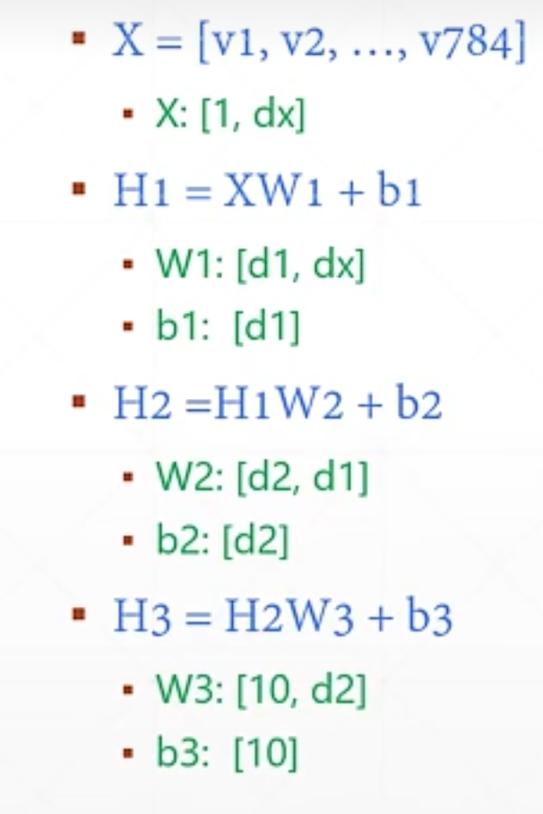
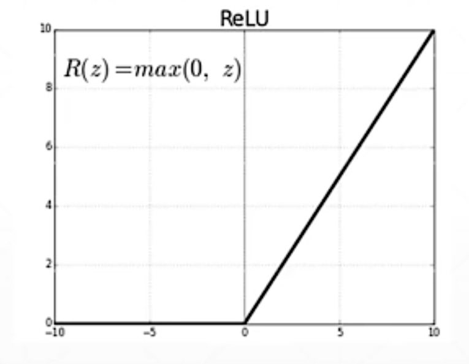

# 分类问题入门

以手写数字识别为例来说明分类问题。

## 数据集划分与处理

首先需要将数据集划分为训练集（train）和测试集（test）。然后把二维数据转换为一维数据，也就是Flatten操作，这个操作会忽略二维的位置相关性，将数据变为x=[1,n]的形式，其中1表示维度。

手写数字无法用一个简单的线性模型来表示，所以需要用三个线性函数嵌套在一起来处理，这里使用的是矩阵相乘的方式。

## Loss的计算与编码方式

三个线性模型嵌套之后，如何计算Loss是一个问题，有不同的编码方式可以选择。

第一种方式，由于Label是0到9，所以用一个维度来表示输出，即H3:[1,1]。第二种方式是one-hot编码，适用于分类问题，它把对应的标签展开成全为0、对应标签位置为1的n维向量。如果直接把标签编码为数字，图片之间本来没有关系，但数字编码会赋予它们关系，这就是所谓的赋予关系。

补充解释一下，类别之间是完全平等的，如果直接使用数值大小来编码，模型会把它解读为类别之间的相似度，强行给毫无关系的类别加上远近关系。one-hot编码能够解决这个问题，因为标签是等长的稀疏矩阵，它们的欧式距离都相等，所以所有类别在向量空间中是完全平等且相互独立的。

## 激活函数

三个线性模型嵌套之后，H1的输出作为H2的输入，H2的输出作为H3的输入。在每个线性部分的后面需要添加Non-linear Factor，也就是非线性部分。对于手写数字来说，实际上它是非线性的，尽管用了三个线性模型嵌套在一起，仍然不够精确，所以需要添加激活函数，比如Sigmoid激活函数等，这里使用的是ReLU函数。

## 实现步骤

实现手写体数字识别的步骤为Load data、Build Model、Train、Test，即加载数据、搭建模型、训练、测试。实战中需要调用相关模块来进行绘图以及one-hot编码。

## 配图

*图1 三层线性模型嵌套结构*

*图2 ReLU激活函数*

