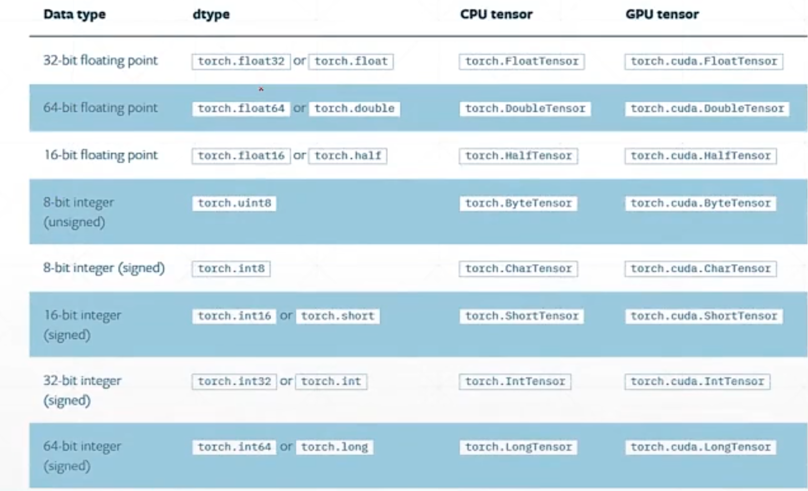
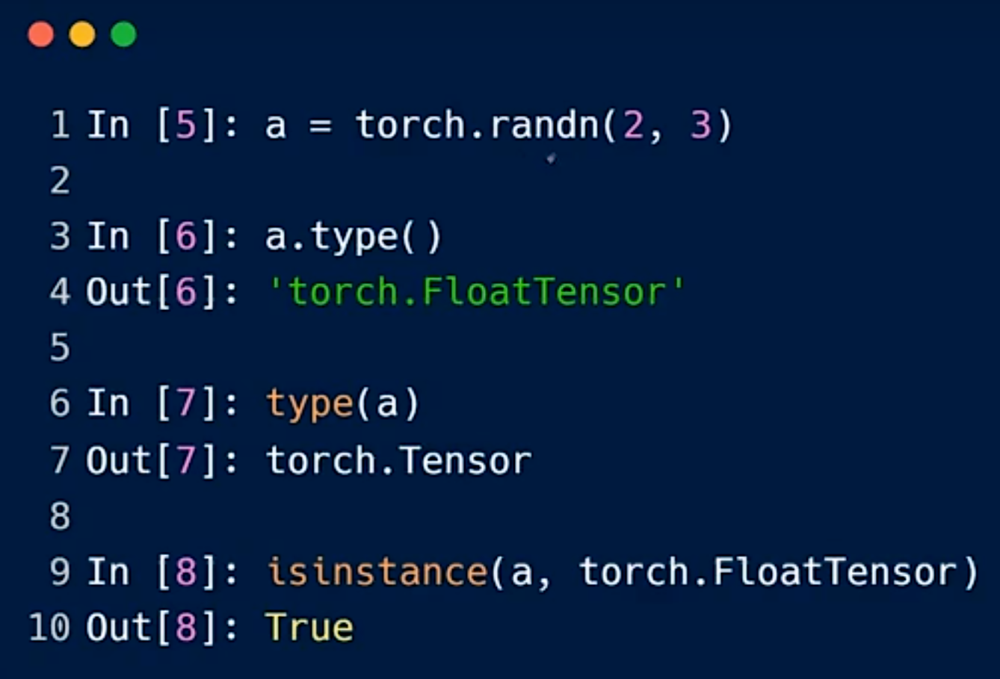

# 张量数据类型

PyTorch内部没有string类型的表示，对于字符串类型的数据，通常使用One-hot编码或者Embedding来表示。

## 常用的数据类型

PyTorch中比较常用的数据类型在比较操作时会经常用到。

## 类型推断

推断类型有两种方式，第一种是使用tensor.type()，第二种是使用isinstance(a, type)，它会返回True或者False。需要注意的是，部署在CPU和GPU上的数据类型是不同的。

## 不同维度的张量

### Dimension为0的标量

使用torch.tensor(数值)可以创建标量。Loss是标量，常用Dimension为0的tensor来表示。

推断Dimension为0的标量类型有三种方式：a.shape返回torch.Size([])，a.size()同样返回torch.Size([])，len(a.shape)返回0。其中[]表示维度为0的张量。

### Dimension为1的张量

创建方式有以下几种：torch.tensor([数值,...])会将数据初始化为输入的数值；torch.FloatTensor(size)生成维度为1、长度为size的张量，数据初始化为random；np.ones(size)生成全1数组，再通过torch.from_numpy(data)转换为tensor。

Dimension为1的张量一般用于Bias偏置值，以及作为Linear Input即神经网络线性层的输入。

### Dimension为2的张量

可以使用torch.randn(n1,n2)或者torch.FloatTensor(n1,n2)来创建，第一维长度为n1，第二维长度为n2，randn是随机正态分布生成。判断size可以用a.size返回size[]，a.size(n)返回第n维的长度。

### Dimension为3的张量

使用torch.rand(n1,n2,n3)或者torch.FloatTensor(n1,n2,n3)创建，rand是随机均匀分布生成，从0到1之间取值。以[10,20,100]为例，表示10个单词、20个句子，其中的10个单词用100维来映射，因此三维张量很适合用于文字处理，比如RNN的Input Batch。可以理解为操作系统中的多级索引表，为了方便与Python交互，可以使用list(a.shape)将其转换为list。

### Dimension为4的张量

使用torch.rand(n1,n2,n3,n4)或者torch.FloatTensor(n1,n2,n3,n4)创建，适用于卷积神经网络。CNN中的格式为[b,c,h,w]，b表示batch批次，即一次处理多少张图片；c表示channel通道数，灰度图为1，RGB为3；h表示height图片高度；w表示width图片宽度。

补充两个方法，a.numel()表示该张量的数据大小，a.dim()返回dimension的值。

## 概念区分

Dimension是size/shape的长度；Size/shape是[...]，表示每一维度有几个元素，可以理解为索引；Tensor则是具体的数据本身。

## 配图

*图1 常用数据类型*

*图2 类型推断代码示例*

