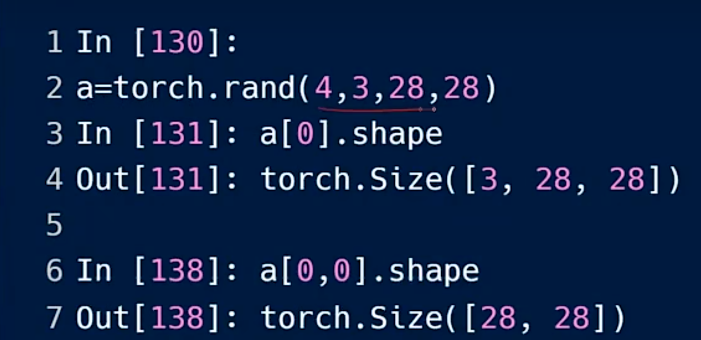

# 索引与切片

## 连续索引

普通索引方式类似多级页表，使用a[:...,...:,:].shape的形式，表示各级从0或者最后一组取到第a组。

例如a[:2,1:,:,-1:].shape表示torch.Size([2,1,28,28])，含义是取第0、1张图片的G、B通道的所有图像信息。

具体规则如下：:x表示从0开始取x个通道，:表示取全部，x:表示从x开始到最末尾的通道，-x:表示从末尾的x通道开始取到最开始的通道。正向索引从0开始，负向索引从-1开始。

高级索引方式使用省略号，a[...].shape中前几级只能索引shape，最后一级直接索引数据，a[...]返回的是标量。

## 间隔索引

间隔索引使用两个冒号，格式为[start:end:steps]。

例如[:,:,a:b:x,::y]表示所有图像的所有RGB通道，图像的高从a开始（包括a）到b（不包括b），间隔为x进行采样，宽的范围取所有，间隔为y进行采样。如[0:28:2]表示0,2,4,6,...，steps表示每step个位置取一个元素。

## index_select

使用torch.index_select可以在指定维度上选取数据，x.index_select(a,torch.tensor([b,c]))表示选取第a个维度中的第b、c组的所有数据。例如x.index_select(1,torch.tensor([1,2])).shape表示取第一个维度中从通道1到2的所有数据，即torch.Size([4,2,28,28])。torch.arange(b)表示[0,b)的维度，不包括b。

省略号索引表示之后的所有维度都取，例如a[1,...].shape表示torch.Size([3,28,28])，实际上如果省略号在最后面可以省略不写。

## mask掩码索引

torch.masked_select(x,mask)将tensor x中符合mask条件的元素提取出来，变成一维tensor。其中x=torch.randn(a,b)随机生成a行b列的tensor，mask=x.ge(c)中ge表示great equal，大于等于c的部分置为1其余为0，类型是ByteTensor。需要注意提取后的tensor维度与原来的shape无关，是一维的不定长tensor。

## take索引

torch.take(src,torch.tensor([a,b,c,...]))表示取tensor src的第a、b、c个元素，src会被打平成一维不定长tensor。

mask和take这两种方法使用较少，因为它们都会将tensor打平。

## 配图

*图1 连续索引代码示例*

