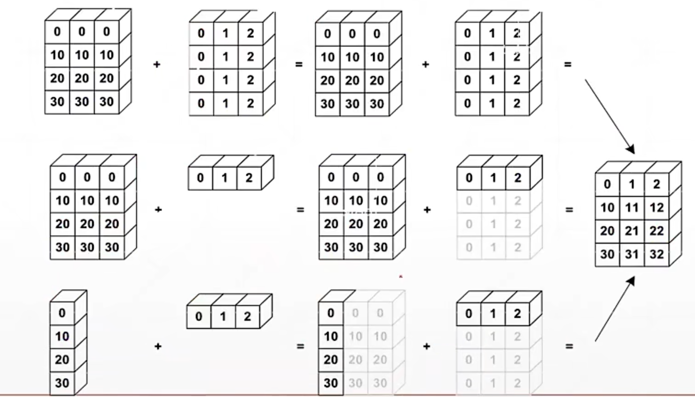

# 广播机制

Broadcast即广播机制，可以自动扩展维度，而且不复制数据。

## 规则

广播机制的规则有两条：第一，从小维度开始对齐，从大维度开始匹配，如果不匹配则插入新的大维度；第二，插入的新维度不断增加，直到新维度大小与对应维度大小相等。

大维度在左侧，小维度在右侧。广播利用了虚拟维度，实际上原来的tensor大小不变。

## 应用场景

当目前的tensor需要与一个标量进行运算时，如果只用unsqueeze和expand，需要写很多接口，使用广播机制可以简化代码。同时广播机制可以节约大量的内存空间。

需要注意小维度部分必须先手动对齐，而且维度必须不同才能使用广播机制。

## 配图

*图1 广播机制示意*

