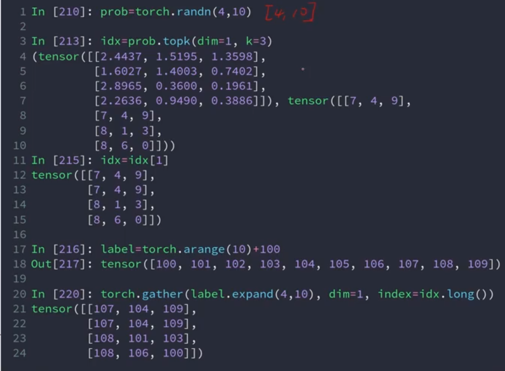

# 高阶操作

## where

where可以作为复杂的时序控制来使用。torch.where(condition,x,y)中，condition是一个索引表，表示该元素是来自x还是来自y。

举例来说，cond表示来自于a的概率，cond>0.5表示将cond的参数简化为0和1，0表示来自b的可能性大，1表示来自a的可能性更大，此处的cond相当于数据选择器。

## gather

torch.gather(input,dim,index,out=None)沿指定维度dim，用index张量去input中收集元素，输出形状与index完全一致。

gather的实际作用有：查询对应元素索引所表示的类型标签input，以及用于相对索引标签，查询各元素实际对应的通用标签。

## 配图

*图1 gather操作代码示例*

