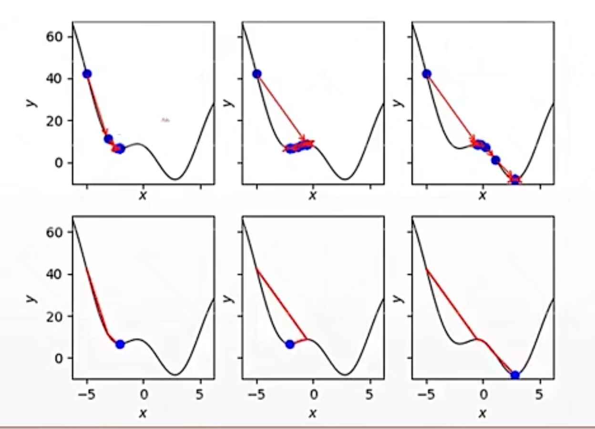
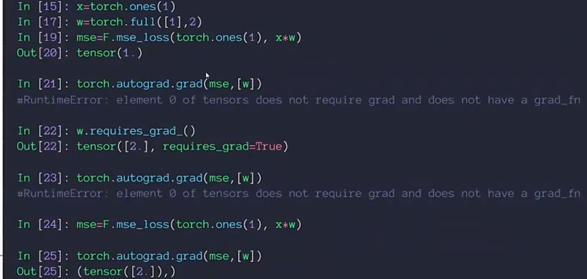

# 梯度与自动求导

## 什么是梯度

梯度gradient定义为所有偏微分的向量。梯度的长度len表示函数的变化趋势，方向dir表示函数增长的方向。偏微分partial derivate是方向固定的标量。

梯度的原理是：梯度方向等于函数值上升最快的方向，往负梯度方向走，函数值下降最快。只要步长合适，不断往负梯度方向走一小步，最后直至梯度接近0，就得到了极小值。

需要注意初始化和学习率即步长都会影响结果。鞍点和局部极小值都会影响优化器的选择。鞍点是梯度为0但既不是极大值也不是极小值的临界点。为了逃脱局部极小值，可以添加一个动量即惯性作为参考。

## ReLU函数

ReLU全称Rectified Linear Unit，是目前神经网络中使用较多的激活函数。它的梯度比较好计算，梯度计算时不会对其进行放大缩小，减少了梯度爆炸和梯度弥散的情况。

## 均方差与求导

Mean Squared Error即均方差。需要标注对w进行求导，否则会报错，因为PyTorch是动态图，图需要更新。标注需要对w进行求导后图会更新。

第一种求导方法是torch.autograd.grad(y,[x])，第二种求导方法是.backward()，它会自动进行反向传播，两种求导方式返回值的形式不同。

## Softmax函数

Softmax函数的输出区间在0到1之间，且所有值之和为1，适用于多分类问题。它具有转义成概率的能力，并且可以放大差距。

## retain注意事项

用了retain之后，第二次对其使用grad，得到的仍然是一阶梯度。

## 配图

*图1 梯度方向示意*

*图2 MSE求导代码示例*

