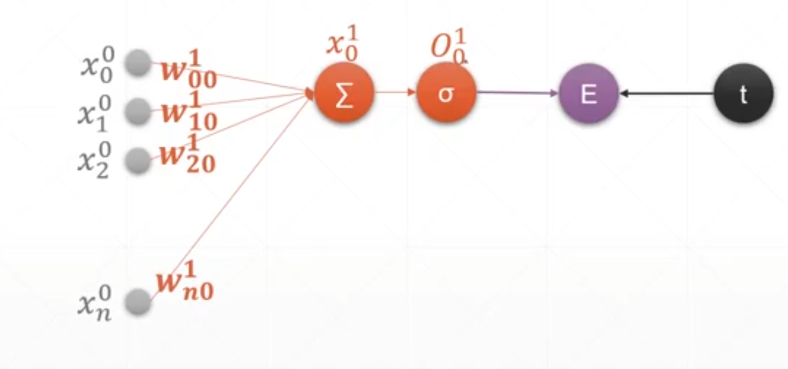
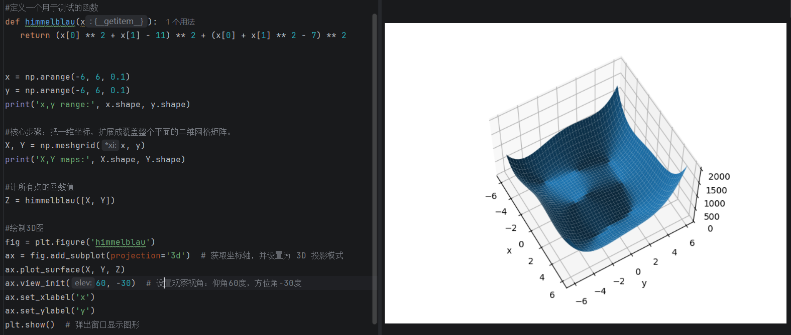

# 感知机与反向传播

## 前向传播

前向传播是指在求导之前先向右计算一次所有变量值，把输入数据喂给模型，按顺序计算出最终输出的过程。以单层单输出感知机为例，其求导结果比较简洁。

## 多输出感知机

多输出感知机的过程与单输出类似，只是输出层有多个神经元。

## 链式法则

链式法则实际上就是复合函数求导。添加多个隐藏层实际上就是嵌套多个线性函数，让模型能够拟合更复杂的模式，具体做法是将上一个隐藏层的输出作为该隐藏层的输入。

感知机的规范化表述分为三段式，每一部分为一层。

## 初始化与学习率

修改初始化值会影响局部极小值的搜索结果，可能找到其他的极小值，因此初始化和学习率的选取十分重要。

## 广义线性分类模型

不同问题对应不同的优化目标，这一部分内容理解即可。

## 配图

*图1 单层感知机前向传播*

*图2 链式法则*

*图3 损失函数三维图*

