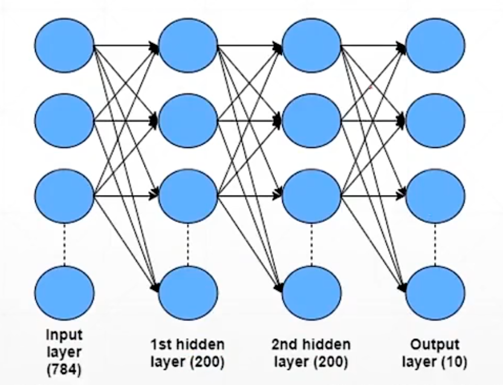
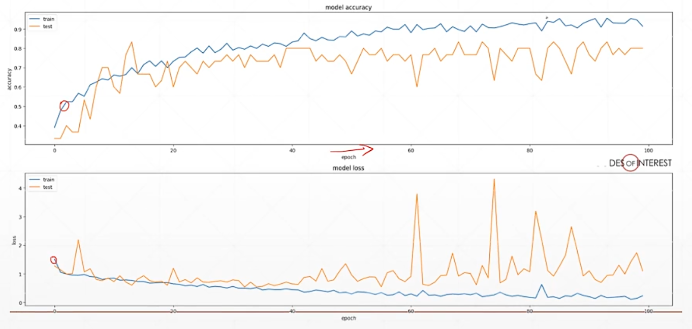
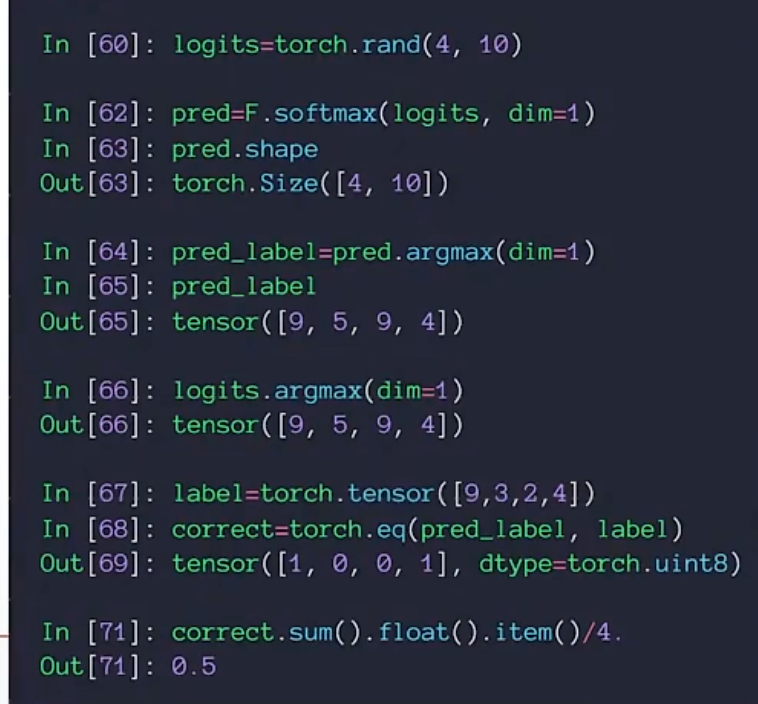

# 交叉熵与多分类实战

## 熵与自信息

熵是对随机变量不确定性的严格量化度量，也可以理解为一个随机事件所包含的平均信息量。

熵描述一个随机变量所有可能结果的平均不确定性，本质是自信息按概率加权的平均值。熵越大，分布越均匀，随机变量的结果越难预测，不确定性越高；熵越小，分布越集中，随机变量的结果越确定，混乱度越低。

自信息是指单次发生该事件的意外程度，该事件发生概率越小，所含信息量越大。

## 交叉熵

交叉熵用于衡量两个概率分布之间的差异，在多分类问题中作为损失函数使用。

## 多分类问题实战

多分类问题实战中需要搭建网络结构，然后进行训练和测试。训练过程中会生成loss函数曲线，通过曲线可以观察模型的训练情况。

从模型原始输出到计算预测准确率有一个完整的过程，需要将输出经过Softmax转换为概率，再取概率最大的类别作为预测结果。

## Visdom可视化

Visdom是一个可视化工具，开启方式是在命令行运行python -m visdom.server，生成一个地址后进入网页即可实时监控。

单条曲线和多条曲线的画法类似，需要注意确保同一个图上绘制的是同一种数据类型。具体用法可以在使用时再学习。

## 配图

*图1 多分类网络结构*

*图2 训练曲线解读*

*图3 从原始输出到准确率*

