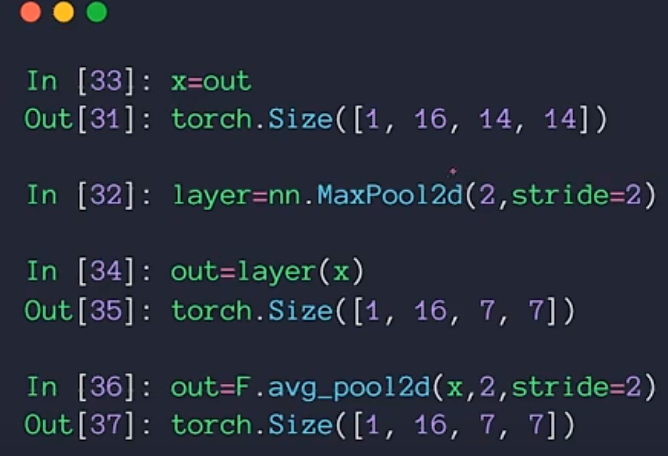
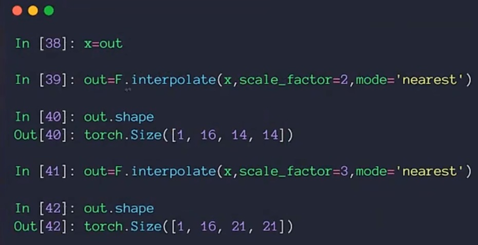
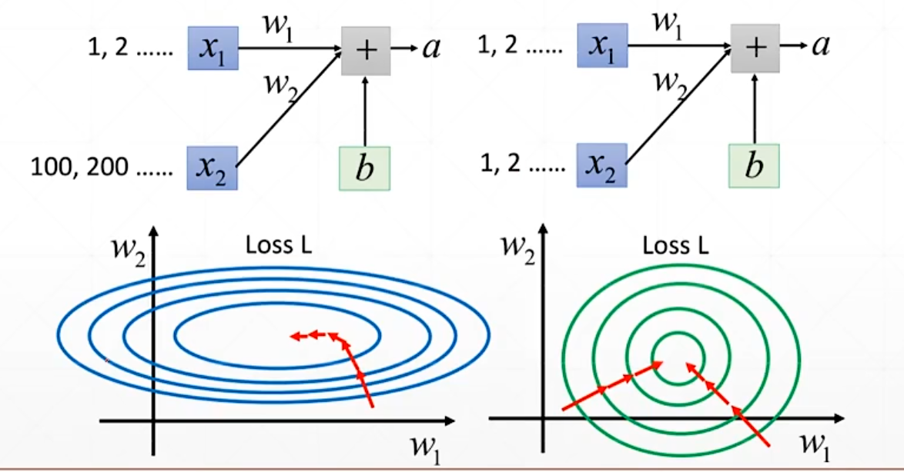

# 池化与上采样

## 池化层

池化层用于对特征图进行空间压缩和特征筛选，它没有可学习的权重参数，只根据固定的规则在窗口内进行操作。常见的池化方式有最大池化和平均池化，最大池化取窗口内的最大值，平均池化取窗口内的平均值。

池化操作可以减小特征图的尺寸，降低后续层的计算量，同时在一定程度上提供了平移不变性。

## 上采样

上采样是池化的逆过程，用于增大特征图的空间尺寸。上采样的实现方式包括简单的复制，即直接复制像素值来放大，以及按照其余规则进行放大，比如使用插值方法。

## Batch Normalization

Batch Normalization即批归一化，它将输入的值做等效转换，使其转换后范围落在有效区间内。批归一化可以加速网络的训练收敛，使得对学习率不那么敏感，同时还有一定的正则化效果。

## 配图

*图1 池化操作*

*图2 上采样操作*

*图3 Batch Normalization*

