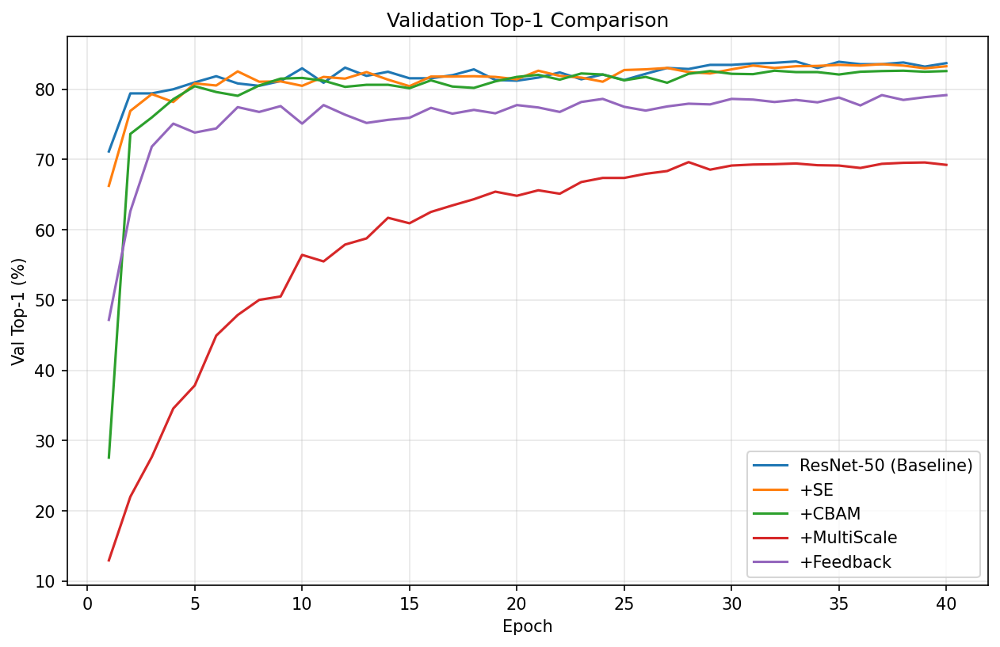
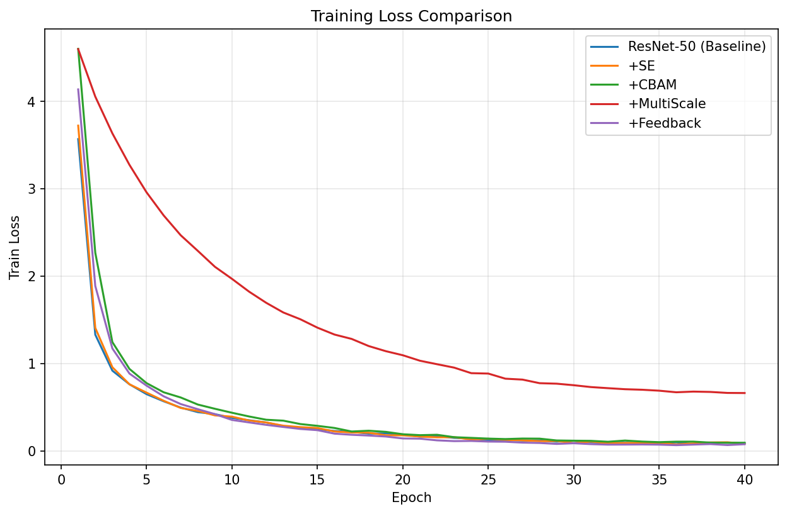
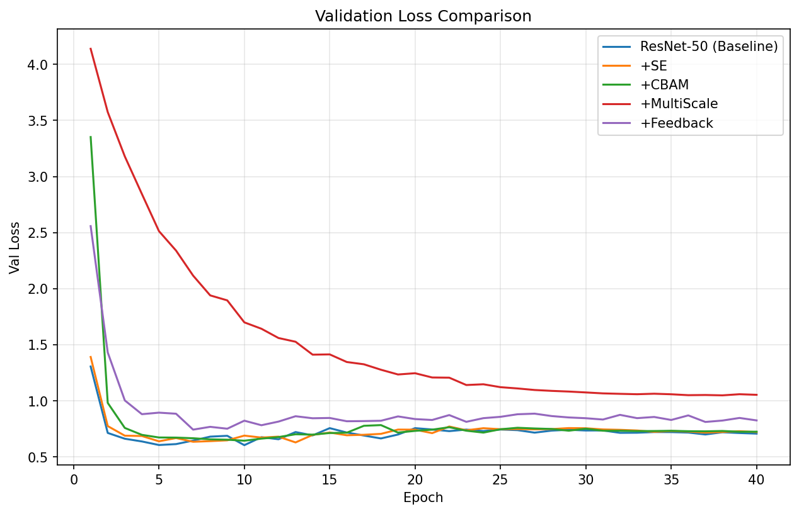
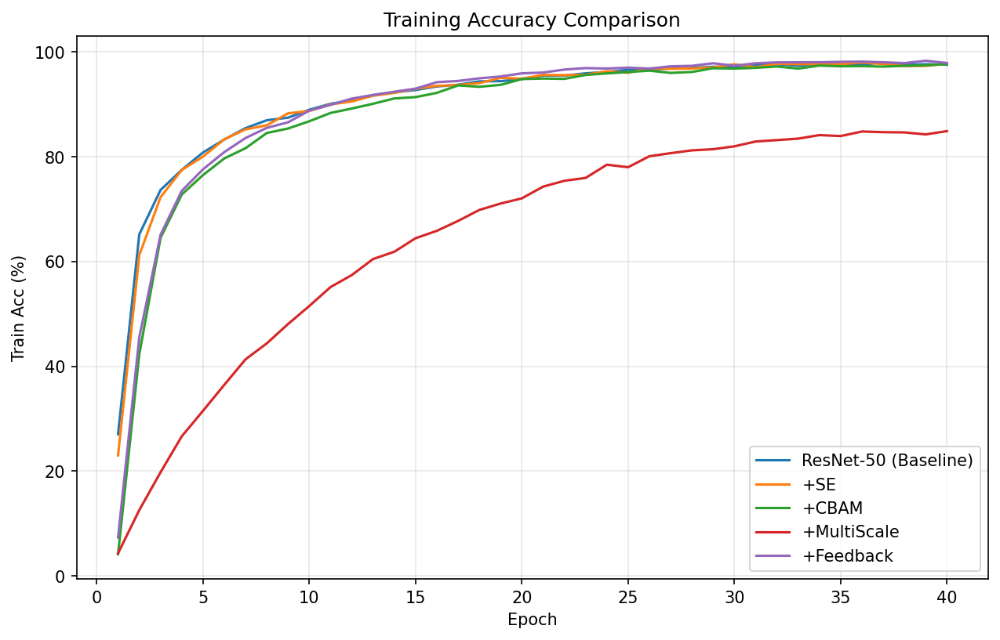
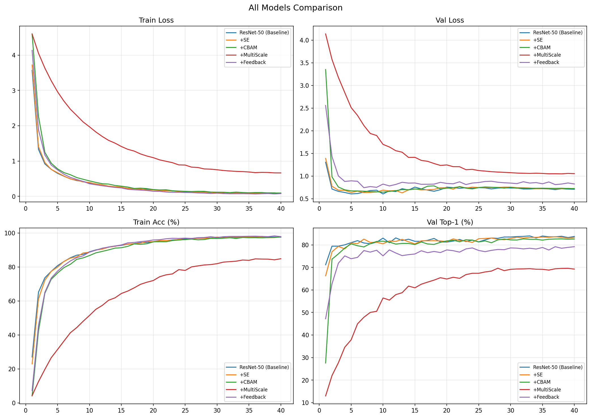
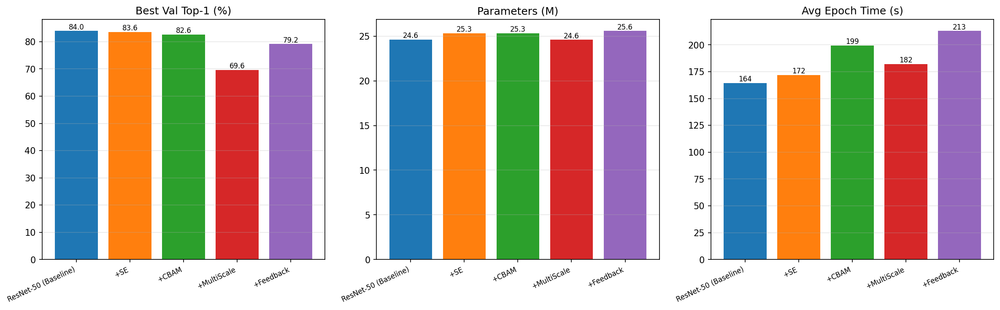

# Kaggle狗品种识别

> 竞赛地址：https://www.kaggle.com/competitions/dog-breed-identification

## 任务简介

细粒度图像分类任务，识别120种犬种。训练集约10,222张标注图片，测试集约10,357张。

### 难点

1. **类间方差小**：不同犬种外观相似（如哈士奇和阿拉斯加）
2. **类内方差大**：同一犬种毛色、姿态、角度差异大
3. **数据量小**：平均每类约85张，从头训练不可行
4. 必须使用 ImageNet 预训练权重做迁移学习

## 数据结构

```
dog-breed-identification/
├── train/          # 训练图片
├── test/           # 测试图片
├── labels.csv      # id, breed
└── sample_submission.csv
```

## 方法设计

以 ResNet-50 为基线，对比四种改进模块：

| 模型 | 方法 | 说明 |
|------|------|------|
| BaselineResNet | ResNet-50 | 纯基线 |
| SEResNet | + SE通道注意力 | 自动关注重要特征通道 |
| CBAMResNet | + CBAM通道空间注意力 | 同时关注"什么"和"哪里" |
| MultiScaleResNet | + FPN多尺度融合 | 融合浅层细节和深层语义 |
| FeedbackResNet | + 反馈迭代修正 | 二次前向传播修正预测 |

### 代码结构

- [`code/Models.py`](./code/Models.py)：所有模型定义（Baseline、SE、CBAM、MultiScale、Feedback）
- [`code/main.py`](./code/main.py)：训练、验证、测试主流程
- [`code/main_compare.py`](./code/main_compare.py)：五模型对比与结果可视化
- 结果缓存：每个模型训练完保存JSON，再次运行自动跳过已训练模型

### 训练配置

- 预训练：ImageNet ResNet-50
- 优化器：AdamW (lr=1e-4, weight_decay=1e-4)
- 学习率调度：CosineAnnealingLR
- 数据增强：RandomResizedCrop, Flip, Rotation, ColorJitter, RandomErasing
- Epochs：40
- Batch size：32
- GPU：RTX 3080 Laptop

## 实验结果

### 结果总表

| 模型 | Best Top-1 | 相对Baseline | 末10轮Top-1均值 | 训练精度 | 过拟合差距 |
|------|-----------|-------------|----------------|---------|-----------|
| ResNet-50 (Baseline) | 83.96% | — | 83.62% | 97.6% | 14.0% |
| + SE | 83.57% | -0.39% | 83.31% | 97.6% | 14.3% |
| + CBAM | 82.64% | -1.32% | — | 97.3% | 14.8% |
| + MultiScale | 69.63% | -14.33% | — | 84.1% | 欠拟合 |
| + Feedback | 79.17% | -4.79% | — | 98.0% | 19.5% |

### 训练曲线









### 综合对比





### 消融实验分析

**SE通道注意力**：Top-1为83.57%，比baseline低0.39%。训练精度和过拟合差距与baseline几乎一致，0.39%的差异在单次实验随机波动范围内，不能说明SE有害。在小数据集上，预训练ResNet已经学到了良好的通道特征，模块可能未带来额外提升，如需进一步确定需要更改随机种子取平均结果。

**CBAM通道+空间注意力**：Top-1为82.64%，比baseline低1.32%。下降幅度略大于SE，但训练精度和过拟合差距与baseline接近，没有出现严重过拟合。CBAM比SE多了空间注意力模块，新增参数更多，在1万张小数据集上引入了额外的优化难度。

**多尺度融合**：Top-1为69.63%，比baseline低14.33%，严重异常。训练精度仅84.1%，训练loss高达0.69，说明模型在训练集上都欠拟合。经代码分析，存在三个问题：layer4被完全丢弃（语义最强层）、通道从2048压缩到256（信息损失严重）、仅用最浅层特征分类。FPN是为目标检测设计的，直接搬到分类任务且丢弃最深层是设计错误。

**反馈网络**：Top-1为79.17%，比baseline低4.79%，严重过拟合。训练精度98.0%但验证精度仅78.6%，过拟合差距达19.5%。核心问题是训练与推理不一致：训练时70%梯度优化第二次前向路径，但推理时只返回第一次前向结果；随机初始化的refine层破坏了预训练特征分布。

## 遇到的问题与解决

### 问题1：SE模块加入后精度不升反降

- 现象：+SE模型Best Top-1为83.57%，比baseline低0.39%
- 分析：训练精度和过拟合差距与baseline几乎一致，排除过拟合，0.39%在单次实验随机波动范围内
- 解决：不做特殊处理
- 教训：单次实验0.5%以内的差异不能作为模块有效性的结论，需要3-5个不同随机种子重复实验取均值

### 问题2：MultiScale模型严重欠拟合

- 现象：前5个epoch验证精度仅30-45%，最终训练精度仅84%，训练loss高达0.69
- 分析：代码审查发现三个结构问题：丢弃layer4、通道过度压缩、仅用最浅层特征分类
- 解决：待修复，保留layer4特征，多层分别GAP后拼接，不做过度通道压缩
- 教训：为其他任务设计的模块不能直接照搬，分类任务最依赖深层语义特征

### 问题3：Feedback模型严重过拟合

- 现象：训练精度98%但验证精度仅78.6%，过拟合差距19.5%
- 分析：训练时70%梯度优化logits2但推理只返回logits1，训练推理路径不一致；refine层随机初始化破坏预训练特征
- 解决：待修复，推理时也返回logits2，将refine层初始化为近似恒等映射
- 教训：训练和推理的前向传播路径必须一致

## 总结与反思

- Baseline ResNet-50在小数据集上已经表现很好（83.96%），简单加模块不一定带来提升
- SE/CBAM的小幅下降在随机波动范围内，需要多种子实验确认
- MultiScale和Feedback的失败都是实现层面的问题，而非方法本身无效
- 如果继续做：TTA、Ensemble、更大输入分辨率、两阶段训练（先冻结后微调）
- 数据增强和输入分辨率的提升往往大于改网络结构

## 附件说明

- 代码：[`code/`](./code/) 目录
- 训练日志：[`results/`](./results/) 目录下的JSON文件
- 结果图表：[`results/`](./results/) 目录下的PNG文件
- 完整报告：[Kaggle狗品种识别项目报告.docx](./Kaggle狗品种识别项目报告.docx)
- 标签文件：[`labels.csv`](./labels.csv)
- 模型权重（.pth）和数据集因体积过大未上传，可通过运行代码重新训练获得
