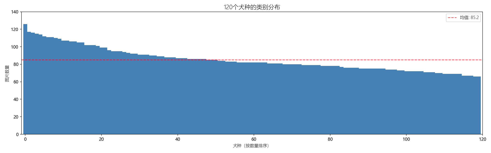
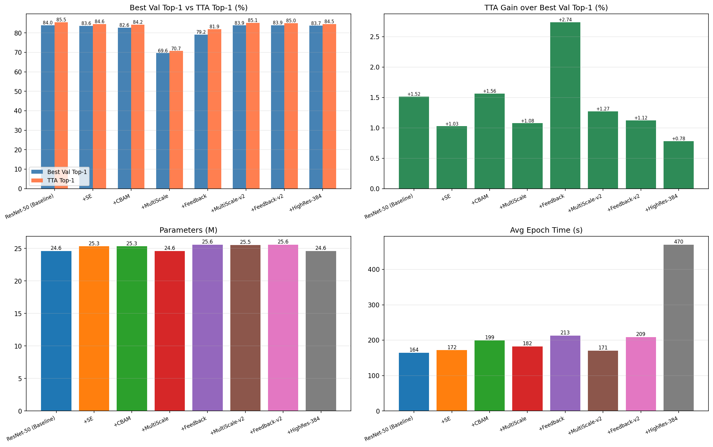
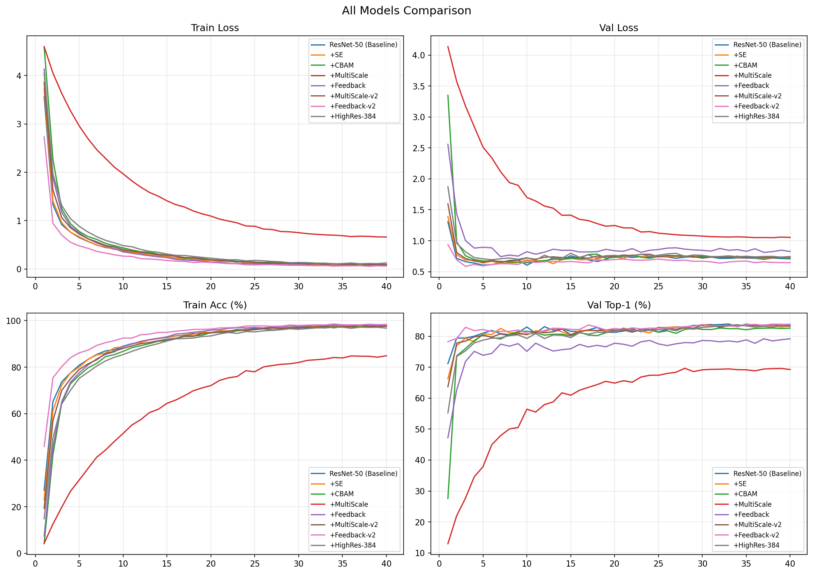

# Kaggle狗品种识别

> 竞赛地址：https://www.kaggle.com/competitions/dog-breed-identification

## 一、任务简介

这个项目基于Kaggle竞赛Dog Breed Identification，任务是对120种犬种做细粒度图像分类，给定一张狗的图片，模型需要输出它属于120个品种中每一种的概率。

这个任务属于细粒度图像分类，和普通的图像分类相比，难点主要体现在以下几个方面：

- 类间方差小，不同犬种之间的外观高度相似，比如哈士奇和阿拉斯加、萨摩耶与日本银狐，区分主要靠耳朵形状、口鼻比例这些细微特征。
- 类内方差大，同一犬种在毛色、姿态、角度、光照、背景这些方面会有很大差异。
- 数据量小，训练集只有10222张，平均每类大概85张，从头训练深度网络不太现实，需要用到ImageNet预训练权重来做迁移学习。

## 二、数据分析

数据集的统计信息如下：

| 项目 | 数值 |
| :--- | :--- |
| 训练集图片数 | 10,222 |
| 测试集图片数 | 10,357 |
| 类别数 | 120 |
| 每类平均图片数 | 85.2 |
| 每类最多/最少 | 126 / 66 |
| 图片格式 | JPEG |

类别分布如下图所示，数量最多的苏格兰猎鹿犬有126张，最少的布里犬和爱斯基摩犬只有66张；类别不均衡在一定程度上存在，但比例控制在2:1以内，不需要做过采样或者使用focal loss这类特殊处理，采用分层抽样就能保证训练集和验证集当中各类别的比例保持一致。

图1  120个犬种的类别分布

## 三、方法设计

### 3.1 基线选择

基线backbone选择ResNet-50：

- 训练集过小，只有1万张左右，从头训练深度CNN会造成严重的过拟合，所以需要借助ImageNet预训练模型学到的通用视觉特征，直接在小样本上进行调整。
- 网络层数选择方面，层数越深，小数据集上的过拟合风险越高，训练时间也会更长，为了适配8G显存的GPU（NVIDIA GeForce RTX 3080 Laptop GPU），这里选用层数适中的ResNet-50。
- 深层网络退化问题，使用ResNet的残差模块能够避免深层网络出现梯度弥散。

### 3.2 改进模块

在ResNet-50基线上，分别加入四个模块做消融实验：

（1）SE通道注意力

- 分析：不同通道对应的特征有所不同，在识别任务当中，可以自适应地给通道加权，对重要的特征进行增强，同时抑制无关通道，以此提高识别率。
- 原理：SE模块先通过global average pooling把每个通道的空间特征压缩成一个数值，得到通道描述符，再经过两个全连接层，先降维再升维，学习通道之间的依赖关系，最后用sigmoid生成0到1之间的通道权重，对原始特征逐通道加权，重要的通道得到增强，无关的通道被抑制。
- 预期：通道注意力有助于聚焦判别性特征通道，预计有轻微提升。

（2）CBAM卷积块注意力（通道+空间）

- 分析：在同一个通道中，每张图的重点信息有所不同，比如背景属于噪声，狗的形态等属于重要信息，对同一通道的不同位置进行加权，能够提高识别率。
- 原理：CBAM包含通道注意力和空间注意力两个子模块，顺序串联。通道分支沿空间维度分别做全局平均池化和最大池化，经过共享的MLP后相加，再通过sigmoid得到通道权重；空间分支沿通道维度做平均池化和最大池化并拼接，经过7x7卷积和sigmoid得到空间权重，对特征图的不同位置进行加权。
- 预期：空间注意力有助于聚焦判别性区域，预计有略微提升。

（3）多尺度特征融合（FPN方式）

- 分析：细粒度分类同时需要细节信息和语义信息，对CNN来说，浅层特征的分辨率高，但"利用率"不高，深层特征的分辨率会被压缩，造成"信息不足"，因此采用多尺度特征融合，把浅层特征和深层特征融合起来利用，在保留深层语义的同时，也保留浅层的分辨率。
- 原理：借鉴FPN的自顶向下结构，把深层低分辨率特征通过最近邻上采样恢复到与浅层相同的尺寸，再和浅层特征逐元素相加，之后用1x1卷积统一通道数；经过逐层融合，每一层的特征都同时包含了浅层的空间细节和深层的语义信息。
- 预期：融合浅层细节和深层语义，预计有轻微提升。

（4）反馈网络

- 动机：对于难分辨的样本，进行二次分辨能够提高识别率，因此根据高层语义的输出，重新反馈回网络，对特征进行调整修正，以此达到"二次分辨"的效果。
- 原理：第一次前向得到初步预测后，把高层特征送入refine卷积层处理，再回传到layer1和原始特征相加，之后做第二次前向；网络能够根据第一次识别的结果对特征进行修正，对难分样本做二次审视。
- 预期：对相似犬种的难分样本通过二次审视修正预测，在干净静态图像上提升有限，预计有轻微提升。

### 3.3 模型结构总览

| 模型 | Backbone | 改进模块 | 新增参数 |
| :--- | :--- | :--- | :--- |
| ResNet-50 (Baseline) | ResNet-50 | 无 | 0 |
| +SE | ResNet-50 | 每个stage后加SE通道注意力 | ~0.7M |
| +CBAM | ResNet-50 | 每个stage后加CBAM通道+空间注意力 | ~0.7M |
| +MultiScale | ResNet-50 | FPN式多层特征融合 | ~0M（替换分类头） |
| +Feedback | ResNet-50 | 两次前向+门控反馈 | ~1.0M |

## 四、代码实现

项目代码分为两个文件：

- [models.py](./code/Models.py)：定义了5个模型类（BaselineResNet、SEResNet、CBAMResNet、MultiScaleResNet、FeedbackResNet），以及SEBlock、CBAM等子模块。
- [main_compare.py](./code/main_compare.py)：包含配置、数据加载、训练循环、验证、测试推理、结果可视化这些部分。

训练流程为前向传播、计算损失、反向传播、优化器更新；每个epoch结束后在验证集上评估Top-1和Top-5精度，保存最佳模型；每个模型的训练历史会保存为JSON文件，再次运行时会自动跳过已经训练过的模型。

## 五、实验配置

| 配置项 | 设置 |
| :--- | :--- |
| GPU | NVIDIA GeForce RTX 3080 Laptop |
| 输入分辨率 | 224 x 224（除了扩大输入分辨率） |
| Batch Size | 32 |
| 训练轮数 | 40 epochs |
| 优化器 | AdamW (lr=1e-4, weight_decay=1e-4) |
| 学习率调度 | CosineAnnealingLR |
| 损失函数 | CrossEntropyLoss |
| 训练数据增强 | RandomResizedCrop(scale=0.6~1.0), HorizontalFlip, Rotation(15), ColorJitter, RandomErasing(p=0.3) |
| 验证预处理 | Resize(256) + CenterCrop(224) |
| 数据划分 | 80%训练 / 20%验证，stratify分层抽样 |
| 随机种子 | 42（固定） |

原则：所有模型使用完全相同的数据增强、优化器、学习率、batch size、epoch数和随机种子，确保差异只来自模型本身。

## 六、实验结果

### 6.1 总体结果

| 模型 | Best Top-1 (%) | Best Top-5 (%) | Params (M) | Avg Epoch (s) |
| :--- | :--- | :--- | :--- | :--- |
| ResNet-50 (Baseline) | 83.96 | 97.95 | 24.6 | 164.4 |
| +SE | 83.57 | 97.80 | 25.3 | 171.8 |
| +CBAM | 82.64 | 97.85 | 25.3 | 199.4 |
| +MultiScale | 69.63 | 94.18 | 24.6 | 182.1 |
| +Feedback | 79.17 | 96.92 | 25.6 | 212.9 |

图2  各模型精度、参数量、训练时间对比

### 6.2 训练曲线

图3  训练/验证 Loss与Accuracy曲线对比

### 6.3 消融实验分析

以BaselineResNet为基准，四个改进模块的消融结果如下：

| 模型 | Best Top-1 (%) | 相对baseline | 末10轮均值 (%) | 训练精度 (%) | 过拟合差距 (%) | 结论 |
| :--- | :--- | :--- | :--- | :--- | :--- | :--- |
| Baseline | 83.96 | — | 83.62 | 97.63 | 14.01 | 基线 |
| +SE | 83.57 | -0.39 | 83.31 | 97.60 | 14.29 | 基本持平 |
| +CBAM | 82.64 | -1.32 | 82.46 | 97.28 | 14.82 | 略低 |
| +MultiScale | 69.63 | -14.33 | 69.30 | 84.10 | 14.80 | 严重异常（欠拟合） |
| +Feedback | 79.17 | -4.79 | 78.56 | 98.04 | 19.48 | 严重过拟合 |

从注意力模块的实验表现来看，SE的各项指标和baseline基本持平，整体效果略有下降，CBAM的各指标相比Baseline稍差；但仅凭单次实验的结果，还不足以说明这类模块会带来负面作用，出现偏差的原因既可能是训练过程中的随机波动，也可能是模块对预训练特征产生了一定干扰。总体来看，两类模块都没有带来性能上的提升，这说明在小数据集场景下，ImageNet的预训练特征已经具备了足够的表达能力，注意力模块引入的额外参数无法转化为更优的性能。

MultiScale和Feedback模块出现了比较严重的异常，前者在训练集上表现出欠拟合状态，后者训练集表现良好但验证集过拟合问题突出；初步判断这一问题源于模块结构本身存在缺陷，后续需要做进一步的排查和确认。

## 七、遇到的问题与解决

问题1：MultiScale模型精度只有69.63%，严重欠拟合

- 现象：MultiScale收敛效果差，前5个epoch验证精度只有30-45%（其他模型已经达到80%），最终训练精度只有84%，训练loss高达0.69。
- 分析：训练集欠拟合，在代码中发现：
  1. ResNet-50中语义最强的layer4被完全丢弃，影响了分类结果
  2. 通道被压缩到了256维，baseline用2048维特征，模型表达能力大幅减弱。
- 解决：保留layer4，为了不让通道被压缩，应该对各层分别做global average pooling后concat。
- 教训：使用模块应该理解原理，之后根据当前任务进行模块的代码修改；分类任务中深层结构不能随意丢弃，否则可能严重影响效果。

问题2：Feedback模型严重过拟合

- 现象：Feedback训练精度比baseline高，但验证精度只有78.6%，过拟合差距达19.5%
- 分析：训练精度高但验证精度低，判断属于过拟合，但普通过拟合一般不会差5%；发现核心问题是训练和推理的前向传播不一致，训练时返回(logits1, logits2)，推理时只返回logits1（第一次前向）。此外，refine卷积层随机初始化，改变了layer1输出的特征分布，而layer2-4是在原始分布上预训练的，输入分布的改变破坏了预训练特征。
- 解决：推理时也返回两次前向结果取平均；把refine层最后一个BN的weight初始化为0，使训练开始时反馈路径近似恒等映射（类似残差模块），不改变原始特征。
- 教训：训练和推理的前向传播路径必须保持一致，否则训练优化的方向和推理使用的方向会不匹配；添加新模块时要保证初始状态接近恒等映射，避免破坏预训练特征。

## 八、问题修复后模型验证与补充实验

由于各个模块都没有取得好的提升，于是前往Kaggle查看了其他人提高Top-1的方法，发现top方案把问题拆解成了"特征提取"和"分类"两步。因为预训练模型在ImageNet上已经学到了很好的视觉特征，小数据集上微调这些特征容易过拟合，所以多个方案直接把多个模型的特征拼接起来，用模型多样性换性能，而不是在单一模型上改结构。同时也有方案直接通过数据增强提高百分比，因此尝试利用TTA和扩大输入来提高识别率，并且修复之前的问题模型。

### 8.1 修复版模型结果验证

针对MultiScale模型，实现了MultiScaleResNetV2：保留layer4，对layer1至layer4四层分别做global average pooling后拼接（3840维），再经过分类头输出，不做通道压缩。
针对Feedback模型，实现了FeedbackResNetV2：推理时返回两次前向结果取平均，将refine层最后一个BN的weight初始化为0，使训练开始时反馈路径近似恒等映射。
两个修复版模型均使用与原始实验相同的超参数和随机种子重新训练40个epoch。

修复后全部8个模型的结果如下表所示：

| 模型 | 输入尺寸 | Best Top-1 (%) | Best Top-5 (%) | TTA Top-1 (%) | TTA Top-5 (%) | Params (M) |
| :--- | :--- | :--- | :--- | :--- | :--- | :--- |
| ResNet-50 (Baseline) | 224 | 83.96 | 97.95 | 85.48 | 98.04 | 24.6 |
| +SE | 224 | 83.57 | 97.80 | 84.60 | 97.90 | 25.3 |
| +CBAM | 224 | 82.64 | 97.85 | 84.21 | 97.80 | 25.3 |
| +MultiScale（原版） | 224 | 69.63 | 94.18 | 70.71 | 94.82 | 24.6 |
| +Feedback（原版） | 224 | 79.17 | 96.92 | 81.91 | 96.97 | 25.6 |
| +MultiScale-v2（修复版） | 224 | 83.86 | 97.75 | 85.13 | 98.09 | 25.5 |
| +Feedback-v2（修复版） | 224 | 83.91 | 97.90 | 85.04 | 98.14 | 25.6 |
| +HighRes-384 | 384 | 83.72 | 97.56 | 84.50 | 97.95 | 24.6 |

Top-1两者都回到了baseline（83.96%）水平，差异在0.1%左右，属于随机波动范围。这验证了之前的分析：MultiScale的欠拟合是由丢弃layer4的结构错误造成的，Feedback的过拟合则是由训练推理不一致和refine层随机初始化造成的；但修复后两个模块本身没有带来提升，不过也不再有害，说明在小数据集加预训练的条件下，这两种结构改进的收益比较有限。

图4  8个模型的训练/验证Loss与Accuracy曲线对比

### 8.2 高分辨率输入实验

为验证增大输入分辨率是否有助于细粒度分类，把输入从224x224提升到了384x384，使用相同的ResNet-50架构和预训练权重重新训练。由于384分辨率下显存占用增加，batch size调整为12，并使用梯度累积（每3个batch更新一次，等效batch size为36）来稳定梯度，学习率调整为7e-5，其余超参数保持不变。

HighRes-384的训练精度为97.0%（baseline为97.6%），验证Loss为0.74（baseline为0.71），过拟合差距和baseline一致。

分析原因：一是ResNet-50在224输入下的感受野已经覆盖了整张图像，犬种的区分特征在224分辨率下已经足够清晰，384多出的像素主要是背景和冗余细节；二是预训练权重在224分辨率的ImageNet上训练，中层和高层特征针对224尺度做了优化，修改尺度后不会自动适应；三是batch size从32降到12后，BatchNorm的统计量噪声增大，验证Loss偏高，梯度累积只能稳定梯度，无法解决BN统计量的问题，可能抵消了高分辨率带来的优势。

### 8.3 TTA测试时增强

TTA在推理时对每张图做多个增强版本分别预测，再把softmax概率取平均，不需要重新训练就能提升精度。本次使用3个尺度（1.0x、1.14x、1.28x）乘以中心裁剪和水平翻转，共6个视角进行TTA。

图5  8个模型的Top-1/TTA精度对比、TTA提升幅度、参数量与训练时间

如图5所示，TTA对所有模型都有提升，幅度在0.78%到2.74%之间；其中Feedback模型提升最大，可能是因为两次前向结构对输入扰动更敏感；HighRes-384提升最小，可能因为384分辨率下多尺度裁剪的信息冗余更大。Baseline在TTA后达到85.48%，是所有单模型中的最好结果。TTA的提升来自多视角平均降低了预测方差，对边界裁剪和翻转敏感的样本收益最大。

### 8.4 补充实验小结

综合修复验证和补充实验的结果，可以得到以下结论：

- MultiScale-v2和Feedback-v2都恢复到了baseline水平，确认了原始模型的异常来自实现错误而非模块本身，但修复后没有带来提升，说明在小样本加预训练的条件下，手动添加注意力或多尺度模块的效果不好。
- 输入分辨率从224提升到384没有带来提升，ResNet-50在224下已经达到了这个架构在该数据集上的最好性能，单纯提高分辨率不会改变模型的特征提取能力。
- TTA是零训练成本的提升手段，可以带来1%左右的稳定增益。
- 所有基于ResNet-50的改进都没有实质上的改进，若想提升可能需要更好的backbone或者使用多模型ensemble（Kaggle的TOP方案使用）。

## 九、总结与反思

1. 基线结果合理

Backbone在120类细粒度犬种分类上达到了83.96%。

2. 注意力模块在小数据集上可能没有收益

SE和CBAM都没有带来提升，预计是ImageNet预训练特征已经足够好，注意力模块在小数据集上引入了额外参数和优化难度，干扰了预训练的训练特征。
因此注意力机制可能更适合大数据集或者从零训练的场景。

3. 多尺度融合第一次实现失败

错误地丢弃了最深层语义特征并过度压缩了通道；需要保留所有层特征，分别全局池化后进行拼接分类。
在使用一个新模块时，需要理解模块含义，并与当前学习任务要求匹配

4. 反馈网络在干净静态图像上可能没有收益

反馈机制在噪声、遮挡、视频等有多余信息的复杂任务会有效，但在干净的静态图像分类上，第一次前向已经提取足够信息，二次反馈实际上不会带来大致收益；
而且模型的训练和推理需要保持一致，否则会出现严重错误。

5. TTA是小样本中十分有效的提升手段

TTA在推理时对每张图做多个数据增强并分别预测，再将softmax概率取平均值，而不需要重新训练就能提升精度，在这个实验的所有小样本模块中都有提升，因此认为小样本中TTA可以有效提高效果。

6. 后续改进方向

- 1.多次重复实验：用不同随机种子实验3-5次取均值，消除随机性影响。
- 2.更换backbone：EfficientNet-B3或ConvNeXt-Tiny进行实验（这两个模型在ImageNet的效果更好）。
- 3.使用多模型ensemble：把2到3个不同backbone的softmax概率加权平均（Kaggle的TOP方案）

---

## 附件

- 代码：[`code/`](./code/) 目录，包含 Models.py、main_compare.py、main.py
- 实验结果：[`results/`](./results/) 目录，包含各模型JSON日志、results.csv、对比图
- 实验图片：[`images/`](./images/) 目录，包含报告中引用的所有图片
