# 408 操作系统笔记

> 第一章 计算机系统概述 · 第二章 进程与线程（含进程同步、死锁）· 第三章 内存管理（全章，含虚拟内存、请求分页、页面置换与地址翻译）

> ✍️ **写作声明**：本笔记知识点总结正文均为本人独立撰写，仅【易错辨析】【考点考频】【补充知识点】三类标注内容借助 AI 辅助分析生成。

---

## 📑 知识点目录

**[第一章  计算机系统概述](#第一章-计算机系统概述)**
- [1. 操作系统的概念](#1-操作系统的概念)
- [2. 操作系统的功能](#2-操作系统的功能)
- [3. 操作系统的特征](#3-操作系统的特征)
- [4. 操作系统的发展历程](#4-操作系统的发展历程)
- [5. 操作系统的运行环境](#5-操作系统的运行环境)
- [6. 操作系统的结构](#6-操作系统的结构)
- [7. 操作系统的引导](#7-操作系统的引导)
- [8. 虚拟机](#8-虚拟机)

**[第二章  进程与线程](#第二章-进程与线程)**
- [1. 进程的概念与特征](#1-进程的概念与特征)
- [2. 进程的组成](#2-进程的组成)
- [3. 进程的内存映像](#3-进程的内存映像)
- [4. 进程的状态与切换](#4-进程的状态与切换)
- [5. 进程控制](#5-进程控制)
- [6. 进程通信 IPC](#6-进程通信-ipc)
- [7. 线程（“轻量级进程”）](#7-线程轻量级进程)
- [8. 线程控制块](#8-线程控制块)
- [9. 线程的实现方式](#9-线程的实现方式)
- [10. CPU 调度](#10-cpu-调度)
- [11. 进程切换](#11-进程切换)
- [12. CPU 调度算法](#12-cpu-调度算法)
- [13. 多处理机调度](#13-多处理机调度)
- [14. 同步与互斥](#14-同步与互斥)
- [15. 实现临界区互斥的基本方法](#15-实现临界区互斥的基本方法)
- [16. 互斥锁（自旋锁，忙等待）](#16-互斥锁自旋锁忙等待)
- [17. 信号量机制](#17-信号量机制)
- [18. 信号量实现互斥、同步与前驱关系](#18-信号量实现互斥同步与前驱关系)
- [19. 经典同步问题](#19-经典同步问题)
- [20. 管程](#20-管程)
- [21. 条件变量](#21-条件变量)
- [22. 死锁](#22-死锁)
- [23. 死锁的处理策略](#23-死锁的处理策略)
- [24. 死锁预防](#24-死锁预防)
- [25. 死锁避免](#25-死锁避免)
- [26. 死锁检测与解除（检测）](#26-死锁检测与解除检测)
- [27. 死锁解除](#27-死锁解除)

**[第三章  内存管理](#第三章-内存管理)**
- [1. 程序的链接与装入](#1-程序的链接与装入)
- [2. 程序的链接](#2-程序的链接)
- [3. 程序的装入](#3-程序的装入)
- [4. 内存保护](#4-内存保护)
- [5. 内存共享](#5-内存共享)
- [6. 连续分配管理方式](#6-连续分配管理方式)
- [7. 动态分区分配算法](#7-动态分区分配算法)
- [8. 非连续分配方式概述](#8-非连续分配方式概述)
- [9. 基本分页存储管理（无快表时两次访存）](#9-基本分页存储管理无快表时两次访存)
- [10. 具有快表 TLB 的地址变换机构（命中 1 次、未命中 2 次访存）](#10-具有快表-tlb-的地址变换机构命中-1-次未命中-2-次访存)
- [11. 两级页表（多级页表）](#11-两级页表多级页表)
- [12. 基本分段存储管理](#12-基本分段存储管理)
- [13. 分页与分段的对比](#13-分页与分段的对比)
- [14. 段的共享与保护](#14-段的共享与保护)
- [15. 段页式存储管理（无快表时三次访存）](#15-段页式存储管理无快表时三次访存)
- [16. 传统存储管理方式的特征](#16-传统存储管理方式的特征)
- [17. 局部性原理](#17-局部性原理)
- [18. 虚拟存储器](#18-虚拟存储器)
- [19. 虚拟内存技术的实现](#19-虚拟内存技术的实现)
- [20. 请求分页管理方式（最常用）](#20-请求分页管理方式最常用)
- [21. 缺页中断机制与请求分页地址变换](#21-缺页中断机制与请求分页地址变换)
- [22. 页框分配](#22-页框分配)
- [23. 内存分配与置换策略](#23-内存分配与置换策略)
- [24. 页框调入算法](#24-页框调入算法)
- [25. 调入页面的时机](#25-调入页面的时机)
- [26. 调入页面的来源](#26-调入页面的来源)
- [27. 页面调入过程（对用户完全透明）](#27-页面调入过程对用户完全透明)
- [28. 页面置换算法](#28-页面置换算法)
- [29. 抖动（颠簸）与工作集（大纲已删除，了解）](#29-抖动颠簸与工作集大纲已删除了解)
- [30. 页面缓冲算法 PBA](#30-页面缓冲算法-pba)
- [31. 页框回收](#31-页框回收)
- [32. 内存映射文件（Memory-Mapped Files）](#32-内存映射文件memory-mapped-files)
- [33. 虚拟存储器性能的影响因素](#33-虚拟存储器性能的影响因素)
- [34. 地址翻译（结合计算机组成原理）](#34-地址翻译结合计算机组成原理)

---

> **📌 标注说明**  
> 【高频】历年选择题/大题反复考查，必须熟练掌握  
> 【中频】有一定考查频率，理解并记忆核心结论  
> 【低频】偶尔考查或仅考概念，留印象即可  
> 【大题考点】曾在综合应用题中出现，需掌握计算与分析过程  
> 【易错辨析】易混淆概念或常见陷阱  
> 【补充】原文遗漏或有误处，已补充/修正的内容  

# 第一章  计算机系统概述

## 1. 操作系统的概念
`🟡中频`

操作系统负责管理硬件资源、为应用程序提供运行环境、充当硬件与用户之间的桥梁。

## 2. 操作系统的功能
`🔴高频`

- 用户接口：联机用户接口、脱机用户接口、图形用户接口。
- 程序接口：核心是一组系统调用，库函数只是对系统调用的封装**【不是操作系统接口】**。

> **⚠️ 【易错辨析】“操作系统接口”的判定**  
> 程序接口（系统调用）才是操作系统提供给应用程序的接口；普通库函数运行在用户态，只是对系统调用的封装，本身不属于操作系统接口。  

## 3. 操作系统的特征
`🔴高频`

操作系统具有并发、共享**【前二者最基本】**、虚拟、异步四个基本特征。

### （1）共享

- 互斥共享：在一段时间内仅有一个进程访问该临界资源。
- 同时访问方式：逻辑上并发访问，微观上分时共享。

### （2）虚拟

一个物理实体映射到多个逻辑上的对应物，典型技术包括多道程序技术、虚拟存储器技术、虚拟设备技术；如 SPOOLing 可将某些独占型设备转化为多台逻辑设备。

### （3）异步

进程以不可预知的速度**【断续】**推进。

> **⚠️ 【易错辨析】并发与并行**  
> 并发性是指宏观上在一段时间内有多道程序同时运行、微观上交替执行（单 CPU 也可并发）；并行性是指同一时刻真的有多个程序在不同 CPU 上同时执行，必须有多个处理机。  

## 4. 操作系统的发展历程
`🔴高频`

### （1）手工操作阶段

- ①人工操作方式；②脱机 I/O 方式：引入外围机预先完成 I/O 准备工作。

### （2）批处理阶段（操作系统开始出现）

- 单道批处理系统：配备监督程序，具有单道性。
- 多道批处理系统：依赖中断技术，宏观上并行、微观上串行。

### （3）分时操作系统

具有同时性（多个终端用户同时使用一台主机）、及时性、交互性、独立性。

### （4）实时操作系统

在严格的时间限制内完成关键任务，分为硬实时（绝对可靠）、软实时（可有短暂延时），具有确定性（响应时间可预测）、高可靠性、强时效性。

### （5）网络操作系统与分布式操作系统

- 网络操作系统：在单机操作上拓展网络功能，用户显式指定远程资源的位置进行访问，系统不提供统一的全局视图。
- 分布式操作系统：多台计算机组成的集合，具有分布性、并行性、**【透明性】**。

### （6）微机操作系统

- ①单用户单任务：允许一个用户登录并运行一个程序（MS-DOS，16 位）。
- ②单用户多任务：支持一个用户同时运行多个应用程序。
- ③多用户多任务：允许多个用户通过终端或网络同时登录，并发执行多个任务，资源共享、互不干扰。

<p align="center"><i>表1-1 操作系统各发展阶段对比</i></p>

| 阶段 | 主要特征 | 是否交互/并发 | 关键点 |
| --- | --- | --- | --- |
| 手工操作 | 用户独占、速度慢 | 无并发 | 脱机I/O用外围机 |
| 单道批处理 | 监督程序、自动成批 | 单道、无并发 | 内存中始终只有一道作业 |
| 多道批处理 | 多道程序交替 | 宏观并行、微观串行 | 依赖中断技术，OS正式形成 |
| 分时系统 | 时间片轮转 | 多用户并发交互 | 同时性/及时性/交互性/独立性 |
| 实时系统 | 限时响应 | 高可靠/强时效 | 硬实时不可超时、软实时可偶尔超时 |

发展历程全览：手工阶段→脱机处理→早期批处理（OS 开始出现）→多道批处理→分时操作系统→实时操作系统→网络操作系统→分布式操作系统→微机操作系统。

## 5. 操作系统的运行环境
`🔴高频 ⭐大题考点`

操作系统内核用于保护核心模块免受应用程序破坏、提升操作系统运行效率。

### （1）内核的核心功能

- ①支撑功能：时钟管理（系统的大量活动均依赖时钟机制）、中断机制（现代操作系统运行的基础）、原语（具有原子性，执行过程不可被中断）。
- ②系统资源管理功能：进程管理、存储器管理、设备管理。

### （2）处理机的两种状态

- 用户态（目态）与内核态（管态、系统态），硬件通过模式位标识当前运行状态。
- 特权指令：仅允许在内核态下执行，可访问全部地址空间；非特权指令：内存访问被限制在用户地址空间。
- 用户进程进入内核态的唯一合法途径是**【中断（外中断）或异常（内中断）】**；**【访管指令不是特权指令】**，它为用户提供受控且主动的内核态入口机制；内核态通过特定返回指令（如 IRET）返回用户态，返回指令执行在内核态。

<p align="center"></p>

<p align="center"><i>图1-1 用户态与内核态的转换、系统调用处理过程</i></p>

### （3）中断与异常

- 外中断：可屏蔽中断**【经 INTR 线发出中断请求】**、不可屏蔽中断**【经 NMI 线发出中断请求】**。
- 异常（内中断）：故障（指令执行引起的异常）、自陷、终止（硬件故障，属于硬件中断）。

**【重点：中断/异常发生时，各寄存器现场分别由谁保存】**无论是外中断还是内中断（异常），**【断点（程序计数器 PC 的值）与程序状态字 PSW，都由硬件（中断隐指令）在响应中断的瞬间自动保存】**；通用寄存器等其余处理机现场，则由**【中断服务程序（操作系统内核、软件）在程序入口处通过进栈指令 PUSH 保存】**，并在中断返回前出栈恢复。

- 外中断发生在**【两条指令之间（一条指令执行结束时）】**，硬件保存的断点是**【下一条待执行指令的地址】**。
- 内中断（异常）发生在**【一条指令的执行过程中】**：故障类（如缺页、地址越界）保存**【当前指令的地址】**，处理结束后**【重新执行该指令】**；自陷类保存下一条指令地址；终止类不再恢复执行。

> **⚠️ 【易错辨析】外中断与内中断的现场保存、断点区别**  
> 相同点：PC、PSW 都由硬件（中断隐指令）自动保存，通用寄存器等其余现场都由中断/异常服务程序（软件）保存，不要误认为全部现场都由硬件保存；  
> 不同点在断点：外中断在指令之间、保存“下一条指令地址”；故障类异常在指令执行中、保存“当前指令地址”并在处理后重新执行该指令；  
> 中断隐指令由硬件完成、并不是一条真正的指令，它主要做关中断、保存断点（PC、PSW）、按中断向量引出服务程序三件事。  

<p align="center"></p>

<p align="center"><i>图1-2 中断（外中断）与异常（内中断）的分类</i></p>

> **⚠️ 【易错辨析】态转换与中断的常见陷阱**  
> ①用户态→内核态只能通过中断/异常（含系统调用陷入），不能由用户程序直接跳转；②内核态→用户态通过返回指令 IRET 完成；③访管/陷入指令本身运行在用户态、是非特权指令，它“触发”进入内核态。  

### （4）系统调用

系统调用是提供给应用程序使用的接口，每个系统调用都有唯一的系统调用号；功能包括设备管理、文件管理、进程管理、进程通信、内存管理。

- 与普通调用的区别：运行状态不同、状态转换不同（系统调用需通过陷入指令触发）、返回机制不同、嵌套调用限制不同（系统调用受内核栈空间限制，普通调用受用户栈大小约束）。
- 系统调用的处理过程：传递系统调用参数→**【执行陷入指令】**并切换至内核态→定位并执行相应服务程序→恢复现场并返回用户态。

> **⭐ 【大题考点】系统调用全过程**  
> 传参（用户态）→执行陷入指令 trap、由用户态陷入内核态→内核根据系统调用号定位服务例程并执行→执行返回指令、恢复现场回到用户态。注意“陷入指令”本身在用户态执行，其余服务在内核态。  

## 6. 操作系统的结构
`🟡中频`

- ①分层法：各层仅可调用其紧邻下层所提供的功能和服务**【单向依赖】**，便于调试与验证、易于扩充维护，但层次划分困难、运行效率低。
- ②模块化：按功能划分为若干具有独立性的模块；模块小则降低单个模块复杂性但提高模块间交互频率，模块大则内部结构复杂、难维护；独立性标准为内聚性（越高越好）与耦合度（越低越好）。
- ③宏内核（单内核/大内核）：主要功能模块集成在一个紧密耦合的整体中，运行于内核态。
- ④微内核：仅保留最基本的功能**【进程调度、进程间通信】**在内核中，将**【文件系统、设备驱动】**移到用户态运行，非核心功能之间以及与客户进程之间通过微内核提供的**【消息传递机制】**完成；具有可扩展性、灵活性、可靠性、安全性、可移植性，采用**【面向对象技术】**，遵循**【机制与策略分离】**原则。
- ⑤外核：**【将物理资源直接暴露给用户级系统，自身仅负责资源的安全分配与隔离】**，利用权限检查防止越权，可在用户空间构建库操作系统，减少抽象开销。

<p align="center"><i>表1-2 宏内核与微内核对比</i></p>

| 对比项 | 宏内核（大内核） | 微内核 |
| --- | --- | --- |
| 运行层次 | 大部分功能在内核态 | 仅进程调度/IPC在内核态，文件、驱动在用户态 |
| 通信方式 | 直接调用函数 | 消息传递（进程间通信） |
| 性能/开销 | 效率高、开销小 | 频繁态切换，开销较大 |
| 可靠性/可扩展 | 一处出错影响整体，较难扩展 | 可靠性高、易扩展、易移植、更安全 |

## 7. 操作系统的引导
`🟡中频`

- ①CPU 激活与 BIOS 初始化：**【从 ROM 中读取并执行 BIOS】**，建立中断向量表。
- ②硬件自检与启动设备选择：BIOS 执行加电自检 POST，依据 CMOS 设置（主板上由电池供电的配置存储器）确定启动设备优先级，选择**【首个有效的启动设备】**。
- ③加载主引导记录 MBR：BIOS 将启动设备首扇区（主引导记录）载入内存，**【MBR 包括引导代码、硬盘分区表】**。
- ④定位活动分区并加载分区引导记录 PBR：MBR 引导代码解析分区表，识别“活动”分区，将其首扇区（PBR）载入内存。
- ⑤加载启动管理器：PBR 加载活动分区内的启动管理器，后者提供多操作系统/内核版本选择页面。
- ⑥加载操作系统内核：启动管理器把内核映像载入内存并跳转执行，内核完全接管控制权**【重建中断处理机制】**。
- ⑦内核初始化与用户环境启动：完成各子系统初始化，**【启动首个用户态进程】**，逐步构建完整用户环境。

<p align="center"></p>

<p align="center"><i>图1-3 操作系统的引导过程</i></p>

## 8. 虚拟机
`🟢低频`

虚拟机使用虚拟化技术隐藏底层物理硬件细节。

- 第一类虚拟机管理程序（裸金属架构）：直接运行在物理硬件之上，是唯一处于最高特权级的软件，客户操作系统运行于虚拟内核态；在支持硬件虚拟化的 CPU 上可根据指令来源代为完成或模拟异常，早期无硬件虚拟化时通过软件模拟敏感指令。
- 第二类虚拟机管理程序（寄居架构）：以应用程序形式运行在宿主操作系统之上，本质是一个用户态进程，**【首次启动时模拟一台新计算机的行为】**。

# 第二章  进程与线程

## 1. 进程的概念与特征
`🔴高频`

多道程序并发执行带来三大问题：失去封闭性、执行过程的间断性、结果不可再现性；进程正是为实现操作系统的并发性与共享性而引入。

进程由专门的数据结构，即进程控制块 PCB 描述，**【创建进程的本质即创建 PCB】**。

### 进程的定义

- ①**【正在执行】**的程序实例。
- ②程序及其数据从外存加载到内存后，在 CPU 上运行的**【过程】**。
- ③具有独立功能的程序在一个特定数据集合上的**【执行活动】**。
- ④**【进程实体的运行过程，是系统进行资源分配和调度的一个独立单位】**。

### 进程的特征

动态性、并发性、独立性、异步性。

## 2. 进程的组成
`🔴高频`

进程实体 = 程序段 + 相关数据段 + PCB，**【PCB 是进程存在的唯一标志】**。

PCB 主要包括四类信息：

- ①进程标识信息：PID、PPID（父进程 ID）、UID（用户 ID）。
- ②进程调度信息：支持操作系统的调度决策与管理状态，**【进程的当前状态】**是 CPU 分配的基本依据，另有进程优先级。
- ③资源和内存信息：记录进程占用的各类系统资源，包括**【代码段、数据段、堆栈段在内存中的起始地址（或指针）】**、已打开文件描述符列表、所占用 I/O 资源。
- ④处理机状态信息：即 CPU 上下文，包括通用寄存器、程序计数器、PSW、**【栈指针 SP】**等。

PCB 的组织方式分为链接方式（相同状态 PCB 放入一个队列中）、索引方式（每种状态建立一个索引表）。

- 程序段：是静态的，可被多个进程共享。
- 数据段：每个进程的数据段都是**【私有的】**。

## 3. 进程的内存映像
`🟡中频`

程序被加载运行时，OS 会**【为其建立一个虚拟地址空间】**，其空间的逻辑布局即为进程的内存映像**【是动态的】**。

- ①代码段**【只读】**：存放程序的机器指令，.init（初始化代码）、.text（存放主程序指令）、.rodata（存放只读数据）。
- ②数据段：存放**【全局变量和静态变量（static 变量）】**；.data 存放已初始化（显式赋值）的全局变量和静态变量（int a=5），.bss 存放未初始化的全局变量和静态变量（int y）。
- ③进程控制块 PCB：**【不属于进程的虚拟地址空间】**，用户进程不可见。
- ④堆：程序运行时动态申请内存的区域，由 malloc() 和 free() 申请与释放。
- ⑤栈：支持函数调用，存放局部变量、函数参数、返回地址等临时信息，由系统自动管理，**【栈从高地址向低地址扩展】**。
- ⑥共享库的存储映射区：提供进程所依赖的公共函数代码，运行时被动态映射到进程地址空间，**【只读、可被多个进程共享】**。

<p align="center"></p>

<p align="center"><i>图2-1 Linux 进程虚拟地址空间布局（高地址→低地址）</i></p>

## 4. 进程的状态与切换
`🔴高频 ⭐大题考点`

进程有运行态、就绪态、阻塞态（等待态）、创建态、终止态，**【前三个为基本状态】**。

- 就绪态与阻塞态：就绪态仅缺乏 CPU，阻塞态还需要其他资源或等待某一事件。
- **【运行态→阻塞态是一种主动行为；阻塞态→就绪态是一种被动行为（依赖外部事件发生或其他进程协助）】**。

<p align="center"></p>

<p align="center"><i>图2-2 进程的五种状态及转换</i></p>

> **⚠️ 【易错辨析】状态转换方向**  
> ①阻塞态不能直接回到运行态，必须先到就绪态重新被调度；②就绪态→运行态由调度程序完成，运行态→就绪态由时间片到或被高优先级抢占引起；③创建态→就绪态、运行态→终止态为单向。  

## 5. 进程控制
`🟡中频`

子进程与父进程是相互独立的实体，进程控制通过各种原语完成。

### （1）进程的创建（创建原语）

分配唯一标识并申请 PCB→分配新进程运行所需资源（可从父进程继承）→初始化 PCB→插入**【就绪队列】**。

### （2）进程的终止（终止原语）

- 引起终止的三种事件：正常结束、异常结束**【运行过程中的错误】**、外界干预**【操作系统资源不足、安全策略终止、父进程系统调用终止子进程】**。
- 根据被终止进程标识符检索 PCB、读取当前状态；若处于运行态则剥夺 CPU，触发调度程序选择下一就绪进程；释放该进程全部系统资源并归还。
- 若系统支持**【级联终止】**，则**【递归】**终止所有子孙进程；否则子孙进程由 init 进程收养（PID=1）继续运行；最后将该 PCB 从所在队列删除。

### （3）进程的阻塞与唤醒

- **【阻塞是进程的主动行为】**，只有处于运行态的进程才能执行阻塞操作。
- 阻塞原语：保存当前 CPU 现场到 PCB→将 PCB 状态字段改为阻塞态并插入对应等待队列→调用调度程序，从就绪队列选一个进程投入运行。
- 内核的**【中断程序或合作进程】**调用唤醒原语将进程重新激活：在指定等待队列找到目标 PCB→移出队列、状态置为就绪态→插入就绪队列等待调度。
- 阻塞原语和唤醒原语必须**【成对使用】**。

## 6. 进程通信 IPC
`🔴高频`

进程间信息交换按通信效率和数据量分为低级通信与高级通信：低级通信传递控制信息（同步/互斥、PV 操作）；高级通信高效传输大量数据（共享存储、消息传递、管道通信、信号）。进程地址空间相互隔离，进程间无法直接访问对方内存。

### （1）共享存储

创建一段独立内存区域，映射到多个进程的虚拟地址空间，使进程能够直接读/写该区域；需要由用户程序引入**【同步互斥机制】**。

### （2）消息传递

进程间没有共享内存，数据交换以**【格式化的消息】**为单位，通过操作系统提供的发送/接收原语进行，通信的底层细节对用户透明、使用最广泛；分为直接通信方式与间接通信方式（需经过中间实体，即信箱）。

### （3）管道通信【单向通信】

- 基于**【先进先出】**原则，常用于**【具有亲缘关系的进程间通信】**，以**【生产者-消费者模式】**交换数据；通过特殊共享文件管道 Pipe（支持 read()、write()）通信。
- 管道是操作系统内核维护的一块**【固定大小的内存缓冲区】**，由父进程通过 pipe() 系统调用创建，**【子进程可与父进程访问同一管道】**。
- 管道机制提供三方面协调能力：①互斥，任意时刻只允许一个进程读/写管道；②同步，管道满时写进程自动阻塞直到读进程取走数据，管道空时读进程自动阻塞直到有进程写入数据；③**【写端关闭检测】**，写端关闭后读端 read() 返回 0，表示无数据可读。

### （4）信号

- 用于通知进程某事件已发生，不同系统事件对应不同信号类型；PCB 中用一个 n 维向量**【记录该进程当前待处理信号】**，另用一个 n 维向量**【记录被阻塞（屏蔽）信号】**。
- 信号发送两种方式：①内核发送，内核检测到特定系统事件后向相关进程发送；②进程发送，通过 kill() 请求内核向指定进程（需目标 PID 和信号序号）发送。
- 当 OS 从**【内核态返回用户态】**时，检查是否存在**【未被阻塞的待处理信号】**，若有则先处理其中**【序号较小】**的信号；处理方式为执行默认处理程序或进程自定义处理程序，处理结束后返回被中断处**【继续执行后续指令】**。

## 7. 线程（“轻量级进程”）
`🔴高频`

线程为进一步降低程序并发执行的时空开销而引入，是**【程序执行流的最小单元、处理器调度的基本单位】**。用户程序启动时仅有一个初始线程**【主要任务是创建其他线程】**，创建成功后系统返回**【唯一的线程标识符】**。

### 线程的主要属性

- ①轻量级执行实体：**【不拥有独立系统资源】**，但拥有运行所必需的私有数据结构，包括**【线程 ID、程序计数器、寄存器集合、栈】**；每个线程有唯一标识符 TID 及线程控制块 TCB，用于记录执行上下文。
- ②共享代码段：同一进程中多个线程可并发执行相同的**【程序代码】**。
- ③资源共享：同一进程内所有线程共享该进程的代码段、数据段、堆、文件描述符等**【系统资源】**，线程间**【无需进程间通信 IPC 机制】**。
- ④独立调度单位：是 CPU 调度和执行的基本单位；⑤生命周期与进程状态相同。

**【进程成为除 CPU 外的系统资源分配单位】**，线程成为 CPU 调度和执行的基本单位。

<p align="center"><i>表2-1 进程与线程的区别</i></p>

| 对比维度 | 进程 | 线程 |
| --- | --- | --- |
| 调度 | 调度需完整上下文切换 | 同进程内线程切换不引起进程切换 |
| 拥有资源 | 资源分配的基本单位，有独立地址空间 | 不拥有独立资源，共享所属进程资源 |
| 独立性 | 各进程地址空间完全独立 | 线程对其他进程不可见 |
| 系统开销 | 切换涉及整个地址空间与资源上下文 | 切换只需保存/恢复寄存器，开销小 |
| 并发性 | 进程间可并发 | 同进程内多线程也可并发，更适合多处理机 |

## 8. 线程控制块
`🟢低频`

TCB 包括线程标识符、寄存器集合、线程当前状态、调度优先级、**【线程局部存储区】**（存储线程私有数据）、堆栈指针（指向该线程私有栈）；每个线程拥有独立私有栈，需避免一个线程访问另一线程私有栈。

## 9. 线程的实现方式
`🔴高频`

分为用户级线程 ULT、内核级线程 KLT 与组合方式。

### （1）用户级线程 ULT

- 所有线程管理均在用户空间（用户态）完成，OS 感知不到线程存在；应用程序只需引入**【线程库】**即可开发多线程程序，**【调度仍以进程为单位】**。
- 线程切换在用户空间完成、避免了模式切换开销，调度策略可由应用程序定制，**【实现与操作系统无关】**；但某个用户级线程被阻塞后整个进程被阻塞，且无法发挥多处理器并行优势。
- 线程库实现有纯用户空间实现（库函数仅触发本地过程调用）、内核支持实现（底层依赖 OS 内核，**【API 调用会触发系统调用】**）两种。

### （2）内核级线程 KLT

- 线程管理完全由内核负责、均在内核态完成，**【OS 为每个线程维护一个 TCB】**；可发挥多处理器并行优势、阻塞处理更灵活，**【内核自身也可采用多线程技术】**；但**【线程切换需从用户态陷入内核态】**，系统开销大。

### （3）组合方式（混合模型）

- ①多对一模型：多个用户级线程映射到一个内核级线程，切换效率高，但阻塞问题仍存在。
- ②一对一模型：每个用户级线程映射到一个独立内核级线程，解决阻塞问题（真正并发），但每创建一个用户级线程就要创建一个内核级线程，开销大。
- ③多对多模型：将 n 个用户级线程映射到 m 个内核级线程，兼顾并发与开销。

<p align="center"></p>

<p align="center"><i>图2-3 用户级线程与内核级线程的三种映射模型</i></p>

<p align="center"><i>表2-2 用户级线程与内核级线程对比</i></p>

| 对比项 | 用户级线程 ULT | 内核级线程 KLT |
| --- | --- | --- |
| 管理者 | 用户空间线程库，OS 不可见 | 操作系统内核 |
| 切换开销 | 用户态内切换，无陷入开销 | 需陷入内核态，开销大 |
| 阻塞影响 | 一个线程阻塞则整个进程阻塞 | 一个线程阻塞不影响同进程其他线程 |
| 多处理机并行 | 不能利用多核 | 可利用多核真正并行 |
| 调度单位 | 以进程为单位 | 以线程为单位 |

## 10. CPU 调度
`🟡中频`

调度分为三级：

- ①高级调度（作业调度）：内存与外存之间的调度，从外存后备队列挑选作业分配资源；**【分时/实时系统的用户进程由交互式命令直接创建，无需高级调度】**。
- ②中级调度（内存调度）：为提高内存利用率和系统吞吐量，内存紧张时**【将阻塞态进程换出到外存】**，内存充裕时换入并**【恢复为就绪态】**加入就绪队列。
- ③低级调度（进程调度）**【最基本】**：按特定算法从就绪队列选一个进程、把 CPU 分配给它。

<p align="center"></p>

<p align="center"><i>图2-4 三级调度的关系</i></p>

进程调度的三步：①保存 CPU 现场；②选取待运行进程；③完成 CPU 分配。

### 调度程序（调度器）的三部分

- 排队器：将所有就绪进程按特定策略组织成就绪队列。
- 分派器：根据调度算法选定进程，执行实际的 CPU 分配操作。
- 上下文切换器：CPU 切换时进行**【两对上下文切换】**，第一对把当前进程上下文保存至其 PCB、再装入分派程序上下文；第二对移出分派程序上下文、把新进程的**【CPU 现场信息】**装入相应寄存器。可用两组寄存器（内核用、用户用）减少 load/store 开销。

### 调度的时机、切换与过程

- 需要调度与切换的情况：①创建新进程后父子进程均为就绪态；②进程正常结束或异常终止后**【若无就绪进程则运行闲逛进程】**；③进程因 I/O 请求、信号量操作等被阻塞；④I/O 设备完成而就绪后发出 I/O 中断请求。
- 进程切换：保存原进程执行现场、恢复新进程现场。**【不能进行进程调度与切换】**的情形：处理中断的过程、执行原子操作的过程。
- 调度方式：抢占（剥夺）调度方式、非抢占（非剥夺）调度方式。

### 调度目标与评价指标

- CPU 利用率、系统吞吐量。
- 周转时间 = 作业完成时间 − 作业提交时间；带权周转时间 = 作业周转时间 / 作业实际运行时间。
- 等待时间：进程在就绪队列中等待 CPU 的时间；响应时间 = 用户**【提交请求】**到**【系统首次产生响应】**的时间。

> **⭐ 【大题考点】调度指标计算**  
> 周转/带权周转/等待/响应时间是大题常考点；带权周转时间恒不小于 1，越接近 1 越理想；计算时务必区分“提交、开始、完成”三个时刻。  

## 11. 进程切换
`🟡中频`

上下文切换过程：①挂起当前进程，将其 CPU 上下文保存至 PCB；②将该进程 PCB 移至相应队列；③选择另一进程执行并更新其 PCB；④恢复新进程 CPU 上下文；⑤跳转到新进程 PCB 中程序计数器所指位置开始执行。

- 模式切换：当前进程未改变**【不涉及上下文切换】**，上下文切换只能由内核完成。
- 调度是决策行为，切换是执行行为。

## 12. CPU 调度算法
`🔴高频 ⭐大题考点`

- ①先来先服务 FCFS：非抢占式，对长作业较为有利。
- ②短作业优先 SJF/SPF（适用于批处理系统）：按**【预计运行时间】**调度，对长作业不利、会导致饥饿，未考虑紧迫程度；抢占/非抢占均有，**【默认非抢占】**；当所有作业同时到达且**【运行时间已知】**时，SJF 的**【平均等待时间/平均周转时间最优】**。
- ③高响应比优先 HRRN：同时考虑**【等待时间、预计运行时间】**，响应比 =（等待时间 + 预计运行时间）/ 预计运行时间。
- ④优先级调度：分非抢占式/抢占式，分静态优先级（会导致饥饿）/动态优先级；优先级设置遵循 系统＞用户、I/O＞计算、交互＞非交互（前台＞后台）。
- ⑤时间片轮转 RR（适用于分时系统）：强调**【公平性】**，时间片大小影响显著（过大退化为 FCFS；过小则频繁切换）；时间片长度依据**【响应速度和运行效率】**确定。
- ⑥多级队列调度：每个队列可独立使用合适算法，**【各队列本身具有不同优先级】**，只有高优先级队列全空才调度低优先级队列。
- ⑦多级反馈队列调度：时间片轮转 + 优先级调度，会**【动态调整进程所处队列和对应时间片大小】**、**【无需提前知道进程运行时间】**。多个就绪队列通常下一级时间片翻倍；队列内部用 RR，未运行完则放入下一级；**【当且仅当高优先级队列为空时才运行低优先级队列】**；交互型、短批处理、长批处理用户都能照顾到，长作业**【不会饥饿】**。
- ⑧基于公平原则的调度（了解）：保证调度对进程公平，为每个进程提供**【可量化的 CPU 时间分配保证】**（n 个进程各获 1/n），需跟踪已获时间、计算应获时间、求公平比率（实际/应得）并选比率最小者；公平分享调度对用户公平，保证每个用户获得相同或按比例的 CPU 时间。

<p align="center"><i>表2-3 常用 CPU 调度算法对比</i></p>

| 算法 | 是否抢占 | 适用系统 | 是否饥饿 | 关键特点 |
| --- | --- | --- | --- | --- |
| FCFS | 非抢占 | 批处理 | 否 | 对长作业有利、利于CPU繁忙型 |
| SJF/SPF | 默认非抢占(有抢占版SRTN) | 批处理 | 长作业饥饿 | 运行时间已知时平均等待/周转最优 |
| HRRN | 非抢占 | 批处理 | 否 | 响应比随等待时间增大，兼顾长短作业 |
| 优先级 | 两种均有 | 通用 | 静态优先级会饥饿 | 系统>用户、I/O>计算 |
| RR | 抢占 | 分时 | 否 | 时间片大小是关键，公平响应快 |
| 多级反馈队列 | 抢占 | 通用 | 不会饥饿 | 动态调队列与时间片，综合性能最好 |

> **⭐ 【大题考点】调度算法大题**  
> FCFS/SJF/HRRN/RR 常要求画甘特图并计算平均周转、平均带权周转、平均等待时间；RR 要按时间片逐个推进、注意到达时刻；多级反馈队列要会跟踪进程在队列间的升降。  

## 13. 多处理机调度
`🟢低频`

- 非对称多处理机 AMP：一个主 CPU 负责全部调度策略和系统管理；对称多处理机 SMP：所有 CPU 地位对等。
- 亲和性与负载平衡是 SMP 调度的核心矛盾，二者相互矛盾。亲和性保证进程在同一 CPU 上运行（迁移会使原 CPU 缓存失效、需重新填充新 CPU 缓存），分软亲和（尽量保持在同一 CPU）与硬亲和（通过**【系统调用】【主动请求】**绑定到固定 CPU）。
- 负载平衡设法将负载平均分配到所有 CPU：推迁移（系统程序周期性检查、从超载 CPU 推出部分进程到空闲 CPU）、拉迁移（负载很低的 CPU 主动从超载 CPU 拉出部分进程）。
- 调度方案：①公共就绪队列，所有 CPU 共享、空闲即取（可实现负载平衡）；②私有就绪队列，每个 CPU 各有一个。

## 14. 同步与互斥
`🔴高频`

- 临界资源：同一时刻仅允许一个进程访问的资源（物理设备、**【被多个进程共享的变量及数据结构】**等）；对临界资源必须**【互斥访问】**，访问临界资源的代码称为临界区。

临界资源访问划分为四部分：①进入区，检查是否允许进入、**【允许则设置“正在访问临界区”标志】**；②临界区，实际访问临界资源的代码段；③退出区，**【清除“正在访问临界区”标志】**；④剩余区。

- 同步（直接制约关系）：执行中产生等待或传递信息的制约，源于**【进程间相互合作】**；互斥（间接制约关系）：一个进程正在临界区使用资源时，其他试图访问的进程必须等待。

临界区同步互斥的设计准则：①空闲让进；②忙则等待；③有限等待（保证**【有限时间内能进入临界区】**）；④让权等待（非必须，等待时主动放弃 CPU、转为阻塞态）。

## 15. 实现临界区互斥的基本方法
`🟡中频`

### （1）软件实现方法

- 单标志检查法：设**【公用整型变量 turn】**，两进程必须**【交替进入】**，违背**【“空闲让进”】**。
- 双标志先检查法（先检查后设置）：设**【布尔数组 flag[2]】**用来标记各进程是否想进入；**【先检查对方、对方想进则等待】**，能进则把自己的 flag[i] 置为 true，退出置 false；无需交替、可连续使用，但**【某些执行顺序下两进程会同时进入临界区】**，违背**【“忙则等待”】**。
- 双标志后检查法（先设置后检查）：先置自己 flag[i] 再查对方 flag[j]，但**【两进程都先置标志再互相检查】**会彼此等待，违背**【“空闲让进”“有限等待”】**，会导致饥饿。
- Peterson 算法**【忙等待、未遵循让权等待】**：结合**【单标志法 + 双标志后检查法】**，用 flag[] 解决互斥、用 turn 解决饥饿；i 进程先置 flag[i]=true，并**【将 turn 置为 j（主动谦让）】**，再以 while(flag[j] && turn==j) 判断是否等待。

<p align="center"><i>表2-4 临界区互斥的四种软件实现对比</i></p>

| 软件方法 | 机制 | 满足的准则 | 缺陷 |
| --- | --- | --- | --- |
| 单标志法 | turn 交替 | 忙则等待、有限等待 | 必须交替，违背空闲让进 |
| 双标志先检查 | 先查对方后置自己 | 空闲让进 | 可能同时进入，违背忙则等待 |
| 双标志后检查 | 先置自己后查对方 | 忙则等待 | 互相等待，违背空闲让进/有限等待，饥饿 |
| Peterson | flag[]+turn 谦让 | 空闲让进/忙则等待/有限等待 | 忙等待，未实现让权等待 |

### （2）硬件实现方法

- 中断屏蔽方法：进入临界区前关中断、退出后开中断；限制了 CPU 并发能力，对内核可行但交给用户有死锁/崩溃风险，**【不适用于多处理器系统】**。

硬件指令方法 TestAndSet（TS）：一条原子硬件指令，功能是**【读取指定标志当前值、立即置为 true、返回读到的旧值】**，该指令是原子操作。

```
Boolean TestAndSet(boolean *lock) {
    boolean old;
    old = *lock;     // old 保存 lock 的旧值
    *lock = true;    // 将 lock 置为 true
    return old;      // 返回 lock 旧值
}
```

为每个临界资源设**【一个共享布尔变量 lock】**（一把锁，初值 false，true 表示被占用）。进入前执行 TestAndSet(&lock)：返回 false 表示原来未上锁、当前进程获得锁并置 true；返回 true 表示已有进程在临界区，**【当前进程循环等待】**直到锁被释放。

```
while (TestAndSet(&lock));   // 尝试获取锁（忙等待）
临界区代码;
lock = false;                // 解锁
```

TS 指令保证了检查锁与加锁的**【原子性】**、**【适用于多处理器系统】**，但等待进程持续执行 TS 指令造成**【忙等待、无法实现“让权等待”】**。

硬件指令方法 Swap：原子地**【交换两个变量的值】**。

```
void Swap(boolean *a, boolean *b) {
    boolean temp = *a;
    *a = *b;
    *b = temp;
}

boolean key = true;          // 局部变量，每次进入前置 true
while (key != false)
    Swap(&lock, &key);       // key 保存 lock 的旧值
临界区代码;
lock = false;
```

每个临界资源设共享变量 lock（初值 false），每个进程定义局部变量 key（每次尝试前置 true）；Swap 后 key 保存 lock 的旧值，key=false 获得访问权，key=true 则循环等待**【忙等待】**。

> **⚠️ 【易错辨析】TS/Swap 与让权等待**  
> 硬件指令法简单、适用于多处理机，但等待时一直占用 CPU 循环测试，属于忙等待，不满足“让权等待”；记录型信号量通过 block 自我阻塞才实现让权等待。  

## 16. 互斥锁（自旋锁，忙等待）
`🟢低频`

进程进入临界区前调用 acquire() 获锁、退出时调用 release() 释放锁，互斥锁通常由硬件机制实现。

```
acquire() {
    while (!available);   // 锁被占用则自旋等待
    available = false;
}
release() {
    available = true;
}
```

## 17. 信号量机制
`🔴高频 ⭐大题考点`

信号量仅能通过两个**【标准原语】**访问：wait() 和 signal()，即 P、V 操作，原语通常由硬件完成。

### （1）整型信号量

用整型变量 S 表示某类**【资源可用数量】**，操作仅限初始化、wait、signal。

```
wait(S) {            // 相当于进入区（原子操作）
    while (S <= 0);  // 没有资源时忙等待
    S = S - 1;
}
signal(S) {
    S = S + 1;       // 相当于退出区（原子操作）
}
```

### （2）记录型信号量

Dijkstra 通过阻塞机制实现**【让权等待】**，采用结构化数据：**【整型字段 value + 进程链表 L（等待队列）】**。

```
typedef struct {
    int value;
    struct process *L;
} semaphore;

void wait(semaphore S) {
    S.value--;
    if (S.value < 0) {
        add this process to S.L;
        block(S.L);          // 自我阻塞、主动放弃 CPU
    }
}
void signal(semaphore S) {
    S.value++;
    if (S.value <= 0) {
        remove a process P from S.L;
        wakeup(P);           // 唤醒等待队列中的一个进程
    }
}
```

- 执行 wait(S) 时先 S.value-- 表示请求一个资源，若 S.value<0 说明资源耗尽，调用 block**【自我阻塞】**、主动放弃 CPU，实现**【让权等待】**。
- 执行 signal(S) 时 S.value++ 表示释放资源，**【若 S.value<=0 说明仍有进程在等待该资源】**，执行 wakeup 唤醒队列中一个进程。

> **⚠️ 【易错辨析】value 取值与等待进程数**  
> 记录型信号量 S.value<0 时，其绝对值正好等于等待队列 L 中被阻塞的进程数；判断唤醒条件用 signal 后的 S.value<=0，不要写成 <0。  

## 18. 信号量实现互斥、同步与前驱关系
`🔴高频 ⭐大题考点`

- 实现互斥**【PV 操作之间夹紧临界资源】**：为资源设互斥信号量 S**【初值=1】**，进入临界区执行 P(S)、退出执行 V(S)；两进程竞争同一资源时 S 可能取 1、0、**【−1】**，S=−1 时恰有一个进程阻塞在等待队列。
- 实现同步：若 P2 的操作依赖 P1 的结果，引入同步信号量 S（**【初值为 0】**，表示 P2 所需资源初始未满足、须由 P1 提供），前驱操作后 V、后继操作前 P。
- 实现前驱关系（类似拓扑图）：用 aij 表示 Si 到 Sj 的前驱关系，**【每对前驱关系对应一个同步问题】**、为每条前驱边设初值 0 的同步信号量；前驱段结束执行 V 释放相应后继段信号量，后继段**【先 P（等待前驱）】**、执行完再 V。

分析同步互斥问题的步骤：①关系分析，识别并发进程，判断**【互斥关系（竞争同一资源）、同步关系（等待对方结果）】**与前驱关系**【明确执行顺序约束】**；②思路整理，确认关键同步点、初步规划 PV 位置；③信号量设置，明确语义与初值，把 PV 放到适当位置，避免死锁、饥饿。

## 19. 经典同步问题
`🔴高频 ⭐大题考点`

### （1）生产者-消费者问题

一组生产者与一组消费者**【共享一个初始为空、容量为 n 的缓冲区（临界资源）】**：缓冲区未满生产者才能写入，缓冲区满则生产者等待；缓冲区空则消费者无法取出、需要等待。

- 关系分析：对缓冲区的访问构成**【互斥关系】**；消费者须等生产者生产后才能消费，构成**【同步关系】**。
- 思路：用**【一个互斥信号量】**控制缓冲区互斥访问，用**【两个计数信号量】**分别跟踪空、满缓冲区数量。
- 信号量设置：mutex 初值 1（互斥访问缓冲区）；empty 初值 n（空缓冲区数）；full 初值 0（满缓冲区数）。

<p align="center"></p>

<p align="center"><i>图2-5 生产者-消费者的循环缓冲区关系</i></p>

进程实现伪代码如下：

```
semaphore mutex = 1;   // 互斥访问缓冲区
semaphore empty = n;   // 空缓冲区数量
semaphore full  = 0;   // 满缓冲区数量
item buffer[n];        // n 个缓冲区组成的循环队列
int in = 0, out = 0;   // 生产者、消费者指针

producer() {
    while (true) {
        produce an item nextp;  // 生产一个产品
        P(empty);               // 先申请空缓冲区（资源信号量）
        P(mutex);               // 再加互斥锁
        buffer[in] = nextp;
        in = (in + 1) % n;
        V(mutex);               // 先解互斥锁
        V(full);                // 满缓冲区数 +1
    }
}

consumer() {
    while (true) {
        P(full);                // 先申请满缓冲区（资源信号量）
        P(mutex);
        nextc = buffer[out];
        out = (out + 1) % n;
        V(mutex);
        V(empty);
        consume the item nextc; // 消费产品
    }
}
```

> **⭐ 【大题考点】生产者-消费者的 P 顺序**  
> 两个 P 操作顺序不能颠倒：必须先对资源信号量 empty/full 做 P、再对互斥信号量 mutex 做 P，否则可能死锁（如缓冲区满时生产者先占 mutex 再等 empty，而消费者拿不到 mutex 无法取货）；两个 V 操作的先后顺序则无关紧要。  

### （2）读者-写者问题

读者和写者**【共享一个文件】**：多个读者可同时读，但同一时刻仅允许一个写者写。约束为：①允许多个读者同时读；②任意时刻只允许一个写者写；③**【写者在完成写操作前不允许其他读者或写者访问】**；④写者开始前必须等待所有已进入的读者/写者全部退出。

- 关系分析：读者与写者、写者与写者之间均为互斥关系。
- 思路：写者与所有其他进程互斥、**【只需一个互斥信号量】**；读者较复杂，既要与其他读者并发、又要阻止写者介入，故引入**【计数器 count 记录当前读者数】**，第一个读者开始读时锁住文件、最后一个读者结束读时才释放，且**【多个读者对 count 的修改必须互斥】**。
- 信号量设置：count 初值 0（当前读者数）；mutex 初值 1（保护 count）；rw 初值 1（控制对文件的互斥访问）。

<p align="center"></p>

<p align="center"><i>图2-6 读者-写者的访问关系</i></p>

读者优先策略的进程实现伪代码如下：

```
semaphore rw = 1;     // 控制对文件的互斥访问
semaphore mutex = 1;  // 保护读者计数器 count
int count = 0;        // 当前正在读的读者数

writer() {
    while (true) {
        P(rw);
        writing the file;
        V(rw);
    }
}

reader() {
    while (true) {
        P(mutex);
        if (count == 0) P(rw);  // 第一个读者锁住文件
        count++;
        V(mutex);
        reading the file;
        P(mutex);
        count--;
        if (count == 0) V(rw);  // 最后一个读者释放文件
        V(mutex);
    }
}
```

- ①读者优先：已有读者在读时后续读者均可立即读，写者须等所有读者退出，存在**【写者饥饿】**。
- ②写者优先（相对优先、不是绝对优先）：**【一旦有写者请求，禁止新读者进入】**，当前读者全部退出后立即让写者执行；**【引入互斥信号量 w，控制所有进程进入“准备访问文件”阶段的权限】**；若多个进程阻塞在 w 上，系统按 FCFS 顺序唤醒，读者仍可能先于某个写者。

### （3）哲学家进餐问题

多名哲学家围坐，相邻两人之间一根筷子，面前一碗饭；哲学家交替思考与进餐，思考互不影响，饥饿时须**【同时持有左右两根筷子】**才能进餐（**【筷子逐根拿起】**），筷子被他人持有则等待，进餐结束立即放下继续思考。

- 关系分析：每根筷子被两侧哲学家共享，对同一根筷子的访问必须互斥。
- 思路：n 个并发进程，关键是让一名哲学家安全获取左右两根筷子、避免死锁/饥饿；一是左右都空闲时才同时拿起，二是制定规则**【破坏死锁必要条件】**。
- 信号量设置：互斥信号量数组 chopstick[n] 初值均为 1；哲学家编号 0~n−1，**【左侧筷子编号 i、右侧编号 (i+1)%n】**。

<p align="center"></p>

<p align="center"><i>图2-7 哲学家进餐问题的进程关系</i></p>

朴素地依次拿起两根筷子会产生死锁（系统进入循环等待），伪代码如下：

```
semaphore chopstick[5] = {1,1,1,1,1};

Pi() {                       // 朴素写法：会死锁
    while (true) {
        P(chopstick[i]);
        P(chopstick[(i+1) % 5]);
        eat;
        V(chopstick[i]);
        V(chopstick[(i+1) % 5]);
        think;
    }
}
```

常用解决方法（破坏死锁条件）：

- ①最多允许 n−1 名哲学家同时进餐（至少一人能拿到两根），增加信号量 limit、初值 n−1，进餐前后分别 P(limit)/V(limit)。
- ②对哲学家编号，奇数号先拿左侧、偶数号先拿右侧，打破循环等待。
- ③当且仅当左右两根筷子都空闲时才同时拿起，用 AND 信号量一次性申请：

```
semaphore chopstick[5] = {1,1,1,1,1};

Pi() {                       // AND 信号量：同时拿、同时放
    while (true) {
        Swait(chopstick[i], chopstick[(i+1) % 5]);
        eat;
        Ssignal(chopstick[i], chopstick[(i+1) % 5]);
        think;
    }
}
```

> **⚠️ 【易错辨析】哲学家问题为何死锁**  
> 五人同时拿起左筷（各占一根）、再等右筷，形成“循环等待”且“持有并等待”，满足死锁必要条件而全部阻塞；三种解法分别从“减少竞争者、破坏循环等待、一次性申请全部资源”入手。  

## 20. 管程
`🟡中频`

为简化 PV 同步控制，引入更高层的管程：把共享资源及其操作封装为一体，**【自动保证互斥访问】**，程序员无需编写显式互斥代码；并通过**【条件变量】**实现进程同步。

管程利用一个共享数据结构表示共享资源，把对该数据结构的所有操作封装为一组过程，进程对共享资源的申请、释放必须通过调用这些过程完成；管程定义了**【一个数据结构 + 一组可被并发进程调用的操作】**。

### 管程的四个组成部分（仿王道）

①管程的名称；②局部于管程内部的共享数据结构说明；③对该数据结构进行操作的一组过程（函数）；④对共享数据结构进行初始化的语句。定义伪代码如下：

```
monitor MonitorName {          // ①管程的名称
    /* ②局部于管程内部的共享数据结构说明 */
    共享变量声明;
    condition x, y;            // 条件变量（各自维护等待队列）

    /* ③对该数据结构操作的一组过程（函数） */
    void procA(...) { ... }
    void procB(...) { ... }

    /* ④对共享数据结构初始化的语句 */
    init code { ... }
}
```

- 管程与类 class 高度相似，具有封装性、互斥性（任一时刻仅允许一个进程执行管程内过程）。

管程与进程的区别：①进程拥有私有数据结构，管程是公共数据结构；②进程执行通用计算，管程专注同步控制与资源管理；③进程实现并发，管程解决共享资源互斥访问；④进程是主动执行实体，管程是**【被动调用模块】**；⑤多个进程可并发，同一时刻仅一个进程可在管程内执行；⑥**【进程有动态生命周期，管程是静态资源管理模块】**。

## 21. 条件变量
`🟡中频`

条件变量**【仅负责同步】**。进程进入管程后若条件不满足需要等待，必须释放对管程的占用，因此引入条件变量：**【把不同阻塞原因分别抽象为独立条件变量】**，**【每个条件变量维护一个等待队列】**，仅支持**【wait() 和 signal()】**。

- x.wait()：条件 x 不满足时，当前进程把自己加入 x 的等待队列、并自动释放管程。
- x.signal()：条件 x 发生变化时，唤醒一个因等待 x 而阻塞的进程。

条件变量的定义与使用伪代码（仿王道四部分）如下：

```
// ①条件变量的定义（管程内部声明，不维护数值，只维护等待队列）
condition notfull, notempty;

// ②等待操作 x.wait()：条件不满足时阻塞自己并自动释放管程
x.wait() {
    将当前进程加入 x 的等待队列;
    释放对管程的占用;
    阻塞当前进程;
}

// ③唤醒操作 x.signal()：唤醒一个因 x 而阻塞的进程
x.signal() {
    if (x 的等待队列非空) 唤醒队首一个进程;
}

// ④使用示例：用管程 + 条件变量解决生产者-消费者问题
monitor BoundedBuffer {
    item buffer[n]; int in=0, out=0, count=0;
    condition notfull, notempty;

    void insert(item x) {           // 生产者调用
        if (count == n) notfull.wait();  // 缓冲区满则等待
        buffer[in]=x; in=(in+1)%n; count++;
        notempty.signal();           // 通知消费者有产品
    }
    item remove() {                  // 消费者调用
        if (count == 0) notempty.wait(); // 缓冲区空则等待
        x=buffer[out]; out=(out+1)%n; count--;
        notfull.signal();            // 通知生产者有空位
        return x;
    }
    init { count = 0; }
}
```

> **⚠️ 【易错辨析】条件变量与信号量的区别**  
> 条件变量本身不维护数值，只用于线程排队与通知（wait/signal），仅解决同步问题；信号量维护整型 value，既可实现互斥（初值1）也可实现同步（初值0或资源数）。signal 空条件变量时不累积、不计数，这与 V 操作会让 value+1 不同。  

## 22. 死锁
`🔴高频 ⭐大题考点`

**【死锁】**是指多个进程在运行过程中，由于争夺资源或进程推进顺序不当而造成的一种僵局；若无外力作用，这些进程都将无法再向前推进。若进程之间形成循环等待链，则称为死锁。

### （1）死锁与饥饿

饥饿是指多个进程同时竞争一类资源，由于分配策略不能保证“等待时间有上界”，而导致部分进程被无限期推迟，**【系统中的其他进程仍在运行】**。

- 涉及的进程数量不同：饥饿可能只影响一个进程；死锁必须涉及两个及以上的进程，且**【它们之间存在循环等待的关系】**。
- 进程所处的状态不同：处于饥饿状态的进程可能处于**【就绪态/阻塞态】**；死锁进程只能处于**【阻塞态】**。

> **⚠️ 【易错辨析】死锁、饥饿与死循环**  
> 死锁：至少两个进程互相等待、都处于阻塞态，没有外力都无法向前推进；  
> 饥饿：某进程长期得不到所需资源（如短作业优先时长作业长期不被调度），它可处于就绪态或阻塞态，但系统整体仍在运行；  
> 死循环：某进程因自身逻辑问题一直占用 CPU 运行，一般只涉及一个进程、处于运行态，属于逻辑错误，并不是死锁。  

### （2）死锁产生的原因

- ①系统资源的竞争：与**【不可剥夺资源】**相关。
- ②进程推进顺序非法：**【请求与释放资源的顺序不合理】**。
- ③同步机制使用不当：消息通道或同步对象可视为逻辑资源，使用不当同样可能造成死锁。

### （3）死锁产生的四个必要条件

四个条件必须同时满足才可能发生死锁，但同时满足也**【不一定】**产生死锁：

- ①互斥条件：资源在一段时间内只能被一个进程占用。
- ②不可剥夺条件：进程获得的资源在未使用完之前不能被强行夺走，只能由自己主动释放。
- ③**【请求并保持条件】**：进程在持有至少一个资源的同时又提出新的资源请求；若新资源被其他进程占有，则请求进程被阻塞，但其已持有的资源**【保持不释放】**。
- ④循环等待条件：存在一个进程—资源的循环等待链，链中每个进程已获得的资源同时被链中的下一个进程请求。

> **⚠️ 【易错辨析】四个必要条件与死锁的关系**  
> 四个条件缺一不可，破坏其中任意一个即可预防死锁；但“同时满足四个条件”只是具备死锁的可能，并不必然死锁；  
> 循环等待与请求并保持不同：前者强调若干进程之间形成环形的等待关系，后者强调单个进程“占着旧资源、还要新资源”。  

### （4）资源分配图中的“环”

**【资源分配图中存在环并不代表一定死锁】**：因为环外若还有可用资源，可通过资源的重新分配打破循环等待链。

只有当系统中**【每类资源均只有一个实例】**时，资源分配图中出现环才是死锁的**【充分必要条件】**；当某类资源含有多个实例时，有环只是死锁的必要非充分条件，**【环的存在仅表示系统处于存在潜在风险的状态】**，需要进一步化简才能判断。

> **⚠️ 【易错辨析】“有环”是否就等于死锁**  
> 每类资源仅一个实例：有环 ⇔ 死锁（充要条件）；  
> 存在多实例资源：有环只是必要条件、未必死锁，必须化简资源分配图后才能下结论。  

## 23. 死锁的处理策略
`🟡中频`

主要有三类策略：一是预防死锁与避免死锁（不让死锁发生）；二是死锁检测及解除（允许死锁发生后再处理）；三是完全忽略死锁、不做处理（鸵鸟策略）。

<p align="center"><i>表2-13 死锁四类处理策略对比</i></p>

| 策略 | 时机 | 基本做法 | 是否需预知最大需求 | 代价 / 特点 |
| --- | --- | --- | --- | --- |
| 预防死锁 | 事前 | 破坏四个必要条件中的一个或多个 | 不需要 | 实现较简单，资源利用率低、可能饥饿 |
| 避免死锁 | 资源分配时 | 用银行家算法判断“分配后是否安全” | 【需要】 | 仅在系统安全时分配，可能让进程等待、产生饥饿 |
| 检测与解除 | 事后 | 化简资源分配图检测，再用剥夺/撤销/回退解除 | 不需要 | 不限制资源申请，死锁后处理、有一定代价 |
| 鸵鸟策略 | —— | 直接忽略死锁、不处理 | 不需要 | 实现最简单，工程操作系统常用 |

<p align="center">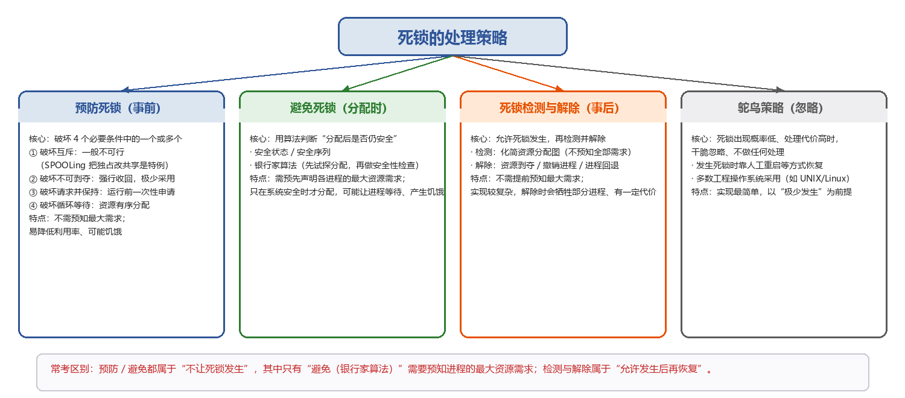</p>

<p align="center"><i>图2-8 死锁的四类处理策略</i></p>

> **📝 【补充】鸵鸟策略**  
> 名称取自鸵鸟遇到危险把头埋进沙堆的比喻；当死锁发生概率很低、而预防或避免的开销又很大时，系统干脆不处理，发生死锁后靠人工重启等方式恢复，UNIX/Linux、Windows 等工程系统多采用这种策略。  

## 24. 死锁预防
`🔴高频`

死锁预防通过**【破坏四个必要条件中的一个或多个】**来实现。

<p align="center"><i>表2-14 死锁预防：破坏四个必要条件的方法</i></p>

| 破坏的条件 | 具体方法 | 可行性 / 代价 |
| --- | --- | --- |
| ①破坏互斥 | 把独占资源在逻辑上改造为可共享（如 SPOOLing 技术） | 多数资源必须互斥访问，【一般不可行】，SPOOLing 是可行特例 |
| ②破坏不可剥夺 | 资源请求得不到满足时，必须先释放已占资源，之后再重新申请 | 剥夺与恢复开销大，【实际极少采用】，只适合 CPU、内存等易保存/恢复的资源 |
| ③破坏请求并保持 | 静态资源分配：运行前【一次性申请全部所需资源】；或先释放已用资源再申请新资源 | 容易引发饥饿、资源浪费，进程可能长时间阻塞 |
| ④破坏循环等待 | 资源有序分配法：给资源分类编号，【按编号递增顺序申请不同类资源，同类资源一次性申请】 | 资源图中不可能成环；但编号相对稳定、不利于新增设备，使用顺序与编号不一致会浪费资源，并增加编程难度 |

资源有序分配法为每类资源赋予唯一编号，持有大编号资源的进程无法再申请小编号资源，因此资源分配图中不可能出现环；其不足在于**【资源编号相对稳定，不利于新增设备类型】**，进程实际使用资源的顺序可能与编号次序不同，从而造成资源浪费，**【强制按固定次序申请资源】**也增加了用户的编程难度。

> **⚠️ 【易错辨析】预防方法与“被破坏条件”的对应（选择题高频）**  
> “运行前一次性申请全部资源”破坏的是请求并保持条件；“资源按编号递增申请”破坏的是循环等待条件；  
> 破坏互斥并非绝对不可行，SPOOLing 把打印机这类独占设备在逻辑上改造成共享设备，就是破坏互斥条件的可行特例；  
> 死锁预防是事前限制资源申请，不依赖运行时的安全性判断，因此不需要预知进程的最大资源需求。  

## 25. 死锁避免
`🔴高频 ⭐大题考点`

### （1）系统安全状态

系统安全状态：对于某个执行序列中的每个进程，在 Pi 之前的所有进程执行完毕并释放占用资源后，系统仍有足够的可用资源满足**【Pi 的尚需资源量（最大需求减去已分配量）】**，从而保证每个进程都能顺利完成，这样的序列称为安全序列，安全序列**【可以存在多个】**。

进行安全判断需要三类信息：**【各个进程的最大资源需求量】**、**【各个进程已分配的资源】**、**【当前系统可用资源】**。

系统处于安全状态时一定不会发生死锁；**【处于不安全状态时不一定发生死锁】**，只是无法保证所有进程都能顺利完成。

> **⚠️ 【易错辨析】安全状态、不安全状态与死锁**  
> 安全 ⇒ 一定不死锁；不安全 ⇏ 一定死锁（不安全只是存在死锁风险）；  
> 安全序列可能不唯一，只要能找到一个即可判定系统安全；  
> 死锁避免的实质，就是让系统在资源分配过程中始终处于安全状态。  

### （2）银行家算法

**【每个进程在运行前先声明对各类资源的最大需求量，且在整个生命周期内不得更改】**，声明值不得超过系统对应资源的总量。

系统先检查当前是否有足够资源可供分配；若有，再判断**【把这些资源分配给进程后，系统是否仍处于安全状态】**；安全才真正分配，不安全则让该进程等待。

设系统中有 n 个进程和 m 类资源，银行家算法需要维护以下四个数据结构：

<p align="center"><i>表2-15 银行家算法的四个数据结构</i></p>

| 名称 | 类型 | 含义 |
| --- | --- | --- |
| Available 可利用资源向量 | 长度 m 的向量 | 每个元素表示一类资源当前可用的数量 |
| Max 最大需求矩阵 | n×m 矩阵 | 定义每个进程对 m 类资源的最大需求 |
| Allocation 分配矩阵 | n×m 矩阵 | 定义每类资源当前已分配给各进程的数量 |
| Need 需求矩阵 | n×m 矩阵 | 每个进程尚需的各类资源数，【Need = Max − Allocation】 |

### （3）进程发出请求时的处理步骤

设 Request_i 是进程 Pi 的资源请求向量，Request_i[j]=K 表示 Pi 请求 K 个 j 类资源，发出请求后依次执行以下操作：

```
① 合法性检查： Request_i[j] ≤ Need[i,j] ?
     不满足 → 请求出错（超过其声明的尚需量），拒绝；
② 可用性检查： Request_i[j] ≤ Available[j] ?
     不满足 → 当前空闲资源不足，Pi 阻塞等待；
③ 试探性分配（暂改数据结构）：
     Available     = Available     - Request_i
     Allocation[i] = Allocation[i] + Request_i
     Need[i]       = Need[i]       - Request_i
④ 执行安全性算法：
     安全   → 正式分配；
     不安全 → 撤销本次试探分配（回滚），Pi 等待。
```

### （4）安全性算法

安全性算法用于**【尝试构造一个进程执行序列】**，使所有进程都能依次获得所需资源并顺利完成：

```
① 初始化： Work = Available； Finish[1…n] 全部为 false；
② 在未完成进程中找一个同时满足下列两条件的进程 Pi：
       Finish[i] == false  且  Need[i] ≤ Work；
③ 认为 Pi 可顺利完成、释放所占全部资源：
       Work = Work + Allocation[i]；
       Finish[i] = true；
       返回步骤②继续寻找；
④ 若所有 Finish[i] == true，则系统安全，并输出一个安全序列；
     否则系统不安全。
```

<p align="center">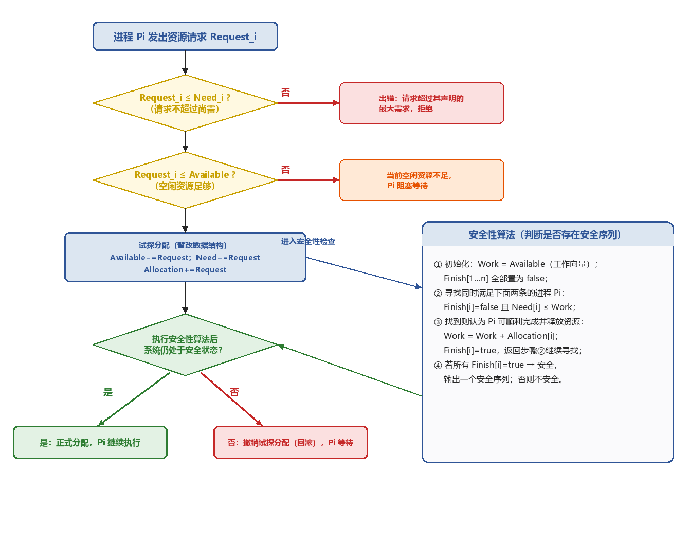</p>

<p align="center"><i>图2-9 银行家算法与安全性算法的执行流程</i></p>

> **⭐ 【大题考点】银行家算法的解题套路**  
> 一是先由 Need = Max − Allocation 补全需求矩阵；  
> 二是对请求先做合法性（Request≤Need）、可用性（Request≤Available）两道检查；  
> 三是试探分配后，用“试探后的 Available”初始化 Work，再执行安全性算法；  
> 四是每一步都写出“选中的进程、Work 的更新过程”，最后给出安全序列；候选进程不止一个时任选其一，因此安全序列并不唯一。  

> **⚠️ 【易错辨析】银行家算法的易错点**  
> Work 是安全性算法内部的工作向量，初值等于 Available，之后不断累加被完成进程的 Allocation；Available 是系统当前真实空闲量，二者不要混淆；  
> 安全性检查时“暂时找不到满足 Need≤Work 的进程”不等于系统已经死锁，只说明本次试探后不安全、应让请求进程等待；  
> 进程完成后回收的是它的 Allocation（已分配量），而不是 Max。  

> **📝 【补充】一个最小算例（帮助理解安全序列）**  
> 某类资源共 10 个，P1/P2/P3 的 Max 分别为 7/5/3，已分配均为 2，故 Available=4，尚需分别为 5/3/1；  
> 先选尚需 3≤4 的 P2 完成，回收 2 后可用变为 6；再选尚需 1 的 P3，回收后变为 8；最后 P1 尚需 5≤8，得到安全序列 P2→P3→P1。  

## 26. 死锁检测与解除（检测）
`🔴高频 ⭐大题考点`

死锁检测**【不需要预先知道进程从开始到结束的全部资源需求】**，**【通常采用资源分配图检测系统是否处于死锁状态】**。

在资源分配图中，圆圈表示进程，矩形框表示一类资源，框内小圆点表示该类资源的多个实例；**【进程指向资源】**的边是请求边，**【资源指向进程】**的边是分配边。

### 资源分配图的化简

- ① 找出一个当前可以继续执行的进程 Pi，即它的**【所有资源请求都能被当前空闲资源满足】**（某类空闲资源数＝该类资源总数−已分配实例数）；消去 Pi 的全部请求边与分配边，使其成为**【孤立点】**，等价于 Pi 顺利完成并释放所占资源。
- ② Pi 释放资源后，可能让原本因等待这些资源而阻塞的进程变为可执行，对其重复步骤①。

若最终**【能删去图中所有边，则称为可完全简化】**，此时系统没有死锁；处于死锁状态时资源分配图**【不可完全简化】**，化简后仍被边连在一起的进程就是死锁进程。

<p align="center">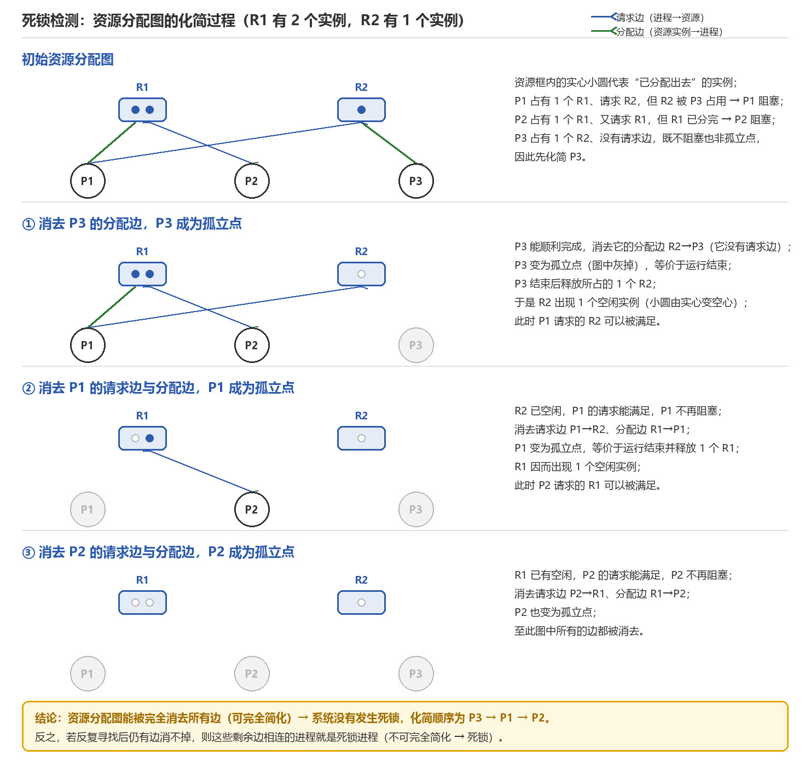</p>

<p align="center"><i>图2-10 资源分配图的化简过程（可完全简化 → 无死锁）</i></p>

> **⭐ 【大题考点】用化简法判断死锁的步骤**  
> 一是先数清每类资源的实例总数与已分配数，得到空闲实例数；  
> 二是找“所有请求都能被空闲资源满足”的进程，消去其边、记为孤立点并回收资源；  
> 三是不断重复，能消完所有边即无死锁，最终消不掉的边所连接的进程就是死锁进程集合。  

> **⚠️ 【易错辨析】资源分配图化简的细节**  
> 化简顺序可能不唯一，但“能否完全简化”的结论唯一；  
> 被消去的进程不是“死锁后又复活”，而是假设它能顺利跑完并释放资源；  
> 每类资源只有一个实例时可直接看是否成环，存在多实例时必须化简，不能只凭有环就判死锁。  

## 27. 死锁解除
`🟡中频`

检测到死锁之后，通过下列方法予以解除，三种方法都属于“事后”处理：

<p align="center"><i>表2-16 死锁解除的三种方法</i></p>

| 方法 | 做法 | 代价 / 注意 |
| --- | --- | --- |
| ①资源剥夺法 | 挂起部分死锁进程，抢占其资源，重新分配给其他死锁进程 | 需要保存被挂起进程的现场；要防止其长期得不到资源而饥饿 |
| ②撤销进程法 | 强制终止部分或全部死锁进程并回收其资源 | 按“代价最小”选择撤销对象；全部撤销处理简单但代价大 |
| ③进程回退法 | 让一个或多个死锁进程回退到足以避开死锁的历史状态，并在回退过程中释放所占资源 | 【需记录进程历史状态、设置还原点（检查点）】 |

> **📝 【补充】选择“牺牲进程”的常用依据**  
> 通常参考进程优先级高低、已执行时间与剩余执行时间、占用资源的种类和数量、进程是交互式还是批处理型等，优先撤销处理代价最小的进程。  

> **⚠️ 【易错辨析】三种解除方法的辨析**  
> 资源剥夺、进程回退都需要保存进程现场或历史状态，撤销进程则直接终止、不保留现场；  
> 死锁解除发生在“已经出现死锁之后”，与死锁预防、死锁避免（都发生在死锁形成之前）要区分开。  

# 第三章  内存管理

## 1. 程序的链接与装入
`🟡中频`

用户程序从源代码到进入内存运行，需要经过三步：①编译，把源代码翻译成若干目标模块；②链接，把目标模块和**【所需的库函数合并，形成一个完整的装入模块】**；③装入（加载），由装入程序把装入模块载入内存并执行。

地址重定位由内存管理单元 MMU 硬件完成；在分页系统中，每个进程维护一张页表，用于记录逻辑页到物理页框的映射关系。

<p align="center">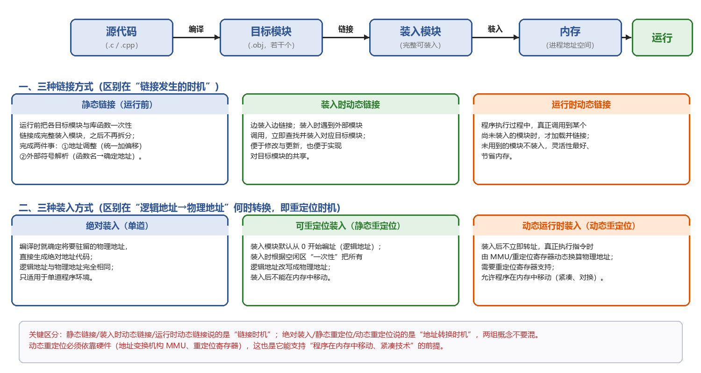</p>

<p align="center"><i>图3-1 程序的编译、链接与装入全过程</i></p>

> **📝 【补充】逻辑地址与物理地址**  
> 逻辑地址（相对地址、虚地址）：程序中相对于自身起始位置编址的地址，装入模块默认从 0 开始编址；  
> 物理地址（绝对地址、实地址）：数据在内存单元中的真实地址；  
> 把逻辑地址转换为物理地址的过程称为地址重定位（地址变换），连续分配中由重定位寄存器完成，分页中由页表配合 MMU 完成。  

## 2. 程序的链接
`🟡中频`

链接是把编译生成的目标模块与其所需库函数合并的过程，根据链接时机可分为以下三类。

### （1）静态链接

运行前就把各目标模块与库函数链接成**【完整】**的装入模块，之后**【不再】**拆分；链接过程需要完成两项关键操作：

- **【地址调整】**：各目标模块编译后均以**【0 为起始地址】**，链接时根据其在装入模块中的实际位置，**【把内部地址统一加上相应偏移量】**（如模块 A 长度为 L，链接后模块 B 的地址从 L 开始）。
- **【外部符号解析】**：把模块间相互引用的外部符号（如函数名）替换为确定地址（类似跳转语句 CALL B 指向 B 的入口地址）。

### （2）装入时动态链接【装入时查找嵌入】

目标模块在装入内存时**【边装入边链接】**，遇到外部模块调用会立即查找并装入相应的外部目标模块；便于修改和更新，也便于实现对目标模块的共享。

### （3）运行时动态链接【调用时查找嵌入】

程序执行过程中，**【仅当需要调用某个尚未装入内存的目标模块时】**，操作系统才动态加载并链接该模块，未用到的模块不会被装入，灵活性最好。

<p align="center"><i>表3-1 三种程序链接方式对比</i></p>

| 链接方式 | 链接时机 | 主要特点 |
| --- | --- | --- |
| 静态链接 | 运行之前 | 一次性链接成完整装入模块，之后不再拆分；需做地址调整与外部符号解析 |
| 装入时动态链接 | 装入内存时 | 边装入边链接，遇到调用才装入对应模块；便于更新与共享 |
| 运行时动态链接 | 执行过程中 | 真正调用到未装入模块时才链接；未用模块不装入，最省内存、最灵活 |

## 3. 程序的装入
`🔴高频`

把装入模块载入内存有以下三种方式，区别在于逻辑地址转换为物理地址的时机。

### （1）绝对装入【单道程序环境】

内存中始终只有一个程序，其驻留位置在编译前即可确定，可**【直接生成使用绝对地址的目标代码】**，逻辑地址与实际物理地址完全一致。

### （2）可重定位装入【多道程序环境】（静态重定位）

经编译和链接生成的装入模块通常从 0 地址开始编制，**【程序中的地址是相对于模块起始位置的逻辑地址】**；装入时系统根据内存当前空闲状态，**【为该模块分配一块连续的内存区域】**，把整个模块装入其中，并**【一次性】**把所有逻辑地址修改为对应的物理地址，即**【静态重定位】**。

### （3）动态运行时装入（动态重定位）

**【支持程序在内存中的移动】**；装入程序把装入模块载入内存后**【不立即转换地址，在运行指令时才进行】**，实际物理地址在程序运行时由硬件动态计算得出，需要重定位寄存器（MMU）支持。

<p align="center"><i>表3-2 三种程序装入方式对比</i></p>

| 装入方式 | 适用环境 | 地址转换时机 | 装入后能否移动 |
| --- | --- | --- | --- |
| 绝对装入 | 单道 | 编译时即确定，逻辑=物理 | —— |
| 可重定位装入（静态重定位） | 多道 | 装入时一次性全部转换 | 不能移动 |
| 动态运行时装入（动态重定位） | 多道 | 执行指令时由硬件动态转换 | 可以移动（支持紧凑、对换） |

> **⚠️ 【易错辨析】静态重定位与动态重定位**  
> 静态重定位在“装入时”一次性改完地址，装入后进程不能在内存中移动，也不需要专门硬件；  
> 动态重定位装入后保持逻辑地址不变，真正访存时才由重定位寄存器加上基址得到物理地址，因此允许进程在内存中移动，这也是紧凑技术和对换技术的前提。  

## 4. 内存保护
`🟡中频`

内存保护用于保证各个进程拥有相互独立的内存空间，主要有两种方法。

- ①在 CPU 设置一对**【上、下限寄存器】**：分别存放用户进程在内存中的下限地址和上限地址，CPU 访问地址时由硬件自动判断是否越界。
- ②用**【重定位寄存器（基地址寄存器）】**和**【界地址寄存器（限长寄存器）】**实现越界检查：重定位寄存器存放进程在内存中的起始物理地址（做加法），界地址寄存器存放进程地址空间的长度（做比较）；这两个寄存器的加载必须通过**【特权指令】**完成。

> **📝 【补充】越界判断过程**  
> 访存时：物理地址 = 重定位寄存器（基址）+ 逻辑地址；  
> 同时判断逻辑地址是否满足 0 ≤ 逻辑地址 ＜ 界地址寄存器（限长），超出即触发越界（地址越界）中断。  

## 5. 内存共享
`🟢低频`

- 只有**【只读区域】**才可以被共享。
- **【可重入代码（纯代码）】**：允许多个进程同时访问、但不允许被任何进程修改的代码。
- 进程执行过程中都配备独立的**【私有数据区】**，用于存放运行过程中可能被修改的数据。
- 若代码为可共享代码，那么不管是分页系统还是分段系统，整个系统中只保留**【一份副本】**。

分页与分段都可以有效支持内存共享，区别在于共享的**【粒度】**及管理机制：分段以逻辑上完整的段为单位，共享更自然；分页以固定大小的页为单位共享。

> **⚠️ 【易错辨析】“能共享的是什么”**  
> 可共享的是只读的代码（可重入代码/纯代码），可写的数据段属于各进程私有、不能直接共享；  
> “整个系统只保留一份副本”指的是同一份可重入代码在物理内存中只有一份，但各进程仍有各自的私有数据区。  

## 6. 连续分配管理方式
`🔴高频`

连续分配为用户程序分配一个连续的内存空间，主要有三种分配方式。

### （1）单一连续分配

内存划分为系统区（位于低地址）和用户区，用户区**【仅允许一道用户程序运行、占用整个用户区】**，无外部碎片。

### （2）固定分区分配【最简单的多道程序存储管理方式】

把用户内存空间划分为若干大小固定的分区，每个分区容纳一道作业；有空闲分区时，系统从**【外存的后备作业队列】**中选择大小合适的作业装入该分区。

- 分区划分有两种方式：分区大小相等、分区大小不等。
- 系统需要维护一张**【分区使用表】**，通常按分区大小排序；各表项包括**【对应分区的起始地址、大小、状态（是否已分配）】**。
- 固定分区会产生**【内部碎片】**，每个分区只能由一个作业独占，**【无法支持多个进程共享同一内存区域】**。

### （3）动态分区分配（可变分区分配）

基本原理：进程装入内存时，根据实际需求**【动态分配一块大小恰好匹配的连续内存空间】**；若有新进程装入而内存空间不足，则换出一个进程，使换出进程之后的空闲大小最接近新装入进程的需求。

动态分区**【会产生大量外部碎片】**，可通过紧凑技术缓解：操作系统周期性地移动进程，使所有空闲块合并成一个连续区域，**【系统需要支持动态重定位】**，移动进程的开销较大。

系统需要维护一张**【空闲分区链（表）】**，按照起始地址排序，分配内存时检索该链、寻找满足请求大小的空闲分区；回收内存时，根据回收分区的起始地址在空闲分区链中确定插入位置，**【并根据相邻情况执行合并操作】**，共有以下四种情况：

- ①回收区只与前一个空闲分区相邻：两者合并，更新前一分区的大小。
- ②回收区只与后一个（后继）空闲分区相邻：两者合并，更新后一分区的**【起始地址及大小】**。
- ③回收区与前、后两个空闲分区都相邻：三者合并为一块，更新前一分区的大小，**【并删除后一分区的表项】**。
- ④回收区不与任何空闲分区相邻：新建一个表项记录起始地址和大小，插入空闲分区链。

<p align="center">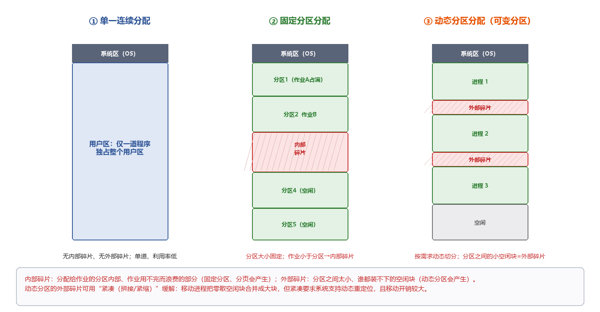</p>

<p align="center"><i>图3-2 三种连续分配方式与内部碎片、外部碎片</i></p>

<p align="center"></p>

<p align="center"><i>图3-3 动态分区回收时的四种相邻情况</i></p>

<p align="center"><i>表3-3 三种连续分配管理方式对比</i></p>

| 分配方式 | 分区是否固定 | 一道/多道 | 碎片类型 | 关键特点 |
| --- | --- | --- | --- | --- |
| 单一连续分配 | 用户区整块 | 一道 | 无内、外部碎片 | 最简单，内存利用率低 |
| 固定分区分配 | 分区大小固定 | 多道，每区一道 | 内部碎片 | 需分区使用表，作业小于分区则浪费 |
| 动态分区分配 | 按需动态切分 | 多道 | 外部碎片 | 用紧凑缓解碎片，需动态重定位支持 |

> **⚠️ 【易错辨析】内部碎片与外部碎片**  
> 内部碎片：分配给进程的分区内部、进程用不完而被浪费的部分，固定分区分配和基本分页会产生；  
> 外部碎片：分区之间一些太小、任何作业都装不下的空闲块，动态分区会产生；总空闲量够但不连续，因此作业仍可能无法装入；  
> 紧凑能合并外部碎片，但要求动态重定位，且移动进程有较大开销。  

## 7. 动态分区分配算法
`🔴高频 ⭐大题考点`

系统有 n GB 的空闲空间总量，却不存在 n GB 的连续空闲空间，作业因此无法运行，这正是**【外部碎片】**导致的。

根据分区检索方式的不同，动态分区分配算法可以分为顺序搜索算法和索引搜索算法两类。

### （1）基于顺序搜索的分配算法

常见的顺序搜索分配算法有以下四种：

- ①首次适应算法（First Fit）：空闲分区**【按地址递增次序排序】**，从链首开始查找，找到第一个满足请求的空闲分区，从中划出所需空间分配给作业，余下部分仍保留在链中；**【优先使用低地址、保留高地址的大空闲区】**，但**【低地址容易积累小碎片】**、查找开销较大，总体上有利于大作业装入。
- ②邻近适应算法（Next Fit，循环首次适应算法）：在首次适应算法的基础上，**【分配从上次查找结束的位置开始继续循环搜索】**，而不是每次都从链首开始；**【减少了低地址区域的重复扫描，但大空闲区在内存中分布不均】**，总体性能不如首次适应算法。
- ③最佳适应算法（Best Fit）：空闲分区**【按容量递增次序排列】**，顺序查找第一个满足作业大小的空闲分区，即**【最小的可用分区】**进行分配；每次分配都会在原分区中遗留下极小的剩余块，从而产生**【大量外部碎片】**。
- ④最坏适应算法（Worst Fit）：空闲分区**【按容量递减次序排列】**，选择第一个满足要求的空闲分区，即**【最大的可用分区】**，从中分割出所需空间；缺点是**【系统很难再满足大作业的需求】**。

四种算法中，**【首次适应算法的综合性能最好】**。

<p align="center">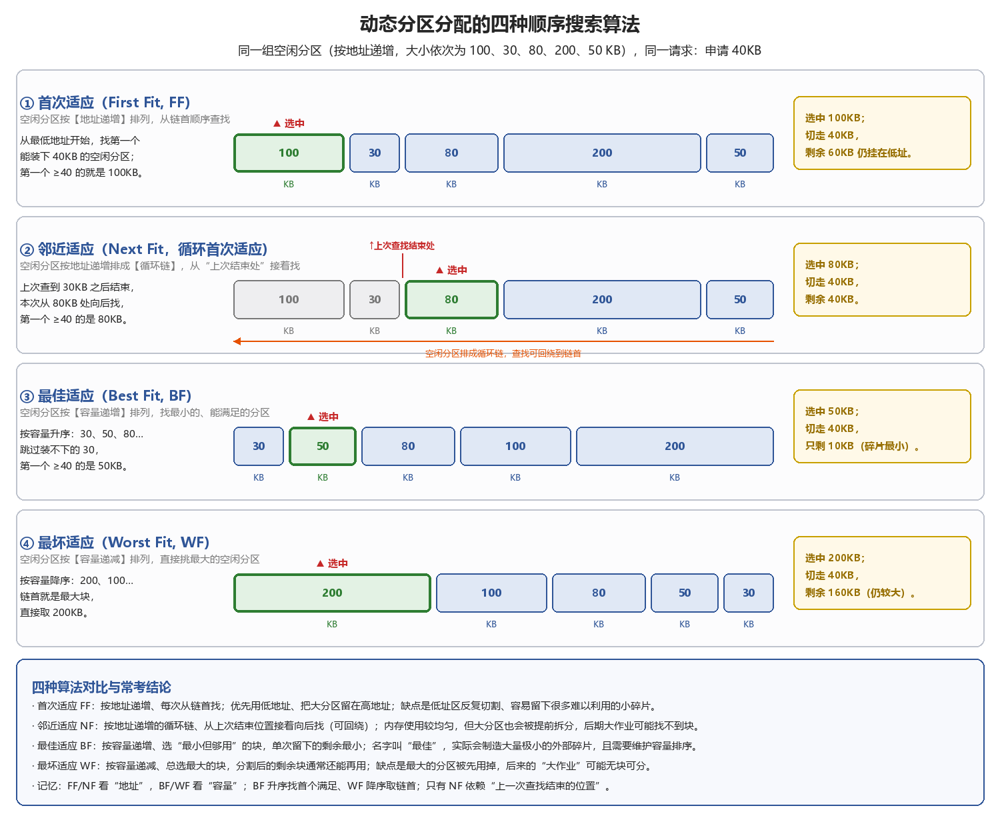</p>

<p align="center"><i>图3-4 基于顺序搜索的四种动态分区分配算法</i></p>

<p align="center"><i>表3-4 四种顺序搜索分配算法对比</i></p>

| 算法 | 空闲分区排列依据 | 选中的分区 | 主要优缺点 |
| --- | --- | --- | --- |
| 首次适应 FF | 按地址递增 | 第一个够用的分区 | 优先用低址、保留高址大块；低址易积碎片，综合性能最好 |
| 邻近适应 NF | 按地址递增的循环链 | 从上次结束处向后第一个够用的分区 | 减少重复扫描；但大分区被提前拆分，性能不如 FF |
| 最佳适应 BF | 按容量递增 | 最小且够用的分区 | 单次剩余最小，却留下大量极小外部碎片 |
| 最坏适应 WF | 按容量递减 | 最大的分区 | 分割后剩余块通常还能用；但大作业可能无块可分 |

> **⭐ 【大题考点】顺序搜索算法的解题要点**  
> 先看清空闲分区是“按地址”还是“按容量”排序：FF/NF 看地址，BF 升序、WF 降序；  
> FF 每次从链首找，NF 从“上一次查找结束的位置”接着循环找，BF/WF 直接看排序后的第一个满足项；  
> 分配后要把剩余部分作为新的空闲分区插回链中，并保持各自的排列次序。  

### （2）基于索引搜索的分配算法

根据空闲分区的大小进行分类，对**【每一类大小相同的空闲分区建立独立的空闲分区链】**，通过一张**【索引表】**统一管理这些链；分配时**【依据】**请求大小在**【索引表】**中定位到相应链表、**【获取其头指针】**，即可快速得到一个空闲分区。常见的索引搜索分配算法有以下三种：

- ①快速适应算法（Quick Fit）：根据系统中进程常用的空间大小，预先把空闲分区划分为若干**【固定尺寸类别】**；分配时先根据**【作业长度】**在索引表中找到能够容纳它的**【最小类别链表】**，再从该链表头部取下第一个空闲分区进行分配；其**【查找效率高、不产生内部碎片】**，但回收时难以有效地合并分区。
- ②伙伴系统（Buddy System）：规定所有分区的**【大小均为 2^k（k 为整数）】**；当需要为进程分配大小为 n 的内存时，先在大小为 2^k 的空闲分区链中查找，若存在则直接分配，不存在则向更大一级继续查找；**【找到分区后不断二分，直到得到所需大小的块】**，其余部分按大小加入对应的空闲链。每个大小为 2^k 的分区**【都有唯一的伙伴分区，即与它大小相同、地址相邻（首尾相接）的另一个分区】**；回收时，若某空闲分区与其伙伴也都空闲，则合并为一个大小为 2^(k+1) 的分区，并继续向上合并，直至无法合并为止。
- ③哈希算法：**【以】**空闲分区大小为关键字建立哈希函数、构建一张哈希表，每个表项记录对应空闲分区链的头指针；分配时可快速获取相应大小的空闲分区链。

<p align="center">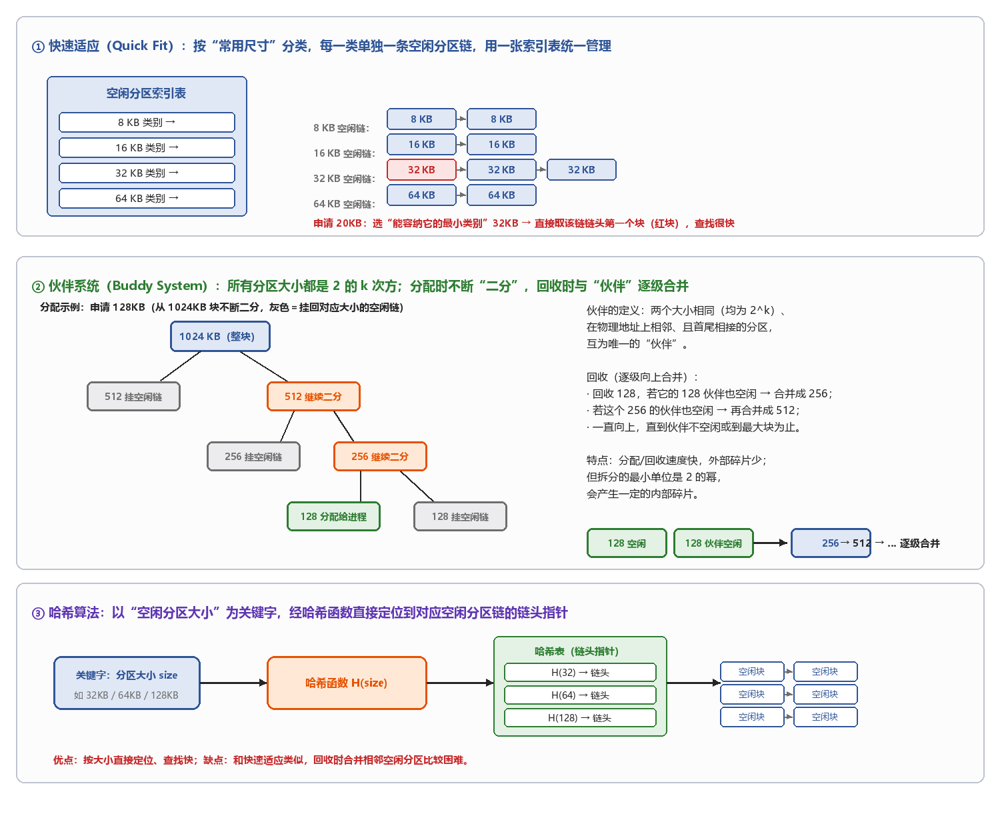</p>

<p align="center"><i>图3-5 基于索引搜索的三种分配算法（快速适应、伙伴系统、哈希）</i></p>

> **⚠️ 【易错辨析】索引搜索与顺序搜索、伙伴系统的碎片**  
> 快速适应按“尺寸类别”各建一条链，取链头即可，查找快，但回收时相邻空闲块难以合并；  
> 伙伴系统的最小分配单位是 2 的幂，请求大小不是 2^k 时要向上取整，因此会产生一定的内部碎片；其“伙伴”必须同时满足大小相同、地址相邻两个条件；  
> “最佳适应”名字虽叫最佳，实际最容易制造难以利用的极小外部碎片，名称与实际效果要分清。  

> **📝 【补充】伙伴系统中伙伴地址的判定（了解）**  
> 对大小为 2^k、起始地址为 x 的块，其伙伴起始地址为：x XOR 2^k（即把 x 的第 k 位取反）；  
> 也可理解为：若 x 是 2^(k+1) 的整数倍，则伙伴在它右侧（x+2^k），否则在左侧（x−2^k）。  

## 8. 非连续分配方式概述
`🟡中频`

非连续分配方式解决了连续分配中的外部碎片问题，可分为**【分页存储管理、分段存储管理】**两大类。

- 若运行前需要一次性装入全部单元，则分为基本分页、基本分段（属于基本存储管理，对应实存管理）。
- 若支持按需动态装入，则分为请求分页与请求分段（属于虚拟存储管理）。

> **📝 【补充】本节定位与后续脉络**  
> 本节只对非连续分配做分类概述，基本分页/基本分段的地址变换、页表机制等在后续部分展开；  
> 整体脉络：连续分配（单一/固定/动态分区）→ 非连续分配（分页、分段、段页式）；其中“基本”对应一次性全部装入的实存管理，“请求”对应按需调入的虚拟存储管理。  

## 9. 基本分页存储管理（无快表时两次访存）
`🔴高频 ⭐大题考点`

固定分区分配会产生内部碎片，动态分区分配会产生外部碎片；分页存储管理把物理内存划分为若干大小相等的单元，即**【页框（页帧、物理块）】**，把进程的逻辑地址空间划分为与页框大小相同的单元，即**【页面（页）】**；**【系统以页框为单位为进程分配内存】**，进程的各个页面在内存中可以离散存放。

### （1）页面和页面大小

- 页号：每个页面都有一个编号；页框号：物理内存中每个页框也有一个编号。
- 页面大小通常取**【2 的整数次幂】**，便于用二进制位直接划分地址；页面过小会导致页面数量增多、页表过长，页面过大会导致**【页内碎片（内部碎片）增多】**。

逻辑地址 = 页号 P**【隐藏，不显式写出】**+ 页内偏移量 W。页表实现**【页号→块号】**的映射：每个进程建立一张页表，它是按页号顺序排列的数组，**【每个页表项记录对应页面所驻留的物理页框号（块号）】**及相关状态信息（有效位、访问位等）。

<p align="center"><i>表3-5 基本分页的基本概念</i></p>

| 概念 | 含义 | 说明 |
| --- | --- | --- |
| 页面（页） | 进程逻辑地址空间划分出的等大单元 | 大小由系统决定，取 2 的整数次幂 |
| 页框（页帧/物理块） | 物理内存划分出的等大单元 | 与页面大小相同，是内存分配单位 |
| 页内偏移 W | 逻辑地址在页面内部的位置 | 位数由页面大小决定，变换前后不变 |
| 页表/页表项 | 记录“页号→物理块号”的映射数组 | 每个进程一张，按页号顺序排列 |

### （2）基本地址变换机构（由硬件 MMU 自动完成）

系统设置一个**【页表寄存器 PTR】**，存放页表在内存中的**【起始地址 F 及页表长度 M】**；进程未运行时这些数据保存在进程 PCB 中，进程运行时再从 PCB 载入页表寄存器 PTR。

<p align="center">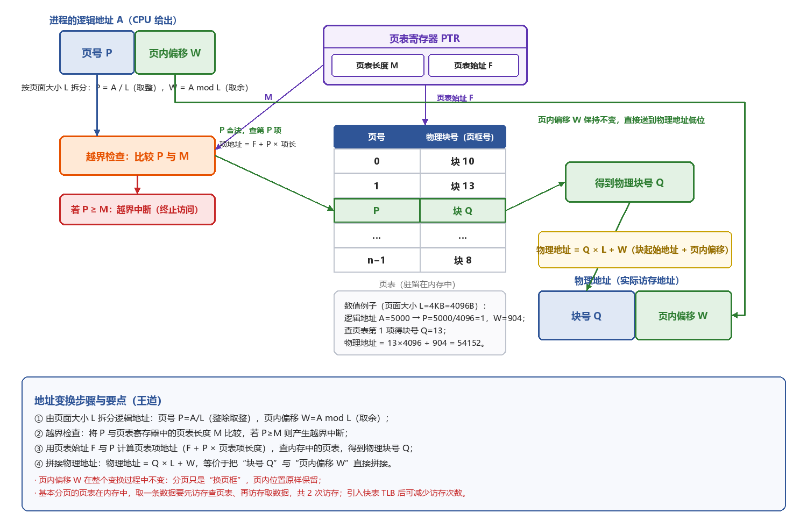</p>

<p align="center"><i>图3-6 基本分页存储管理的地址变换机构</i></p>

逻辑地址 A 到物理地址 E 的变换过程：

- ①计算页号：由页面大小 L 计算该逻辑地址对应的页号 P（P = A 整除 L，W = A mod L）。
- ②**【判断页号是否越界】**：比较页号 P 与页表长度 M，若 P≥M 则触发越界中断。
- ③查页表：页表项地址 = 页表起始地址 F + 页号 P ×**【页表项长度】**，从该页表项取出物理块号 b（Q）。
- ④计算物理地址并访存：物理地址 = 块号 × 页面大小 L + 页内偏移 W（等价于把块号与 W 直接拼接）。

### （3）页表项大小的计算

- 页框数量 = 物理内存总量 / 页面大小；**【页框号所需位数 = ⌈log2(页框数量)⌉】**，页表项至少要能表示一个页框号。
- 由于**【内存按字节编址】**，为便于按字节对齐存取，页表项的实际大小通常取**【8 bit（1 字节）的整数倍】**。

> **⭐ 【大题考点】基本分页的计算题型**  
> 一是由页面大小求页内偏移位数、由内存大小求页框号位数，进而确定逻辑/物理地址的位数划分；  
> 二是用“页表项地址 = 页表始址 + 页号 × 页表项长度”定位页表项，注意乘的是“页表项长度”而不是页面大小、也不是页表长度；  
> 三是计算一张页表占用的内存：页表大小 = 页面数 × 页表项大小。  

> **⚠️ 【易错辨析】基本分页的常见误区**  
> 基本分页（页表在内存、无快表）取一个操作数需要两次访存：第一次查页表得块号，第二次才真正访问目标单元；  
> 页号 P 是“隐藏”的，由逻辑地址位数和页面大小自动划分，程序员不需要显式给出，这与分段中段号要由用户显式提供不同；  
> 分页虽离散分配、消除了外部碎片，但页面内部仍可能有页内碎片（内部碎片）。  

## 10. 具有快表 TLB 的地址变换机构（命中 1 次、未命中 2 次访存）
`🔴高频 ⭐大题考点`

若页表全部放在内存中，每次访存至少需要两次：第一次查页表得物理块号，第二次根据物理地址访问目标。为此引入**【快表 TLB】**（相联存储器实现，可并行比较），缓存当前活跃的若干页表项；主存中完整的页表称为**【慢表】**。

具有快表的分页机制地址变换过程：

- ①CPU 给出逻辑地址后，硬件自动提取页号，并与快表中所有页号**【并行比较】**。
- ②若命中，则从快表取出对应物理块号，与页内偏移量**【拼接】**形成物理地址，再访问内存，全程仅需**【一次访存】**。
- ③若未命中，则访问内存中的页表、读取相应表项获得物理块号，再拼接物理地址并访存，共**【两次访存】**；**【同时系统会把该页表项装入快表】**，若快表已满，则按特定置换算法淘汰一个旧项。

> **⭐ 【大题考点】快表与有效访问时间 EAT**  
> 设查快表耗时 a、访问一次主存耗时 m、快表命中率为 h：命中需 a+m，未命中需 a+2m；  
> 故 EAT = h(a+m) + (1−h)(a+2m) = a + (2−h)m；题目若再给出 Cache 命中率，按同样的分层方法叠加即可。  

> **⚠️ 【易错辨析】快表的细节**  
> 快表是硬件（相联存储器），查找按内容并行进行；快表只缓存“近期会用到”的少量页表项，未命中仍要回慢表；快表满了也要置换，但它与内存中页面的置换算法不是一回事。  

## 11. 两级页表（多级页表）
`🟡中频`

单级页表本身可能很大，并且要求在内存中连续存放；为了**【减小页表所占连续空间并实现离散存放】**，把页表本身也视为可分页的对象。

- ①对页表采用**【离散分配】**，通过专门的索引表记录各个页表在内存中的位置。
- ②仅把当前活跃的**【部分页表调入内存，其余驻留在磁盘】**，需要时再调入（虚拟内存思想）。

本质上就是为已经离散化的页表再建立一层页表，称为**【外层页表（页目录）】**。逻辑地址 = 一级页号（页目录号）+ 二级页号（页号）+ 页内偏移量；外层页表存放某个**【页表分页的物理起始地址】**。

<p align="center">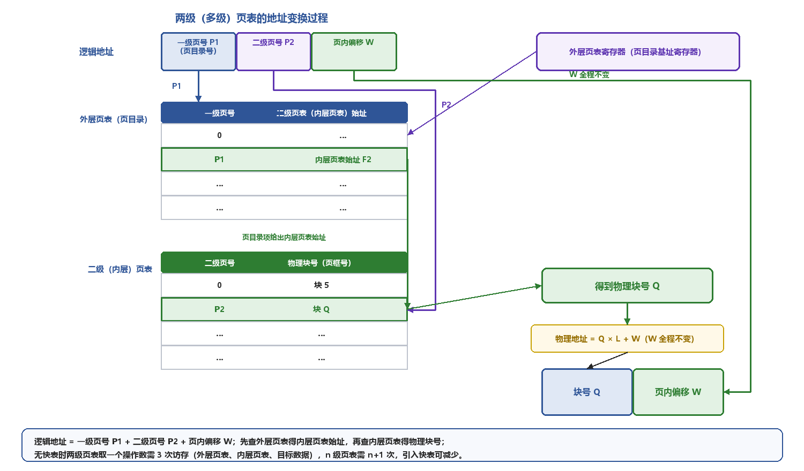</p>

<p align="center"><i>图3-7 两级页表的地址变换过程</i></p>

二级页表地址变换过程（无快表需访存 3 次）：系统增设一个**【外层页表寄存器（页目录基址寄存器）】**存放外层页表始址；①以页目录号为索引访问外层页表，得到对应内层页表的物理始址；②以二级页号为索引访问该内层页表，得到目标页面的物理块号；③把物理块号与页内偏移拼接成物理地址并访存。

> **⚠️ 【易错辨析】多级页表的访存次数与作用**  
> 无快表时，n 级页表取一个操作数需要 n+1 次访存（逐级查 n 张表 + 最后取数据），两级页表即 3 次，引入快表后可减少；  
> 多级页表并没有减少“页表项总数”，它解决的是单级页表必须连续占用大块内存、以及按需调入的问题；  
> 在 64 位系统等场景下常采用多级页表，题中若出现“虚拟地址限制为 48 位”等说法，指的是架构对可用虚地址位数的规定。  

## 12. 基本分段存储管理
`🔴高频`

分页管理方式面向**【计算机】**，由**【硬件自动完成、对用户透明】**；分段管理方式面向**【用户、程序员】**，支持方便编程、信息保护与共享、**【动态增长】**以及动态链接等高级功能。

分段把逻辑地址空间划分为若干**【大小不等】**的段，每个段都从 0 开始编址，并**【分配一段连续的地址空间（段内连续、段间离散）】**；整个进程的逻辑地址结构呈现**【二维特性】**，由段号和段内偏移共同确定一个地址。

- 分段系统的逻辑地址结构 = 段号 S + 段内偏移量 W，**【段号和段内偏移量必须由用户（编译器）显式提供】**。

每个进程拥有一张段表，建立逻辑段到物理内存区的映射；段表项记录该段在内存中的**【基址（起始地址）和段长（长度）】**；由于**【段表项连续存放且长度相同】**，段号可作为隐含索引。系统设置一个**【段表寄存器】**，存放段表始址 F 和段表长度 M。

<p align="center">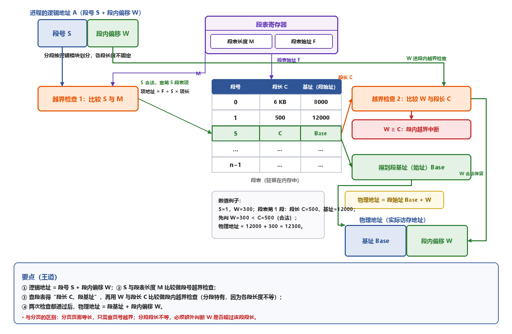</p>

<p align="center"><i>图3-8 基本分段存储管理的地址变换机构</i></p>

分段地址变换过程：

- ①从逻辑地址 A 分离出段号 S 和段内偏移量 W；②判断**【段号是否越界】**（S 与段表长度 M 比较）。
- ③按段号 S 查段表：段表项地址 = 段表始址 F + 段号 S × 段表项长度，先取出该段段长 C、判断**【段内是否越界】**（W≥C 即段内越界中断）。
- ④取出该段基址 b，计算物理地址 E = b + W 并访存。

> **⚠️ 【易错辨析】分段为何要做两次越界检查**  
> 分页页面等长，只需检查页号是否越界；分段各段长度不等，除段号越界外，还必须比较“段内偏移 W 与该段段长 C”，W≥C 即段内越界；  
> 分段地址空间是二维的（要显式给出段号），分段物理地址用“基址 + 偏移”相加得到，而不是分页那样的字段拼接。  

## 13. 分页与分段的对比
`🔴高频`

- ①**【页是系统管理内存的物理单位】**，分页用于提高内存利用率，由硬件自动完成、对用户透明；**【段是用户程序的逻辑单位】**，分段用于满足编程、共享、保护等需求，由**【编译器根据程序逻辑结构划分、用户可见】**。
- ②**【页大小固定、由系统决定】**；段的长度不固定，取决于程序的逻辑结构。
- ③分页系统的地址空间是**【一维的】**，分段系统的地址空间是**【二维的】**。

<p align="center"><i>表3-6 分页与分段的对比</i></p>

| 对比维度 | 分页 | 分段 |
| --- | --- | --- |
| 划分目的 | 提高内存利用率（系统视角） | 满足编程/共享/保护（用户视角） |
| 单位大小 | 页大小固定、系统决定 | 段大小不等、由逻辑结构决定 |
| 地址维度 | 一维（页号隐藏） | 二维（段号显式给出） |
| 碎片 | 无外部碎片、有内部碎片 | 无内部碎片、会有外部碎片 |
| 共享/保护 | 以固定页为单位，不方便 | 以完整逻辑段为单位，方便自然 |

## 14. 段的共享与保护
`🟡中频`

**【分页系统也可以实现共享，但不方便】**：若一段共享代码占 N 个页框，每个共享进程都要建立 N 个页表项分别指向这 N 个页框；分段系统只需在每个共享进程中建立**【一个段表项】**指向该共享段。

- 为支持段共享，系统维护一张**【共享段表】**，每个共享段对应一个表项，记录**【段号、段长、内存起始地址、存在位、外存起始地址、共享进程计数 count】**。
- 共享进程计数 count：某进程不再使用该段时 count−−；**【当且仅当 count==0 时】**，系统才回收该段所占空间。
- **【同一共享段在不同进程中可以具有不同的段号】**，各进程通过各自的段号即可访问同一物理段。
- 可重入代码（纯代码）置于只读段中，每个进程配备私有的局部数据区，存放执行过程中可能变化的数据。

分段系统的保护机制主要有两类：①地址越界保护，包括段号越界、段内越界；②存取控制保护，通过段表项中的访问权限位防止非法访问。

## 15. 段页式存储管理（无快表时三次访存）
`🔴高频`

段页式系统**【地址空间是二维的】**：先把进程地址空间划分为若干逻辑段、每段有唯一段号，再把每个段进一步划分成若干大小固定的页；**【内存空间仍按分页方式管理，即以物理块（页框）为单位分配】**。逻辑地址 = 段号 S + 页号 P + 页内偏移量 W。

- **【系统设置一个段表寄存器；每个进程有一张段表、一个或多个页表】**：①每个进程建立一张段表，记录各段的页表始址和页表长度；②每个段对应一张页表，页表项记录对应页的物理块号；③段表寄存器存放当前进程段表的起始地址与段表长度，用于段表寻址和段号越界判断。

<p align="center">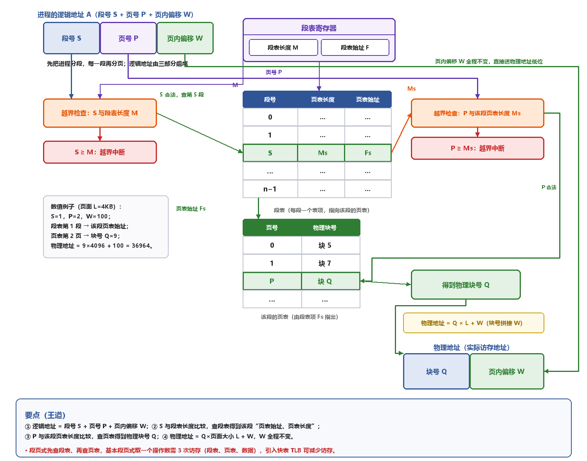</p>

<p align="center"><i>图3-9 段页式存储管理的地址变换机构</i></p>

段页式地址变换过程（越界判断省略）：①根据逻辑地址中的段号 S 查段表，得到该段对应页表的起始地址（同时做段号越界检查）；②利用页号 P 访问该段页表得到物理块号（同时做页号越界检查）；③把物理块号与页内偏移 W 拼接得到物理地址。

<p align="center"><i>表3-7 几种非连续分配方式的访存次数对比</i></p>

| 管理方式 | 地址结构 | 用户可见性 | 无快表时访存次数 |
| --- | --- | --- | --- |
| 基本分页 | 页号 P + 偏移 W（一维） | 对用户透明 | 2 次 |
| 基本分段 | 段号 S + 偏移 W（二维） | 用户显式给段号 | 2 次 |
| 两级页表 | 页目录号+页号+偏移（一维） | 对用户透明 | 3 次 |
| 段页式 | 段号 S+页号 P+偏移 W（二维） | 先分段后分页 | 3 次 |

> **⚠️ 【易错辨析】段页式的访存与查表顺序**  
> 段页式先查段表、再查页表、最后访存取数，无快表时共 3 次访存；段表每进程一张，页表每段一张；内存仍以页框为单位离散分配，因此兼有分段便于共享保护和分页离散分配的优点。  

## 16. 传统存储管理方式的特征
`🟢低频`

传统存储管理方式下，暂未使用或暂时不使用的代码和数据也会占用大量内存空间，具有两个特征：

- ①一次性：作业必须**【一次性全部装入内存】**后才开始运行；作业过大则无法运行，大量作业请求运行时只能让少数作业先运行，系统并发性下降。
- ②驻留性：作业一旦装入内存便一直驻留其中，直至运行结束；实际运行时进程可能被阻塞，导致其长期处于等待状态、占用的内存得不到利用。

## 17. 局部性原理
`🔴高频`

- 时间局部性：程序中的某条指令或某个数据项一旦被访问，不久之后很可能被再次访问（如循环、栈、常用变量）。
- 空间局部性：一旦访问了某个存储单元，其附近的存储单元也很可能被访问（如顺序执行的指令、数组）。

虚拟内存技术正是建立在局部性原理之上：时间局部性方面，把近期使用的指令、数据保存在高速缓存中，并借助多级缓存层次结构加以利用；空间局部性方面，采用较大容量的缓存，并在缓存控制逻辑中集成**【预取机制】**。

## 18. 虚拟存储器
`🟡中频`

虚拟存储器**【提供逻辑上远大于物理内存的地址空间】**，把**【外存作为内存的透明扩展】**，有效缓解物理内存不足；它是操作系统根据以下三种机制（均对用户透明）构造出的逻辑抽象：

- ①部分装入：仅把当前运行所需的少数页面（或段）装入内存，其余暂留外存。
- ②请求调页（段）机制：执行中若所访问的信息不在内存，系统自动把它从外存调入。
- ③页面（段）置换机制：请求调入时若内存不足，就把暂时不用的信息换出内存。

虚拟存储器具有三个主要特征：①多次性，作业分多次动态调入；②对换性，运行中无需常驻内存，可按需把暂时不用的程序或数据换出到**【外存对换区】**、需要时再换回；③**【虚拟性（本质特征、根本目标）】**，逻辑地址空间远大于物理内存空间。

> **⚠️ 【易错辨析】虚拟存储器的特征**  
> 虚拟性是虚拟存储器的本质特征；多次性、对换性分别与传统方式的“一次性、驻留性”相对立；虚拟存储器对用户透明，进程“感觉”自己拥有一个很大的连续地址空间。  

## 19. 虚拟内存技术的实现
`🟡中频`

虚拟内存技术**【建立在离散分配的内存管理方式基础之上】**，主要有三种实现方式：请求分页、请求分段、请求段页式存储管理，它们都需要一定的硬件支持：

- ①足够容量的内存和外存，分别存放程序的当前部分与后备部分。
- ②页表机制（段表机制）：作为地址映射的关键数据结构。
- ③**【中断机制】**：用户程序访问尚未调入内存的部分时，用于**【触发缺页（或缺段）中断】**。
- ④地址变换机构：在程序运行过程中动态地把逻辑地址转换为物理地址。

## 20. 请求分页管理方式（最常用）
`🔴高频`

请求分页在基本分页系统基础上增加**【请求调页、页面置换】**功能：①作业运行中若所访问页面不在内存，系统通过请求调页功能把它从外存调入；②内存不足时通过页面置换功能把暂时不用的页面换出到外存。由于每次换入换出的基本单位（页面）长度固定，请求分页比请求分段更简单、最常用。

为支持上述功能，系统必须在基本页表项基础上增加四个字段：

<p align="center"><i>表3-8 请求分页页表项新增字段</i></p>

| 新增字段 | 别名 | 作用 |
| --- | --- | --- |
| 状态位 P | 存在位 | 判断该页是否已调入内存（1 在内存 / 0 不在） |
| 访问字段 A | —— | 记录本页一段时间内的访问次数或距上次访问的时间，供置换算法参考 |
| 修改位 M | 脏位 | 记录本页是否被修改过，决定换出时是否需要写回外存 |
| 外存地址 | —— | 该页未调入时，指出它在外存（磁盘）中的存放位置 |

因此完整的请求分页页表项 = 页号 + 物理块号 + 状态位 P（存在位）+ 访问字段 A + 修改位 M（脏位）+ 外存地址。

> **⚠️ 【易错辨析】状态位与修改位的作用**  
> 状态位 P 决定“是否需要缺页调页”；修改位 M 决定“换出时是否要写回磁盘”——未修改的页换出时直接丢弃即可，修改过的页必须先写回外存，二者不要混淆。  

## 21. 缺页中断机制与请求分页地址变换
`🔴高频 ⭐大题考点`

当进程访问的页面尚未调入内存时，由**【硬件自动触发缺页中断】**，再由操作系统的**【缺页中断处理程序】**处理：把所需页面从外存调入内存（必要时先换出一页）。页面调入通常涉及较长时间的磁盘 I/O，在此期间可能调度其他进程运行；页面调入完成后**【重新执行触发缺页的那条指令】**，因此**【一条指令可能引起多次缺页中断】**。

<p align="center">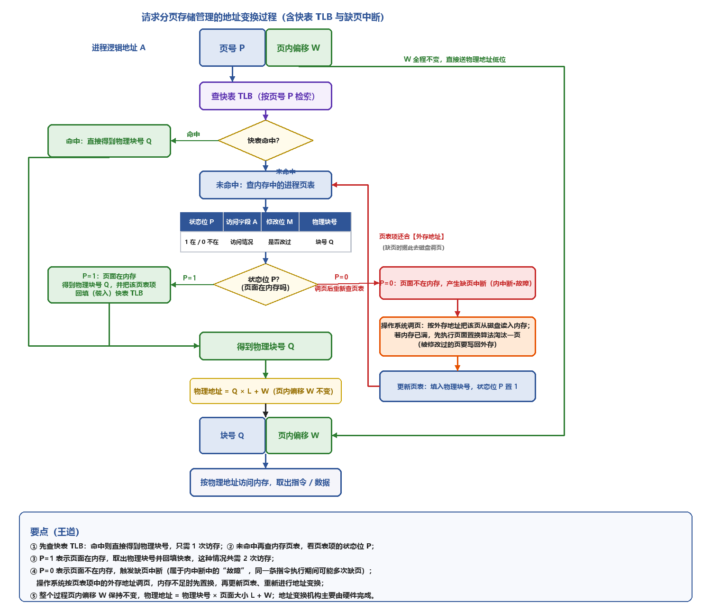</p>

<p align="center"><i>图3-10 请求分页（含快表与缺页中断）的地址变换过程</i></p>

请求分页的地址变换在基本分页基础上增加了缺页中断处理：

- ①检索快表 TLB，命中则直接取出该页物理块号，并**【置访问位为 1】**（供置换算法参考）；对于写操作还要**【置修改位（脏位）为 1】**。
- ②TLB 未命中则访问页表：若该页已在内存（状态位为 1），取出物理块号，并把该页表项加入 TLB；若 TLB 已满则运行置换算法淘汰一项。
- ③若页面不在内存（状态位为 0），触发**【缺页中断】**，操作系统从外存调入该页（必要时换出一页），并更新页表和快表，之后重新进行地址变换获得物理块号。
- ④把获得的物理块号与页内地址拼接形成物理地址，用于访存。

> **⚠️ 【易错辨析】缺页中断的性质**  
> 缺页中断属于【内中断（异常）中的“故障 fault”】，由硬件在指令执行过程中自动触发，不是外中断；  
> 一条指令执行期间可能多次缺页（如指令本身和多个操作数各缺一页），处理完后要“重新执行”该指令而不是执行下一条；  
> 缺页处理期间进程阻塞、可能切换到其他进程，这与一般的越界中断（程序错误、不会恢复）不同。  

> **⭐ 【大题考点】请求分页完整流程题**  
> 按“查快表→未命中查页表→看状态位→在内存则得块号并回填快表、不在内存则缺页调页（必要时置换、脏页写回）→更新页表快表→拼接物理地址”的顺序描述，并能结合 EAT、缺页率进行计算。  

## 22. 页框分配
`🟡中频`

为进程分配内存涉及三个问题：①进程所需的最小页框数；②分配的页框固定还是可变；③页框在进程间**【平均分配】**还是**【按进程大小比例分配】**。

- 最小页框数（最小物理块数）：保证进程正常运行所需的最少页框数量，与**【计算机硬件结构】**有关，具体取决于**【指令格式、指令功能、寻址方式】**。

驻留集是操作系统决定分配给该进程的页框集合，其大小与**【系统并发度、缺页开销】**有关：

- ①过小：内存可容纳的进程数增多、并发度提高，但每个进程页框过少，可能频繁缺页。
- ②过大：超过一定阈值后再增加页框，缺页率的下降趋于平缓，反而会降低并发度、浪费内存资源。

## 23. 内存分配与置换策略
`🟡中频`

内存分配策略分为固定分配、可变分配；置换时的策略分为全局置换、局部置换（局部指只在自身进程范围内、全局指可在全部进程范围内选择）。两两组合后实际形成三种策略：

<p align="center"><i>表3-9 三种内存分配与置换策略</i></p>

| 组合策略 | 发生缺页时的做法 | 特点 / 问题 |
| --- | --- | --- |
| 固定分配局部置换 | 从该进程自身已分配的页框中选一页换出，再调入所缺页 | 页框太少则频繁缺页，太多则浪费、降低并发度；运行中页框数不变 |
| 可变分配全局置换 | 先从空闲页框队列取一页；空闲耗尽时可从【任一进程】的页框中选一页换出 | 最容易实现；但若缺乏调控，某些活跃进程驻留集可能持续膨胀 |
| 可变分配局部置换 | 只在自身页框中置换，并根据进程缺页率【动态增减】其驻留集 | 缺页率高则适当加页框、过低则回收，性能较好 |

> **⚠️ 【易错辨析】为什么没有“固定分配全局置换”**  
> 固定分配意味着进程页框数运行期不变，全局置换却会抢占别的进程的页框、导致被抢进程页框数改变，二者矛盾，因此不存在“固定分配全局置换”，一共只有三种组合。  

## 24. 页框调入算法
`🟢低频`

- ①平均分配算法：把可分配页框平均分给各个进程。
- ②按比例分配算法：根据进程逻辑地址空间的大小按比例分配页框。
- ③优先权分配算法：为重要、紧急的进程分配更多页框；一部分页框按比例分配，另一部分依据进程优先权动态分配。

## 25. 调入页面的时机
`🟡中频`

- ①预调页策略：根据局部性原理**【一次调入若干相邻页面】**，尝试预测进程近期可能访问的页面（目前预测成功率约 50%）；**【主要用于进程首次调入时】**，由程序员显式指定应优先加载的页面。
- ②请求调页策略：运行时访问到不在内存的页面才**【触发缺页中断】**调入，每次仅调入一页，磁盘 I/O 开销较大。

## 26. 调入页面的来源
`🟡中频`

请求分页系统的外存分为存放文件的**【文件区】**和存放换出页面的**【对换区（交换区）】**：对换区采用**【连续分配方式】**、读写速度快，文件区采用**【离散分配方式】**。调入页面的来源分三种情况：

- ①有足够的对换区空间：可把所有页面都从对换区调入以提高调页速度，进程运行前先把相关文件从文件区复制到对换区。
- ②对换区空间不足：**【不会被修改的页面直接从文件区调入】**；**【可能被修改的页面先复制到对换区】**，即换出时必须保存到对换区，以后再从对换区调入。
- ③UNIX 方式：与进程相关的文件始终保留在文件区，未运行过的页面从文件区调入，**【运行过又被换出的页面存放在对换区】**、以后从对换区读取；若多个进程共享同一页面，只要它已在内存中，其他进程可直接复用。

> **⚠️ 【易错辨析】文件区与对换区的分工**  
> 对换区连续分配、速度快，用于存放“运行过、被换出”的页面；文件区离散分配，存放未运行过或不会修改的页面；判断“从哪里调入”，关键看该页是否运行过、是否可能被修改。  

## 27. 页面调入过程（对用户完全透明）
`🟡中频`

当所访问页面不在内存（存在位为 0）时，CPU 触发缺页中断，处理流程为：先通过页表项获取该页在外存中的位置，再判断内存是否已满；若未满，则分配一个空闲页框、发起磁盘 I/O 调入页面，并更新页表项（填入物理块号、把存在位置 1）；若已满，则按置换算法选出一页准备换出——该页修改位为 0 可直接丢弃，修改位为 1 则先**【写回对换区、释放该页框】**，随后把所缺页面调入该页框并更新页表项。

## 28. 页面置换算法
`🔴高频 ⭐大题考点`

页面置换遵循一个原则：尽可能保留近期访问过的页面，优先淘汰**【近期未访问过】**的页面。常考四种算法：

- ①最佳置换算法 OPT：淘汰**【以后永不使用、或在最长时间内不再被访问】**的页面，缺页率最低、是理论最优，但无法在实际系统中实现（无法预知未来），只用于**【评价其他算法】**。
- ②先进先出算法 FIFO：按调入时间淘汰最早进入的页面，**【未利用局部性原理】**、性能较差；**【只有 FIFO 存在 Belady 异常】**，即分配的物理块数增加时缺页率反而可能上升。
- ③最近最久未使用算法 LRU**【最接近 OPT】**：淘汰**【最近最长时间未被使用】**的页面，依据是“过去久未使用、近期也很可能不再使用”；系统为每页维护访问字段、记录距上次访问经历的时间，淘汰时选择该值**【最大】**的页面，需要寄存器或栈等硬件支持。
- ④时钟算法 CLOCK：分为简单 CLOCK 与改进型 CLOCK。简单 CLOCK（最近未用算法 NRU）为每页设一个访问位，页面首次装入或被访问时置 1，把所有页框组织成循环队列并维护一个替换指针；缺页时，指针所指页访问位为 0 就淘汰，为 1 就把它**【置 0】**并让指针移向下一页、继续轮询，直到找到访问位为 0 的页面。

改进型 CLOCK 考虑到“修改过的页面置换代价更高”，在访问位 A 基础上**【再加上修改位 M（脏位）】**，把页面分为四类，淘汰时优先考虑既未访问又未修改的页面：

- 1 类（A=0,M=0）：最佳淘汰页；2 类（A=0,M=1）：次佳淘汰页；3 类（A=1,M=0）、4 类（A=1,M=1）：最近访问过、**【可能再次被访问】**，最后才考虑。
- 扫描步骤：①第一轮从当前指针位置寻找 1 类页面；②失败则第二轮寻找 2 类页面，**【本轮把经过页面的访问位 A 置 0】**；③再失败（所有页面 A=1）则指针复位、重复第一轮。该算法优先淘汰未修改页面，降低了磁盘 I/O 开销。

<p align="center">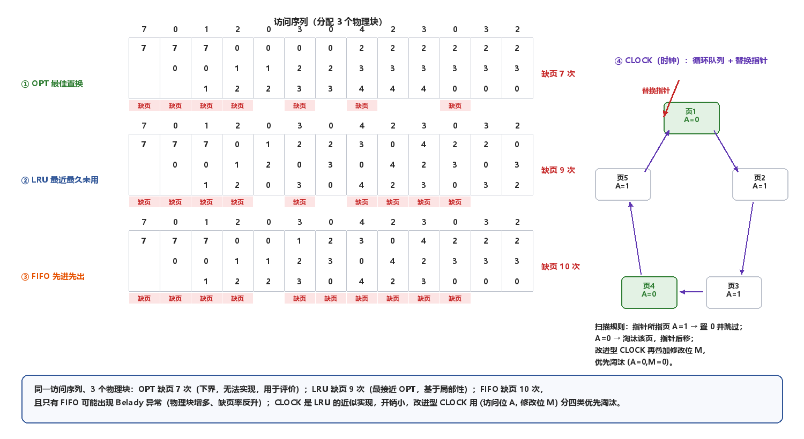</p>

<p align="center"><i>图3-11 页面置换算法对比（OPT/LRU/FIFO）与 CLOCK 循环队列</i></p>

<p align="center"><i>表3-10 常用页面置换算法对比</i></p>

| 算法 | 依据 | 能否实现 | Belady 异常 | 特点 |
| --- | --- | --- | --- | --- |
| OPT | 未来最长时间不用 | 不能（理论最优） | 无 | 缺页率下界，用于评价 |
| FIFO | 进入内存最早 | 能 | 【有，且仅此一个】 | 未用局部性，性能较差 |
| LRU | 最近最久未用 | 能（需硬件支持） | 无 | 最接近 OPT，性能好、开销较大 |
| 简单 CLOCK | 访问位 A 循环扫描 | 能 | 无 | LRU 的近似，开销小 |
| 改进 CLOCK | (访问位 A,修改位 M) | 能 | 无 | 优先换未修改页，减少 I/O |

> **⭐ 【大题考点】置换算法大题**  
> 给出页面访问串和物理块数，要会分别按 OPT/FIFO/LRU 逐列写出内存中的页面并统计缺页次数、缺页率；  
> CLOCK/改进型 CLOCK 要会跟着替换指针逐页判断 A、M，改进型要分清两轮扫描以及“第二轮把 A 清 0”；  
> 判断 Belady 异常只可能出现在 FIFO。  

> **⚠️ 【易错辨析】LRU 与 CLOCK 的区别**  
> LRU 要精确记录“距上次访问的时间”，需要较多硬件支持；CLOCK 只用一个访问位做近似，开销小。改进型 CLOCK 的扫描优先级是 (0,0)→(0,1)，第二轮才在把 A 清 0 的同时找 (0,1)，不要把四类顺序记反。  

## 29. 抖动（颠簸）与工作集（大纲已删除，了解）
`🟢低频`

- 抖动（颠簸）是频繁的页面调度现象；根本原因是**【分配给进程的物理块数过少】**，无法满足正常运行需要，导致进程执行中频繁缺页、大部分时间都在调页。
- 工作集：某段时间间隔内进程实际访问过的页面集合，由时间 t 和工作窗口尺寸共同决定；**【驻留集不能小于工作集】**，否则会频繁抖动。

## 30. 页面缓冲算法 PBA
`🟢低频`

影响页面换入换出的因素包括页面置换算法的选择、已修改页面写回磁盘的频率、磁盘内容读入内存的频率。页面缓冲算法在原置换算法基础上增设一个**【修改页面链表】**，保存**【已修改且需要换出的页面】**，等被换出页面积累到一定数量再**【批量写回磁盘】**，以减少换出开销；它配合简单的 FIFO 也能获得良好性能。

系统在内存中维护两个专用链表，通过链表管理物理页框、延迟实际 I/O：

- ①空闲页面链表（空闲页框链表，双向链表）：需要读入页面时从链表**【首部】**取一个页框装入；**【未被修改的页面换出时不写盘】**，直接把其物理页框挂到空闲链表末尾，页框中仍保留原数据，以后若又访问该页，可直接从空闲链表取下复用（缺页时先检查空闲链表中是否已有该页）。
- ②修改页面链表：已修改页面换出时不立即写盘，先把其页框挂到该链表末尾，积累到一定数量后再批量写回磁盘。

## 31. 页框回收
`🟢低频`

系统可分配内存不足时必须回收部分页框，但**【不是所有页框都能回收】**：属于内核的大部分页框不可回收（如内核栈、内核代码段、内核数据段等），由进程使用的页框大多可以回收（进程代码段、数据段、堆栈、文件映射页、进程间共享内存占用的页框等）。

- Linux 内核设置负责页面换出的守护进程 kswapd，**【定期检查内存使用情况，当空闲页框数低于特定阈值时主动发起页框回收】**（脏页写回磁盘的 I/O 还需要临时页框作为缓冲区）。
- Linux 通过**【伙伴算法的逆操作】**实现页框回收：一个页框被释放时，先检查是否存在大小相等的伙伴空闲块，若存在就合并成一个**【大小翻倍】**的新空闲块，再继续向上检查能否与更高一级伙伴合并。

## 32. 内存映射文件（Memory-Mapped Files）
`🟢低频`

内存映射文件在**【磁盘文件与进程虚拟地址空间之间建立直接映射关系】**；进程通过相应系统调用后，就可以像访问内存一样读/写文件，无需传统的 read/write 文件 I/O 接口。

- 映射时**【只有进程首次访问某页面时，才按需把它一页一页调入内存】**；当进程退出或显式**【解除】**文件映射时，所有被修改页面才一次性写回磁盘文件。
- 多个进程可通过**【共享内存】**实现高效通信：把同一文件映射到多个不同进程的虚拟地址空间，即可像访问内存一样共享同一文件，编程更简单。

## 33. 虚拟存储器性能的影响因素
`🟡中频`

- **【缺页率是核心指标】**，受页面大小、分配给进程的物理块数、页面置换算法、写回磁盘的频率以及程序局部化程度等多方面影响。
- 页面大小同时受碎片控制和页面开销影响；**【程序编写的局部化程度越高，执行时缺页率越低】**。

## 34. 地址翻译（结合计算机组成原理）
`🔴高频 ⭐大题考点`

地址翻译是地址变换在“二进制位”层面的体现，与计算机组成原理中“标记 + 块内地址”的拼接思想一致：把逻辑（虚拟）地址按页面大小划分为“虚页号 + 页内偏移”，用虚页号查页表（或快表）得到物理页框号，再用页框号替换掉虚页号字段、低位偏移保持不变，即得到物理地址。

### （1）各字段位数的确定

- 设页面（页框）大小 L = 2^k B，则**【页内偏移占低 k 位】**；逻辑地址若为 n 位，则虚页号占高 n−k 位。
- 物理内存大小 / 页框大小 = 页框总数，由此确定物理页框号的位数；物理地址位数 = 页框号位数 + 页内偏移位数 k。

### （2）完整数值例题

设页面大小 L = 4KB = 2^12 B（页内偏移占 12 位），物理内存 16MB = 2^24 B（故物理块号占 12 位、物理地址共 24 位）；某进程页表中虚页号 0/1/3 分别对应块 5/9/14，虚页号 2 状态位为 0（在外存）。给定逻辑地址 A = 0x00001ABC，翻译过程如下：

- ①划分字段：P = A 整除 4096 = 1，W = A mod 4096 = 2748 = 0xABC。
- ②查页表（先查快表）：P = 1 在内存，对应物理块号 Q = 9。
- ③拼接物理地址：E = Q × 4096 + W = 9 × 4096 + 2748 = 39612 = 0x00009ABC。

可见由于页面与页框等大（都为 2^12），低 12 位偏移 0xABC 在翻译前后保持不变，物理地址只是把高位的虚页号 1 替换为物理块号 9，即 0x1ABC → 0x9ABC。

<p align="center">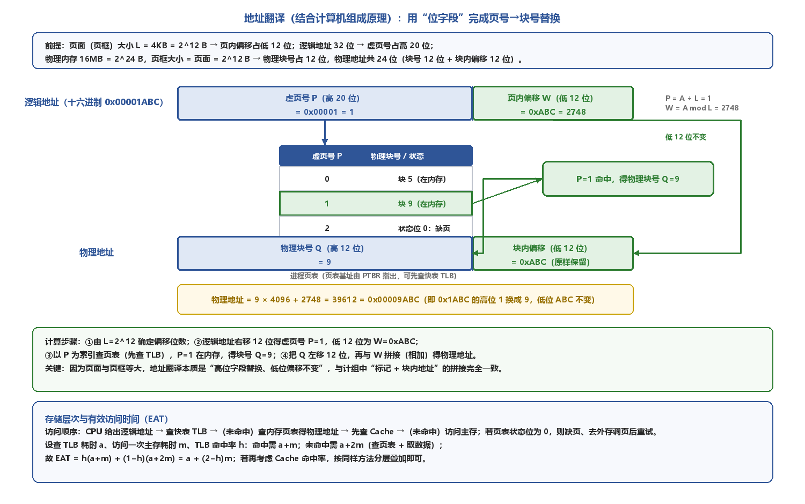</p>

<p align="center"><i>图3-12 结合计组的地址翻译：位字段划分、页表查找与地址拼接</i></p>

> **⭐ 【大题考点】地址翻译题的标准步骤**  
> 先由页面大小 L=2^k 定出页内偏移位数 k，再把逻辑地址右移 k 位得虚页号、低 k 位为页内偏移；  
> 以虚页号为索引查页表（先查 TLB）：状态位为 0 则缺页调页，为 1 则得物理块号；  
> 把物理块号左移 k 位后与页内偏移相加（拼接）得物理地址；低位偏移全程不变，可直接用十六进制替换高位字段快速验算。  

> **📝 【补充】存储层次与有效访问时间 EAT**  
> 一次完整访问的层次：CPU 给出逻辑地址 → 查快表 TLB →（未命中）查内存页表得物理地址 → 先查 Cache →（未命中）访问主存；若页表状态位为 0，则缺页、去外存调页后重试；  
> 设查 TLB 耗时 a、访存一次耗时 m、TLB 命中率 h，则 EAT = h(a+m) + (1−h)(a+2m) = a + (2−h)m；若再给出 Cache 命中率 c、查 Cache 耗时 b，按“TLB→页表→Cache→主存”的层次同样分层叠加即可。
