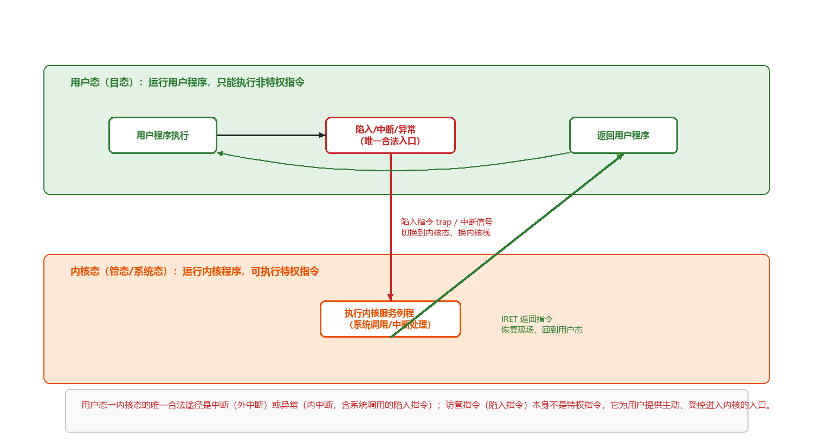
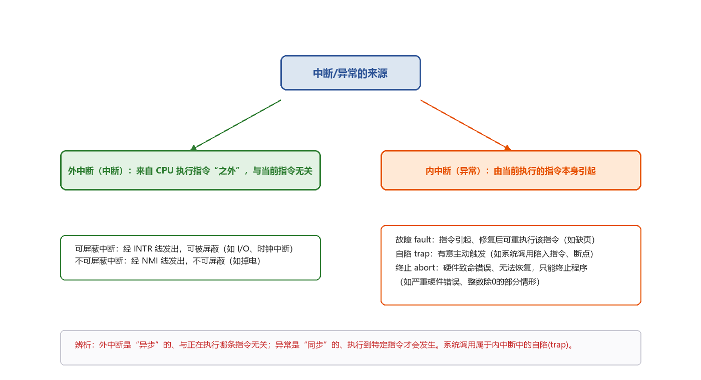
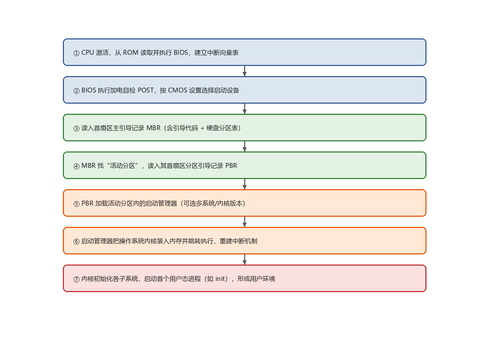
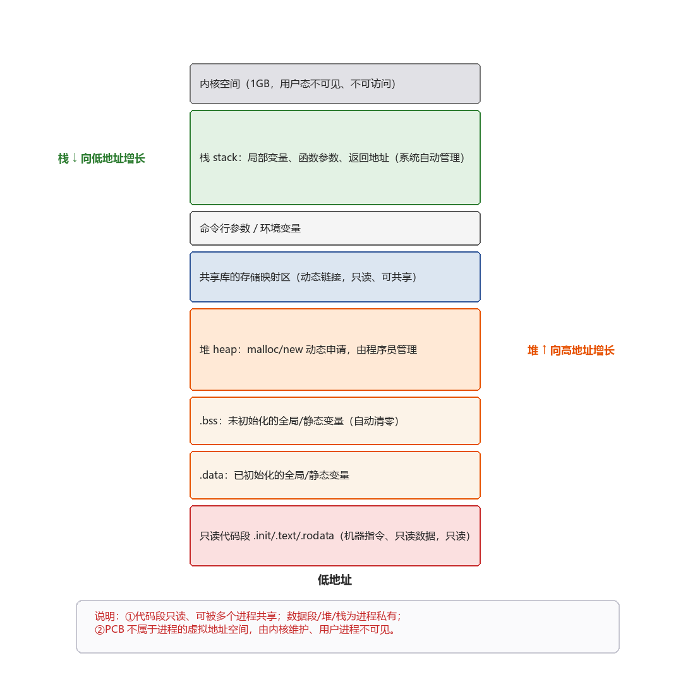
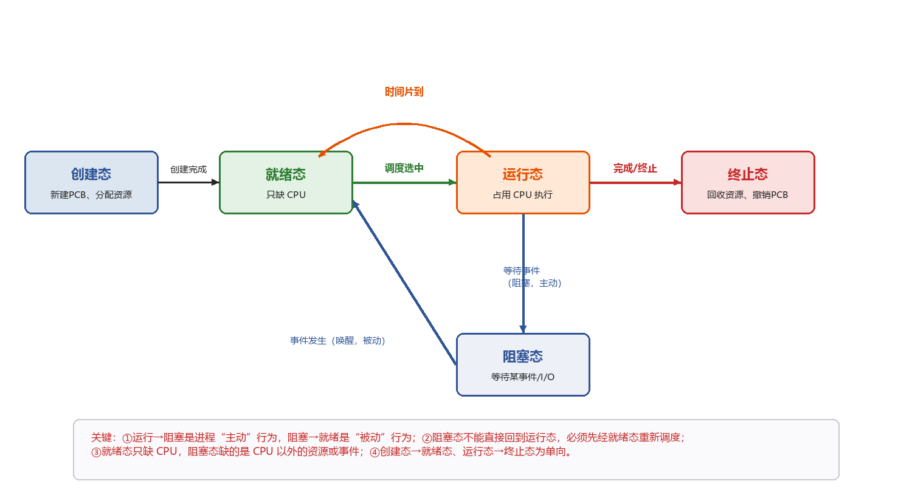
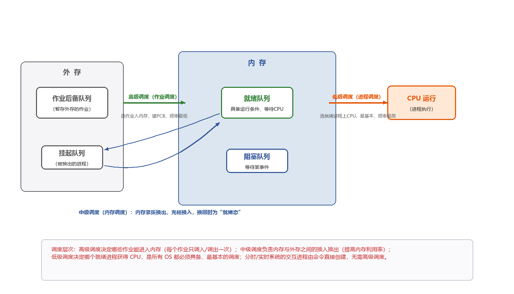
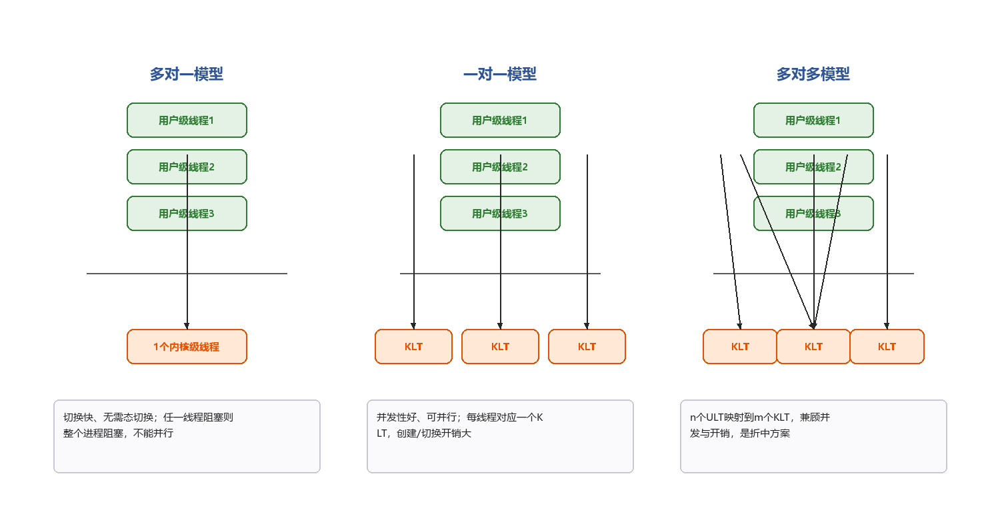
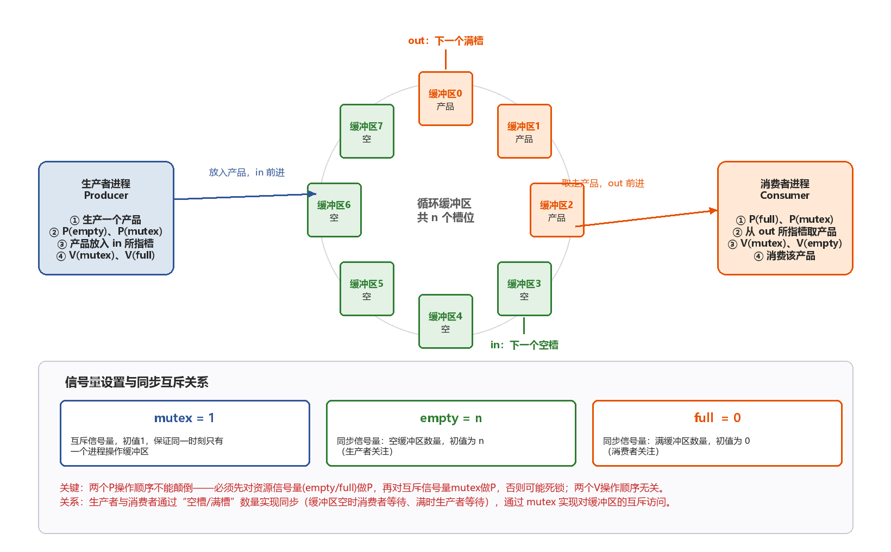
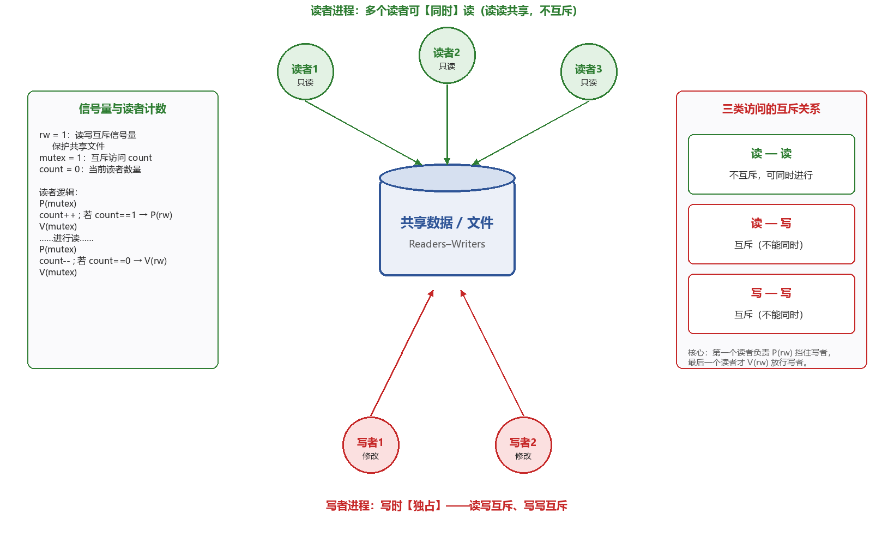
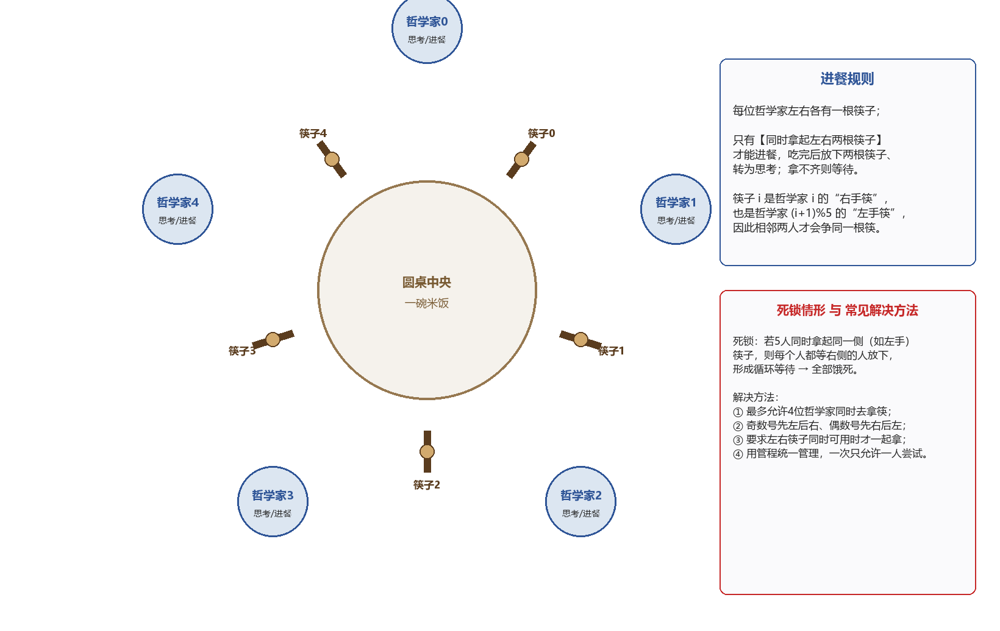

# 408 操作系统笔记

> 第一章 计算机系统概述 · 第二章 进程与线程（至管程与条件变量，死锁暂缺）

> ✍️ **写作声明**：本笔记知识点总结正文均为本人独立撰写，仅【易错辨析】【考点考频】【补充知识点】三类标注内容借助 AI 辅助分析生成。

---

## 📑 知识点目录

**[第一章  计算机系统概述](#第一章-计算机系统概述)**
- [1. 操作系统的概念](#1-操作系统的概念)
- [2. 操作系统的功能](#2-操作系统的功能)
- [3. 操作系统的特征](#3-操作系统的特征)
- [4. 操作系统的发展历程](#4-操作系统的发展历程)
- [5. 操作系统的运行环境](#5-操作系统的运行环境)
- [6. 操作系统的结构](#6-操作系统的结构)
- [7. 操作系统的引导](#7-操作系统的引导)
- [8. 虚拟机](#8-虚拟机)

**[第二章  进程与线程](#第二章-进程与线程)**
- [1. 进程的概念与特征](#1-进程的概念与特征)
- [2. 进程的组成](#2-进程的组成)
- [3. 进程的内存映像](#3-进程的内存映像)
- [4. 进程的状态与切换](#4-进程的状态与切换)
- [5. 进程控制](#5-进程控制)
- [6. 进程通信 IPC](#6-进程通信-ipc)
- [7. 线程（“轻量级进程”）](#7-线程轻量级进程)
- [8. 线程控制块](#8-线程控制块)
- [9. 线程的实现方式](#9-线程的实现方式)
- [10. CPU 调度](#10-cpu-调度)
- [11. 进程切换](#11-进程切换)
- [12. CPU 调度算法](#12-cpu-调度算法)
- [13. 多处理机调度](#13-多处理机调度)
- [14. 同步与互斥](#14-同步与互斥)
- [15. 实现临界区互斥的基本方法](#15-实现临界区互斥的基本方法)
- [16. 互斥锁（自旋锁，忙等待）](#16-互斥锁自旋锁忙等待)
- [17. 信号量机制](#17-信号量机制)
- [18. 信号量实现互斥、同步与前驱关系](#18-信号量实现互斥同步与前驱关系)
- [19. 经典同步问题](#19-经典同步问题)
- [20. 管程](#20-管程)
- [21. 条件变量](#21-条件变量)

---

> **📌 标注说明**  
> 【高频】历年选择题/大题反复考查，必须熟练掌握  
> 【中频】有一定考查频率，理解并记忆核心结论  
> 【低频】偶尔考查或仅考概念，留印象即可  
> 【大题考点】曾在综合应用题中出现，需掌握计算与分析过程  
> 【易错辨析】易混淆概念或常见陷阱  
> 【补充】原文遗漏或有误处，已补充/修正的内容  

# 第一章  计算机系统概述

## 1. 操作系统的概念 `🟡中频`

操作系统负责管理硬件资源、为应用程序提供运行环境、充当硬件与用户之间的桥梁。

## 2. 操作系统的功能 `🔴高频`

- 用户接口：联机用户接口、脱机用户接口、图形用户接口。
- 程序接口：核心是一组系统调用，库函数只是对系统调用的封装**【不是操作系统接口】**。

> **⚠️ 【易错辨析】“操作系统接口”的判定**  
> 程序接口（系统调用）才是操作系统提供给应用程序的接口；普通库函数运行在用户态，只是对系统调用的封装，本身不属于操作系统接口。  

## 3. 操作系统的特征 `🔴高频`

操作系统具有并发、共享**【前二者最基本】**、虚拟、异步四个基本特征。

### （1）共享

- 互斥共享：在一段时间内仅有一个进程访问该临界资源。
- 同时访问方式：逻辑上并发访问，微观上分时共享。

### （2）虚拟

一个物理实体映射到多个逻辑上的对应物，典型技术包括多道程序技术、虚拟存储器技术、虚拟设备技术；如 SPOOLing 可将某些独占型设备转化为多台逻辑设备。

### （3）异步

进程以不可预知的速度**【断续】**推进。

> **⚠️ 【易错辨析】并发与并行**  
> 并发性是指宏观上在一段时间内有多道程序同时运行、微观上交替执行（单 CPU 也可并发）；并行性是指同一时刻真的有多个程序在不同 CPU 上同时执行，必须有多个处理机。  

## 4. 操作系统的发展历程 `🔴高频`

### （1）手工操作阶段

- ①人工操作方式；②脱机 I/O 方式：引入外围机预先完成 I/O 准备工作。

### （2）批处理阶段（操作系统开始出现）

- 单道批处理系统：配备监督程序，具有单道性。
- 多道批处理系统：依赖中断技术，宏观上并行、微观上串行。

### （3）分时操作系统

具有同时性（多个终端用户同时使用一台主机）、及时性、交互性、独立性。

### （4）实时操作系统

在严格的时间限制内完成关键任务，分为硬实时（绝对可靠）、软实时（可有短暂延时），具有确定性（响应时间可预测）、高可靠性、强时效性。

### （5）网络操作系统与分布式操作系统

- 网络操作系统：在单机操作上拓展网络功能，用户显式指定远程资源的位置进行访问，系统不提供统一的全局视图。
- 分布式操作系统：多台计算机组成的集合，具有分布性、并行性、**【透明性】**。

### （6）微机操作系统

- ①单用户单任务：允许一个用户登录并运行一个程序（MS-DOS，16 位）。
- ②单用户多任务：支持一个用户同时运行多个应用程序。
- ③多用户多任务：允许多个用户通过终端或网络同时登录，并发执行多个任务，资源共享、互不干扰。

<p align="center"><i>表1-1 操作系统各发展阶段对比</i></p>

| 阶段 | 主要特征 | 是否交互/并发 | 关键点 |
| --- | --- | --- | --- |
| 手工操作 | 用户独占、速度慢 | 无并发 | 脱机I/O用外围机 |
| 单道批处理 | 监督程序、自动成批 | 单道、无并发 | 内存中始终只有一道作业 |
| 多道批处理 | 多道程序交替 | 宏观并行、微观串行 | 依赖中断技术，OS正式形成 |
| 分时系统 | 时间片轮转 | 多用户并发交互 | 同时性/及时性/交互性/独立性 |
| 实时系统 | 限时响应 | 高可靠/强时效 | 硬实时不可超时、软实时可偶尔超时 |

发展历程全览：手工阶段→脱机处理→早期批处理（OS 开始出现）→多道批处理→分时操作系统→实时操作系统→网络操作系统→分布式操作系统→微机操作系统。

## 5. 操作系统的运行环境 `🔴高频 ⭐大题考点`

操作系统内核用于保护核心模块免受应用程序破坏、提升操作系统运行效率。

### （1）内核的核心功能

- ①支撑功能：时钟管理（系统的大量活动均依赖时钟机制）、中断机制（现代操作系统运行的基础）、原语（具有原子性，执行过程不可被中断）。
- ②系统资源管理功能：进程管理、存储器管理、设备管理。

### （2）处理机的两种状态

- 用户态（目态）与内核态（管态、系统态），硬件通过模式位标识当前运行状态。
- 特权指令：仅允许在内核态下执行，可访问全部地址空间；非特权指令：内存访问被限制在用户地址空间。
- 用户进程进入内核态的唯一合法途径是**【中断（外中断）或异常（内中断）】**；**【访管指令不是特权指令】**，它为用户提供受控且主动的内核态入口机制；内核态通过特定返回指令（如 IRET）返回用户态，返回指令执行在内核态。

<p align="center"></p>

<p align="center"><i>图1-1 用户态与内核态的转换、系统调用处理过程</i></p>

### （3）中断与异常

- 外中断：可屏蔽中断**【经 INTR 线发出中断请求】**、不可屏蔽中断**【经 NMI 线发出中断请求】**。
- 异常（内中断）：故障（指令执行引起的异常）、自陷、终止（硬件故障，属于硬件中断）。

<p align="center"></p>

<p align="center"><i>图1-2 中断（外中断）与异常（内中断）的分类</i></p>

> **⚠️ 【易错辨析】态转换与中断的常见陷阱**  
> ①用户态→内核态只能通过中断/异常（含系统调用陷入），不能由用户程序直接跳转；②内核态→用户态通过返回指令 IRET 完成；③访管/陷入指令本身运行在用户态、是非特权指令，它“触发”进入内核态。  

### （4）系统调用

系统调用是提供给应用程序使用的接口，每个系统调用都有唯一的系统调用号；功能包括设备管理、文件管理、进程管理、进程通信、内存管理。

- 与普通调用的区别：运行状态不同、状态转换不同（系统调用需通过陷入指令触发）、返回机制不同、嵌套调用限制不同（系统调用受内核栈空间限制，普通调用受用户栈大小约束）。
- 系统调用的处理过程：传递系统调用参数→**【执行陷入指令】**并切换至内核态→定位并执行相应服务程序→恢复现场并返回用户态。

> **⭐ 【大题考点】系统调用全过程**  
> 传参（用户态）→执行陷入指令 trap、由用户态陷入内核态→内核根据系统调用号定位服务例程并执行→执行返回指令、恢复现场回到用户态。注意“陷入指令”本身在用户态执行，其余服务在内核态。  

## 6. 操作系统的结构 `🟡中频`

- ①分层法：各层仅可调用其紧邻下层所提供的功能和服务**【单向依赖】**，便于调试与验证、易于扩充维护，但层次划分困难、运行效率低。
- ②模块化：按功能划分为若干具有独立性的模块；模块小则降低单个模块复杂性但提高模块间交互频率，模块大则内部结构复杂、难维护；独立性标准为内聚性（越高越好）与耦合度（越低越好）。
- ③宏内核（单内核/大内核）：主要功能模块集成在一个紧密耦合的整体中，运行于内核态。
- ④微内核：仅保留最基本的功能**【进程调度、进程间通信】**在内核中，将**【文件系统、设备驱动】**移到用户态运行，非核心功能之间以及与客户进程之间通过微内核提供的**【消息传递机制】**完成；具有可扩展性、灵活性、可靠性、安全性、可移植性，采用**【面向对象技术】**，遵循**【机制与策略分离】**原则。
- ⑤外核：**【将物理资源直接暴露给用户级系统，自身仅负责资源的安全分配与隔离】**，利用权限检查防止越权，可在用户空间构建库操作系统，减少抽象开销。

<p align="center"><i>表1-2 宏内核与微内核对比</i></p>

| 对比项 | 宏内核（大内核） | 微内核 |
| --- | --- | --- |
| 运行层次 | 大部分功能在内核态 | 仅进程调度/IPC在内核态，文件、驱动在用户态 |
| 通信方式 | 直接调用函数 | 消息传递（进程间通信） |
| 性能/开销 | 效率高、开销小 | 频繁态切换，开销较大 |
| 可靠性/可扩展 | 一处出错影响整体，较难扩展 | 可靠性高、易扩展、易移植、更安全 |

## 7. 操作系统的引导 `🟡中频`

- ①CPU 激活与 BIOS 初始化：**【从 ROM 中读取并执行 BIOS】**，建立中断向量表。
- ②硬件自检与启动设备选择：BIOS 执行加电自检 POST，依据 CMOS 设置（主板上由电池供电的配置存储器）确定启动设备优先级，选择**【首个有效的启动设备】**。
- ③加载主引导记录 MBR：BIOS 将启动设备首扇区（主引导记录）载入内存，**【MBR 包括引导代码、硬盘分区表】**。
- ④定位活动分区并加载分区引导记录 PBR：MBR 引导代码解析分区表，识别“活动”分区，将其首扇区（PBR）载入内存。
- ⑤加载启动管理器：PBR 加载活动分区内的启动管理器，后者提供多操作系统/内核版本选择页面。
- ⑥加载操作系统内核：启动管理器把内核映像载入内存并跳转执行，内核完全接管控制权**【重建中断处理机制】**。
- ⑦内核初始化与用户环境启动：完成各子系统初始化，**【启动首个用户态进程】**，逐步构建完整用户环境。

<p align="center"></p>

<p align="center"><i>图1-3 操作系统的引导过程</i></p>

## 8. 虚拟机 `🟢低频`

虚拟机使用虚拟化技术隐藏底层物理硬件细节。

- 第一类虚拟机管理程序（裸金属架构）：直接运行在物理硬件之上，是唯一处于最高特权级的软件，客户操作系统运行于虚拟内核态；在支持硬件虚拟化的 CPU 上可根据指令来源代为完成或模拟异常，早期无硬件虚拟化时通过软件模拟敏感指令。
- 第二类虚拟机管理程序（寄居架构）：以应用程序形式运行在宿主操作系统之上，本质是一个用户态进程，**【首次启动时模拟一台新计算机的行为】**。

# 第二章  进程与线程

## 1. 进程的概念与特征 `🔴高频`

多道程序并发执行带来三大问题：失去封闭性、执行过程的间断性、结果不可再现性；进程正是为实现操作系统的并发性与共享性而引入。

进程由专门的数据结构，即进程控制块 PCB 描述，**【创建进程的本质即创建 PCB】**。

### 进程的定义

- ①**【正在执行】**的程序实例。
- ②程序及其数据从外存加载到内存后，在 CPU 上运行的**【过程】**。
- ③具有独立功能的程序在一个特定数据集合上的**【执行活动】**。
- ④**【进程实体的运行过程，是系统进行资源分配和调度的一个独立单位】**。

### 进程的特征

动态性、并发性、独立性、异步性。

## 2. 进程的组成 `🔴高频`

进程实体 = 程序段 + 相关数据段 + PCB，**【PCB 是进程存在的唯一标志】**。

PCB 主要包括四类信息：

- ①进程标识信息：PID、PPID（父进程 ID）、UID（用户 ID）。
- ②进程调度信息：支持操作系统的调度决策与管理状态，**【进程的当前状态】**是 CPU 分配的基本依据，另有进程优先级。
- ③资源和内存信息：记录进程占用的各类系统资源，包括**【代码段、数据段、堆栈段在内存中的起始地址（或指针）】**、已打开文件描述符列表、所占用 I/O 资源。
- ④处理机状态信息：即 CPU 上下文，包括通用寄存器、程序计数器、PSW、**【栈指针 SP】**等。

PCB 的组织方式分为链接方式（相同状态 PCB 放入一个队列中）、索引方式（每种状态建立一个索引表）。

- 程序段：是静态的，可被多个进程共享。
- 数据段：每个进程的数据段都是**【私有的】**。

## 3. 进程的内存映像 `🟡中频`

程序被加载运行时，OS 会**【为其建立一个虚拟地址空间】**，其空间的逻辑布局即为进程的内存映像**【是动态的】**。

- ①代码段**【只读】**：存放程序的机器指令，.init（初始化代码）、.text（存放主程序指令）、.rodata（存放只读数据）。
- ②数据段：存放**【全局变量和静态变量（static 变量）】**；.data 存放已初始化（显式赋值）的全局变量和静态变量（int a=5），.bss 存放未初始化的全局变量和静态变量（int y）。
- ③进程控制块 PCB：**【不属于进程的虚拟地址空间】**，用户进程不可见。
- ④堆：程序运行时动态申请内存的区域，由 malloc() 和 free() 申请与释放。
- ⑤栈：支持函数调用，存放局部变量、函数参数、返回地址等临时信息，由系统自动管理，**【栈从高地址向低地址扩展】**。
- ⑥共享库的存储映射区：提供进程所依赖的公共函数代码，运行时被动态映射到进程地址空间，**【只读、可被多个进程共享】**。

<p align="center"></p>

<p align="center"><i>图2-1 Linux 进程虚拟地址空间布局（高地址→低地址）</i></p>

## 4. 进程的状态与切换 `🔴高频 ⭐大题考点`

进程有运行态、就绪态、阻塞态（等待态）、创建态、终止态，**【前三个为基本状态】**。

- 就绪态与阻塞态：就绪态仅缺乏 CPU，阻塞态还需要其他资源或等待某一事件。
- **【运行态→阻塞态是一种主动行为；阻塞态→就绪态是一种被动行为（依赖外部事件发生或其他进程协助）】**。

<p align="center"></p>

<p align="center"><i>图2-2 进程的五种状态及转换</i></p>

> **⚠️ 【易错辨析】状态转换方向**  
> ①阻塞态不能直接回到运行态，必须先到就绪态重新被调度；②就绪态→运行态由调度程序完成，运行态→就绪态由时间片到或被高优先级抢占引起；③创建态→就绪态、运行态→终止态为单向。  

## 5. 进程控制 `🟡中频`

子进程与父进程是相互独立的实体，进程控制通过各种原语完成。

### （1）进程的创建（创建原语）

分配唯一标识并申请 PCB→分配新进程运行所需资源（可从父进程继承）→初始化 PCB→插入**【就绪队列】**。

### （2）进程的终止（终止原语）

- 引起终止的三种事件：正常结束、异常结束**【运行过程中的错误】**、外界干预**【操作系统资源不足、安全策略终止、父进程系统调用终止子进程】**。
- 根据被终止进程标识符检索 PCB、读取当前状态；若处于运行态则剥夺 CPU，触发调度程序选择下一就绪进程；释放该进程全部系统资源并归还。
- 若系统支持**【级联终止】**，则**【递归】**终止所有子孙进程；否则子孙进程由 init 进程收养（PID=1）继续运行；最后将该 PCB 从所在队列删除。

### （3）进程的阻塞与唤醒

- **【阻塞是进程的主动行为】**，只有处于运行态的进程才能执行阻塞操作。
- 阻塞原语：保存当前 CPU 现场到 PCB→将 PCB 状态字段改为阻塞态并插入对应等待队列→调用调度程序，从就绪队列选一个进程投入运行。
- 内核的**【中断程序或合作进程】**调用唤醒原语将进程重新激活：在指定等待队列找到目标 PCB→移出队列、状态置为就绪态→插入就绪队列等待调度。
- 阻塞原语和唤醒原语必须**【成对使用】**。

## 6. 进程通信 IPC `🔴高频`

进程间信息交换按通信效率和数据量分为低级通信与高级通信：低级通信传递控制信息（同步/互斥、PV 操作）；高级通信高效传输大量数据（共享存储、消息传递、管道通信、信号）。进程地址空间相互隔离，进程间无法直接访问对方内存。

### （1）共享存储

创建一段独立内存区域，映射到多个进程的虚拟地址空间，使进程能够直接读/写该区域；需要由用户程序引入**【同步互斥机制】**。

### （2）消息传递

进程间没有共享内存，数据交换以**【格式化的消息】**为单位，通过操作系统提供的发送/接收原语进行，通信的底层细节对用户透明、使用最广泛；分为直接通信方式与间接通信方式（需经过中间实体，即信箱）。

### （3）管道通信【单向通信】

- 基于**【先进先出】**原则，常用于**【具有亲缘关系的进程间通信】**，以**【生产者-消费者模式】**交换数据；通过特殊共享文件管道 Pipe（支持 read()、write()）通信。
- 管道是操作系统内核维护的一块**【固定大小的内存缓冲区】**，由父进程通过 pipe() 系统调用创建，**【子进程可与父进程访问同一管道】**。
- 管道机制提供三方面协调能力：①互斥，任意时刻只允许一个进程读/写管道；②同步，管道满时写进程自动阻塞直到读进程取走数据，管道空时读进程自动阻塞直到有进程写入数据；③**【写端关闭检测】**，写端关闭后读端 read() 返回 0，表示无数据可读。

### （4）信号

- 用于通知进程某事件已发生，不同系统事件对应不同信号类型；PCB 中用一个 n 维向量**【记录该进程当前待处理信号】**，另用一个 n 维向量**【记录被阻塞（屏蔽）信号】**。
- 信号发送两种方式：①内核发送，内核检测到特定系统事件后向相关进程发送；②进程发送，通过 kill() 请求内核向指定进程（需目标 PID 和信号序号）发送。
- 当 OS 从**【内核态返回用户态】**时，检查是否存在**【未被阻塞的待处理信号】**，若有则先处理其中**【序号较小】**的信号；处理方式为执行默认处理程序或进程自定义处理程序，处理结束后返回被中断处**【继续执行后续指令】**。

## 7. 线程（“轻量级进程”） `🔴高频`

线程为进一步降低程序并发执行的时空开销而引入，是**【程序执行流的最小单元、处理器调度的基本单位】**。用户程序启动时仅有一个初始线程**【主要任务是创建其他线程】**，创建成功后系统返回**【唯一的线程标识符】**。

### 线程的主要属性

- ①轻量级执行实体：**【不拥有独立系统资源】**，但拥有运行所必需的私有数据结构，包括**【线程 ID、程序计数器、寄存器集合、栈】**；每个线程有唯一标识符 TID 及线程控制块 TCB，用于记录执行上下文。
- ②共享代码段：同一进程中多个线程可并发执行相同的**【程序代码】**。
- ③资源共享：同一进程内所有线程共享该进程的代码段、数据段、堆、文件描述符等**【系统资源】**，线程间**【无需进程间通信 IPC 机制】**。
- ④独立调度单位：是 CPU 调度和执行的基本单位；⑤生命周期与进程状态相同。

**【进程成为除 CPU 外的系统资源分配单位】**，线程成为 CPU 调度和执行的基本单位。

<p align="center"><i>表2-1 进程与线程的区别</i></p>

| 对比维度 | 进程 | 线程 |
| --- | --- | --- |
| 调度 | 调度需完整上下文切换 | 同进程内线程切换不引起进程切换 |
| 拥有资源 | 资源分配的基本单位，有独立地址空间 | 不拥有独立资源，共享所属进程资源 |
| 独立性 | 各进程地址空间完全独立 | 线程对其他进程不可见 |
| 系统开销 | 切换涉及整个地址空间与资源上下文 | 切换只需保存/恢复寄存器，开销小 |
| 并发性 | 进程间可并发 | 同进程内多线程也可并发，更适合多处理机 |

## 8. 线程控制块 `🟢低频`

TCB 包括线程标识符、寄存器集合、线程当前状态、调度优先级、**【线程局部存储区】**（存储线程私有数据）、堆栈指针（指向该线程私有栈）；每个线程拥有独立私有栈，需避免一个线程访问另一线程私有栈。

## 9. 线程的实现方式 `🔴高频`

分为用户级线程 ULT、内核级线程 KLT 与组合方式。

### （1）用户级线程 ULT

- 所有线程管理均在用户空间（用户态）完成，OS 感知不到线程存在；应用程序只需引入**【线程库】**即可开发多线程程序，**【调度仍以进程为单位】**。
- 线程切换在用户空间完成、避免了模式切换开销，调度策略可由应用程序定制，**【实现与操作系统无关】**；但某个用户级线程被阻塞后整个进程被阻塞，且无法发挥多处理器并行优势。
- 线程库实现有纯用户空间实现（库函数仅触发本地过程调用）、内核支持实现（底层依赖 OS 内核，**【API 调用会触发系统调用】**）两种。

### （2）内核级线程 KLT

- 线程管理完全由内核负责、均在内核态完成，**【OS 为每个线程维护一个 TCB】**；可发挥多处理器并行优势、阻塞处理更灵活，**【内核自身也可采用多线程技术】**；但**【线程切换需从用户态陷入内核态】**，系统开销大。

### （3）组合方式（混合模型）

- ①多对一模型：多个用户级线程映射到一个内核级线程，切换效率高，但阻塞问题仍存在。
- ②一对一模型：每个用户级线程映射到一个独立内核级线程，解决阻塞问题（真正并发），但每创建一个用户级线程就要创建一个内核级线程，开销大。
- ③多对多模型：将 n 个用户级线程映射到 m 个内核级线程，兼顾并发与开销。

<p align="center"></p>

<p align="center"><i>图2-3 用户级线程与内核级线程的三种映射模型</i></p>

<p align="center"><i>表2-2 用户级线程与内核级线程对比</i></p>

| 对比项 | 用户级线程 ULT | 内核级线程 KLT |
| --- | --- | --- |
| 管理者 | 用户空间线程库，OS 不可见 | 操作系统内核 |
| 切换开销 | 用户态内切换，无陷入开销 | 需陷入内核态，开销大 |
| 阻塞影响 | 一个线程阻塞则整个进程阻塞 | 一个线程阻塞不影响同进程其他线程 |
| 多处理机并行 | 不能利用多核 | 可利用多核真正并行 |
| 调度单位 | 以进程为单位 | 以线程为单位 |

## 10. CPU 调度 `🟡中频`

调度分为三级：

- ①高级调度（作业调度）：内存与外存之间的调度，从外存后备队列挑选作业分配资源；**【分时/实时系统的用户进程由交互式命令直接创建，无需高级调度】**。
- ②中级调度（内存调度）：为提高内存利用率和系统吞吐量，内存紧张时**【将阻塞态进程换出到外存】**，内存充裕时换入并**【恢复为就绪态】**加入就绪队列。
- ③低级调度（进程调度）**【最基本】**：按特定算法从就绪队列选一个进程、把 CPU 分配给它。

<p align="center"></p>

<p align="center"><i>图2-4 三级调度的关系</i></p>

进程调度的三步：①保存 CPU 现场；②选取待运行进程；③完成 CPU 分配。

### 调度程序（调度器）的三部分

- 排队器：将所有就绪进程按特定策略组织成就绪队列。
- 分派器：根据调度算法选定进程，执行实际的 CPU 分配操作。
- 上下文切换器：CPU 切换时进行**【两对上下文切换】**，第一对把当前进程上下文保存至其 PCB、再装入分派程序上下文；第二对移出分派程序上下文、把新进程的**【CPU 现场信息】**装入相应寄存器。可用两组寄存器（内核用、用户用）减少 load/store 开销。

### 调度的时机、切换与过程

- 需要调度与切换的情况：①创建新进程后父子进程均为就绪态；②进程正常结束或异常终止后**【若无就绪进程则运行闲逛进程】**；③进程因 I/O 请求、信号量操作等被阻塞；④I/O 设备完成而就绪后发出 I/O 中断请求。
- 进程切换：保存原进程执行现场、恢复新进程现场。**【不能进行进程调度与切换】**的情形：处理中断的过程、执行原子操作的过程。
- 调度方式：抢占（剥夺）调度方式、非抢占（非剥夺）调度方式。

### 调度目标与评价指标

- CPU 利用率、系统吞吐量。
- 周转时间 = 作业完成时间 − 作业提交时间；带权周转时间 = 作业周转时间 / 作业实际运行时间。
- 等待时间：进程在就绪队列中等待 CPU 的时间；响应时间 = 用户**【提交请求】**到**【系统首次产生响应】**的时间。

> **⭐ 【大题考点】调度指标计算**  
> 周转/带权周转/等待/响应时间是大题常考点；带权周转时间恒不小于 1，越接近 1 越理想；计算时务必区分“提交、开始、完成”三个时刻。  

## 11. 进程切换 `🟡中频`

上下文切换过程：①挂起当前进程，将其 CPU 上下文保存至 PCB；②将该进程 PCB 移至相应队列；③选择另一进程执行并更新其 PCB；④恢复新进程 CPU 上下文；⑤跳转到新进程 PCB 中程序计数器所指位置开始执行。

- 模式切换：当前进程未改变**【不涉及上下文切换】**，上下文切换只能由内核完成。
- 调度是决策行为，切换是执行行为。

## 12. CPU 调度算法 `🔴高频 ⭐大题考点`

- ①先来先服务 FCFS：非抢占式，对长作业较为有利。
- ②短作业优先 SJF/SPF（适用于批处理系统）：按**【预计运行时间】**调度，对长作业不利、会导致饥饿，未考虑紧迫程度；抢占/非抢占均有，**【默认非抢占】**；当所有作业同时到达且**【运行时间已知】**时，SJF 的**【平均等待时间/平均周转时间最优】**。
- ③高响应比优先 HRRN：同时考虑**【等待时间、预计运行时间】**，响应比 =（等待时间 + 预计运行时间）/ 预计运行时间。
- ④优先级调度：分非抢占式/抢占式，分静态优先级（会导致饥饿）/动态优先级；优先级设置遵循 系统＞用户、I/O＞计算、交互＞非交互（前台＞后台）。
- ⑤时间片轮转 RR（适用于分时系统）：强调**【公平性】**，时间片大小影响显著（过大退化为 FCFS；过小则频繁切换）；时间片长度依据**【响应速度和运行效率】**确定。
- ⑥多级队列调度：每个队列可独立使用合适算法，**【各队列本身具有不同优先级】**，只有高优先级队列全空才调度低优先级队列。
- ⑦多级反馈队列调度：时间片轮转 + 优先级调度，会**【动态调整进程所处队列和对应时间片大小】**、**【无需提前知道进程运行时间】**。多个就绪队列通常下一级时间片翻倍；队列内部用 RR，未运行完则放入下一级；**【当且仅当高优先级队列为空时才运行低优先级队列】**；交互型、短批处理、长批处理用户都能照顾到，长作业**【不会饥饿】**。
- ⑧基于公平原则的调度（了解）：保证调度对进程公平，为每个进程提供**【可量化的 CPU 时间分配保证】**（n 个进程各获 1/n），需跟踪已获时间、计算应获时间、求公平比率（实际/应得）并选比率最小者；公平分享调度对用户公平，保证每个用户获得相同或按比例的 CPU 时间。

<p align="center"><i>表2-3 常用 CPU 调度算法对比</i></p>

| 算法 | 是否抢占 | 适用系统 | 是否饥饿 | 关键特点 |
| --- | --- | --- | --- | --- |
| FCFS | 非抢占 | 批处理 | 否 | 对长作业有利、利于CPU繁忙型 |
| SJF/SPF | 默认非抢占(有抢占版SRTN) | 批处理 | 长作业饥饿 | 运行时间已知时平均等待/周转最优 |
| HRRN | 非抢占 | 批处理 | 否 | 响应比随等待时间增大，兼顾长短作业 |
| 优先级 | 两种均有 | 通用 | 静态优先级会饥饿 | 系统>用户、I/O>计算 |
| RR | 抢占 | 分时 | 否 | 时间片大小是关键，公平响应快 |
| 多级反馈队列 | 抢占 | 通用 | 不会饥饿 | 动态调队列与时间片，综合性能最好 |

> **⭐ 【大题考点】调度算法大题**  
> FCFS/SJF/HRRN/RR 常要求画甘特图并计算平均周转、平均带权周转、平均等待时间；RR 要按时间片逐个推进、注意到达时刻；多级反馈队列要会跟踪进程在队列间的升降。  

## 13. 多处理机调度 `🟢低频`

- 非对称多处理机 AMP：一个主 CPU 负责全部调度策略和系统管理；对称多处理机 SMP：所有 CPU 地位对等。
- 亲和性与负载平衡是 SMP 调度的核心矛盾，二者相互矛盾。亲和性保证进程在同一 CPU 上运行（迁移会使原 CPU 缓存失效、需重新填充新 CPU 缓存），分软亲和（尽量保持在同一 CPU）与硬亲和（通过**【系统调用】【主动请求】**绑定到固定 CPU）。
- 负载平衡设法将负载平均分配到所有 CPU：推迁移（系统程序周期性检查、从超载 CPU 推出部分进程到空闲 CPU）、拉迁移（负载很低的 CPU 主动从超载 CPU 拉出部分进程）。
- 调度方案：①公共就绪队列，所有 CPU 共享、空闲即取（可实现负载平衡）；②私有就绪队列，每个 CPU 各有一个。

## 14. 同步与互斥 `🔴高频`

- 临界资源：同一时刻仅允许一个进程访问的资源（物理设备、**【被多个进程共享的变量及数据结构】**等）；对临界资源必须**【互斥访问】**，访问临界资源的代码称为临界区。

临界资源访问划分为四部分：①进入区，检查是否允许进入、**【允许则设置“正在访问临界区”标志】**；②临界区，实际访问临界资源的代码段；③退出区，**【清除“正在访问临界区”标志】**；④剩余区。

- 同步（直接制约关系）：执行中产生等待或传递信息的制约，源于**【进程间相互合作】**；互斥（间接制约关系）：一个进程正在临界区使用资源时，其他试图访问的进程必须等待。

临界区同步互斥的设计准则：①空闲让进；②忙则等待；③有限等待（保证**【有限时间内能进入临界区】**）；④让权等待（非必须，等待时主动放弃 CPU、转为阻塞态）。

## 15. 实现临界区互斥的基本方法 `🟡中频`

### （1）软件实现方法

- 单标志检查法：设**【公用整型变量 turn】**，两进程必须**【交替进入】**，违背**【“空闲让进”】**。
- 双标志先检查法（先检查后设置）：设**【布尔数组 flag[2]】**用来标记各进程是否想进入；**【先检查对方、对方想进则等待】**，能进则把自己的 flag[i] 置为 true，退出置 false；无需交替、可连续使用，但**【某些执行顺序下两进程会同时进入临界区】**，违背**【“忙则等待”】**。
- 双标志后检查法（先设置后检查）：先置自己 flag[i] 再查对方 flag[j]，但**【两进程都先置标志再互相检查】**会彼此等待，违背**【“空闲让进”“有限等待”】**，会导致饥饿。
- Peterson 算法**【忙等待、未遵循让权等待】**：结合**【单标志法 + 双标志后检查法】**，用 flag[] 解决互斥、用 turn 解决饥饿；i 进程先置 flag[i]=true，并**【将 turn 置为 j（主动谦让）】**，再以 while(flag[j] && turn==j) 判断是否等待。

<p align="center"><i>表2-4 临界区互斥的四种软件实现对比</i></p>

| 软件方法 | 机制 | 满足的准则 | 缺陷 |
| --- | --- | --- | --- |
| 单标志法 | turn 交替 | 忙则等待、有限等待 | 必须交替，违背空闲让进 |
| 双标志先检查 | 先查对方后置自己 | 空闲让进 | 可能同时进入，违背忙则等待 |
| 双标志后检查 | 先置自己后查对方 | 忙则等待 | 互相等待，违背空闲让进/有限等待，饥饿 |
| Peterson | flag[]+turn 谦让 | 空闲让进/忙则等待/有限等待 | 忙等待，未实现让权等待 |

### （2）硬件实现方法

- 中断屏蔽方法：进入临界区前关中断、退出后开中断；限制了 CPU 并发能力，对内核可行但交给用户有死锁/崩溃风险，**【不适用于多处理器系统】**。

硬件指令方法 TestAndSet（TS）：一条原子硬件指令，功能是**【读取指定标志当前值、立即置为 true、返回读到的旧值】**，该指令是原子操作。

```
Boolean TestAndSet(boolean *lock) {
    boolean old;
    old = *lock;     // old 保存 lock 的旧值
    *lock = true;    // 将 lock 置为 true
    return old;      // 返回 lock 旧值
}
```

为每个临界资源设**【一个共享布尔变量 lock】**（一把锁，初值 false，true 表示被占用）。进入前执行 TestAndSet(&lock)：返回 false 表示原来未上锁、当前进程获得锁并置 true；返回 true 表示已有进程在临界区，**【当前进程循环等待】**直到锁被释放。

```
while (TestAndSet(&lock));   // 尝试获取锁（忙等待）
临界区代码;
lock = false;                // 解锁
```

TS 指令保证了检查锁与加锁的**【原子性】**、**【适用于多处理器系统】**，但等待进程持续执行 TS 指令造成**【忙等待、无法实现“让权等待”】**。

硬件指令方法 Swap：原子地**【交换两个变量的值】**。

```
void Swap(boolean *a, boolean *b) {
    boolean temp = *a;
    *a = *b;
    *b = temp;
}

boolean key = true;          // 局部变量，每次进入前置 true
while (key != false)
    Swap(&lock, &key);       // key 保存 lock 的旧值
临界区代码;
lock = false;
```

每个临界资源设共享变量 lock（初值 false），每个进程定义局部变量 key（每次尝试前置 true）；Swap 后 key 保存 lock 的旧值，key=false 获得访问权，key=true 则循环等待**【忙等待】**。

> **⚠️ 【易错辨析】TS/Swap 与让权等待**  
> 硬件指令法简单、适用于多处理机，但等待时一直占用 CPU 循环测试，属于忙等待，不满足“让权等待”；记录型信号量通过 block 自我阻塞才实现让权等待。  

## 16. 互斥锁（自旋锁，忙等待） `🟢低频`

进程进入临界区前调用 acquire() 获锁、退出时调用 release() 释放锁，互斥锁通常由硬件机制实现。

```
acquire() {
    while (!available);   // 锁被占用则自旋等待
    available = false;
}
release() {
    available = true;
}
```

## 17. 信号量机制 `🔴高频 ⭐大题考点`

信号量仅能通过两个**【标准原语】**访问：wait() 和 signal()，即 P、V 操作，原语通常由硬件完成。

### （1）整型信号量

用整型变量 S 表示某类**【资源可用数量】**，操作仅限初始化、wait、signal。

```
wait(S) {            // 相当于进入区（原子操作）
    while (S <= 0);  // 没有资源时忙等待
    S = S - 1;
}
signal(S) {
    S = S + 1;       // 相当于退出区（原子操作）
}
```

### （2）记录型信号量

Dijkstra 通过阻塞机制实现**【让权等待】**，采用结构化数据：**【整型字段 value + 进程链表 L（等待队列）】**。

```
typedef struct {
    int value;
    struct process *L;
} semaphore;

void wait(semaphore S) {
    S.value--;
    if (S.value < 0) {
        add this process to S.L;
        block(S.L);          // 自我阻塞、主动放弃 CPU
    }
}
void signal(semaphore S) {
    S.value++;
    if (S.value <= 0) {
        remove a process P from S.L;
        wakeup(P);           // 唤醒等待队列中的一个进程
    }
}
```

- 执行 wait(S) 时先 S.value-- 表示请求一个资源，若 S.value<0 说明资源耗尽，调用 block**【自我阻塞】**、主动放弃 CPU，实现**【让权等待】**。
- 执行 signal(S) 时 S.value++ 表示释放资源，**【若 S.value<=0 说明仍有进程在等待该资源】**，执行 wakeup 唤醒队列中一个进程。

> **⚠️ 【易错辨析】value 取值与等待进程数**  
> 记录型信号量 S.value<0 时，其绝对值正好等于等待队列 L 中被阻塞的进程数；判断唤醒条件用 signal 后的 S.value<=0，不要写成 <0。  

## 18. 信号量实现互斥、同步与前驱关系 `🔴高频 ⭐大题考点`

- 实现互斥**【PV 操作之间夹紧临界资源】**：为资源设互斥信号量 S**【初值=1】**，进入临界区执行 P(S)、退出执行 V(S)；两进程竞争同一资源时 S 可能取 1、0、**【−1】**，S=−1 时恰有一个进程阻塞在等待队列。
- 实现同步：若 P2 的操作依赖 P1 的结果，引入同步信号量 S（**【初值为 0】**，表示 P2 所需资源初始未满足、须由 P1 提供），前驱操作后 V、后继操作前 P。
- 实现前驱关系（类似拓扑图）：用 aij 表示 Si 到 Sj 的前驱关系，**【每对前驱关系对应一个同步问题】**、为每条前驱边设初值 0 的同步信号量；前驱段结束执行 V 释放相应后继段信号量，后继段**【先 P（等待前驱）】**、执行完再 V。

分析同步互斥问题的步骤：①关系分析，识别并发进程，判断**【互斥关系（竞争同一资源）、同步关系（等待对方结果）】**与前驱关系**【明确执行顺序约束】**；②思路整理，确认关键同步点、初步规划 PV 位置；③信号量设置，明确语义与初值，把 PV 放到适当位置，避免死锁、饥饿。

## 19. 经典同步问题 `🔴高频 ⭐大题考点`

### （1）生产者-消费者问题

一组生产者与一组消费者**【共享一个初始为空、容量为 n 的缓冲区（临界资源）】**：缓冲区未满生产者才能写入，缓冲区满则生产者等待；缓冲区空则消费者无法取出、需要等待。

- 关系分析：对缓冲区的访问构成**【互斥关系】**；消费者须等生产者生产后才能消费，构成**【同步关系】**。
- 思路：用**【一个互斥信号量】**控制缓冲区互斥访问，用**【两个计数信号量】**分别跟踪空、满缓冲区数量。
- 信号量设置：mutex 初值 1（互斥访问缓冲区）；empty 初值 n（空缓冲区数）；full 初值 0（满缓冲区数）。

<p align="center"></p>

<p align="center"><i>图2-5 生产者-消费者的循环缓冲区关系</i></p>

进程实现伪代码如下：

```
semaphore mutex = 1;   // 互斥访问缓冲区
semaphore empty = n;   // 空缓冲区数量
semaphore full  = 0;   // 满缓冲区数量
item buffer[n];        // n 个缓冲区组成的循环队列
int in = 0, out = 0;   // 生产者、消费者指针

producer() {
    while (true) {
        produce an item nextp;  // 生产一个产品
        P(empty);               // 先申请空缓冲区（资源信号量）
        P(mutex);               // 再加互斥锁
        buffer[in] = nextp;
        in = (in + 1) % n;
        V(mutex);               // 先解互斥锁
        V(full);                // 满缓冲区数 +1
    }
}

consumer() {
    while (true) {
        P(full);                // 先申请满缓冲区（资源信号量）
        P(mutex);
        nextc = buffer[out];
        out = (out + 1) % n;
        V(mutex);
        V(empty);
        consume the item nextc; // 消费产品
    }
}
```

> **⭐ 【大题考点】生产者-消费者的 P 顺序**  
> 两个 P 操作顺序不能颠倒：必须先对资源信号量 empty/full 做 P、再对互斥信号量 mutex 做 P，否则可能死锁（如缓冲区满时生产者先占 mutex 再等 empty，而消费者拿不到 mutex 无法取货）；两个 V 操作的先后顺序则无关紧要。  

### （2）读者-写者问题

读者和写者**【共享一个文件】**：多个读者可同时读，但同一时刻仅允许一个写者写。约束为：①允许多个读者同时读；②任意时刻只允许一个写者写；③**【写者在完成写操作前不允许其他读者或写者访问】**；④写者开始前必须等待所有已进入的读者/写者全部退出。

- 关系分析：读者与写者、写者与写者之间均为互斥关系。
- 思路：写者与所有其他进程互斥、**【只需一个互斥信号量】**；读者较复杂，既要与其他读者并发、又要阻止写者介入，故引入**【计数器 count 记录当前读者数】**，第一个读者开始读时锁住文件、最后一个读者结束读时才释放，且**【多个读者对 count 的修改必须互斥】**。
- 信号量设置：count 初值 0（当前读者数）；mutex 初值 1（保护 count）；rw 初值 1（控制对文件的互斥访问）。

<p align="center"></p>

<p align="center"><i>图2-6 读者-写者的访问关系</i></p>

读者优先策略的进程实现伪代码如下：

```
semaphore rw = 1;     // 控制对文件的互斥访问
semaphore mutex = 1;  // 保护读者计数器 count
int count = 0;        // 当前正在读的读者数

writer() {
    while (true) {
        P(rw);
        writing the file;
        V(rw);
    }
}

reader() {
    while (true) {
        P(mutex);
        if (count == 0) P(rw);  // 第一个读者锁住文件
        count++;
        V(mutex);
        reading the file;
        P(mutex);
        count--;
        if (count == 0) V(rw);  // 最后一个读者释放文件
        V(mutex);
    }
}
```

- ①读者优先：已有读者在读时后续读者均可立即读，写者须等所有读者退出，存在**【写者饥饿】**。
- ②写者优先（相对优先、不是绝对优先）：**【一旦有写者请求，禁止新读者进入】**，当前读者全部退出后立即让写者执行；**【引入互斥信号量 w，控制所有进程进入“准备访问文件”阶段的权限】**；若多个进程阻塞在 w 上，系统按 FCFS 顺序唤醒，读者仍可能先于某个写者。

### （3）哲学家进餐问题

多名哲学家围坐，相邻两人之间一根筷子，面前一碗饭；哲学家交替思考与进餐，思考互不影响，饥饿时须**【同时持有左右两根筷子】**才能进餐（**【筷子逐根拿起】**），筷子被他人持有则等待，进餐结束立即放下继续思考。

- 关系分析：每根筷子被两侧哲学家共享，对同一根筷子的访问必须互斥。
- 思路：n 个并发进程，关键是让一名哲学家安全获取左右两根筷子、避免死锁/饥饿；一是左右都空闲时才同时拿起，二是制定规则**【破坏死锁必要条件】**。
- 信号量设置：互斥信号量数组 chopstick[n] 初值均为 1；哲学家编号 0~n−1，**【左侧筷子编号 i、右侧编号 (i+1)%n】**。

<p align="center"></p>

<p align="center"><i>图2-7 哲学家进餐问题的进程关系</i></p>

朴素地依次拿起两根筷子会产生死锁（系统进入循环等待），伪代码如下：

```
semaphore chopstick[5] = {1,1,1,1,1};

Pi() {                       // 朴素写法：会死锁
    while (true) {
        P(chopstick[i]);
        P(chopstick[(i+1) % 5]);
        eat;
        V(chopstick[i]);
        V(chopstick[(i+1) % 5]);
        think;
    }
}
```

常用解决方法（破坏死锁条件）：

- ①最多允许 n−1 名哲学家同时进餐（至少一人能拿到两根），增加信号量 limit、初值 n−1，进餐前后分别 P(limit)/V(limit)。
- ②对哲学家编号，奇数号先拿左侧、偶数号先拿右侧，打破循环等待。
- ③当且仅当左右两根筷子都空闲时才同时拿起，用 AND 信号量一次性申请：

```
semaphore chopstick[5] = {1,1,1,1,1};

Pi() {                       // AND 信号量：同时拿、同时放
    while (true) {
        Swait(chopstick[i], chopstick[(i+1) % 5]);
        eat;
        Ssignal(chopstick[i], chopstick[(i+1) % 5]);
        think;
    }
}
```

> **⚠️ 【易错辨析】哲学家问题为何死锁**  
> 五人同时拿起左筷（各占一根）、再等右筷，形成“循环等待”且“持有并等待”，满足死锁必要条件而全部阻塞；三种解法分别从“减少竞争者、破坏循环等待、一次性申请全部资源”入手。  

## 20. 管程 `🟡中频`

为简化 PV 同步控制，引入更高层的管程：把共享资源及其操作封装为一体，**【自动保证互斥访问】**，程序员无需编写显式互斥代码；并通过**【条件变量】**实现进程同步。

管程利用一个共享数据结构表示共享资源，把对该数据结构的所有操作封装为一组过程，进程对共享资源的申请、释放必须通过调用这些过程完成；管程定义了**【一个数据结构 + 一组可被并发进程调用的操作】**。

### 管程的四个组成部分（仿王道）

①管程的名称；②局部于管程内部的共享数据结构说明；③对该数据结构进行操作的一组过程（函数）；④对共享数据结构进行初始化的语句。定义伪代码如下：

```
monitor MonitorName {          // ①管程的名称
    /* ②局部于管程内部的共享数据结构说明 */
    共享变量声明;
    condition x, y;            // 条件变量（各自维护等待队列）

    /* ③对该数据结构操作的一组过程（函数） */
    void procA(...) { ... }
    void procB(...) { ... }

    /* ④对共享数据结构初始化的语句 */
    init code { ... }
}
```

- 管程与类 class 高度相似，具有封装性、互斥性（任一时刻仅允许一个进程执行管程内过程）。

管程与进程的区别：①进程拥有私有数据结构，管程是公共数据结构；②进程执行通用计算，管程专注同步控制与资源管理；③进程实现并发，管程解决共享资源互斥访问；④进程是主动执行实体，管程是**【被动调用模块】**；⑤多个进程可并发，同一时刻仅一个进程可在管程内执行；⑥**【进程有动态生命周期，管程是静态资源管理模块】**。

## 21. 条件变量 `🟡中频`

条件变量**【仅负责同步】**。进程进入管程后若条件不满足需要等待，必须释放对管程的占用，因此引入条件变量：**【把不同阻塞原因分别抽象为独立条件变量】**，**【每个条件变量维护一个等待队列】**，仅支持**【wait() 和 signal()】**。

- x.wait()：条件 x 不满足时，当前进程把自己加入 x 的等待队列、并自动释放管程。
- x.signal()：条件 x 发生变化时，唤醒一个因等待 x 而阻塞的进程。

条件变量的定义与使用伪代码（仿王道四部分）如下：

```
// ①条件变量的定义（管程内部声明，不维护数值，只维护等待队列）
condition notfull, notempty;

// ②等待操作 x.wait()：条件不满足时阻塞自己并自动释放管程
x.wait() {
    将当前进程加入 x 的等待队列;
    释放对管程的占用;
    阻塞当前进程;
}

// ③唤醒操作 x.signal()：唤醒一个因 x 而阻塞的进程
x.signal() {
    if (x 的等待队列非空) 唤醒队首一个进程;
}

// ④使用示例：用管程 + 条件变量解决生产者-消费者问题
monitor BoundedBuffer {
    item buffer[n]; int in=0, out=0, count=0;
    condition notfull, notempty;

    void insert(item x) {           // 生产者调用
        if (count == n) notfull.wait();  // 缓冲区满则等待
        buffer[in]=x; in=(in+1)%n; count++;
        notempty.signal();           // 通知消费者有产品
    }
    item remove() {                  // 消费者调用
        if (count == 0) notempty.wait(); // 缓冲区空则等待
        x=buffer[out]; out=(out+1)%n; count--;
        notfull.signal();            // 通知生产者有空位
        return x;
    }
    init { count = 0; }
}
```

> **⚠️ 【易错辨析】条件变量与信号量的区别**  
> 条件变量本身不维护数值，只用于线程排队与通知（wait/signal），仅解决同步问题；信号量维护整型 value，既可实现互斥（初值1）也可实现同步（初值0或资源数）。signal 空条件变量时不累积、不计数，这与 V 操作会让 value+1 不同。
