# 408 数据结构笔记

> 第一章 绪论 · 第二章 线性表 · 第三章 栈、队列、数组 · 第四章 串（KMP）· 第五章 树与二叉树 · 第六章 图 · 第七章 查找 · 第八章 排序（含外部排序）

> ✍️ **写作声明**：本笔记知识点总结正文均为本人独立撰写，仅【易错辨析】【考点考频】【补充知识点】三类标注内容借助 AI 辅助分析生成。

---

## 📑 知识点目录

**[第一章 绪论](#第一章-绪论)**
- [1. 数据结构的基本概念](#1-数据结构的基本概念)
- [2. 数据结构的三要素](#2-数据结构的三要素)
- [3. 算法](#3-算法)
- [4. 算法效率的度量](#4-算法效率的度量)
**[第二章 线性表](#第二章-线性表)**
- [1. 线性表](#1-线性表)
- [2. 线性表的顺序表示](#2-线性表的顺序表示)
- [3. 线性表的链式表示](#3-线性表的链式表示)
**[第三章 栈、队列、数组](#第三章-栈队列数组)**
- [1. 栈与共享栈](#1-栈与共享栈)
- [2. 队列](#2-队列)
- [3. 循环队列](#3-循环队列)
- [4. 双端队列](#4-双端队列)
- [5. 栈和队列的应用](#5-栈和队列的应用)
- [6. 中缀表达式转后缀表达式、后缀表达式求值](#6-中缀表达式转后缀表达式后缀表达式求值)
- [7. 队列在计算机系统中的应用](#7-队列在计算机系统中的应用)
- [8. 数组与特殊矩阵的压缩存储](#8-数组与特殊矩阵的压缩存储)
**[第四章 串](#第四章-串)**
- [1. 串的简单模式匹配算法（暴力匹配）](#1-串的简单模式匹配算法暴力匹配)
- [2. KMP 算法（串的模式匹配算法）](#2-kmp-算法串的模式匹配算法)
- [3. KMP 优化算法（nextval 数组）](#3-kmp-优化算法nextval-数组)
**[第五章 树与二叉树](#第五章-树与二叉树)**
- [1. 树的定义与基本概念](#1-树的定义与基本概念)
- [2. 树的性质](#2-树的性质)
- [3. 树的存储方式](#3-树的存储方式)
- [4. 二叉树的定义与特殊二叉树](#4-二叉树的定义与特殊二叉树)
- [5. 二叉树的性质](#5-二叉树的性质)
- [6. 完全二叉树的性质](#6-完全二叉树的性质)
- [7. 二叉树的遍历与由遍历构造二叉树](#7-二叉树的遍历与由遍历构造二叉树)
- [8. 线索二叉树](#8-线索二叉树)
- [9. 哈夫曼树与哈夫曼编码](#9-哈夫曼树与哈夫曼编码)
- [10. 并查集](#10-并查集)
**[第六章 图](#第六章-图)**
- [6.1 图的定义与基本概念](#61-图的定义与基本概念)
- [6.2 图的存储结构](#62-图的存储结构)
- [6.3 图的遍历](#63-图的遍历)
- [6.4 最小生成树](#64-最小生成树)
- [6.5 最短路径](#65-最短路径)
- [6.6 有向无环图 DAG](#66-有向无环图-dag)
- [6.7 拓扑排序](#67-拓扑排序)
- [6.8 关键路径](#68-关键路径)
**[第七章 查找](#第七章-查找)**
- [7.1 查找的基本概念与平均查找长度](#71-查找的基本概念与平均查找长度)
- [7.2 顺序查找、折半查找与分块查找](#72-顺序查找折半查找与分块查找)
- [7.3 二叉排序树 BST](#73-二叉排序树-bst)
- [7.4 平衡二叉树 AVL](#74-平衡二叉树-avl)
- [7.5 红黑树](#75-红黑树)
- [7.6 B 树](#76-b-树)
- [7.7 B+ 树](#77-b+-树)
- [7.8 散列表](#78-散列表)
**[第八章 排序](#第八章-排序)**
- [8.1 排序的基本概念](#81-排序的基本概念)
- [8.2 插入排序](#82-插入排序)
- [8.3 交换排序](#83-交换排序)
- [8.4 选择排序](#84-选择排序)
- [8.5 归并排序](#85-归并排序)
- [8.6 基数排序与计数排序](#86-基数排序与计数排序)
- [8.7 外部排序](#87-外部排序)
- [8.8 排序算法总结与对比](#88-排序算法总结与对比)

---

> **📌 标注说明**  
> 【高频】历年选择题/大题反复考查，必须熟练掌握  
> 【中频】有一定考查频率，理解并记忆核心结论  
> 【低频】偶尔考查或仅考概念，留印象即可  
> 【大题考点】曾在综合应用题中出现，需掌握计算与分析过程  
> 【易错辨析】易混淆概念或常见陷阱  
> 【补充】原文遗漏或有误处，已补充/修正的内容  

---

# 第一章 绪论

## 1. 数据结构的基本概念

`🟢低频`

数据元素：数据的基本单位，一个数据元素可由若干数据项组成

数据项：数据元素的不可分割的最小单位

数据对象：具有相同性质的数据元素的集合

数据类型：一个值的集合以及定义在该集合上的**【一组操作】**的总称

①原子类型：不可再分；②结构类型：可进一步分割

③抽象数据类型 ADT：**【一个数学模型以及定义在该模型上的一组操作】**

数据结构：相互之间存在**【一种或多种特定关系】**的数据元素的集合，包括逻辑结构、存储结构、**【数据运算】**

> **⚠️ 【易错辨析】数据元素、数据项、数据对象**  
> 数据元素是数据的**【基本单位】**，数据项是数据的**【最小单位】**（不可再分），一个数据元素可以由若干数据项组成；  
> 数据对象是**【具有相同性质】**的数据元素的集合，是数据的一个子集，不要把数据对象和数据元素等同；  
> 举例：一条学生记录是数据元素，其中的学号、姓名是数据项，全部学生记录组成数据对象。  

## 2. 数据结构的三要素

`🟢低频`

逻辑结构：线性结构、非线性结构（树形结构、图（网）状结构、**【集合】**）

存储结构：顺序存储、链式存储、索引存储、散列存储（可能造成哈希冲突）

数据的运算：**【定义与实现】**两方面，针对逻辑结构说明功能，实现基于存储结构

> **⚠️ 【易错辨析】逻辑结构与存储结构**  
> 逻辑结构描述数据元素之间的逻辑关系，**【独立于计算机】**，面向具体问题；存储结构（物理结构）是逻辑结构在计算机中的实现，依赖于计算机；  
> 同一种逻辑结构可以对应多种存储结构，如线性表既可以顺序存储、也可以链式存储；  
> **【集合】**属于逻辑结构（元素之间除"同属一个集合"外没有其他关系），不是存储结构；散列存储是存储结构，可能产生哈希冲突。  

## 3. 算法

`🟢低频`

算法是对特定问题**【求解步骤的描述】**

具有五个特性：

①有穷性：执行有限步骤后结束（每一步也能在有限时间内完成）

②确定性：相同输入得到相同输出，不存在二义性

③可行性：描述的操作可以通过**【基本运算执行有限次】**来完成

④输入：有**【零个】**或多个输入

⑤输出：**【至少有一个输出】**

好算法具备的条件：

①正确性；②可读性；③健壮性：对非法或异常输入做出适当处理；④**【高效率与低存储量需求】**：与问题规模密切相关

> **⚠️ 【易错辨析】算法的五个特性与好算法的评价目标**  
> 有穷性、确定性、可行性、输入、输出是**【算法必须满足】**的特性，缺少一个就不成为算法；正确性、可读性、健壮性、高效率低存储是**【评价算法好坏】**的目标，二者不要混淆；  
> 算法可以有**【零个输入】**（如打印固定信息），但必须**【至少有一个输出】**，没有输出的算法没有意义；  
> 健壮性指对非法输入能适当处理、不致崩溃，它是好算法的"目标"，不是算法的"特性"。  

## 4. 算法效率的度量

`🔴高频` `⭐大题考点`

时间复杂度：通常以**【最坏时间复杂度】**作为算法效率的评价标准

加法规则：O(f(n))+O(g(n))=O(max(f(n),g(n)))

乘法规则：一段代码嵌套在另一段内部时，总时间复杂度为二者之积

综上，时间复杂度直接计算最深层嵌套即可

空间复杂度：算法额外使用的辅助空间；原地工作为 O(1)

> **⭐ 【大题考点】时间复杂度计算**  
> 几乎每年一道选择题，给出一段含循环或递归的代码，求时间复杂度；  
> 解题要点：①只看最深层、执行次数最多的基本语句；②多层并列循环取 max、嵌套循环相乘；③递归算法列出递推式（如 T(n)=T(n/2)+O(1)）再求解；④每次规模按比例缩小时出现 log。  

> **⚠️ 【易错辨析】时间复杂度的口径与常见量级**  
> 评价标准一般取**【最坏时间复杂度】**，注意区分最好、最坏、平均三种情况，题目没有说明时按最坏处理；  
> 常见时间复杂度从小到大：O(1) < O(log₂n) < O(n) < O(nlog₂n) < O(n²) < O(n³) < O(2ⁿ) < O(n!) < O(nⁿ)；  
> **【原地工作】**指算法所需辅助空间为常数 O(1)，并不是不占任何空间，输入数据本身占用的空间不计入空间复杂度；  
> 对数的底数在大 O 中可以忽略（O(log₂n) 与 O(log₃n) 同为 O(log n)），但对数阶与线性阶不能混。  

<i>表1-1 常见时间复杂度及代码特征</i>

| 复杂度 | 量级名称 | 典型代码特征 |
| --- | --- | --- |
| O(1) | 常数阶 | 基本语句，与 n 无关 |
| O(log₂n) | 对数阶 | 每次循环 n 按比例缩小（如 i*=2） |
| O(n) | 线性阶 | 单层循环执行 n 次 |
| O(nlog₂n) | 线性对数阶 | 嵌套，内层为 log n（归并、快排理想情况） |
| O(n²) | 平方阶 | 两层嵌套循环 |
| O(n³) | 立方阶 | 三层嵌套循环 |
| O(2ⁿ) | 指数阶 | 递归分成两份、无记忆 |
| O(n!) | 阶乘阶 | 全排列类 |

# 第二章 线性表

## 1. 线性表

`🟢低频`

线性表：n 个相同数据类型的元素组成的**【有限序列】**，包括顺序表、链表

## 2. 线性表的顺序表示

`🟡中频`

顺序表（线性表的顺序存储）：用一组地址连续的存储单元依次存储线性表的数据元素，使得逻辑上相邻的元素在物理位置上也相邻，**【逻辑顺序与物理存储顺序完全一致】**

可随机存取，存储密度高

**【线性表的位序从 1 开始，而数组的下标从 0 开始】**

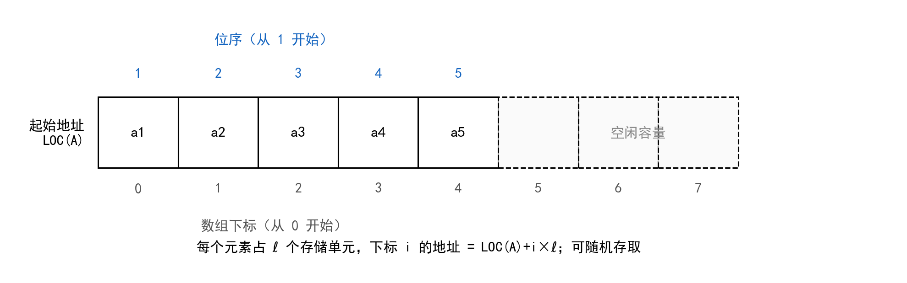

<i>图2-1 顺序表的存储结构</i>

> **⚠️ 【易错辨析】顺序表与链表的对比**  
> 存取方式不同：顺序表支持**【随机存取】**，按下标 O(1) 访问；链表只能**【顺序存取】**，需从头沿指针找，访问为 O(n)；  
> 插入删除不同：顺序表插入、删除要移动大量元素，平均 O(n)；链表只需修改指针，为 O(1)，但这个 O(1) 的前提是**【已经定位到操作位置】**，查找位置本身仍是 O(n)；  
> 存储密度不同：顺序表只存数据、密度高；链表每个结点还要存指针、密度低；  
> 空间分配不同：顺序表需预先分配连续空间，分大了浪费、分小了会溢出；链表按结点动态分配，不会预先浪费，但对内存的小块占用较分散。  

<i>表2-1 顺序表与链表的对比</i>

| 对比项 | 顺序表 | 链表 |
| --- | --- | --- |
| 存取方式 | 随机存取 O(1) | 顺序存取 O(n) |
| 逻辑/物理关系 | 逻辑相邻、物理也相邻 | 逻辑相邻用指针表示，物理可不相邻 |
| 插入删除 | 移动元素，平均 O(n) | 修改指针 O(1)（已定位时） |
| 存储密度 | 高（无指针开销） | 低（含指针域） |
| 空间分配 | 预分配连续空间 | 按结点动态分配 |
| 适用场景 | 查多改少、规模可估计 | 插删频繁、规模变化大 |

## 3. 线性表的链式表示

`🔴高频` `⭐大题考点`

链式表示包括：单链表、双链表、循环单链表、循环双链表

双链表：每个结点包含指向前驱的指针、指向后继的指针、数据

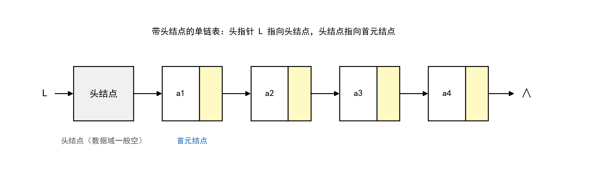

<i>图2-2 带头结点的单链表</i>

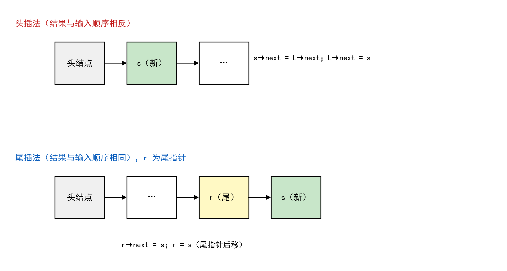

<i>图2-3 头插法与尾插法建表</i>

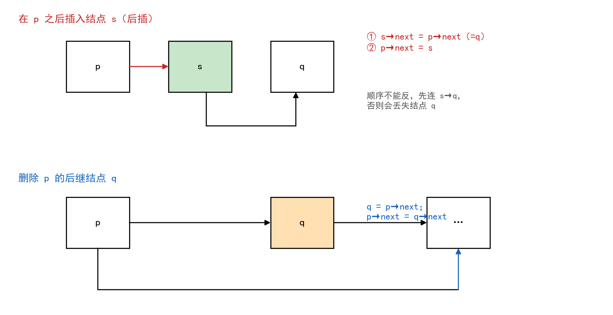

<i>图2-4 单链表的插入与删除</i>

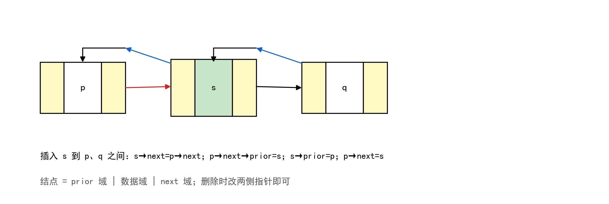

<i>图2-5 双链表的结点与插入</i>

循环单链表：

判空条件：检查头结点的 next 是否指向自身（L→next == L）

为了方便操作，可以**【仅设置尾指针，不设置头指针】**

循环双链表：

判空条件：检查头结点的前驱、后继指针是否都指向自身（L→prior == L→next == L）

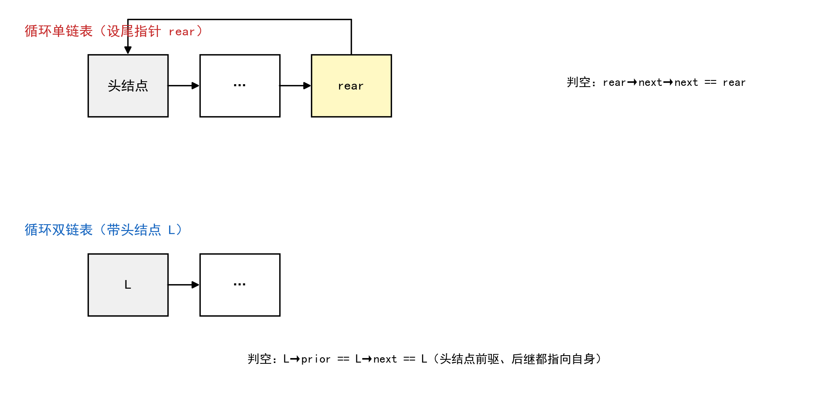

<i>图2-6 循环单链表与循环双链表</i>

> **⚠️ 【易错辨析】头指针与头结点**  
> 头指针是链表**【必须有】**的，即使是空表也存在头指针，它指向链表的第一个结点（带头结点时指向头结点）；  
> 头结点是**【可选】**的，放在首元结点之前、数据域一般为空，设立头结点是为了让首元结点的插入删除与其他结点统一，也让空表与非空表的处理统一；  
> 带头结点时，头指针指向头结点；不带头结点时，头指针直接指向首元结点，二者不要混为一谈。  

> **⚠️ 【易错辨析】循环链表的判空与尾指针**  
> 普通单链表判空看头结点 next 是否为 NULL（L→next == NULL）；循环单链表判空看头结点 next 是否指向**【自身】**（L→next == L）；  
> 循环双链表判空要求头结点的前驱和后继都指向自身（L→prior == L→next == L）；  
> 循环单链表只设尾指针 rear 时，表头和表尾都能 O(1) 找到（rear 即表尾，rear→next 即头结点）；判空为 rear→next→next == rear。  

> **⭐ 【大题考点】单链表算法**  
> 单链表是综合应用题（算法设计）最高频的载体之一，常考：头插法/尾插法建表、链表反转、两个有序链表合并、找倒数第 k 个结点、快慢指针找中点、判断是否有环及找环入口、按值或条件删除结点；  
> 常用手法：①头插法天然实现"逆序"，可用于反转；②快慢双指针处理中点、倒数第 k、判环；③设置哑结点（头结点）可统一空表与首结点的处理，减少特判；  
> 答题时先说明算法思想，再给出关键指针操作，最后说明时间复杂度与空间复杂度。  

# 第三章 栈、队列、数组

## 1. 栈与共享栈

`🔴高频`

共享栈：利用栈底相对固定的特性，让两个顺序栈共享同一段一维数组空间，将两个栈的栈底分别置于数组两端，栈顶向中间延伸

栈空：top0 = −1，top1 = MaxSize；**【入栈时栈顶指针先 ++ 或 −−，出栈时先取元素】**

栈满：top1 − top0 == 1

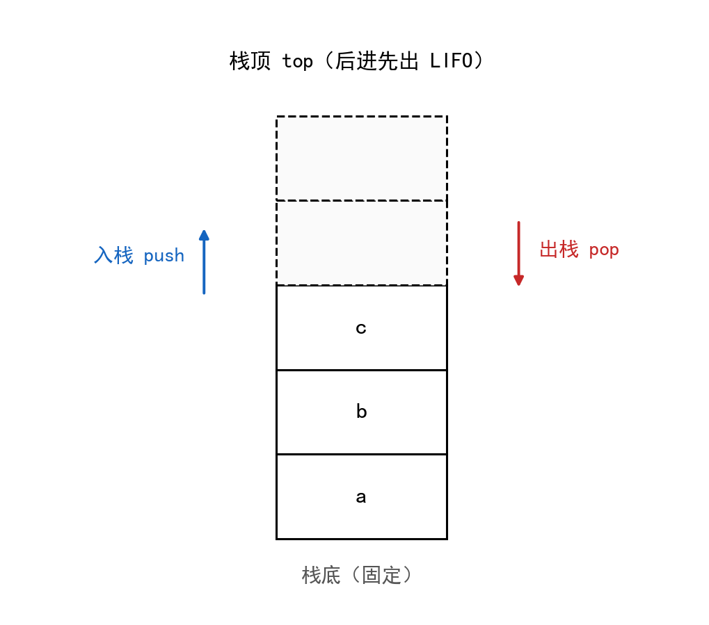

<i>图3-1 栈的入栈与出栈</i>

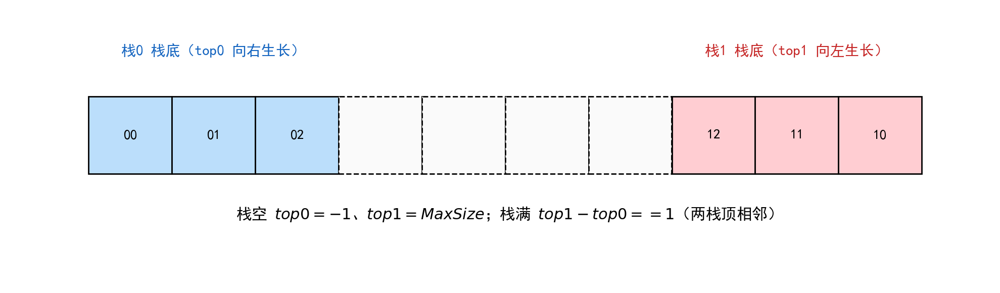

<i>图3-2 共享栈</i>

n 个元素依次入栈，能够得到的出栈序列总数（卡特兰数）为：

> **⚠️ 【易错辨析】栈的操作顺序与出栈序列**  
> 入栈时先移动栈顶指针、再存入元素；出栈时先取出栈顶元素、再移动指针，顺序不要写反；共享栈中栈0的 top0 向增大方向移动，栈1的 top1 向减小方向移动；  
> n 个元素依次入栈，出栈序列总数为卡特兰数，不是 n 的全排列 n!，因为栈的后进先出限制了一部分排列；  
> 判断某个出栈序列是否合法：入栈序列为 1,2,3,… 时，若一个较大的数先出栈，则比它小的数之后只能按**【逆序】**出现，例如 3 先出栈后，1、2 的相对次序只能是 2 在 1 之前。  

## 2. 队列

`🟡中频`

初始状态：Q.front = Q.rear

入队：元素先入队尾，队尾指针再 ++

出队：元素先出队首，队首指针再 ++

> **⚠️ 【易错辨析】单链表实现队列时的头尾指针修改**  
> 单链表实现队列（链式队列）时，队头、队尾指针分别指向链表的首结点和尾结点；出队删除结点时，若删除的结点是最后一个结点，则队头、队尾指针均需要修改（队尾指针要置为空），否则只需要修改队头指针；  

## 3. 循环队列

`🔴高频` `⭐大题考点`

初始状态：Q.front = Q.rear

队首指针进 1：Q.front = (Q.front + 1) % MaxSize

队尾指针进 1：Q.rear = (Q.rear + 1) % MaxSize

入队、出队操作，指针均按顺时针方向移动

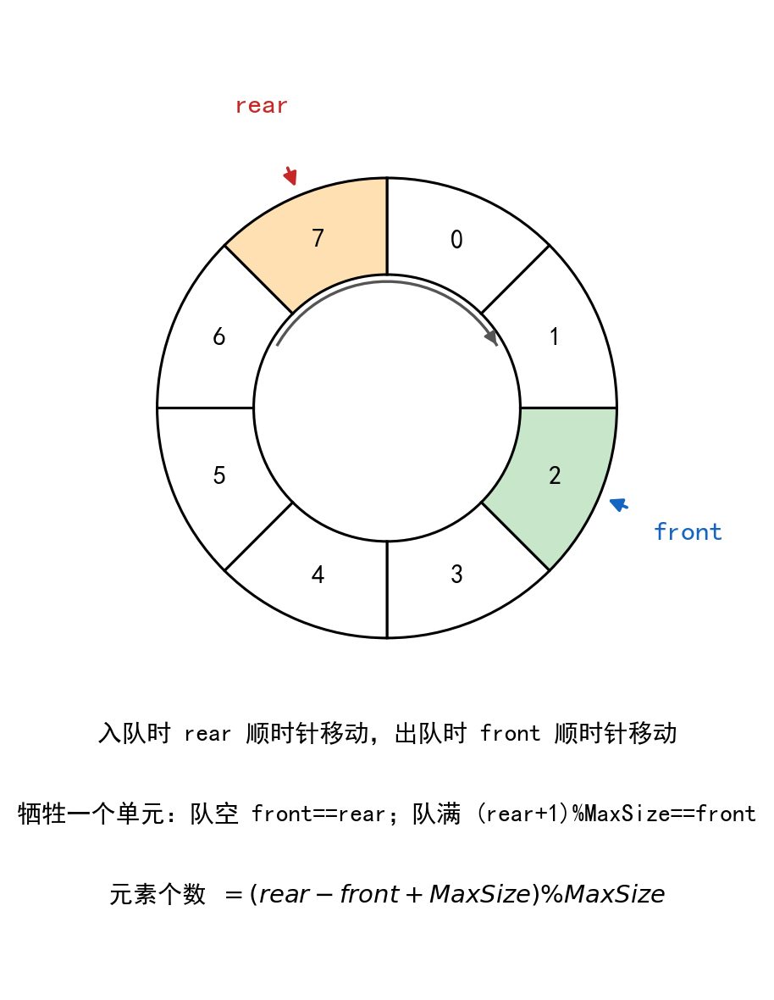

<i>图3-3 循环队列</i>

判满及判空条件的三种方法：

① 牺牲一个存储单元：队满为队尾指针的下一个位置为队首，队空为 Q.front == Q.rear

② 增设 size 成员，记录当前元素个数：队空 Q.size == 0，队满 Q.size == MaxSize

③ 增设 tag 标志位，出队后置 tag = 0，入队后置 tag = 1：队空 Q.front == Q.rear 且 tag == 0，队满 Q.front == Q.rear 且 tag == 1

> **⭐ 【大题考点】循环队列的判空判满与元素计数**  
> 循环队列把顺序存储的数组首尾相接，用取模运算实现指针回绕，是选择题和实现题的常考点；  
> 三种判满方法：牺牲一个单元、增设 size、增设 tag，其中牺牲一个单元最常考，队满条件是 (rear+1)%MaxSize == front，队空是 front == rear；  
> 队列中元素个数为 (rear − front + MaxSize) % MaxSize，注意加 MaxSize 是为了处理 rear 回绕到数组开头、比 front 小的情况。  

## 4. 双端队列

`🟡中频`

允许两端进行插入或删除的队列；输出受限的双端队列、输入受限的双端队列

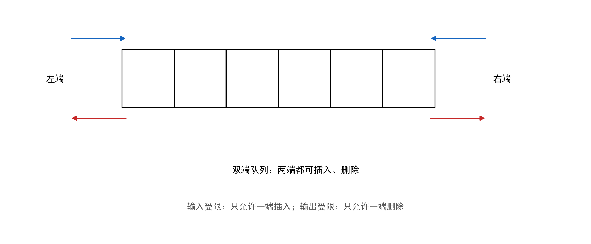

<i>图3-4 双端队列</i>

> **⚠️ 【易错辨析】双端队列与输出序列**  
> 双端队列两端都可以插入、删除；输入受限指只允许一端插入，输出受限指只允许一端删除，受限的方向要看清题目；  
> 判断一个序列能否由双端队列得到时，要结合"从哪端入、从哪端出"逐一枚举，普通队列（先进先出）和栈（后进先出）可以看作双端队列的两种极端情况；  
> 普通队列只在一端入、另一端出，不要和双端队列两端都能操作相混。  

## 5. 栈和队列的应用

`🔴高频` `⭐大题考点`

栈在括号匹配中的应用：

① 初始化一个栈，顺序扫描输入的括号序列

② 遇到左括号压入栈，遇到右括号，若栈为空则非法，否则出栈一个括号

③ 扫描结束后，栈空则匹配成功，否则非法

栈在表达式求值中的应用：

前缀表达式：运算符在两个操作数之前

中缀表达式：运算符在两个操作数之间

后缀表达式：运算符在两个操作数之后；**【表达式树的后序遍历序列 = 后缀表达式】**

栈在递归中的应用，将问题转化为属性相同但规模更小的问题；递归必须满足：①递归体（递归表达式），②边界条件（递归出口），在有限步内终止

队列在层次遍历中的应用

## 6. 中缀表达式转后缀表达式、后缀表达式求值

`🔴高频` `⭐大题考点`

手算：给表达式逐层加括号，将每个运算符移到所在括号的右括号之后，删除所有括号

机算：**【借助一个运算符栈】**，用于存储尚未确定输出时机的运算符，从左往右扫描：

① 遇到操作数，直接加入后缀表达式（输出）

② 遇到括号，左括号直接入栈；**【右括号则一直出栈直到遇到左括号，将左括号出栈】**

③ 遇到运算符，若其**【优先级高于栈顶运算符或栈顶为左括号，则入栈】**；若其**【优先级低于或等于栈顶运算符】**，依次弹出栈中运算符并加入后缀表达式，直至**【栈空或栈顶运算符为左括号】**

④ 扫描完所有字符后，输出栈中剩余的所有运算符

后缀表达式求值，从左往右扫描表达式：

① 为操作数，则入栈

② 为操作符，则从栈中弹出两个操作数，**【先弹出的是右操作数】**，并将结果压回栈中

> **⭐ 【大题考点】括号匹配、中缀转后缀与后缀求值**  
> 括号匹配用一个栈，左括号入栈、右括号与栈顶配对，扫描结束栈空才合法；  
> 中缀转后缀借助运算符栈，核心是比较当前运算符与栈顶的优先级，遇右括号一直弹到左括号；  
> 后缀求值时弹出的两个操作数次序不能颠倒，**【先弹出的是右操作数、后弹出的是左操作数】**，如栈中依次为 a、b，遇减号应计算 b−a。  

## 7. 队列在计算机系统中的应用

`🟢低频`

解决主机与外设之间速度不匹配的问题，解决多用户引起的资源竞争问题

## 8. 数组与特殊矩阵的压缩存储

`🔴高频`

数组（线性表的推广）的存储结构：按行优先、按列优先

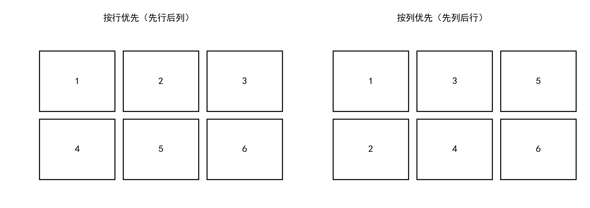

<i>图3-5 数组的按行优先与按列优先存储</i>

特殊矩阵的压缩存储：上（下）三角矩阵、对称矩阵、对角矩阵

① 对称矩阵：只存放主对角线以及下三角区域的元素

② 三角矩阵：存放方式与对称矩阵类似，**【但需要额外存储其余相同的常量】**

③ 三对角矩阵（带状矩阵）：按行或列优先顺序存储

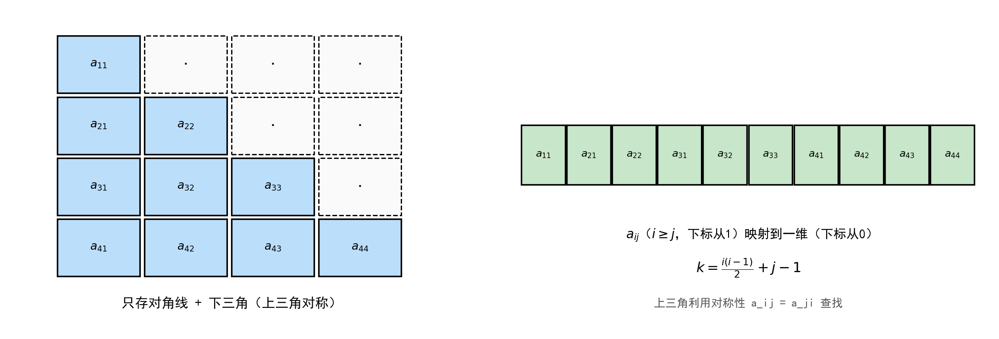

<i>图3-6 对称矩阵的压缩存储</i>

稀疏矩阵：

**【仅存储非零元素，设置三元组】**（行标 i、列标 j、值 a_ij），**【还需存储行数、列数、非零元素个数】**

三元组可用多种方式存储：①数组存储，插入删除效率低；②十字链表存储，便于频繁插入删除

> **⚠️ 【易错辨析】按行/列优先与矩阵压缩**  
> 按行优先先变列下标、列下标走完再变行下标，按列优先相反；二维数组元素地址计算要先确定是按行还是按列，二者结果不同；  
> 对称矩阵只存对角线和一个三角，另一三角利用 a_ij = a_ji 查找，下标映射公式与下标从 0 还是从 1 开始有关，代入前先确认口径；  
> 三角矩阵除了存储一个三角，还要**【额外用一个位置存储其余相同的常量】**，这是它与对称矩阵压缩的区别；  
> 稀疏矩阵用三元组（行、列、值）只存非零元素，并记录总行数、总列数、非零元素个数；三元组丢失了随机存取特性，且转置等操作要专门处理。  

# 第四章 串

## 1. 串的简单模式匹配算法（暴力匹配）

`🟡中频`

从主串的第一个字符开始，与模式串 T 的首字符比较，若相等则继续匹配后续字符，否则**【将主串】**的比较起点后移一位

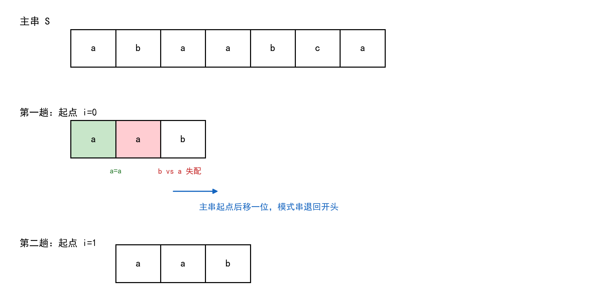

<i>图4-1 串的简单模式匹配（暴力匹配）</i>

> **⚠️ 【易错辨析】暴力匹配与 KMP 的主串指针**  
> 暴力匹配每趟失配后，主串的比较起点整体后移一位，模式串退回到开头，主串指针发生回溯；  
> KMP 在每趟失配时**【主串指针不回溯】**，只调整模式串指针，已经比较过的主串字符不再重复比较，这是 KMP 效率更高的根本原因；  
> 暴力匹配最坏时间复杂度为 O(mn)，KMP 为 O(m+n)，其中 m、n 分别为主串和模式串长度。  

## 2. KMP 算法（串的模式匹配算法）

`🔴高频` `⭐大题考点`

每趟匹配失败时，主串指针不会回溯，仅模式串指针调整；其中 i 为主串指针，j 为模式串指针

模式串右滑的位数为：**【匹配字符数 − 对应的部分匹配值】**

PMT 表（部分匹配值表）：用来确定模式串在失配后的最优右移距离，**【主串指针始终没有回溯】**

next 数组：当模式串的第 j 个字符失配时，下一轮应从模式串的第 next[j] 个位置继续与主串当前字符比较

PMT 表与 next 数组的关系

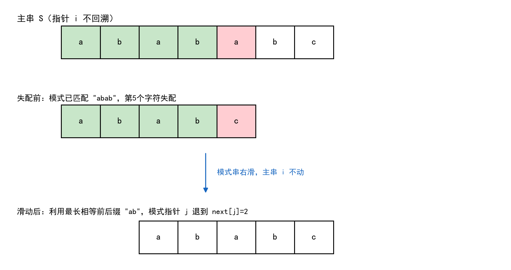

<i>图4-2 KMP 匹配（主串指针不回溯）</i>

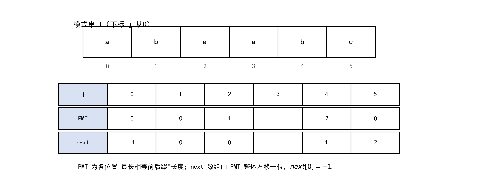

<i>图4-3 PMT 表与 next 数组</i>

next 数组的手算方法：

在模式串**【不匹配处之前】**进行分割，右移模式串，当左侧匹配或为空时，**【右侧对应的字符串序号】**即为 next 的值

> **⭐ 【大题考点】next 数组的含义与计算**  
> next[j] 表示模式串第 j 个字符失配时，模式串指针应退到的位置，主串指针 i 保持不动；  
> 计算 next 用"最长相等前后缀"方法：取失配位置之前子串的最长相等**【真前缀】**与**【真后缀】**，其长度决定 next，注意是真前后缀、不包含整个子串本身；  
> PMT 表整体右移一位、并令 next[0] = −1 即得到 next 数组，做题时先确认下标从 0 还是从 1 开始。  

## 3. KMP 优化算法（nextval 数组）

`🟡中频`

nextval 的手算：先计算 next 数组，若**【回溯时失配字符与回溯指针对应字符相同】**，则说明在该位置也一定失配，此时令 nextval[j] = nextval[next[j]]，否则令 nextval[j] = next[j]

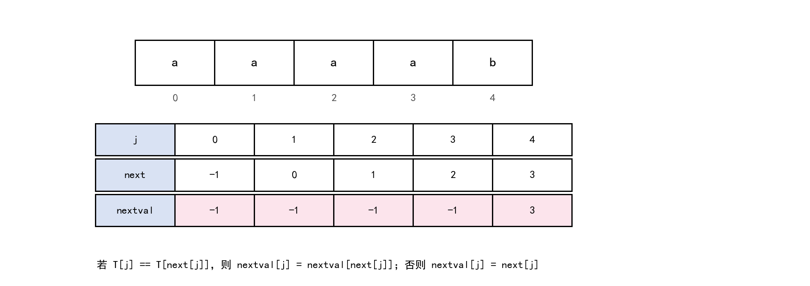

<i>图4-4 KMP 优化的 nextval 数组</i>

> **⚠️ 【易错辨析】next 与 nextval 的计算口径**  
> nextval 是对 next 的优化，当 T[j] 与 T[next[j]] 相同时，退到 next[j] 后仍会失配，因此直接继承 nextval[next[j]]，少做一次无用比较；  
> 当 T[j] 与 T[next[j]] 不同时，nextval[j] 就等于 next[j]；  
> nextval[0] 通常固定为 −1，计算时从左到右逐个位置推导，后面的值依赖前面的结果，不要跳着算。  

# 第五章 树与二叉树

## 1. 树的定义与基本概念

`🟡中频`

树是典型的递归数据结构

结点的度：结点有几个孩子；树的度：树中结点度的最大值

分支结点的度大于 0，叶子结点的度等于 0

路径：两个结点及之间所有结点构成；路径长度：两个结点之间边的数量

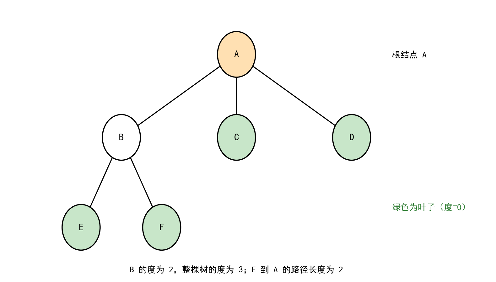

<i>图5-1 树的一般结构</i>

> **⚠️ 【易错辨析】树的度、路径与结点数**  
> 结点的度看它有几个孩子，树的度是所有结点度的最大值，二者是局部与整体的关系；  
> 路径长度数的是**【边】**的条数，不是路径上结点的个数，两个相邻结点的路径长度为 1；  
> 树中结点数等于总度数（总边数）加 1，因为每条边对应一个"被指向"的结点，再加上根结点。  

## 2. 树的性质

`🔴高频` `⭐大题考点`

① 结点数 = 总度数（总边数）+ 1

② 度为 m 的树，第 i 层最多有：

③ 高度为 h 的 m 叉树，至多有：

④ 度为 m、具有 n 个结点的树，最小高度为（按每层放满最大结点数求解）：

⑤ 度为 m、具有 n 个结点的树，最大高度为：

## 3. 树的存储方式

`🟡中频`

① 双亲表示法：用数组保存每个结点的父结点

② 孩子兄弟表示法：左指针连第一个孩子，右指针连下一个兄弟

③ 孩子表示法：为每个结点保存它的孩子链表

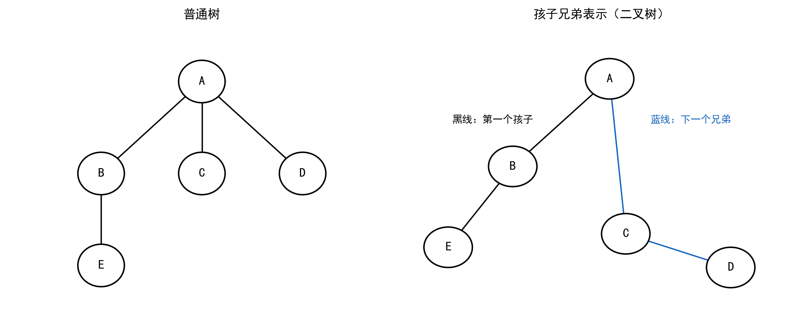

<i>图5-2 树的孩子兄弟表示法</i>

## 4. 二叉树的定义与特殊二叉树

`🔴高频`

二叉树是**【有序树】**

**【度为 2 的树，某结点只有一个孩子时不区分左右次序；二叉树的左右位置不可互换】**

① 满二叉树

② 完全二叉树：叶结点一定在最后两层，**【最多有一个度为 1 的结点】**

③ 二叉排序树：中序遍历为递增序列

④ 平衡二叉树：在二叉排序树基础上，任意结点的**【左右子树高度差绝对值不超过 1】**

⑤ 正则二叉树：没有度为 1 的结点

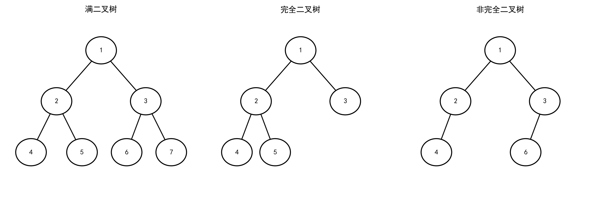

<i>图5-3 满二叉树、完全二叉树与非完全二叉树</i>

> **⚠️ 【易错辨析】二叉树与度为 2 的树**  
> 二叉树是**【有序树】**，即使结点只有一个孩子也要区分是左孩子还是右孩子；度为 2 的树不要求有序，单个孩子不分左右；  
> 完全二叉树至多有一个度为 1 的结点，叶子只出现在最后两层，且最后一层结点靠左连续排列；  
> 满二叉树一定是完全二叉树，完全二叉树不一定是满二叉树；正则二叉树只要求没有度为 1 的结点，和满二叉树不是同一概念。  

## 5. 二叉树的性质

`🔴高频`

非空二叉树中，叶子结点数 n0 与度为 2 的结点数 n2 满足：

## 6. 完全二叉树的性质

`🔴高频` `⭐大题考点`

① 具有 n 个结点的树，最小高度为：

② 最后一个分支结点为：

③ n 为奇数，则不存在度为 1 的结点

④ 当 i 大于 1 时，编号 i 的结点的父结点为：

⑤ 编号 i 的结点所在层次（深度）为：

> **⭐ 【大题考点】二叉树的结点数与高度计算**  
> n0 = n2 + 1 是二叉树结点计数的核心公式，结合"总结点数 n = n0+n1+n2"和"边数 = n−1"可联立求解各类结点数；  
> 完全二叉树按层编号，父子编号关系为：父结点 floor(i/2)，左孩子 2i、右孩子 2i+1；  
> 完全二叉树的最小高度为 floor(log2 n)+1，计算时注意区分"高度从 0 还是从 1 计数"。  

## 7. 二叉树的遍历与由遍历构造二叉树

`🔴高频` `⭐大题考点`

中序遍历 + 其它任一遍历（前序、后序、层序），可以构造唯一的二叉树

仅前序 + 后序不能唯一确定二叉树

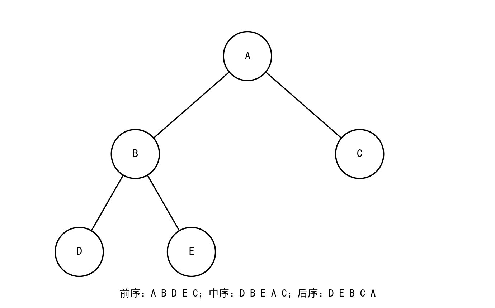

<i>图5-4 二叉树的前序、中序、后序遍历</i>

> **⭐ 【大题考点】二叉树遍历与唯一构造**  
> 前序、中序、后序遍历的区别在于访问根结点的时机：前序根左右、中序左根右、后序左右根；  
> 由遍历序列唯一构造二叉树**【必须包含中序】**，因为中序才能根据根把左右子树分开；前序加后序缺少中序，不能唯一确定；  
> 非递归遍历借助栈，层序遍历借助队列，相关算法题常要求写出遍历过程或统计结点。  

## 8. 线索二叉树

`🟡中频`

含有 n 个结点的二叉树，空指针域（空链域）的个数为：

结构：用 ltag、rtag 标记指针指向的是孩子还是线索；lchild 指向前驱，rchild 指向后继

线索化的本质就是对二叉树进行一次遍历

中序线索二叉树的遍历：**【无需借助栈或递归】**，找到第一个结点后依次查找后继结点即可

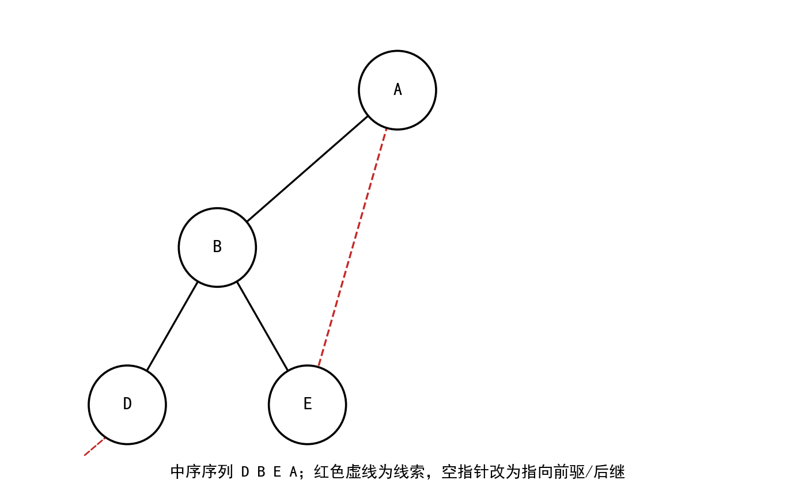

<i>图5-5 中序线索二叉树</i>

> **⚠️ 【易错辨析】线索二叉树的空链与标志位**  
> n 个结点的二叉树有 2n 个指针域，其中 n−1 个用来连边，剩下 n+1 个空链域可改为线索；  
> tag 为 0 表示指针指向孩子，tag 为 1 表示是指向前驱或后继的线索，判断时先看标志位；  
> 中序线索二叉树找后继可以不用栈或递归，但前序、后序线索二叉树在某些情况下仍可能需要栈，不能一概而论。  

## 9. 哈夫曼树与哈夫曼编码

`🔴高频` `⭐大题考点`

结点的带权路径长度：从根结点到某结点的路径长度与该结点权值的乘积

树的带权路径长度 WPL：所有叶子结点带权路径长度之和

**【WPL 最小】**的二叉树即为哈夫曼树，哈夫曼树的形态不唯一

哈夫曼树的构造：每次选取两个权值最小的结点合并成一棵树

① n 个叶子在构造过程中创造了 n−1 个新结点，总结点数为：

② 初始结点均为叶子，权值越小，路径长度越长

③ **【不存在度为 1 的结点】**

编码方式：①固定长度编码；②可变长度编码，如哈夫曼编码

哈夫曼树可以设计出总长度最短的**【二进制前缀编码】**

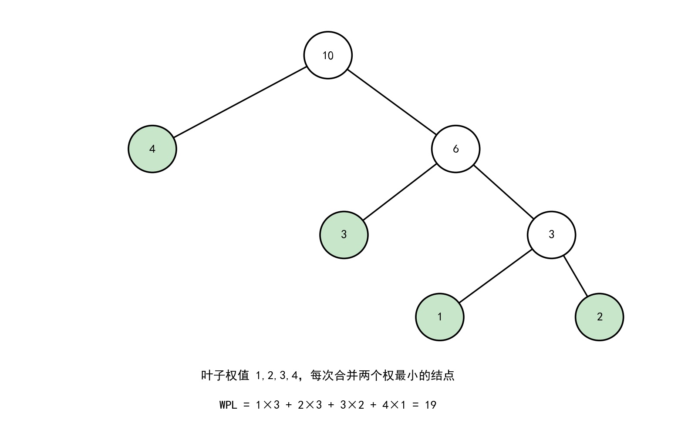

<i>图5-6 哈夫曼树的构造</i>

> **⭐ 【大题考点】哈夫曼树构造与哈夫曼编码**  
> 构造哈夫曼树每次选两个权最小的结点合并，新结点权值为二者之和并放回，重复直到只剩一棵树；  
> 哈夫曼树**【没有度为 1 的结点】**，n 个叶子对应 n−1 个新分支结点、共 2n−1 个结点；  
> 哈夫曼编码是二进制前缀编码，任一字符的编码都不是另一个字符编码的前缀，左分支一般标 0、右分支标 1。  

## 10. 并查集

`🟡中频`

并查集是用于处理不相交**【集合的合并】**与**【查询】**问题的树状数据结构

通常采用树的双亲表示法实现

① 合并时优化：将小树并入大树（按大小或秩合并），使树的深度不超过：

② 查找时优化：路径压缩机制，每次查找后，将**【该结点到根结点路径上的所有结点都直接挂到根结点下】**

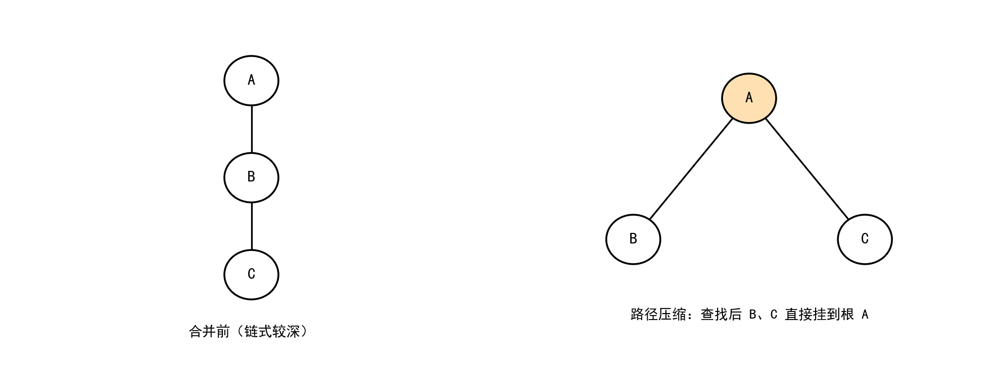

<i>图5-7 并查集的合并与路径压缩</i>

# 第六章 图

## 6.1 图的定义与基本概念

`🔴高频`

图由顶点的有穷非空集合 V 和边的集合 E 组成，**【顶点集 V 不能为空】**，边集 E 可以为空；图常记为 G=(V,E)

无向图：边是顶点的无序对，记为 (v,w)；有向图：弧是顶点的有序对，记为 <v,w>，其中 v 为**【弧尾（起点）】**，w 为**【弧头（终点）】**

简单图：数据结构课程只讨论简单图，即不存在顶点到自身的边，也不存在重复出现的边

完全图：无向完全图中任意两个顶点之间都有一条边，共有 n(n-1)/2 条边；有向完全图中任意两个顶点之间存在方向相反的两条弧，共有 n(n-1) 条弧

度：无向图中顶点的度，等于依附于该顶点的边的条数；有向图中顶点的度，等于该顶点的入度与出度之和

路径：顶点之间由边依次连接形成的序列，路径长度是路径上边或弧的数目

简单路径：**【路径序列中所有顶点均不重复】**

简单回路（简单环）：**【第一个顶点和最后一个顶点相同，其余顶点不重复】**

连通（无向图）：任意两个顶点之间都存在路径；强连通（有向图）：**【任意一对顶点之间，两个方向上都存在路径】**

连通分量：无向图中的**【极大连通子图】**；强连通分量：有向图中的极大强连通子图

极小连通子图：既要保持连通，又要使边数最少，对应生成树（n 个顶点含 n-1 条边），不连通的图对应生成森林

> **⚠️ 【易错辨析】连通、强连通与连通子图**  
> 连通用于无向图，强连通用于有向图，强连通要求任意一对顶点在两个方向上都有路径，不是只有一条路径  
> 图中存在回路，不代表图一定连通，连通要看任意两顶点之间是否都有路径  
> 极大连通子图强调在连通的前提下尽可能多地包含顶点和边，极小连通子图强调在保持连通的前提下边数最少  

> **⚠️ 【易错辨析】简单路径与简单回路**  
> 简单路径要求所有顶点都不重复；简单回路只要求第一个顶点和最后一个顶点相同，其余顶点不重复  
> 无向完全图的边数是 n(n-1)/2，有向完全图的弧数是 n(n-1)，这两个数常直接考查  

## 6.2 图的存储结构

`🔴高频` `⭐大题考点`

邻接矩阵：用一个一维数组存储顶点信息，用一个二维数组（矩阵）存储顶点之间的边，A[i][j]=1 表示两顶点之间有边；无向图的邻接矩阵是对称矩阵

邻接表：为图建立一个顶点表，再为每个顶点建立一个单链表，链表中存放与该顶点相邻接的顶点，兼顾顺序存储和链式存储

十字链表（有向图）：把每条弧组织成同时链接在出边表和入边表中的结点，求入度和出度都比较方便

邻接多重表（无向图）：每条边只对应一个边结点，便于对边进行删除和访问标记

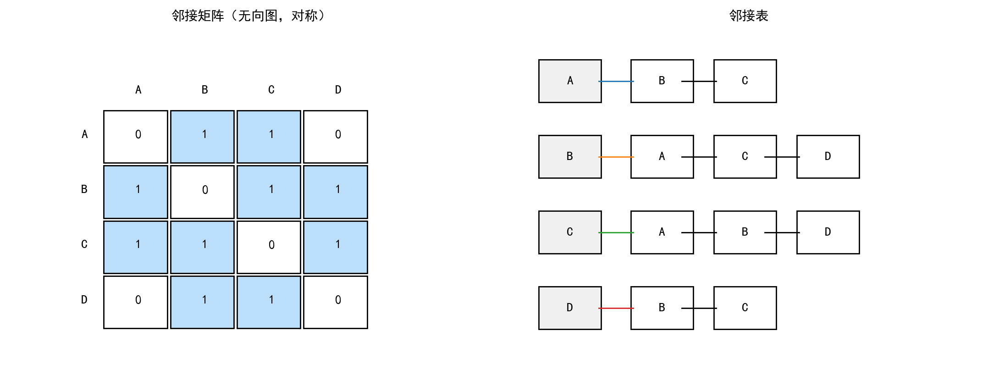

<i>图 6-1 邻接矩阵与邻接表示意</i>

<i>表 6-1 图的四种存储结构对比</i>

| 对比角度 | 邻接矩阵 | 邻接表 | 十字链表（有向图） | 邻接多重表（无向图） |
| --- | --- | --- | --- | --- |
| 存储方式 | 顺序存储 | 顺序存储+链式存储 | 链式存储 | 链式存储 |
| 空间复杂度 | O(n²)，只与顶点数 n 有关，与边数无关 | 无向图 O(n+2e)；有向图 O(n+e) | O(n+e) | O(n+e) |
| 判断两顶点相邻 | O(1)，直接查 A[i][j] | O(degree(v))，沿边表查找 | 沿出边/入边链查找，O(degree) | 沿边链查找，O(degree) |
| 找顶点的所有邻边 | 不方便，要扫描一整行(列)，O(n) | 无向图方便；有向图找出边方便、找入边麻烦 | 入边、出边都方便 | 方便 |
| 删除一条边 | O(1)，直接改矩阵元素 | 改指针即可；无向图要删两个边结点 | 方便，改指针 | 最方便，每条边一个结点，删一次 |
| 删除一个顶点 | 麻烦，要删行删列、移动元素，O(n²) | 麻烦，要删该点所有边结点及相关结点 | 较方便 | 较方便 |
| 适用图 | 稠密图 | 稀疏图 | 有向图 | 无向图（频繁删边、标记访问） |
| 表示是否唯一 | 唯一（顶点编号确定后） | 不唯一（与边输入次序有关） | 不唯一 | 不唯一 |

> **⚠️ 【易错辨析】图的四种存储结构易混点**  
> 无向图的邻接矩阵是对称矩阵，可以压缩存储，实际只需 n(n-1)/2 个空间；无向图邻接表中每条边在两个端点的边表中各存一个结点，共有 2e 个边结点  
> 邻接矩阵找邻边慢 O(n)、删边快 O(1)，邻接表找邻边快、删边要先查找，这组对比经常考查  
> 有向图用邻接表时求入度麻烦、求出度方便，逆邻接表正好相反；十字链表同时保留出边表和入边表，求入度、出度都方便  
> 邻接多重表相比邻接表的核心优势，是无向图中每条边只对应一个边结点，删边和标记边是否访问只需操作一次  
> 除邻接矩阵表示唯一外，邻接表、十字链表、邻接多重表这三种链式存储都不唯一，边结点次序与边的输入次序有关  

## 6.3 图的遍历

`🔴高频` `⭐大题考点`

广度优先搜索 BFS：类似于二叉树的层序遍历，借助一个队列，先访问的顶点先扩展；可以用来求**【无权图的单源最短路径】**，并得到广度优先生成树

深度优先搜索 DFS：类似于树的先序遍历，借助递归工作栈，沿一个方向一直深入，走不通再回退；得到深度优先生成树

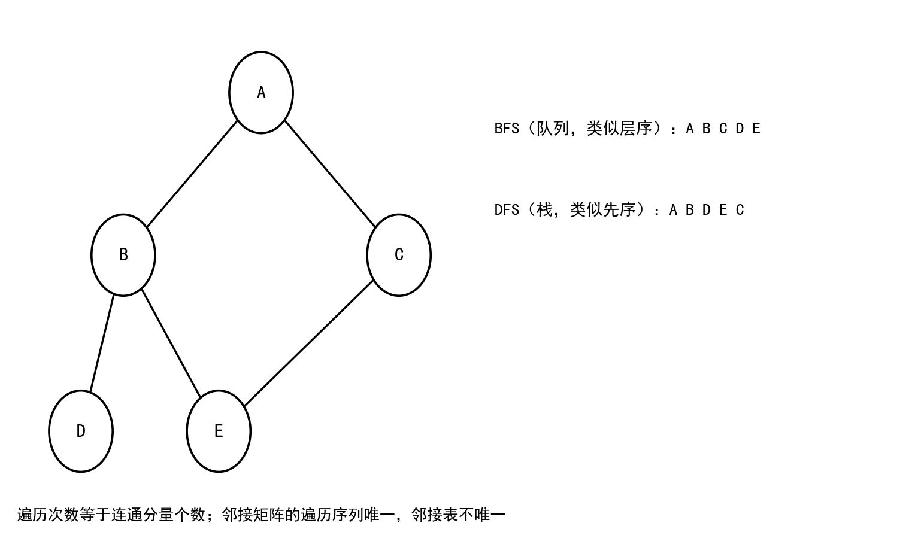

<i>图 6-2 图的 BFS 与 DFS</i>

对每个连通分量，BFS、DFS 各需要调用一次，因此**【遍历算法的调用次数，恰好等于图的连通分量个数】**，遍历也可以用来判断图的连通性

> **⚠️ 【易错辨析】遍历序列的唯一性与连通分量**  
> 邻接矩阵确定、源点确定时，BFS、DFS 的访问序列唯一；邻接表的边结点次序不固定，遍历序列可能不唯一  
> BFS 借助队列、类似层序，可求无权图单源最短路径；DFS 借助栈、类似先序  
> BFS、DFS 被调用的次数等于连通分量个数，不是只调用一次  

> **⭐ 【大题考点】BFS、DFS 与生成树**  
> 常给出图的存储结构，要求写出从指定顶点出发的 BFS、DFS 访问序列，并画出对应的生成树  
> 求无权图两点间的最短路径长度，用 BFS；注意 BFS 求最短路径只适用于无权图（或各边权相同）  

## 6.4 最小生成树

`🔴高频` `⭐大题考点`

生成树：包含图中全部顶点的一个极小连通子图，n 个顶点的生成树含有 n-1 条边，去掉一条边会变成非连通，增加一条边会形成回路

最小生成树：在带权连通无向图中，**【各边权值之和最小】**的生成树；最小生成树可能不唯一，当所有边的权值互不相同时唯一，但不同最小生成树的总权值相同

Prim 算法：从一个顶点开始，每次选取**【距离当前生成树最近】**的顶点加入，再更新其余顶点到生成树的距离，适合稠密图

Kruskal 算法：把边按权值从小到大依次考察，每次选取**【权值最小且加入后不成环】**的边，适合稀疏图

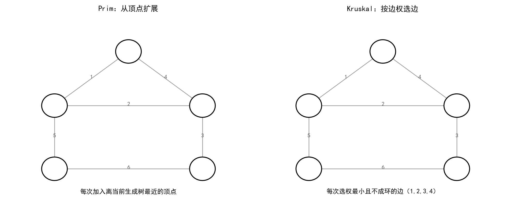

<i>图 6-3 Prim 与 Kruskal 算法</i>

> **⚠️ 【易错辨析】Prim、Kruskal 与 Dijkstra 的选取依据**  
> Prim 每次选的是离“当前生成树这个集合”最近的顶点，Dijkstra 每次选的是离“源点路径长度”最短的顶点，二者的距离含义不同  
> Kruskal 每次选择权最小且不形成回路的边，是按边来构造；Prim 是按顶点来构造  
> 最小生成树可能不唯一，但总权值一定相同；边权全部互异时最小生成树唯一  

> **⭐ 【大题考点】最小生成树的构造**  
> 常给出带权无向图，要求分别用 Prim、Kruskal 求最小生成树，写出顶点或边的加入次序并计算总权值  
> Prim 要不断更新各顶点到生成树的最小距离，Kruskal 要判断加入一条边后是否成环  

## 6.5 最短路径

`🔴高频` `⭐大题考点`

Dijkstra 算法：求解单源最短路径，设置 dist 记录源点到各顶点的当前最短距离，每次选取**【路径长度最短】**的尚未确定的顶点，并用它松弛其邻边，**【不允许出现负权边】**

Floyd 算法：求解任意两个顶点之间的最短路径，用动态规划逐步允许路径经过更多中间顶点，**【允许存在负权边，但不允许存在负权环】**

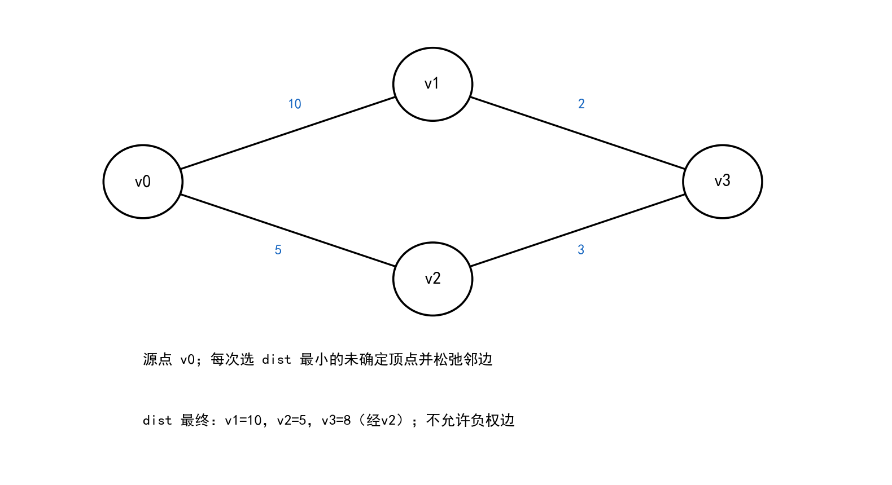

<i>图 6-4 Dijkstra 单源最短路径</i>

> **⚠️ 【易错辨析】Dijkstra 与 Floyd 对负权的处理**  
> Dijkstra 基于贪心，一旦顶点的最短距离确定就不再更改，因此不能处理负权边  
> Floyd 基于动态规划，可以处理负权边，但不能处理负权环，负权环会使最短路径没有意义  
> Dijkstra 求单源最短路径，Floyd 求各顶点对之间的最短路径  

> **⭐ 【大题考点】最短路径计算**  
> Dijkstra 常要求列表给出每一轮各顶点的 dist，并写出顶点确定次序和最终最短路径  
> Floyd 常要求写出各轮的距离矩阵，注意每加入一个中间顶点就更新一次矩阵  

## 6.6 有向无环图 DAG

`🟡中频`

有向无环图 DAG，是描述含有公共子表达式的表达式的有效工具，把公共子表达式只计算一次并被多处共享，可以减少重复计算

## 6.7 拓扑排序

`🔴高频` `⭐大题考点`

AOV 网：用顶点表示活动、用弧表示活动之间先后关系的有向无环图

拓扑排序：从图中选择一个入度为 0 的顶点输出，删除该顶点以及从它出发的所有边，重复这一过程，直到所有顶点都输出

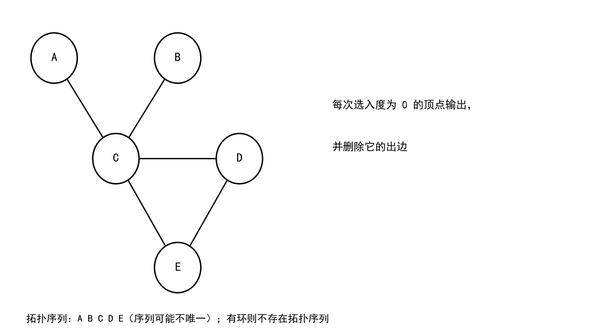

<i>图 6-5 拓扑排序</i>

> **⚠️ 【易错辨析】拓扑序列与环**  
> 一个 AOV 网的拓扑序列可能不唯一，任何一个入度为 0 的顶点都可以先输出  
> 如果拓扑排序过程中剩余顶点的入度都不为 0，说明图中存在环，此时不存在拓扑序列  

> **⭐ 【大题考点】拓扑排序过程**  
> 常给出 AOV 网，要求统计各顶点入度，写出拓扑排序的顶点输出次序  
> 删除一个顶点的出边时，要把对应邻接点的入度减 1，入度变为 0 的顶点进入待选集合  

## 6.8 关键路径

`🟡中频` `⭐大题考点`

> **⚠️ 【易错辨析】关键路径与 AOE 网**  
> AOE 网用顶点表示事件、用边表示活动、边权表示完成活动所需的时间，源点入度为 0、汇点出度为 0  
> 关键路径是从源点到汇点路径长度最长的路径，关键路径上的活动称为关键活动，关键路径长度决定整个工程的最短完成时间  
> 关键路径可能不止一条，只提高某一条关键路径上的关键活动，不一定能缩短整个工期，需要同时缩短所有关键路径上共有的关键活动  

> **⭐ 【大题考点】关键路径的计算**  
> 需要依次求：各顶点事件的最早发生时间 ve、最迟发生时间 vl，各活动的最早开始时间 e、最迟开始时间 l  
> 满足 l-e=0 的活动是关键活动，由关键活动串联得到关键路径  

# 第七章 查找

## 7.1 查找的基本概念与平均查找长度

`🟡中频`

查找表：由同一类型的数据元素（或记录）构成的集合；关键字是数据元素中某个数据项的值，用来标识一个数据元素（或记录）

查找：根据给定的某个值，在查找表中确定一个关键字等于给定值的数据元素（或记录）

平均查找长度 ASL：查找过程中，一次查找的长度是要比较的关键字次数，平均查找长度是所有查找过程中进行关键字比较次数的平均值

其中 n 是查找表中记录的个数，Pi 是查找第 i 个记录的概率，Ci 是找到第 i 个记录所需的比较次数；查找成功和查找失败可分别计算 ASL

## 7.2 顺序查找、折半查找与分块查找

`🔴高频` `⭐大题考点`

顺序查找（线性查找）：从线性表的一端开始，逐个检查关键字是否相等，对顺序表和链表都适用，对记录的有序性没有要求

折半查找（二分查找）：仅适用于**【有序的顺序表】**，每次取中间关键字与给定值比较，将查找范围缩小一半；mid=⌊(low+high)/2⌋

查找判定树：**【右子树结点数-左子树结点数=0 或 1】**，折半查找的判定树是一棵平衡的二叉排序树，查找成功时比较次数最多为判定树的高度

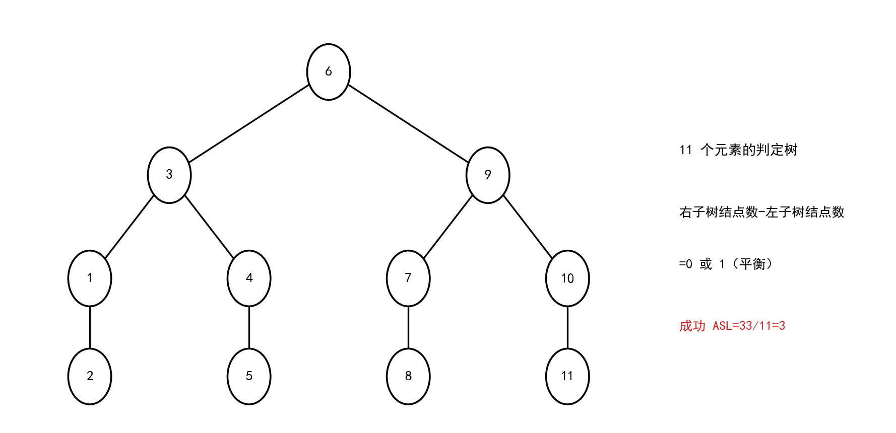

<i>图 7-1 折半查找的判定树</i>

分块查找（索引顺序查找）：将查找表分为若干子块，块内的记录可以无序，块间的记录有序；索引表中存储每个分块的**【最大关键字】**以及该块的起始地址，索引表本身有序

> **⚠️ 【易错辨析】折半查找的适用前提**  
> 折半查找要求线性表具有随机存取的特性（顺序表），并且关键字有序；链表不能进行折半查找，无序表也不能直接折半  

> **⚠️ 【易错辨析】分块查找中“有序”的含义**  
> 分块查找要求块间有序（前一块的最大关键字小于后一块的最小关键字），但同一块内部的记录不要求有序  

> **⭐ 【大题考点】折半判定树与 ASL**  
> 常给出有序表和查找元素，要求画出折半判定树、写出比较路径并计算查找成功或失败的 ASL；注意判定树中圆形结点对应成功、外部方形结点对应失败  

## 7.3 二叉排序树 BST

`🔴高频`

二叉排序树 BST：**【中序遍历得到递增序列】**；左子树结点关键字 < 根结点 < 右子树结点关键字，左右子树本身也都是二叉排序树

查找：从根结点开始，目标关键字比根小就进入左子树，比根大就进入右子树，直到找到或走到空树

插入：先查找插入的位置，新结点作为叶子插入；**【关键字不可重复】**

删除：①叶子结点，直接删除；②只有单个子树的结点，用该子树直接替代；③有两个子树的结点，用直接前驱或直接后继结点替代，**【中序遍历可得到递增序列】**

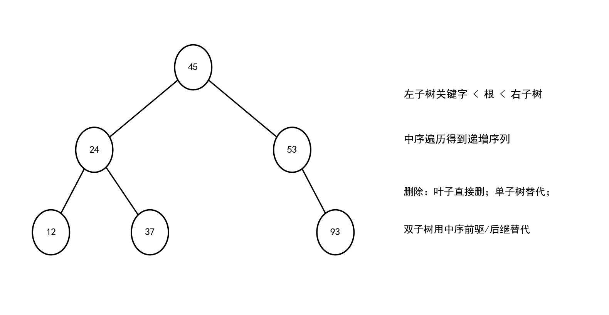

<i>图 7-2 二叉排序树</i>

> **⚠️ 【易错辨析】二叉排序树的中序序列**  
> 二叉排序树的中序遍历一定得到一个关键字递增的序列，可以用这一点判断一棵树是不是二叉排序树  

> **⚠️ 【易错辨析】删除双分支结点后的结果**  
> 删除有两个子树的结点时，用中序前驱（左子树的最右下结点）或中序后继（右子树的最左下结点）替代，替代后仍要满足二叉排序树的性质  

## 7.4 平衡二叉树 AVL

`🟡中频` `⭐大题考点`

平衡二叉树 AVL：树上任一结点的左子树和右子树的深度之差不超过 1；结点的平衡因子 = 左子树高度 - 右子树高度，只可能取 -1、0、1

最小不平衡子树：插入结点后，从插入结点到根结点路径上第一个平衡因子绝对值大于 1 的结点，作为根的子树

插入调整：**【最后旋转的一定是最小不平衡子树的结点】**；①LL 型，右旋；②RR 型，左旋；③RL 型，先右旋再左旋；④LR 型，先左旋再右旋

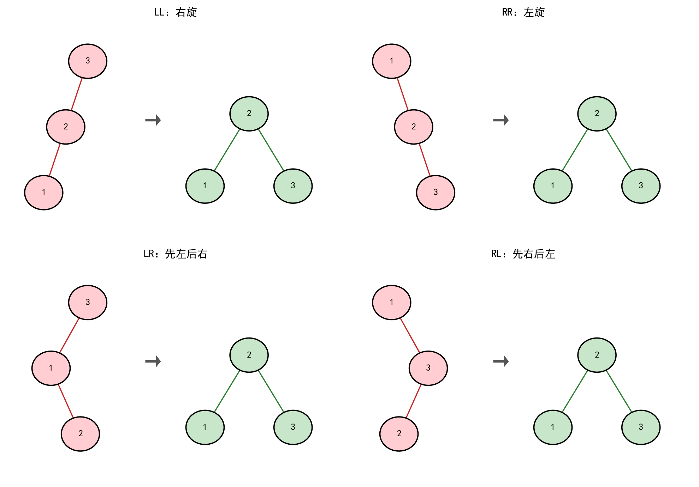

<i>图 7-3 AVL 的四种旋转</i>

删除：先删除结点，再沿路径寻找最小不平衡子树，根据孙子结点的位置判断类型（LL、RR、RL、LR）并调整，循环进行，直到不再出现不平衡子树

> **⚠️ 【易错辨析】LR 与 RL 的旋转顺序**  
> LR 型是先对最小不平衡子树的左子树左旋、再对整体右旋；RL 型是先对右子树右旋、再对整体左旋，旋转顺序不能颠倒  

> **⭐ 【大题考点】平衡旋转的判断**  
> 常给出插入序列，要求构造平衡二叉树，判断最小不平衡子树的类型并画出旋转后的结果；关键是先找插入路径上第一个不平衡的结点  

## 7.5 红黑树

`🟡中频`

平衡二叉树每次插入和删除都容易破坏平衡特性，需要频繁调整；红黑树每次插入和删除一般在常数级时间内完成

红黑树的定义和性质：**【左根右、根叶黑、不红红、黑路同】**；①满足二叉排序树的特性；②根结点是黑色的；③叶结点（NULL、外部结点、失败结点）为黑色，**【不是实际存在的结点】**；④不存在两个相邻的红色结点；⑤对任一结点，从它到任意叶结点的简单路径上，所含黑色结点的数量相同

黑高：某结点到其叶结点的路径上黑色结点（也叫黑色祖先）的个数，不包含该结点本身，包含**【失败结点】**

含 n 个内部结点的红黑树，高度至多为：

插入：①先查找，确定插入位置；②新结点为根则染黑，非根则染红（保证黑路同特性）；③若破坏了红黑树的定义，根据**【叔叔（父兄）的颜色】**调整形态

黑叔：先旋转，再染色；红叔：先染色，再把爷爷当作新插入的结点继续处理（叔父爷染色）；染色时不染新插入的结点，经过最终旋转的结点其颜色需要改变

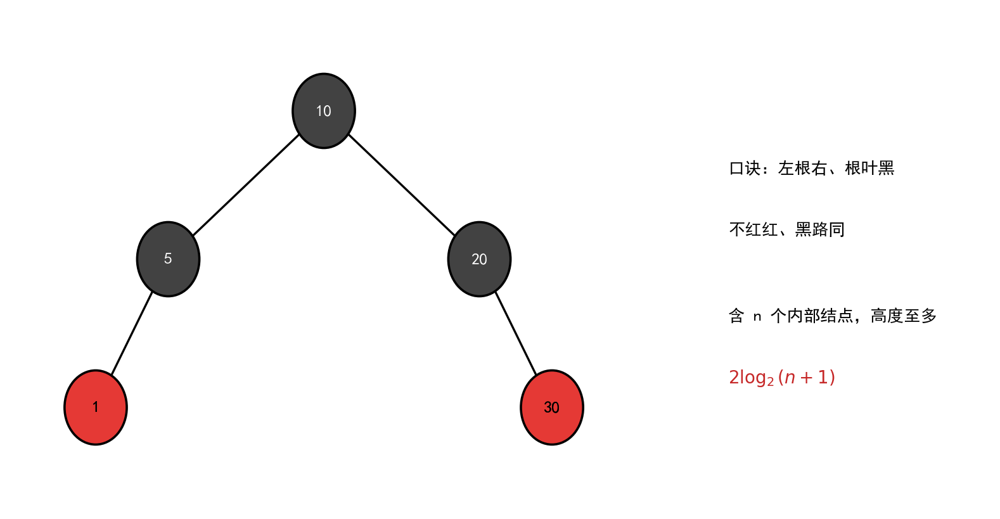

<i>图 7-4 红黑树示例</i>

> **⚠️ 【易错辨析】新插入结点为什么染红**  
> 新插入的非根结点染成红色，不会改变路径上黑色结点的数量，从而不破坏黑路同；如果染黑就会使某条路径多出一个黑结点  

## 7.6 B 树

`🔴高频` `⭐大题考点`

B 树是一种平衡的多路查找树，结点中关键字按递增次序排列，子树高度都相同；一个含 k 个关键字的结点，有 k+1 棵子树

一棵 m 阶 B 树，每个结点中关键字的个数和子树的棵数满足：

根结点（不是叶子时）至少有 1 个关键字、2 棵子树；除根以外的所有非叶结点，至少有 ⌈m/2⌉-1 个关键字、⌈m/2⌉ 棵子树

每个结点中关键字的个数至多为 m-1，子树棵数至多为 m；n 个关键字的 B 树，有 n+1 个叶子结点（查找失败的结点）

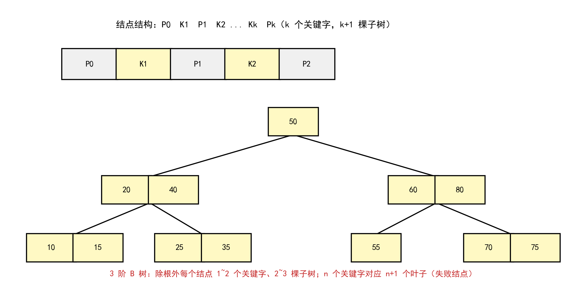

<i>图 7-5 B 树的结点结构与 3 阶 B 树</i>

插入：在相应位置插入关键字后，若关键字个数超过 m-1，则从中间位置把关键字分开，将中间关键字上提到父结点中；若父结点也超限，则重复操作，直到满足 B 树定义

删除：①终端结点中的关键字直接删除；②非终端结点中的关键字，用直接前驱或直接后继替换；③删除后关键字个数不足，向邻近的左（右）兄弟借用；④兄弟不够借，则将父结点中的关键字与邻近兄弟合并；⑤重复上述操作，直到符合定义

> **⚠️ 【易错辨析】关键字个数与子树棵数**  
> B 树中一个结点有 k 个关键字就一定有 k+1 棵子树；除根外关键字最少为 ⌈m/2⌉-1，要注意根结点不受这个下限约束  

> **⭐ 【大题考点】B 树的插入与删除**  
> 常给出插入（删除）序列，要求画出 B 树每次变化后的形态；插入超限要分裂并上提中间关键字，删除不足要先向兄弟借、借不到再合并  

## 7.7 B+ 树

`🟡中频`

B+ 树是 B 树的一种变体；非叶根结点至少有两棵子树，每个分支结点至少有 ⌈m/2⌉ 棵子树、至多有 m 棵子树，要保持绝对平衡

**【分支结点的子树个数 = 关键字的个数】**，这一点与 B 树（关键字个数 +1）不同

所有叶结点包含全部关键字，以及指向相应记录的指针，叶结点中的关键字按大小顺序排列，相邻叶结点按大小顺序相互链接起来，**【支持顺序查找】**

B+ 树中的非叶子结点仅起到索引作用，索引项只包含对应子树的最大关键字，不含有该记录的存储地址

<i>表 7-1 B 树与 B+ 树的对比</i>

| 对比角度 | B 树 | B+ 树 |
| --- | --- | --- |
| 关键字与子树 | k 个关键字，k+1 棵子树 | 分支结点子树个数 = 关键字个数 |
| 关键字存放 | 所有结点都含关键字 | 全部关键字都在叶子，分支结点仅索引 |
| 记录地址 | 关键字本身带记录地址 | 只有叶子结点含记录指针 |
| 叶子链接 | 叶子不相互链接 | 叶子按大小顺序链接，支持顺序查找 |
| 查找结束位置 | 可在任意一层结点结束 | 每次查找都要走到叶子结点 |

> **⚠️ 【易错辨析】B+ 树与 B 树的关键字对应关系**  
> B 树中关键字个数比子树少 1 的对应关系相反；B+ 树的分支结点里，子树个数与关键字个数相等，全部关键字和记录指针只出现在叶子中  

## 7.8 散列表

`🔴高频` `⭐大题考点`

冲突：根据关键字的值确定的存储地址，已经插入了其他元素；同义词：不同的关键字经过散列函数计算得到相同的存储地址，这些关键字互为同义词

散列函数的构造要求：定义域涵盖所有可能出现的关键字，值域不超过散列表的地址范围，尽可能减少冲突，并且散列函数尽可能简单以减少时间开销

①除留余数法：取关键字被某个不大于散列表表长 m 的数 p 除后所得的余数作为散列地址，关键字为整数即可

②直接定址法：用关键字的某个线性函数值作为散列地址，关键字分布基本连续时适用

③数字分析法：**【选取数码分布较为均匀的若干位作为散列地址】**，要求关键字集合已知，且关键字的某几个数码位分布均匀

④平方取中法：取关键字平方值的中间几位作为散列地址；关键字每位取值都不均匀时适用，得到的**【散列地址与每个关键字的每位都有关系，因此分布较为均匀】**

处理冲突的方法——拉链法（链地址法）：将所有同义词用链表存储起来，默认使用头插法

开放定址法：一旦发生冲突，就为新元素寻找另外的空闲地址，di 表示第 i 次冲突时下一个地址相对初始散列地址的偏移量

探测序列的构造：①线性探测法，di=1,2,3,…；②平方探测法，di=0²,1²,-1²,2²,-2²,…；③双散列法；④伪随机序列法，人为设计一个伪随机序列

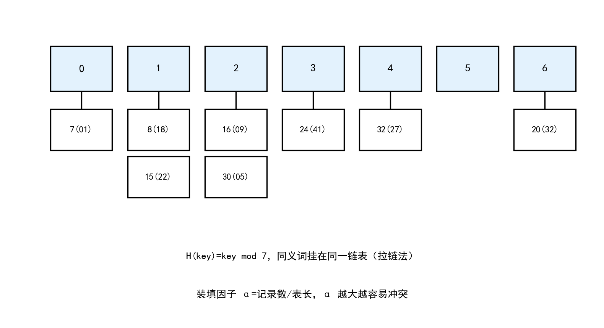

<i>图 7-6 散列表的拉链法</i>

开放定址法删除元素：查找成功才可以删除关键字，并且只能进行**【逻辑删除（设置删除标志位）】**，不能真正物理删除

探测覆盖率：①线性探测法可以探测所有位置；②平方探测法，当表长是可以表示成 4k+3 的素数时，可以探测所有位置；③双散列法，若 H2(key) 与表长互质，则可以探测所有位置；实际中常直接让表长本身是质数

散列表的 ASL：成功 ASL 除以**【散列表中的元素个数】**；失败 ASL 除以**【散列地址的取值个数】**，查找失败的标志只能是空单元 NULL

注意删除元素后，计算成功 ASL 和失败 ASL 依旧**【要考虑被删除的位置】**，因为删除只是逻辑删除，不是真实删除

装填因子 α 反映散列表“满”的程度，α 越大越容易冲突、ASL 增大

聚集（堆积）效应：几个**【初始散列地址不同的元素】**，争夺**【同一个后继散列地址】**的现象；线性探测法容易产生聚集效应，**【平方探测法可以减少聚集现象】**

> **⚠️ 【易错辨析】成功 ASL 与失败 ASL 的分母**  
> 计算成功 ASL 时除以实际存放的元素个数，计算失败 ASL 时除以散列地址（模值）的取值个数，二者分母不同；逻辑删除的位置仍要计入  

> **⚠️ 【易错辨析】开放定址法的删除方式**  
> 开放定址法中删除关键字只能做逻辑删除、加删除标志，物理删除会打断探测序列，使后续同义词无法被找到  

> **⭐ 【大题考点】散列表构造与 ASL 计算**  
> 常给定关键字集合和散列函数、冲突处理方法，要求画出散列表，计算查找成功和失败的 ASL；要按探测顺序逐个统计比较次数，并注意失败 ASL 的分母是地址取值个数  

# 第八章 排序

## 8.1 排序的基本概念

`🟡中频`

排序：重新排列表中的数据元素，使之按关键字递增（或递减）次序排列；排序的依据可以是主关键字，也可以是次关键字

稳定性：设表中有两个关键字相同的元素，若排序之后它们的**【相对先后次序保持不变】**，则称该排序方法是稳定的，否则是不稳定的；稳定性只针对关键字相同的元素

内部排序：排序期间元素全部存放在内存中；外部排序：排序期间元素太多、内存放不下，需要在内存与外存之间多次移动数据

内部排序按是否基于关键字比较，可分为比较类（插入排序、交换排序、选择排序、归并排序）与非比较类（基数排序、计数排序、桶排序）

> **⚠️ 【易错辨析】稳定性的判断对象**  
> 稳定性描述的是关键字相同的两个元素，排序前后相对次序是否改变；与元素值是否相等无关，判断一个排序是否稳定，要找关键字相同的元素，看它们会不会越过彼此  

## 8.2 插入排序

`🔴高频`

直接插入排序：把序列分成前方有序区与后方无序区，每一趟取出无序区的第一个元素，在有序区中**【从后往前】**边比较边后移，找到合适位置后插入

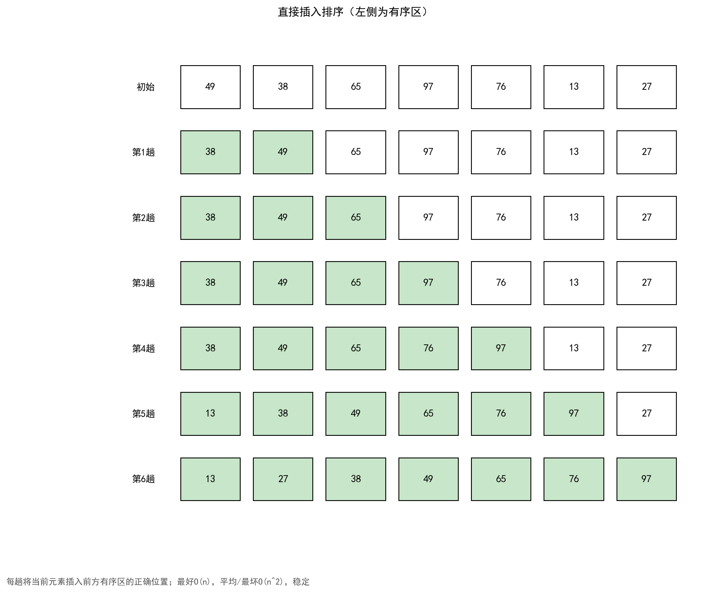

<i>图 8-1 直接插入排序</i>

直接插入排序在序列已经基本有序时很快；最好情况（已有序）每趟只比较一次、不移动，时间为 O(n)，最坏情况（逆序）与平均情况为 O(n²)，空间复杂度 O(1)，是稳定排序

折半插入排序：查找插入位置时改用折半查找，当 low>high 时停止查找，将 [high+1, i-1]（即 [low, i-1]）的元素全部右移后插入；当 A[mid]==temp 时继续往右找插入位置，以此保证稳定性

折半插入排序减少了关键字的比较次数，比较次数约为 O(n log n)、与初始状态无关，但元素的移动次数没有改变，整体时间仍为 O(n²)，空间 O(1)，稳定

希尔排序（Shell Sort）：先取一个增量 d，把待排序表按下标间隔 d 分割成若干特殊子表，对各子表分别做直接插入排序，之后缩小增量、重复上述过程，直到增量缩小到 1，对整体再做一次直接插入排序

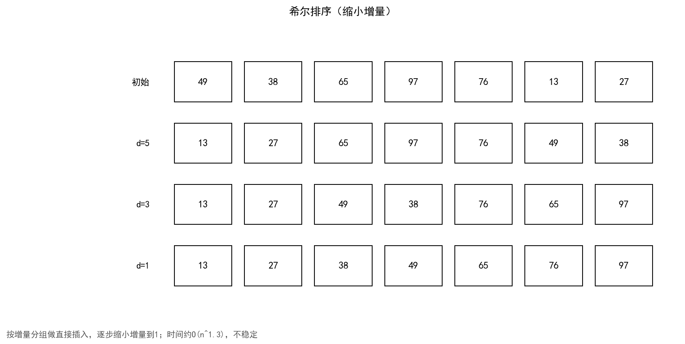

<i>图 8-2 希尔排序</i>

希尔排序通过前面几趟的大步长插入，使元素大体接近有序，最后一趟直接插入就很快；时间复杂度依赖增量序列，约为 O(n¹·³)，空间 O(1)，**【希尔排序不稳定】**

> **⚠️ 【易错辨析】插入排序的比较与移动**  
> 直接插入排序最好 O(n)、最坏 O(n²)，折半插入只减少比较次数、不减少移动次数，时间仍是 O(n²)；希尔排序因为分组后相同关键字元素可能分到不同组、相对次序会改变，属于不稳定排序  

> **⭐ 【大题考点】手工模拟插入类排序**  
> 常给出初始序列，要求写出直接插入或希尔排序每一趟的结果；直接插入注意有序区逐步扩大，希尔排序要按给定增量序列逐趟分组插入，最后一趟增量一定是 1  

## 8.3 交换排序

`🔴高频` `⭐大题考点`

冒泡排序：从前往后（或从后往前）两两比较相邻元素，若为逆序则交换，直到这一趟序列比较完；每一趟可以把关键字最小（或最大）的值移动到序列的一端

冒泡排序中，**【若某一趟冒泡没有发生任何交换，则说明该序列已经整体有序】**，可以提前结束

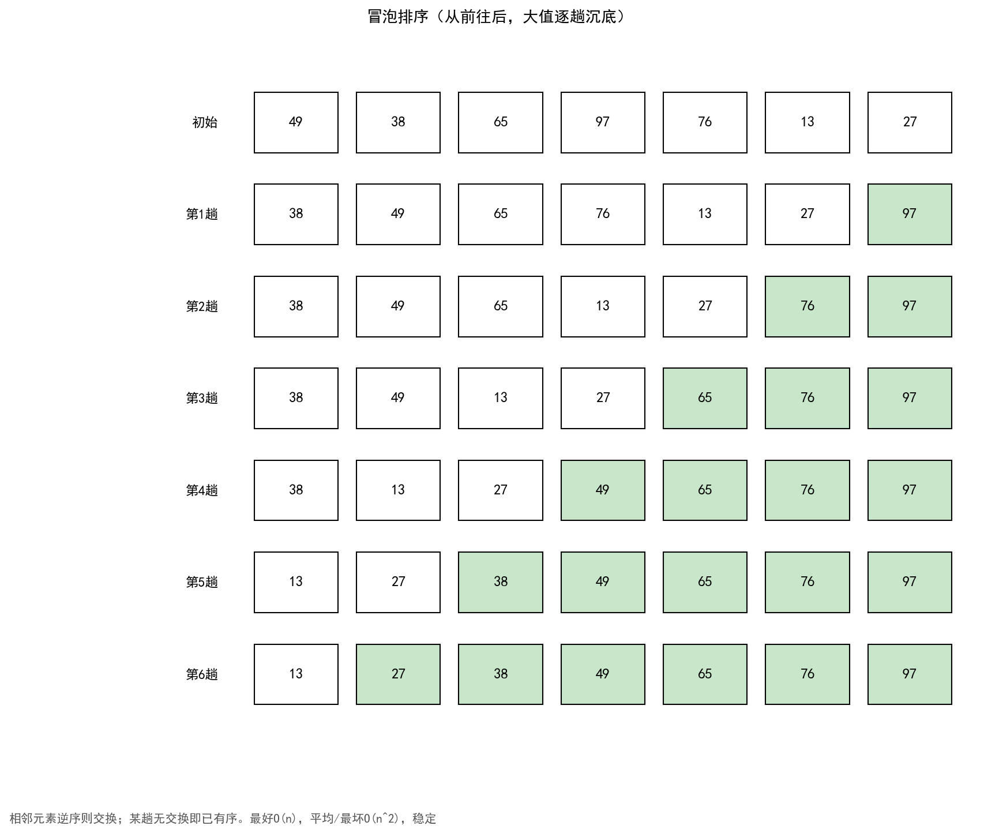

<i>图 8-3 冒泡排序</i>

冒泡排序最好情况（已有序、只跑一趟无交换）为 O(n)，最坏与平均情况为 O(n²)，空间 O(1)，是稳定排序

快速排序：在待排序表中选一个元素作为枢纽 pivot，通过一次划分，把小于 pivot 的元素放到左边子表、**【大于等于】**pivot 的元素放到右边子表，由此确定 pivot 的最终位置，之后对左右子表递归，直到排序结束

一次划分可用双指针完成，固定位置为空的指针、移动位置不为空的指针，两端向中间靠拢、逆序则交换；递归层数对应一棵二叉排序树的树高

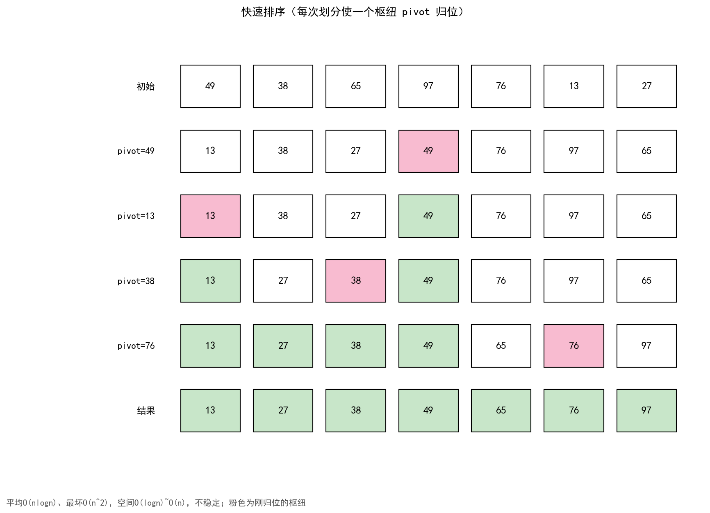

<i>图 8-4 快速排序</i>

快速排序每层处理的元素总数为 n，时间复杂度为 O(n 乘 递归层数)；最好与平均情况（划分较均匀）为 O(n log n)，最坏情况（序列已有序或逆序、划分极不均匀）为 O(n²)

快速排序的空间复杂度等于递归调用的深度，最好为 O(log n)、最坏为 O(n)；**【快速排序不稳定】**

> **⚠️ 【易错辨析】冒泡的交换次数与移动次数**  
> 分析冒泡排序性能时，要看清题目问的是交换次数还是移动元素的次数；每交换一次，两个元素互换位置、共移动三次元素，二者不能混为一谈  

> **⚠️ 【易错辨析】快速排序的最坏情况与空间**  
> 快速排序并非任何情况都快，序列已有序或逆序时，每次划分只分出一个元素，退化为 O(n²)；递归需要栈辅助，空间为递归深度 O(log n)~O(n)，且相同关键字元素可能因交换改变次序，属于不稳定排序  

> **⭐ 【大题考点】快速排序的划分过程**  
> 常要求写出以某元素为枢纽的一次划分过程（双指针移动与交换）、每趟结果及递归层次；关键是先确定 pivot，左右指针按规则移动，一次划分后 pivot 到达最终位置  

## 8.4 选择排序

`🔴高频` `⭐大题考点`

简单选择排序：在每个待排序序列中，选出关键字最小（或最大）的元素，与无序区的第一个位置交换，将其加入有序子序列

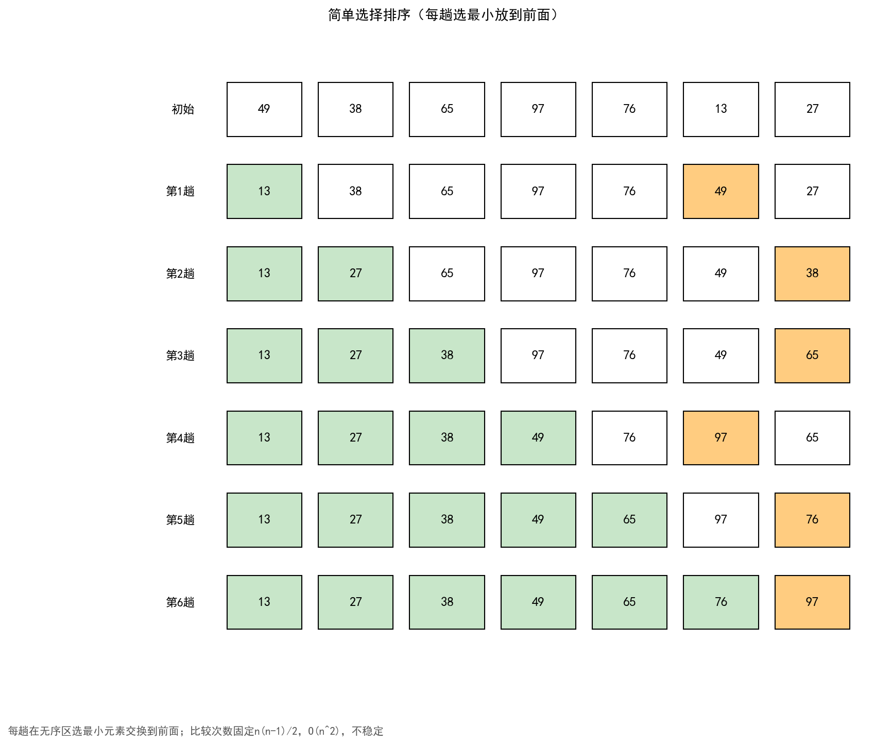

<i>图 8-5 简单选择排序</i>

简单选择排序的关键字比较次数固定，与初始状态无关，为 n(n-1)/2、即 O(n²)，元素交换次数很少（最多 n-1 次），空间 O(1)，**【简单选择排序不稳定】**

堆排序：堆是一棵完全二叉树，若根结点关键字最大则为大根堆（每个结点都不小于其孩子），若根结点关键字最小则为小根堆

建立大根堆不用递归，只需从**【最后一个非终端结点（下标为 ⌊n/2⌋-1）】**开始，从右往左、从下往上逐个判断非终端结点是否满足堆条件，不满足就将较大的孩子与根交换，时间为 O(n)，关键字比较次数不超过 4n

向下调整时，若交换破坏了下一级的堆，就用相同方式继续往下调整，小元素不断下坠；一个结点每下坠一次，最多只需比较两次关键字

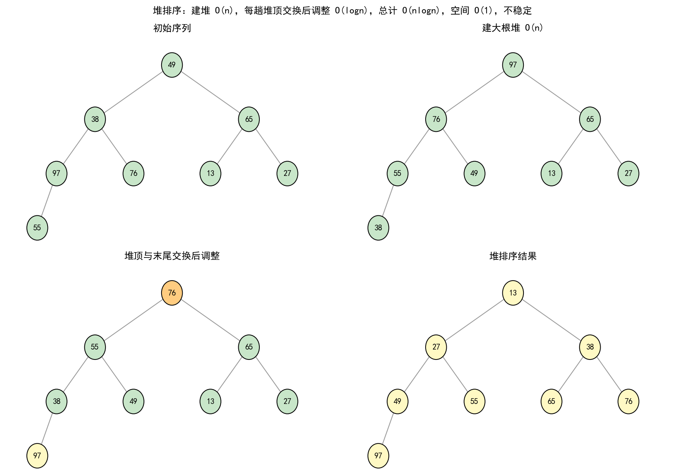

<i>图 8-6 堆的建立与堆排序</i>

基于大根堆排序：每一趟将堆顶元素（当前最大）与待排序序列中的最后一个元素交换，把堆顶加入有序子序列，再把剩余元素重新调整为大根堆，如此循环；建堆 O(n)、之后 n-1 趟每趟 O(log n)，总时间 O(n log n)，空间 O(1)，**【堆排序不稳定】**

堆的插入：把元素放到表尾，再一路上升，每次上升只需比较一次关键字；堆的删除：用堆底元素代替被删元素，再让它不断下坠直到符合堆的要求，每次下坠比较关键字的次数等于孩子数量

> **⚠️ 【易错辨析】建堆的次序与复杂度**  
> 建堆必须从最后一个非终端结点 ⌊n/2⌋-1 开始、从下往上调整，整体为 O(n)，不是 O(n log n)；下坠时每次最多比较两次（与左右孩子比较后再与较大者交换），堆排序全程 O(n log n)、空间 O(1)  

> **⚠️ 【易错辨析】选择排序为何不稳定**  
> 简单选择排序与堆排序都要跨位置交换元素，关键字相同的元素可能因交换越过彼此，因此都不稳定；简单选择排序比较次数固定为 n(n-1)/2，交换次数最多 n-1  

> **⭐ 【大题考点】堆的建立、调整与排序**  
> 常给出序列要求先建大根堆（或小根堆），再逐趟堆顶交换并调整、写出每趟结果；要从最后一个非终端结点往前调整，排序时注意待调整堆的规模逐趟缩小  

## 8.5 归并排序

`🔴高频` `⭐大题考点`

归并排序：把两个或多个已经有序的序列，用多指针法合并成一个有序序列；内部排序中一般采用二路归并

二路归并排序手算时，自底向上把相邻的两个有序子序列合并成一个，第一趟两两合并单个元素，之后子序列长度逐趟加倍

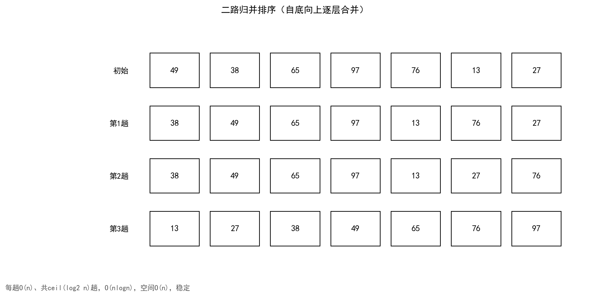

<i>图 8-7 二路归并排序</i>

每一趟归并遍历全部 n 个元素、时间为 O(n)，共 ⌈log₂n⌉ 趟，因此总时间为 O(n log n)；归并需要与原表等大的辅助数组暂存合并结果，空间复杂度为 O(n)，归并排序是稳定排序

k 路归并：每次要从 k 个序列中选出最小（大）的一个数，顺序比较最多需要 k-1 次关键字比较，可借助败者树把这次选择的比较次数减少到 O(log k)

> **⚠️ 【易错辨析】归并排序的空间与稳定性**  
> 归并排序时间稳定为 O(n log n)（最好最坏平均相同），但合并时需要辅助数组，空间 O(n)，是常见 O(n log n) 排序中空间开销最大的；合并时按次序取元素、不越过相同关键字，因此稳定  

> **⭐ 【大题考点】归并过程与趟数**  
> 常要求写出二路归并每一趟的结果、计算归并趟数；趟数为 ⌈log₂n⌉，每趟 O(n)，注意一次合并要用两个指针分别扫描两个有序子序列  

## 8.6 基数排序与计数排序

`🟡中频`

基数排序：不直接比较关键字整体，而是把关键字拆分成 d 个元组（d 个关键字位，最高位到最低位），采用最低位优先 LSD，从权重最小的最低位开始，一趟分配、一趟收集

每一趟按当前关键字位，把元素分配到 r 个队列（r 为该位的基数、即取值个数），全部入队后再从队列依次出队收集，共进行 d 趟，最终得到有序序列

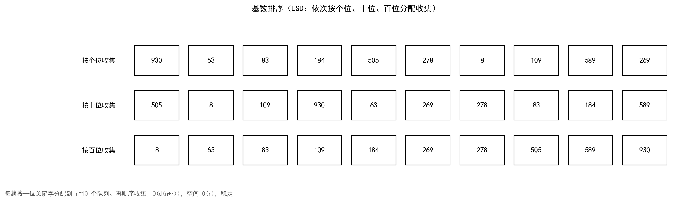

<i>图 8-8 基数排序</i>

基数排序擅长解决的情况：①数据元素可拆分成 d 个元组、d 较小；②每组关键字的取值范围 r 不大；③数据元素个数 n 较大；基数排序稳定

计数排序：前提是待排序元素关键字为整数、取值范围 k 不大；先创建长度为 k 的辅助数组，统计每个元素的出现次数，再计算前缀和，最后利用前缀和、从后往前把元素放回正确位置

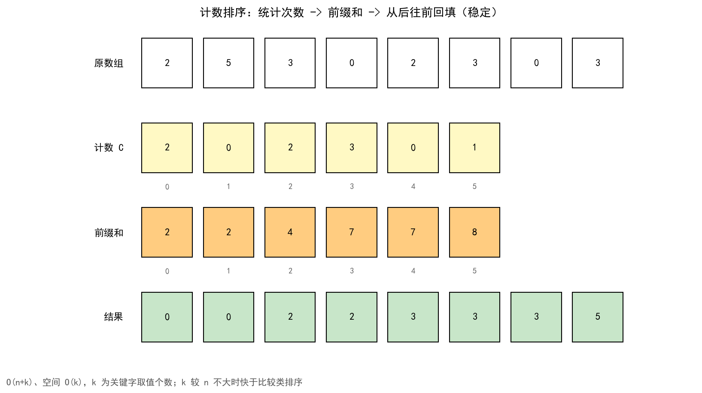

<i>图 8-9 计数排序</i>

计数排序中前缀和表示某元素应放在第几个位置（是位置、不是下标），从后往前处理可保证稳定性；当 k 比 n 不大时，时间效率高于快速排序、堆排序等比较类排序，当 k 很大时则相反

> **⚠️ 【易错辨析】非比较类排序的复杂度口径**  
> 基数排序时间 O(d(n+r))、空间 O(r)，计数排序时间 O(n+k)、空间 O(k)，都不基于关键字比较，复杂度与关键字位数或取值范围有关；计数排序从后往前回填是为了保持稳定  

## 8.7 外部排序

`🔴高频` `⭐大题考点`

外部排序基于归并排序，对存放在磁盘中的大文件进行排序，内存中至少要划分三个缓冲区（两个输入缓冲区、一个输出缓冲区，大小等于一个物理块）

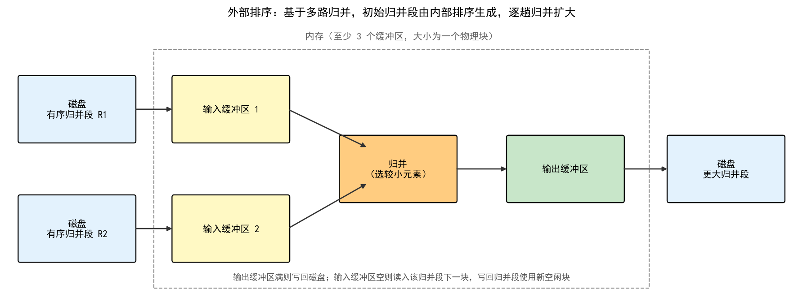

<i>图 8-10 外部排序的工作流程</i>

构造初始归并段：先分别读入数据块到输入缓冲区，对缓冲区中的数据做内部排序，再把排序好的数据写回磁盘，合并成有序的初始归并段；写回归并段时写入新的空闲块，原来存放数据的物理块释放归还系统

归并时，把各归并段中较小的一块读入输入缓冲区，选择缓冲区中较小的元素放入输出缓冲区，输出缓冲区满就写回磁盘，输入缓冲区空就读入该归并段的下一块，完成一趟归并后得到更大的归并段，重复直到排序结束

外部排序的时间开销 = 读写外存的时间 + 内部排序的时间 + 内部归并的时间，其中主要开销是读写外存；m 个初始归并段做 k 路归并时归并趟数为 ⌈logₖ m⌉，每一趟读、写磁盘各一次

优化方向：一是增大归并路数 k，k 路归并需要 k 个输入缓冲区，可用败者树减少每次选关键字的比较次数；二是减少归并趟数，k 越大、趟数越少，读写磁盘次数越少；三是增加初始归并段的长度，用置换-选择排序减少初始归并段数量

败者树：是一棵完全二叉树（不计最后胜者的单独结点），每个叶子表示一个归并段当前最小的元素（叶子是虚拟的），非叶子结点记录左右子树比较中的失败者（记录该元素来自哪个归并段），让胜者继续向上比较，树顶得到全局冠军

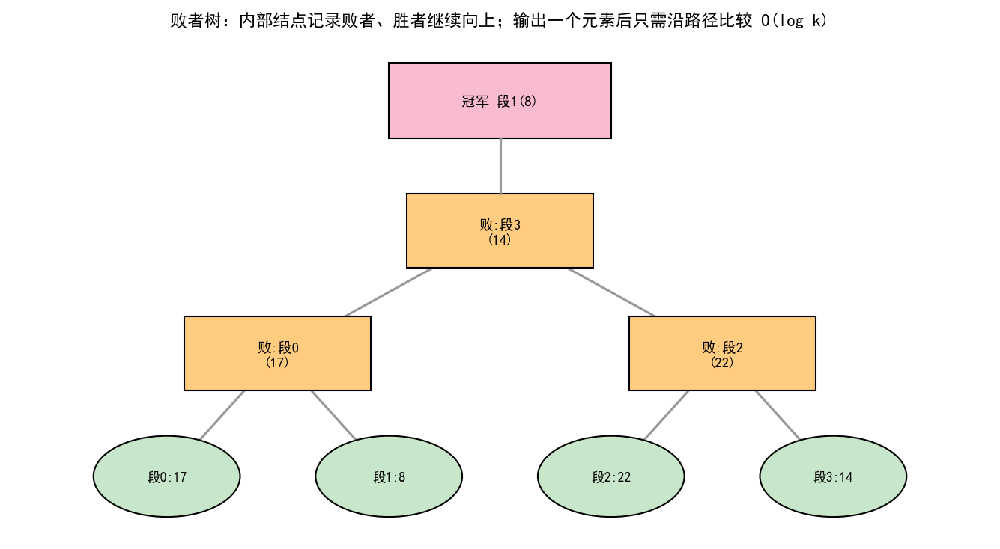

<i>图 8-11 败者树</i>

k 个归并段构造败者树需要比较 k-1 次；输出冠军元素后，从该归并段取新元素放到对应叶子，只需沿叶子到根的路径、经过非叶子结点的层数进行比较，即 O(log k) 次，不必重建整棵树

置换-选择排序：用于减少初始归并段的个数，可使生成的归并段长度大于内存工作区的长度；在工作区中不断选出比当前归并段末尾大的最小元素加入归并段，当新加入工作区的元素都比段尾小时，该归并段截止，再开始下一段

最佳归并树：各归并段所含块数不同，磁盘读写每一块各需要一次，把归并段作为叶子、归并段的块数作为结点权重，构造使带权路径长度最短的归并树；二路归并的最优情况就是构造 Huffman 树，多路归并构造类似的 m 叉 Huffman 树

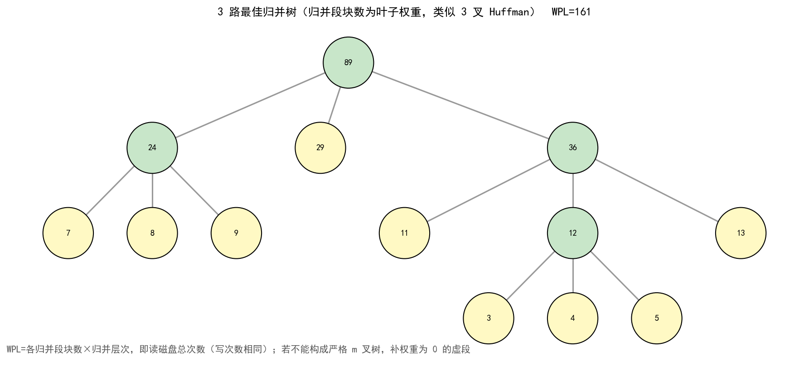

<i>图 8-12 最佳归并树</i>

最佳归并树的带权路径长度 WPL 即读磁盘的次数（写磁盘次数相同）；m 路最佳归并树一定是严格 m 叉树，只存在度为 m 与度为 0 的结点，若归并段数无法构成严格 m 叉树，就添加一些权重为 0 的虚拟结点（虚段）再构造

> **⚠️ 【易错辨析】外部排序的主要开销与趟数**  
> 外部排序最费时的是内外存之间的数据读写，减少读写次数的关键是减少归并趟数；m 个初始段做 k 路归并，趟数为 ⌈logₖ m⌉，每趟对每个块读一次、写一次  

> **⚠️ 【易错辨析】最佳归并树的虚段计算**  
> 严格 m 叉树满足 (m-1)nₘ = n₀-1，若 (n₀-1) 不能被 (m-1) 整除，就要补权重为 0 的虚段，使叶子总数满足该式；虚段权重为 0、不增加实际读写，WPL 才最小  

> **⭐ 【大题考点】外部排序综合计算**  
> 常要求计算归并趟数、磁盘读写总次数、判断需要几个缓冲区或虚段，并结合败者树、最佳归并树出题；关键是先确定初始归并段数 m 与归并路数 k，再算趟数 ⌈logₖ m⌉ 与读写次数  

## 8.8 排序算法总结与对比

`🔴高频`

<i>表 8-1 各种内部排序算法的性能对比</i>

| 排序算法 | 最好时间 | 平均时间 | 最坏时间 | 空间复杂度 | 稳定性 |
| --- | --- | --- | --- | --- | --- |
| 直接插入排序 | O(n) | O(n²) | O(n²) | O(1) | 稳定 |
| 折半插入排序 | O(n) | O(n²) | O(n²) | O(1) | 稳定 |
| 希尔排序 | — | 约 O(n¹·³) | — | O(1) | 不稳定 |
| 冒泡排序 | O(n) | O(n²) | O(n²) | O(1) | 稳定 |
| 快速排序 | O(n log n) | O(n log n) | O(n²) | O(log n)~O(n) | 不稳定 |
| 简单选择排序 | O(n²) | O(n²) | O(n²) | O(1) | 不稳定 |
| 堆排序 | O(n log n) | O(n log n) | O(n log n) | O(1) | 不稳定 |
| 二路归并排序 | O(n log n) | O(n log n) | O(n log n) | O(n) | 稳定 |
| 基数排序 | O(d(n+r)) | O(d(n+r)) | O(d(n+r)) | O(r) | 稳定 |
| 计数排序 | O(n+k) | O(n+k) | O(n+k) | O(k) | 稳定 |

> **⚠️ 【易错辨析】不稳定排序的记忆**  
> 不稳定的内部排序主要有快速排序、希尔排序、简单选择排序、堆排序；其余直接插入、折半插入、冒泡、归并、基数、计数排序都稳定；平均时间为 O(n log n) 的比较类排序有快速排序、堆排序、归并排序  

> **⭐ 【大题考点】排序算法的选择**  
> 若 n 较小可用直接插入或简单选择；若关键字基本有序可用直接插入、冒泡；若要求稳定用归并；若 n 很大且关键字为整数、范围不大可用计数、基数；平均性能上快速排序通常最快，但最坏会退化，归并排序稳定且适合外部排序与链表  