# 408 计算机组成原理笔记

> 第一章 计算机系统概述 · 第二章 数据的表示和运算 · 第三章 存储系统

> ✍️ **写作声明**：本笔记知识点总结正文均为本人独立撰写，仅【易错辨析】【考点考频】【大题考点】【补充知识点】四类标注内容借助 AI 辅助分析生成。

---

## 📑 知识点目录

**[第一章 计算机组成原理概述](#第一章-计算机组成原理概述)**
- [1.冯·诺依曼机](#1冯诺依曼机)
- [2.计算机的功能部件](#2计算机的功能部件)
- [3.计算机软件](#3计算机软件)
- [4.计算机系统的工作原理](#4计算机系统的工作原理)
- [5.计算机的性能指标](#5计算机的性能指标)

**[第二章 数据的表示和运算](#第二章-数据的表示和运算)**
- [1.原码、补码、反码、移码](#1原码补码反码移码)
- [2.整型数据的类型转换](#2整型数据的类型转换)
- [3.运算方法和运算电路](#3运算方法和运算电路)
- [4.定点数的运算](#4定点数的运算)
- [5.加减运算电路](#5加减运算电路)
- [6.定点数的乘法运算](#6定点数的乘法运算)
- [7.定点数的除法运算](#7定点数的除法运算)
- [7.浮点数的表示与运算](#7浮点数的表示与运算)
- [8.真值用浮点数精确表示](#8真值用浮点数精确表示)
- [9.数据的存储和排列](#9数据的存储和排列)

**[第三章 存储系统](#第三章-存储系统)**
- [1.存储器的类别](#1存储器的类别)
- [2.主存储器的组成和基本操作](#2主存储器的组成和基本操作)
- [3.存储器的而层次化结构](#3存储器的而层次化结构)
- [4.存储器的主要性能目标](#4存储器的主要性能目标)
- [5.半导体随机存取存储器](#5半导体随机存取存储器)
- [6.非易失性存储器](#6非易失性存储器)
- [7.多模块存储器](#7多模块存储器)
- [8.不同类型的存储器及特点](#8不同类型的存储器及特点)
- [9.主存容量的扩展](#9主存容量的扩展)
- [10.磁盘存储器](#10磁盘存储器)
- [11.固态磁盘](#11固态磁盘)
- [12.程序的局部性原理](#12程序的局部性原理)
- [13.Cache的基本工作原理](#13cache的基本工作原理)
- [14.Cache和主存的映射方式](#14cache和主存的映射方式)
- [15.Cache中的主存块替换算法](#15cache中的主存块替换算法)
- [16.Cache的一致性问题](#16cache的一致性问题)
- [17.Cache容量的计算](#17cache容量的计算)
- [18.Cache的应用](#18cache的应用)
- [19.虚拟存储器](#19虚拟存储器)
- [20.虚拟存储器与Cache比较](#20虚拟存储器与cache比较)
- [21.Cache的性能影响因素](#21cache的性能影响因素)

---

> **📌 标注说明**  
> 【高频】历年选择题/大题反复考查，必须熟练掌握  
> 【中频】有一定考查频率，理解并记忆核心结论  
> 【低频】偶尔考查或仅考概念，留印象即可  
> 【大题考点】曾在综合应用题中出现，需掌握计算与分析过程  
> 【易错辨析】易混淆概念或常见陷阱  
> 【补充】原文遗漏或有误处，已补充/修正的内容  

# 第一章 计算机组成原理概述

### 1.冯·诺依曼机

首次提出**【存储程序】**的思想

①采用“存储程序”的工作方式：程序和初始数据预先存入主存，计算机启动后自动执行

②硬件系统：运算器、控制器、存储器、输入设备、输出设备

③指令和数据在存储器中以相同形式存放**【相同地位】**

④指令和数据均采用二进制编码表示

⑤指令由操作码+地址码组成

⑥**【主存为核心工作存储器】**，用于存放待执行的程序和数据

> **📌 【考点考频】**  
> 本章为基础概念，选择题几乎每年 1 题，集中在冯·诺依曼思想、五大部件、性能指标；很少单独出大题  

> **⚠️ 【易错辨析】**  
> “存储程序”是冯·诺依曼机的核心，指程序和数据预先存入主存、启动后自动执行，不是边算边存  
> 指令和数据以相同地位存于存储器，形式上都是二进制，靠执行时的语境区分，不能说二者分开存放  
> 早期冯·诺依曼机以运算器为核心，现代计算机以存储器为核心，注意题干问“传统”还是“现代”  

> **📝 【补充】**  
> 五大部件为运算器、控制器、存储器、输入设备、输出设备；运算器与控制器合称为 CPU（中央处理器）；ENIAC 尚未采用存储程序，EDVAC 才是典型的存储程序计算机  

### 2.计算机的功能部件

①中央处理器CPU

传统组成部分→**【运算器+控制器】**；现代组成部分→**【数据通路+控制单元】**

数据通路的核心包括：算术逻辑单元ALU和通用寄存器组

②存储器

内存：主存+高速缓存Cache；外存

③外部设备和设备控制器

外部设备$(I/O$设备$)$：由物理功能部件+设备控制器组成

设备控制器$(I/O$控制器$)$：网卡、显卡、接口

④总线

> **⚠️ 【易错辨析】**  
> 运算器含 ALU、累加器 ACC、通用寄存器组、程序状态字 PSW；控制器含程序计数器 PC、指令寄存器 IR、控制单元 CU  
> PC 属于控制器，其位数取决于存储器容量；IR 位数取决于指令字长，二者归属不要混淆  
> MAR、MDR 现代虽集成在 CPU 内，但逻辑上是存储器侧的接口部件  

> **📝 【补充】**  
> 数据通路指数据在各部件间流动的路径，含 ALU、寄存器、总线；主机 = CPU + 主存，外设含输入输出设备与外存  

### 3.计算机软件

系统软件：操作系统、数据库管理系统$DBMS$、语言处理程序、标准库程序等

**【软件和硬件的逻辑功能等价】**

计算机系统的层次结构

①算法和编程

编程语言可分为高级语言（独立于计算机底层硬件结构）和低级语言

机器语言（二进制代码语言）：计算机**【唯一能直接识别和执行】**的语言

汇编语言：不能被硬件执行，需要经过汇编程序的系统软件翻译转化成机器语言

高级语言：需要经过编译程序处理，先编译成汇编语言→在汇编生成机器语言；或直接编译为目标机器的机器语言

翻译程序

汇编程序→汇编语言翻译为机器语言

解释程序→**【逐条翻译并立即执行，不生成独立的目标程序、只转化为单条机器语言程序】**

编译程序→**【一次性翻译】**成汇编语言或者机器语言

②操作系统

③指令集体系结构$ISA$

计算机软件/硬件的关键接口，完整定义了软件可直接使用的硬件功能

包括指令格式、操作类型、寻址方式、以及可访问的寄存器等硬件资源

$ISA$构成了软件能感知到的计算机功能视图→**【软件可见部分】**

④微体系结构（微架构）

处理器内部的硬件组织方式，实现$ISA$定义的功能。核心设计包括数据通路来组织、控制单元实现、流水线级数、缓存层次结构以及分支预测机制等

【相同的$ISA$课对应多种不同的微架构】

> **⚠️ 【易错辨析】**  
> 只有机器语言能被硬件直接识别执行，汇编语言和高级语言都必须经过翻译  
> 编译是一次性翻译并生成独立目标程序、可反复执行；解释是逐条翻译逐条执行、不生成独立目标程序  
> 汇编程序翻译汇编语言，编译程序翻译高级语言，两者处理对象不同  

> **📝 【补充】**  
> ISA（指令集体系结构）是软硬件的关键界面、属软件可见部分；微体系结构是 ISA 的具体硬件实现，同一 ISA 可对应多种微架构  

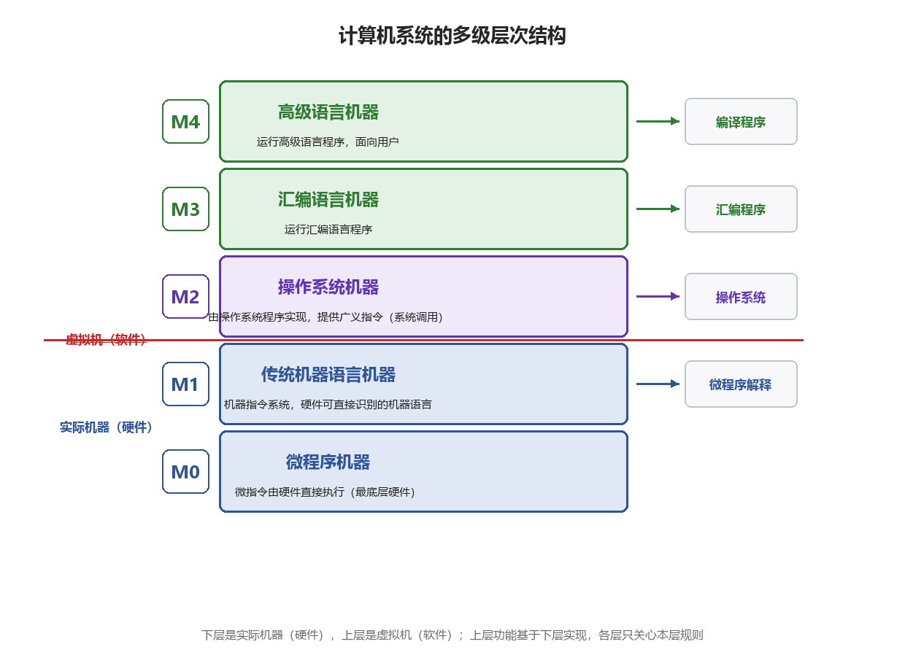

<i>图 1-1 计算机系统的多级层次结构</i>

### 4.计算机系统的工作原理

①“存储程序”工作方式

在程序执行前，将其包含的指令和数据预先加载到主存储器中，计算机自动逐条取出并执行

从主存中取指→对指令译码→取操作数→执行操作→将结果写回存储器

②从源程序到可执行文件

C语言必须经过编译与链接过程，转换为一系列低级机器指令，并按照特定格式封装成可执行目标文件，最终以而精致形式存储与磁盘中

预处理阶段：预处理器$cpp$处理源文件种以#开头的预处理指令，生成预处理后的C文件.$.i$

编译阶段：编译器$ccl$将$.i$翻译为汇编程序$.s$，其中每条语句以文本形式描述一条低级机器指令

汇编阶段：汇编器$as$将$.s$转换成机器语言指令，生成【可重定位目标文件$.o$】

链接阶段：链接器$ld$将$.o$与标准库$C$库种所需的函数惊醒链接，解析外部符号引用，最终生成完整的可执行文件，并保存到磁盘

> **⚠️ 【易错辨析】**  
> 一条指令的执行步骤为取指、译码、执行（含取操作数与写回）；取指后 PC 自动加 1，为下一条指令做准备  

> **📝 【补充】**  
> 源程序到可执行文件依次经过预处理、编译、汇编、链接；预处理处理 # 指令，编译生成汇编，汇编生成可重定位目标文件，链接合并库并解析外部符号后生成可执行文件  

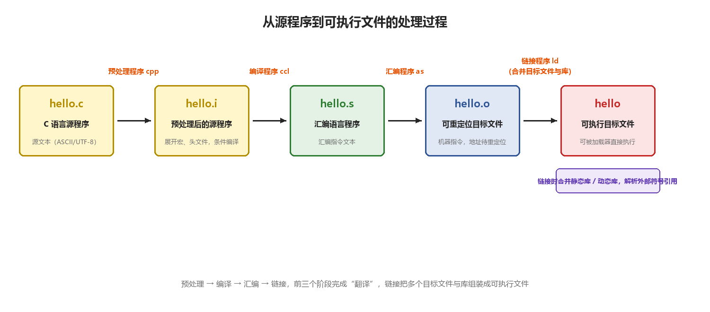

<i>图 1-2 源程序转换为可执行文件的过程</i>

### 5.计算机的性能指标

运算速度

①吞吐量和响应时间（包括CPU时间和等待时间）

②主频和CPU时钟周期

CPU时钟周期：机器内部注释中脉冲宽度，CPU的最小时间单位

时钟周期通常以相邻状态单元间组合逻辑电路的**【最大延迟时间】**为基准确定；在流水线结构中，则以**【指令流水线的每个流水段的最大延迟时间】**为准

主频（CPU时钟频率）：时钟周期的倒数，表示**【每秒包含的时钟周期数】**

③$CPI(Cycles Per Instruction)$：执行一条指令所需的时钟周期数

$IPS(Instructions Per Second)$：每秒执行多少条指令

$MIPS\left( Million Instructions Per Second \right)$：用于不同机器间的性能比较存在明显缺陷

④CPU执行时间（运行一个程序所花费的时间）

【CPU的性能取决于：指令条数、$CPI$、主频】

⑤$FLOPS(Floating-point Operations Per Second)$：每秒执行的浮点运算次数

> **⭐ 【大题考点】**  
> 性能计算是本章唯一常出的计算题，需掌握：CPU 执行时间 = 指令条数 × CPI × 时钟周期 = 指令条数 × CPI / 主频，主频 = 1 / 时钟周期  

> **⚠️ 【易错辨析】**  
> CPI 是执行一条指令所需的平均时钟周期数；MIPS = 主频 /(CPI × 10⁶)，用 MIPS 比较不同指令集存在明显缺陷  
> CPU 时间只计 CPU 真正运行的时间，不含等待 I/O 的时间；MFLOPS 衡量浮点运算能力  

> **📝 【补充】**  
> CPU 性能取决于指令条数、CPI、时钟周期三要素，分别与 ISA 及编译、CPU 组织、硬件工艺有关，三者相互制约  

# 第二章 数据的表示和运算

### 1.原码、补码、反码、移码

①原码表示法：最高为表示数的符号，零的表示不唯一

②补码表示法：计算机以补码的形式存储信息，**【无符号数只是在解释的时候有区别】**

补码表示法的加法和减法运算可通过加法器统一实现

$正数的补码=原码，负数的补码=按位取反+1$零的补码唯一

补码的运算：${\left[ A \right]}_{补}-{\left[ B \right]}_{补}={\left[ A \right]}_{补}+M-{\left[ B \right]}_{补}={\left[ A \right]}_{补}+{\left[ -B \right]}_{补} , M-{\left[ B \right]}_{补}={\left[ -B \right]}_{补}$

变形补码（双符号位补码表示）：00表示正数，11表示负数，左符号位为真正的符号位，右符号位用于一处判断

【模4补码$\ne $双符号位，模$n$补码只有一个符号位，而仅在$ALU$运算时，会将符号位复制到$ALU$的双符号位中】

③反码表示法：真值转换为补码的中间表示形式，零的表示不唯一、**【反码数值越大真值越大】**

④移码表示法：**【表示浮点数的解码，且用于表示整数】**。针织加上一个固定的偏置值实现整体右移${\left[ x \right]}_{移}=x+{2}^{n}$

零表示唯一、相同字长下与补码仅符号位不同、移码全0对应真值的最小值为$-{2}^{n}$、移码全1对应真值的最大值${2}^{n}-1$、**【移码保持真值的大小顺序，移码越大真值越大】**

> **📌 【考点考频】**  
> 本章是组成原理的重中之重，选择题与大题都高频，补码移码、IEEE754、定点乘除几乎年年出现  

> **⚠️ 【易错辨析】**  
> 原码与反码的 0 不唯一，补码与移码的 0 唯一；n+1 位补码范围为 −2ⁿ ~ 2ⁿ−1，比原码多表示一个最小负数 −2ⁿ  
> 正数的原码、反码、补码相同；移码只用于表示浮点数阶码，保持真值大小顺序，且与补码仅符号位相反  

> **📝 【补充】**  
> 移码 = 真值 + 偏置值；变形补码（双符号位）中 00 表正、11 表负，01 为正溢、10 为负溢，左符号位为真符号  

### 2.整型数据的类型转换

位截断：丢弃高位保留低位

位扩展：零扩展→无符号整数；符号扩展→有符号整数

> **⚠️ 【易错辨析】**  
> 长数转短数（截断）丢弃高位，可能溢出；短数转长数（扩展）时无符号零扩展、有符号符号扩展，值不变  
> 有符号数与无符号数互转时二进制位不变、只是解释方式改变，数值可能变化；无符号数没有符号位  

### 3.运算方法和运算电路

运算器：由算术逻辑单元$ALU$、移位器、状态寄存器、通用寄存器组等组成

基本功能包括：四则运算、逻辑运算、移位、求补等，核心为**【加法器】**

一位全加器$FA$：三个输入→两个加数和一个来自低位的进位；两个输出→本位和、向高位的进位；**【缩短进位传递路径】**是提升性能的关键

串行进位加法器：由多个全加器级联构成

并行进位加法器（先行进位加法器）：$n$个一位全加器被连接至一个$n$位【先行进位逻辑部件$CLA$不见】

带标志加法器

溢出标志$OF$→$OF={C}_{n}\oplus {C}_{n-1}$**【有符号加减的溢出判断】**

符号标志$SF$→$SF=$结果的最高有效位

零标志$ZF$

进位/结尾标志$CF$→**【无符号加减的溢出判断】**

> **⚠️ 【易错辨析】**  
> 全加器有三个输入（两个加数与低位进位）、两个输出（本位和与向高位进位）  
> 串行进位延迟随位数线性增加，先行进位 CLA 提前生成各位进位、延迟小但电路复杂  
> 溢出标志 OF 用于有符号运算，进位/借位标志 CF 用于无符号运算，判断对象不同  

> **📝 【补充】**  
> 标志位含 ZF 零标志、SF 符号标志（结果最高位）、OF 溢出标志、CF 进位/借位标志  

### 4.定点数的运算

移位运算：逻辑移位**【无符号整数】**、算术移位**【有符号整数】**→移出的高位于原符号位不同**【左移后符号位改变】**，则说明溢出

【算数右移与$C$语言的除法直接截断小数部分得到结果可能不同】

加减运算（字长为$n+1$）$$${\left[ A+B \right]}_{补}={\left[ A \right]}_{补}+{\left[ B \right]}_{补}\left( mod {2}^{n+1} \right)$

${\left[ A-B \right]}_{补}={\left[ A \right]}_{补}+{\left[ -B \right]}_{补}\left( mod {2}^{n+1} \right)$减法时→被减数的补码于减数的负数补码进行相加

**【符号位与数值为一同运算，结果的符号位有运算自然得出】**

运算结果自动截断$n+1$位，高位进位被丢弃

溢出判别方法

①采用一位符号位：$V={A}_{s}{B}_{s}{S}_{s}+{A}_{s}{B}_{s}{S}_{s}$

②采用一位符号位+进位情况：$V={C}_{n}\oplus {C}_{n-1}$

③采用双符号位：$V={S}_{s1}\oplus {S}_{S2}$，01→正溢出，10→负溢出

> **⭐ 【大题考点】**  
> 溢出判断是高频小计算，三种方法都要会：单符号位比较、单符号位结合进位、双符号位判断  

> **⚠️ 【易错辨析】**  
> 逻辑移位用于无符号数、空位补 0；算术移位用于有符号数、空位按规则补符号位；左移可能溢出，右移损失精度  
> 只有有符号数才谈溢出，无符号数的越界表现为进位 CF  

> **📝 【补充】**  
> 加减统一为补码加法：A−B = [A]补 + [−B]补，符号位参与运算、高位进位自然丢弃；OF = 最高位进位 ⊕ 次高位进位  

### 5.加减运算电路

一套电路两种语义，减法时，【$Sub$控制信号作为最低位进位输入】

无符号数大小比较：零标志位$OF$及进/借位标志$CF$

有符号数大小比较：零标志位$OF$及符号标志$SF$及溢出标志$OF$

> **⚠️ 【易错辨析】**  
> 实现减法时把减数各位取反，并令最低位进位为 1，即得到 [−B]补  
> 无符号数大小比较看 ZF 与 CF，有符号数大小比较看 ZF、SF、OF  

### 6.定点数的乘法运算

**【符号位与数值为分别处理】**：乘积符号位→两个符号位进行异或；乘积的数值位→两个数值位的绝对值之积

硬件中的实现**【先运算后右移】**

$n$位乘法，需要用$2n$位暂存结果，最终保留低$n$位。若高位不全为0则说明溢出

①无符号整数的乘法**【存进位信息】**

初始化，控制逻辑计数器${C}_{n}=$位数→先运算→后右移→${C}_{n}--$

②有符号整数的乘法$Booth$**【无需存进位信息，但是乘数寄存器中有辅助位】**

初始化，辅助位置0，控制逻辑计数器${C}_{n}=$位数→先运算→右移→${C}_{n}—$

运算规则

乘数寄存器最低位$Y$和辅助位$P$相同时，+0

$Y$与$P$相异时，$Y\to 0$执行$P+{\left[ X \right]}_{补}$；$Y\to 1$执行$P-{\left[ X \right]}_{补}=P+{\left[ -X \right]}_{补}$

乘法的实现方式（$nbit$的无符号相乘）

①由$ALU$、移位器、寄存器、控制逻辑电路组成的乘法电路，需要$n$个时钟

②阵列乘法器（快速乘法器的一种）：一个时钟完成

③无乘法电路：使用代码的移位运算及加法运算实现→$bit=y\&1;x\ll =1$

> **⭐ 【大题考点】**  
> Booth（补码一位乘）是大题高频，需会逐步列部分积：初值为 0、设辅助位、按两位判断加减、再算术右移  

> **⚠️ 【易错辨析】**  
> 无符号乘法的符号位单独异或、数值用绝对值相乘，n 位乘 n 位得到 2n 位乘积  
> Booth 看乘数最低位与辅助位：00/11 加 0，01 加 [X]补，10 加 [−X]补，随后算术右移；无符号乘法需存进位，Booth 不存进位但有辅助位  

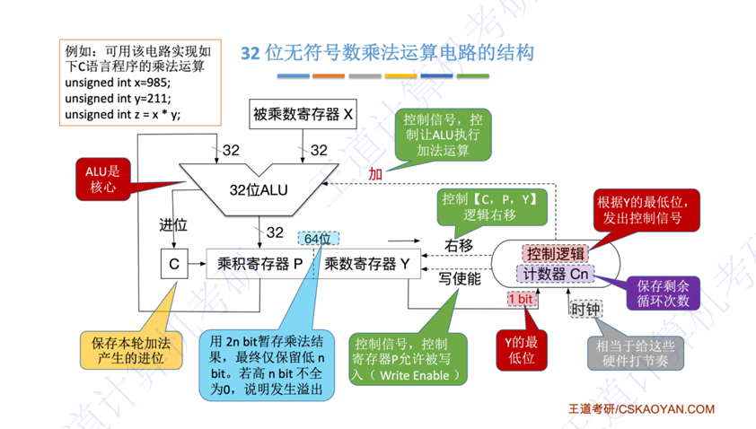

<i>图 2-1 32 位无符号数乘法运算器的逻辑结构</i>

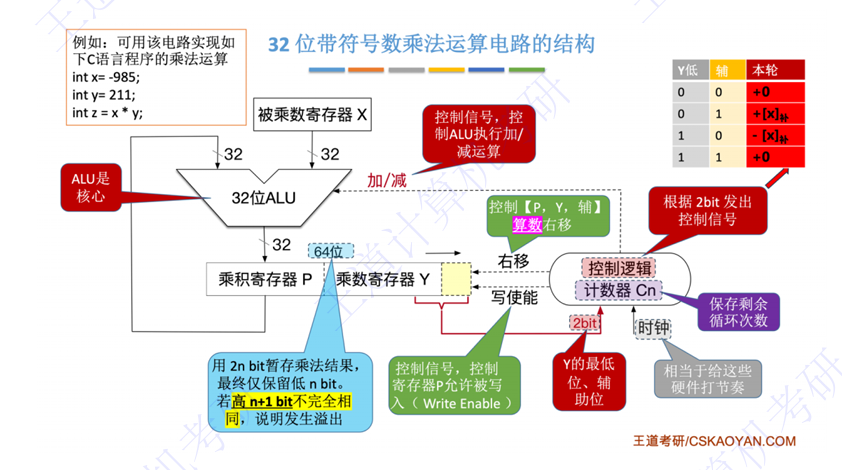

<i>图 2-2 32 位补码一位乘法（Booth）寄存器的逻辑结构</i>

### 7.定点数的除法运算

**【先左移再计算】**

无符号整数的除法

①初始化

**【被除数零扩展】**→余数寄存器$R$+余数/商寄存器$Q$、${C}_{n}=n$、除数寄存器$Y$

特殊情况：除数为0→直接停止→OS异常处理程序

&nbsp;&nbsp;&nbsp;&nbsp;&nbsp;&nbsp;&nbsp;&nbsp;&nbsp;&nbsp;|被除数|$<$|除数|，商=0，余数$=$被除数，不运算

②进行【$n+1$】轮处理：规则→$\left[ R \right]-\left[ Y \right]\ge 0$上商1，否则上0

第一轮特殊处理：直接上商，为1→溢出；为0→不溢出，【不保存商且${C}_{n}$不变】

第一轮的判断方法：

&nbsp;&nbsp;&nbsp;&nbsp;恢复余数法：$R-Y$→$R$，判断$R$是否为0；之后还原$R=0$，即执行$R+=Y$

&nbsp;&nbsp;&nbsp;&nbsp;不恢复余数法：第一轮不恢复余数，下一轮判断是否需要执行$R+=Y$

其余$n$轮循环处理：左移→最右用于上商；上商（进行加减运算）；${C}_{n}—$

③最终输出：$R$→余数、$Q$→商

有符号整数的除法

初始化和特殊情况与无符号整数除法基本一致

初始化：被除数符号扩展

特殊情况判断：对于单精度有符号位除法，当且仅当$min\div (-1)$才会溢出

进行【$n$轮处理】

上商规则

&nbsp;&nbsp;中间余数与减数符号位→相同执行减法、相异执行加法

&nbsp;&nbsp;$ALU$计算结果存入$R$，其符号位决定上商数→新旧相同则上1、相异则上0

&nbsp;&nbsp;**【上0时要恢复余数】**

结束状态：控制逻辑根据被除数和除数符号修改$Q$→异号取补码、同号直接输出

> **⭐ 【大题考点】**  
> 恢复余数法与不恢复余数法（加减交替法）是大题考点，需逐步列出余数与上商  

> **⚠️ 【易错辨析】**  
> 除法先左移再判断，与乘法先运算后右移相反；够减上商 1，不够减上商 0  
> 恢复余数法在余数为负时加回除数恢复；不恢复余数法不立即恢复，下一步改为加除数  

> **📝 【补充】**  
> 除数为 0 属异常；|被除数| < |除数| 时商为 0、余数为被除数  

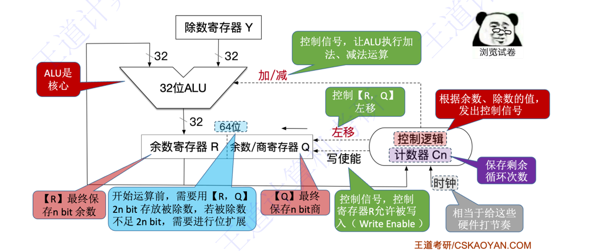

<i>图 2-3 32 位除法运算的逻辑结构</i>

### 7.浮点数的表示与运算

由符号、阶码**【偏置表示】**、尾数**【原码表示】**三个部分组成

$IEEE 754$标准的浮点数**【默认存储规格化小数，阶码不全相同】**

32位单精度格式：1+8+23

64位双精度格式：1+11+52

非规格化小数→阶码全0，$f\ne 0$、无穷→阶码全1，$f=0$、无定义→阶码全1，$f\ne 0$

规格化小数→阶码不全相同（小数点前的1省略）

阶码：用移码表示，规定偏置值→单精度127、双精度1023

将十进制真值转换成偏置值为$M$的移码步骤

①十进制数+偏置值$M$

②“无符号整数”转换成指定位数

浮点数的加减运算

①对阶：小阶码对大阶码→阶码小的，阶码进行加法，尾数相应右移**【尾数右移要保留3位小数】**

②加减运算

③规格化：右规阶码+1、左规阶码-1

④依据规则进行舍入

&nbsp;&nbsp;$GRS$，保护位$G$、舍入位$R$、粘滞位$S(后面的所有值，全0\to 0)$

&nbsp;&nbsp;就近舍入：$G==0$→直接舍去

&nbsp;&nbsp;&nbsp;&nbsp;&nbsp;&nbsp;&nbsp;&nbsp;&nbsp;&nbsp;&nbsp;&nbsp;$G==1\&\&R+S==1$→尾数$+1$

&nbsp;&nbsp;&nbsp;&nbsp;&nbsp;&nbsp;&nbsp;&nbsp;&nbsp;&nbsp;&nbsp;&nbsp;$G==1\&\&R\cdot S==0$→尾数为$1$则$+1$，否则舍弃

&nbsp;&nbsp;正向舍入、负向舍入、截断舍入

⑤溢出判断：阶码全1→无穷（上溢）、阶码全0→下溢（非规格化小数或机器零）

浮点数的加减运算的溢出判断

**【不以尾数溢出判断，取决于阶码是否上溢】**

上溢→**【先规格化，尾数置0】**、下溢→**【不规格化，阶码置0】**

下溢时，【阶码为00…001仍需要右规，但尾数$f$不变】，即下溢到非规格化区间，当$f$全0则为机器零

注意【$float\to int$直接截断小数部分，不会有舍入问题】

> **⭐ 【大题考点】**  
> IEEE754 表示与浮点加减是必考大题：十进制与浮点格式互转、对阶、规格化、舍入、溢出判断  

> **⚠️ 【易错辨析】**  
> 单精度为 1+8+23、双精度为 1+11+52；阶码用移码（偏置 127/1023），尾数用原码且隐含前导 1  
> 对阶时小阶向大阶看齐、尾数右移；浮点是否溢出看阶码而非尾数，阶码上溢为无穷、下溢为非规格化或机器零  
> 阶码全 0 表示非规格化数或零，阶码全 1 表示无穷或 NaN  

> **📝 【补充】**  
> 舍入依据保护位 G、舍入位 R、粘滞位 S，就近偶舍入看 GRS；左规阶码减 1 可多次，右规阶码加 1 通常一次  

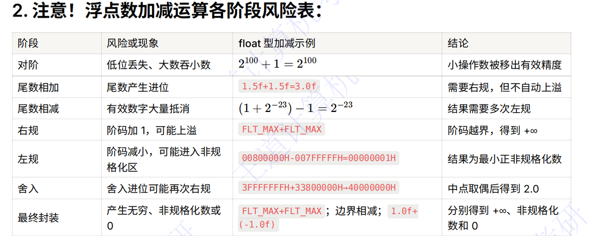

<i>图 2-4 浮点数加减运算各步骤及风险点</i>

### 8.真值用浮点数精确表示

**【数值→分数的形式】**，分母能被${2}^{n}$表示，则二进制小数能有限结束，除此之外还要判断能否用对应尾数位数表示

> **⚠️ 【易错辨析】**  
> 十进制小数化简后分母只含因子 2 且位数足够时，才能用二进制精确表示，如 0.1 无法精确表示  

### 9.数据的存储和排列

大端存储方式：便于人类阅读，高位字节→低地址

小端存储方式：便于机器阅读，低位字节→低地址**【机器从低地址向高地址处理】**

边界对齐存储方式：一个字/半字只需要访存1次；要求数据的存储地址必须是对齐值得整数倍

非边界对齐存储方式：一个字或半个字需要访存2次

> **⚠️ 【易错辨析】**  
> 大端方式把高位字节放低地址，小端方式把低位字节放低地址（x86 常用小端）  
> 边界对齐时数据地址是其长度的整数倍、一次访存可取；未对齐可能需要两次访存  

> **📝 【补充】**  
> 边界对齐以少量填充空间换取访存次数的减少  

# 第三章 存储系统

### 1.存储器的类别

按存储元件分类：半导体器件→DRAM、SRAM、此表面存储器、光存储器

按存取方式分类

①随机存取存储器RAM：主存或高速缓存

②顺序存取存储器：磁带

③直接存取存储器：兼具随机存取、顺序存取的特性→传统机械磁盘

④相联存储器：**【按内容进行存取】**，不是根据地址进行存取→快表TLB、路由表等小容量高速查找器件

按信息的可保存性：易失性存储器RAM、非易失性存储器ROM

若数据读出破坏存储单元信息→破坏性读出

若数据读出不破坏存储单元信息→非破坏性读出

> **📌 【考点考频】**  
> 本章与第二章并列最重要，Cache 映射/替换/写策略与计算、主存扩展、DRAM 刷新是选择与大题的高频点  

> **⚠️ 【易错辨析】**  
> RAM 为随机存取、SAM 顺序存取（磁带）、DAM 直接存取（磁盘先寻道后顺序）；相联存储器按内容访问，如 TLB  
> SRAM 不需刷新、用作 Cache；DRAM 需刷新、用作主存；RAM 易失，ROM、Flash、磁盘、光盘非易失  

### 2.主存储器的组成和基本操作

$MDR$的位数$=$数据线宽度、$MAR$位数$=$地址线得到位数

> **⚠️ 【易错辨析】**  
> MAR 位数决定可寻址单元数，MDR 位数等于存储字长；总容量 = 2^(MAR 位数) × MDR 位数  

> **📝 【补充】**  
> MAR、MDR 现代集成在 CPU 内，但属于存储器接口  

### 3.存储器的而层次化结构

关键层级：$Cache-$主存层→缓解CPU与主存速度不匹配问题、主存$-$辅存层→解决存储容量不足问题

上一层存储器作为下一层的高速缓存。当CPU访问数据按照$Cache$→主存→辅存的顺序主机查找

> **⚠️ 【易错辨析】**  
> Cache—主存层解决速度问题、由硬件管理且对程序员透明；主存—辅存层解决容量问题、由硬件与操作系统共同管理  
> 层次越靠上速度越快、容量越小、每位价格越高，反之亦然  

> **📝 【补充】**  
> 层次结构以程序局部性原理为基础，目标是速度接近最快层、容量接近最大层、价格接近最便宜层  

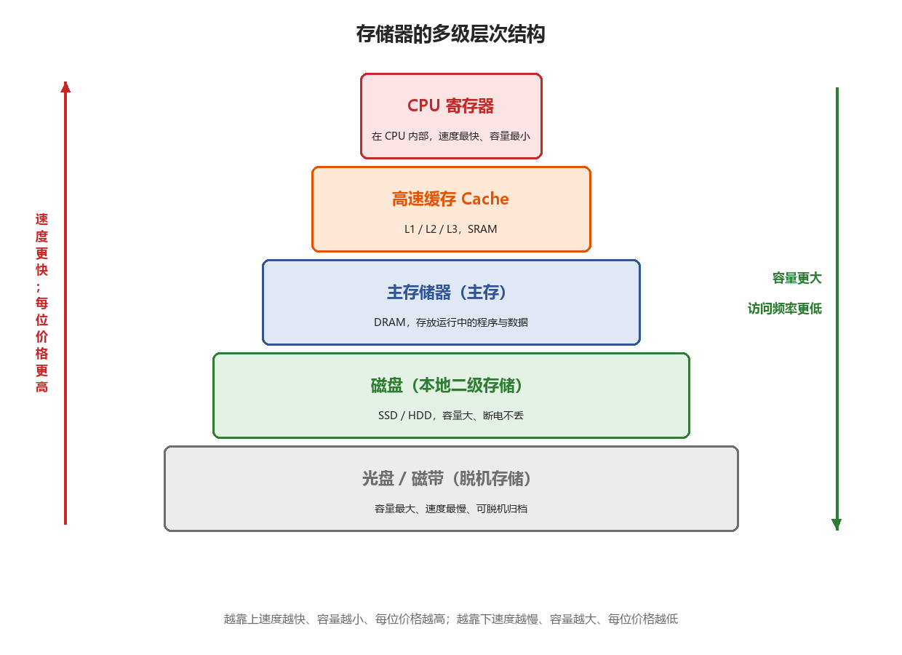

<i>图 3-1 存储器的多级层次结构</i>

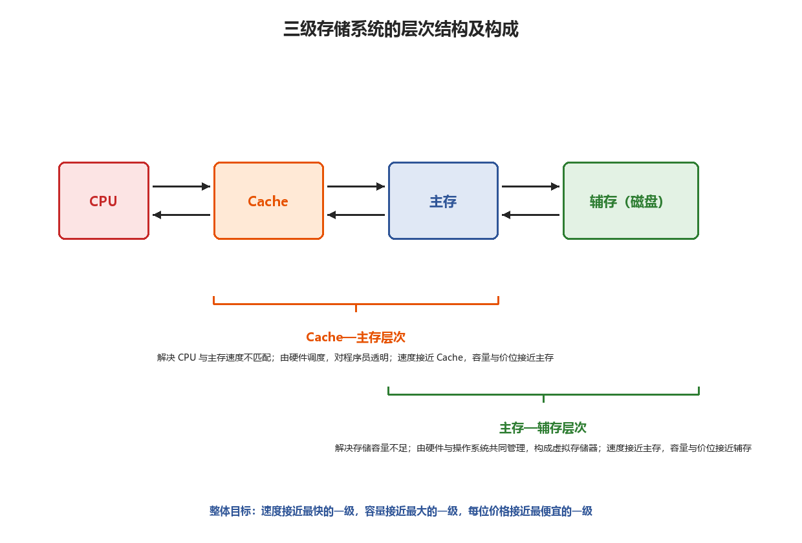

<i>图 3-2 三级存储系统的层次结构及构成</i>

### 4.存储器的主要性能目标

存储周期：存储器进行连续两次独立的读/写操作所需要的最小时间间隔

【存取时间$\ne $存储周期，存贮周期$>$存取时间】，每次读/写操作后，存储器需要一定时间恢复内部状态。对于破坏性读出的存储器，读出后需要再生数据

存储器带宽：可被组织成多模块结构，多个模块并行工作进而提升总带宽

> **⚠️ 【易错辨析】**  
> 存取时间是一次读写所需时间，存取周期 = 存取时间 + 恢复时间，故存取周期大于存取时间  
> 带宽为单位时间内存取的数据量；破坏性读出的存储器读出后需再生，再生时间计入存取周期  

### 5.半导体随机存取存储器

分为SRAM（静态RAM）、DRAM（动态RAM）。贮存主要采用DRAM、$Cache$主要采用SRAM

SRAM：双稳态触发器（六晶体管MOS）、行列地址同时送，集成度低

DRAM：利用栅极电容上的电荷存储信息，集成度高

存储芯片的组成

①存储体（存储矩阵）：存储单元的集合，通过行选择线、列选择线共同选中目标单元

②地址译码器：单译码法→仅使用一个行译码器，同一行中所有存储单元的字线相连，构成一个字；双译码法→通过行与列的交叉点唯一确定一个存储单元

③$I/O$电路：控制被选中存储单元的读/写，具有放大信号的作用

④片选控制线：单个存储芯片容量有限，采用多个芯片组合拓展。

⑤读/写控制线

DRAM芯片的技术

①地址引脚复用技术：分时复用传送行地址和列地址。芯片内部采用三维结构

②刷新机制与阵列设计优化

芯片内部集成一个刷新计数器、**【刷新按行刷新】**→行数越少刷新开销月底

DRAM数据只能维持2s，刷新一次占用一个读/写周期，**【刷新发生在译码阶段】**

刷新方式：分散刷新→每存取一次刷新一次**【改变存取周期】**

&nbsp;&nbsp;&nbsp;&nbsp;&nbsp;&nbsp;&nbsp;&nbsp;&nbsp;&nbsp;集中刷新→有一段专门刷新的**【死区】**

&nbsp;&nbsp;&nbsp;&nbsp;&nbsp;&nbsp;&nbsp;&nbsp;&nbsp;&nbsp;异步刷新→2ms内每行刷新一次→**【死时间】**

③缓存机制与突发传输：内部设有一个行缓冲器**【由SRAM实现】**，用于缓存被选中行中所有列的数据，其容量等于一行中所有存储单元的数据总量，即【容量$=$列数$\times $每个存储单元的位数】

同步DRAM（SDRAM）：读写操作与系统时钟同步。连续访问**【同一行/页】**的数据可以实现突发传输，显著减少甚至避免插入等待状态。

异步DRAM：CPU发出地址和控制信号后，**【必须等待一段不确定的延迟时间】**才能获得数据或完成写入，在此期间CPU不断轮询存储器的状态信号

> **⭐ 【大题考点】**  
> DRAM 刷新计算（刷新周期、死区、每行刷新间隔）可出小计算题  

> **⚠️ 【易错辨析】**  
> SRAM 靠双稳态触发器、不需刷新、集成度低；DRAM 靠电容存储、需刷新、集成度高  
> DRAM 地址引脚复用，行、列地址分两次传送；刷新按行进行，与个别单元访问无关  
> 三种刷新方式中，集中刷新有死区，分散刷新拉长周期、无明显死区，异步刷新最常用、死区短  

> **📝 【补充】**  
> SDRAM 与系统时钟同步、支持突发传输，内部行缓冲由 SRAM 实现、缓存一整行数据  

### 6.非易失性存储器

ROM属于非易失性存储器，按照制造工艺和可编程性可分为

①掩模式ROM（MROM）②一次可编程ROM（PROM）③可擦除可编程ROM（EPROM）

EPROM：紫外线擦除，只能擦除整片芯片

EEROM：电擦除，每次擦除一行

Flash存储器（闪存）：早期BIOS固化在MROM或EPROM中无法更新，现在BIOS在Flash存储器中

支持电擦除和在线重写、读取速度接近RAM、写入速度较慢

固态硬盘SSD：基于闪存构建的存储设备，由控制单元存储单元（闪存阵列）组成

> **⚠️ 【易错辨析】**  
> MROM 为掩模式，PROM 一次可编程，EPROM 靠紫外线整片擦除，EEPROM 电擦除可按字节，Flash 按块电擦除  

> **📝 【补充】**  
> BIOS 现存放于 Flash（早期在 MROM/EPROM），固态硬盘 SSD 基于闪存构建  

### 7.多模块存储器

**【同一个存储体的读写必须间隔一个存取周期】**

分为连续编制和交叉编制两种结构

①连续编制：模块号+地址→即一个存储体内的地址是连续的

存取方式是连续的、本质上还是**【顺序存储器】**

②交叉编制（低位交叉编制）：地址+模块号→即一个存储体内的地址是不连续的，程序或数据块在物理上是**【交叉存放的】**

可采用轮流启动、同时启动两种方式

轮流启动：流水线方式

同时启动：所有存储块一次并行读/写的位数=存储器数据总线宽度，多个存储体并行读取

> **⭐ 【大题考点】**  
> 低位交叉轮流启动的时间与带宽计算是高频点：连续读取 m 个字的时间 = T + (m−1)τ，其中 τ = T/m  

> **⚠️ 【易错辨析】**  
> 连续编址（高位交叉）体号在高位、相邻地址同体，主要用于扩容、难以并行提速  
> 交叉编址（低位交叉）体号在低位、相邻地址分布在不同体，可流水并行、提高带宽  
> 同一个存储体的两次访问必须间隔一个存取周期 T  

> **📝 【补充】**  
> 同时启动时 m 个体一次并行读出 m 个字（受总线宽度限制），轮流启动以流水线方式工作  

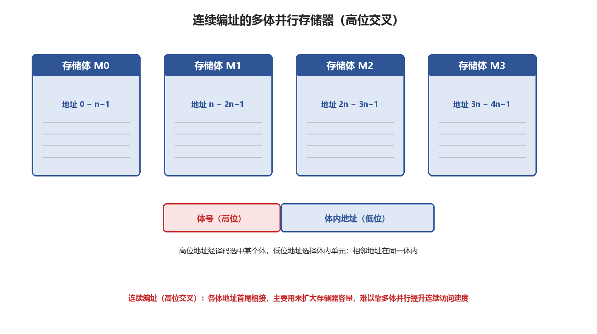

<i>图 3-3 连续编址的多体并行存储器</i>

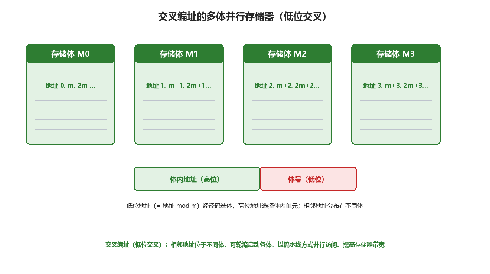

<i>图 3-4 交叉编址的多体并行存储器</i>

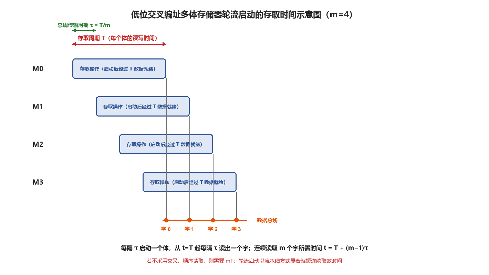

<i>图 3-5 低位交叉轮流启动的存取时间示意图</i>

### 8.不同类型的存储器及特点

单体多字存储器：可能用到多个缓冲寄存器

多端口存储器（显卡、显存、多设备）：同一个存储体**【使用多套读写电路】**、扩容难、并行访问、类似生产者-消费者模式、随机访问无冲突

多体低位交叉存储器：连续地址访问可采用流水线访问、**【随机访问性能差】**、**【随机访问冲突：同一个存储体的读取必须间隔一个存取周期】**、无法支持独立端口**【所有访问共享一套总线】**

> **⚠️ 【易错辨析】**  
> 单体多字存储器按一个地址同时读出多个字，多端口存储器配备多套读写电路、可被多设备访问但扩容困难  
> 低位交叉存储器随机访问性能较差、可能访问同体，且所有访问共享同一套总线  

### 9.主存容量的扩展

位扩展：**【增加存储字的长度】**→并联多个芯片

连接方式：一个地址总线=一个字

字扩展：**【增加存储单元数量（扩大地址空间）】**→串联多个芯片，使用译码器选择芯片，同一时刻只能选中一个芯片

字位同时扩展：同一时刻选择一组芯片

> **⭐ 【大题考点】**  
> 存储器与 CPU 的连接、地址空间分配、片选译码、所需芯片数计算是大题高频点  

> **⚠️ 【易错辨析】**  
> 位扩展字数不变、只增字长，地址线与 CS、WE 并联，数据线分别接各位  
> 字扩展字长不变、只增字数，地址低位与数据线并联，高位经译码器选片、同一时刻只选一片  

> **📝 【补充】**  
> 芯片数 = 总容量 / 单片容量；字位同时扩展时先按位扩展成组、再在组间按字扩展译码  

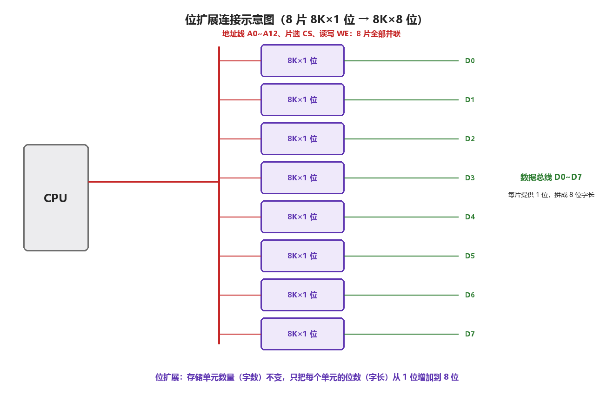

<i>图 3-6 位扩展连接示意图</i>

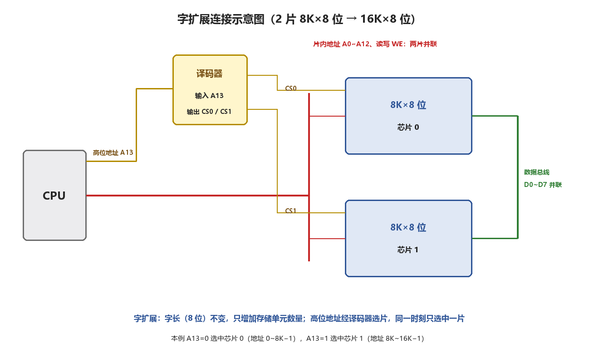

<i>图 3-7 字扩展连接示意图</i>

### 10.磁盘存储器

磁盘存储器的组成

由磁盘驱动器、磁盘控制器、盘片组成

磁盘驱动器：驱动磁盘旋转并通过磁头在盘面上进行读写

磁盘控制器：磁盘驱动器与主机之间的接口，负责接收并解析CPU命令，向磁盘驱动器发送控制信号并监控运行状态

磁盘高速缓存（Disk Cache）：在内存中靠皮有一部分空间暂存待写入磁盘的数据

磁盘以**【“簇”】**为单位进行写操作

磁盘记录原理：通过电磁实现数据的读/写操作

编码方式：将二进制数据序列转换为磁层中对应的磁化翻转状态序列

磁盘性能指标

①记录密度

②磁盘容量：非格式化容量、格式化容量→预留扇区间隙、同步字段、备用扇区等

③响应时间与存储时间

响应时间=排队延迟+控制器时间+寻道时间**【主要】**+旋转等待时间+数据传输时间

存取时间=寻道时间+旋转等待时间+数据传输时间

磁盘阵列

RAID独立冗余磁盘阵列：多个独立的物理磁盘组合成一个逻辑磁盘，数据在多个物理攀上交叉分割存储并并行访问

RAID0：无冗余、无校验

RAID1：镜像磁盘阵列**【牺牲一半空间，两个磁盘同步读和写】**

RAID2：海明码纠错

RAID3：位交叉奇偶校验

RAID4：块交叉奇偶校验

RAID5：无独立校验盘的分布式奇偶校验磁盘阵列

> **⭐ 【大题考点】**  
> 磁盘容量、平均存取时间、数据传输率的计算常出大题  

> **⚠️ 【易错辨析】**  
> 存取时间 = 寻道时间 + 旋转延迟 + 传输时间，平均旋转延迟为转半圈的时间；数据传输率 = 每磁道容量 / 转一周时间  
> 磁盘属于直接存取而非随机存取，以簇为写入单位；格式化容量小于非格式化容量  

> **📝 【补充】**  
> RAID 中 0 为无冗余条带、1 为镜像、2 用海明码、3 为位级校验、4 为块级校验、5 为分布式校验（较常用）  

### 11.固态磁盘

基于闪存技术的存储设备，**【读/写操作以页为单位，擦除操作以块为单位】**

随机写入速度慢→擦除耗时较长、**【修改一个已有数据的页，必须先复制到新的块中再写入】**

磨损均衡

①静态磨损均衡（高级）：定期扫描，将高磨损块中的有效数据迁移到低磨损块中，高磨损块以读为主

②动态磨损均衡：优先选择擦写次数较少的空闲块写入

> **⚠️ 【易错辨析】**  
> 固态硬盘读、写以页为单位，擦除以块为单位，不能原地改写、修改前需先擦除块，故随机写入较慢  

> **📝 【补充】**  
> 磨损均衡分为静态与动态，用于均匀各块擦写次数、延长使用寿命  

### 12.程序的局部性原理

时间局部性：当前访问的某条指令或数据，在不久的将来可能会被再次访问

空间局部性：当前访问的存储单元，其附近的存储单元在不久的将来可能被再次访问

> **⚠️ 【易错辨析】**  
> 时间局部性指同一单元不久后可能再次被访问（如循环、栈），空间局部性指相邻单元可能被访问（如顺序执行、数组）  

> **📝 【补充】**  
> 局部性原理是 Cache 与虚拟存储器层次能够成立的基础  

### 13.Cache的基本工作原理

Cache的访问过程**【Cache的缺页完全由硬件实现，无需操作系统干预】**

每次需要从主存取指令或读/写数据，先访问Cache→命中则直接读取、未命中（Cache缺失）→主存中命中，则调入Cache（Cache满→替换算法）、未命中（缺页，操作系统执行缺页操作）

> **⚠️ 【易错辨析】**  
> Cache 缺失的处理完全由硬件完成、无需操作系统介入；缺页（虚存）才由操作系统处理  
> 命中条件为有效位等于 1 且标记 Tag 相等  

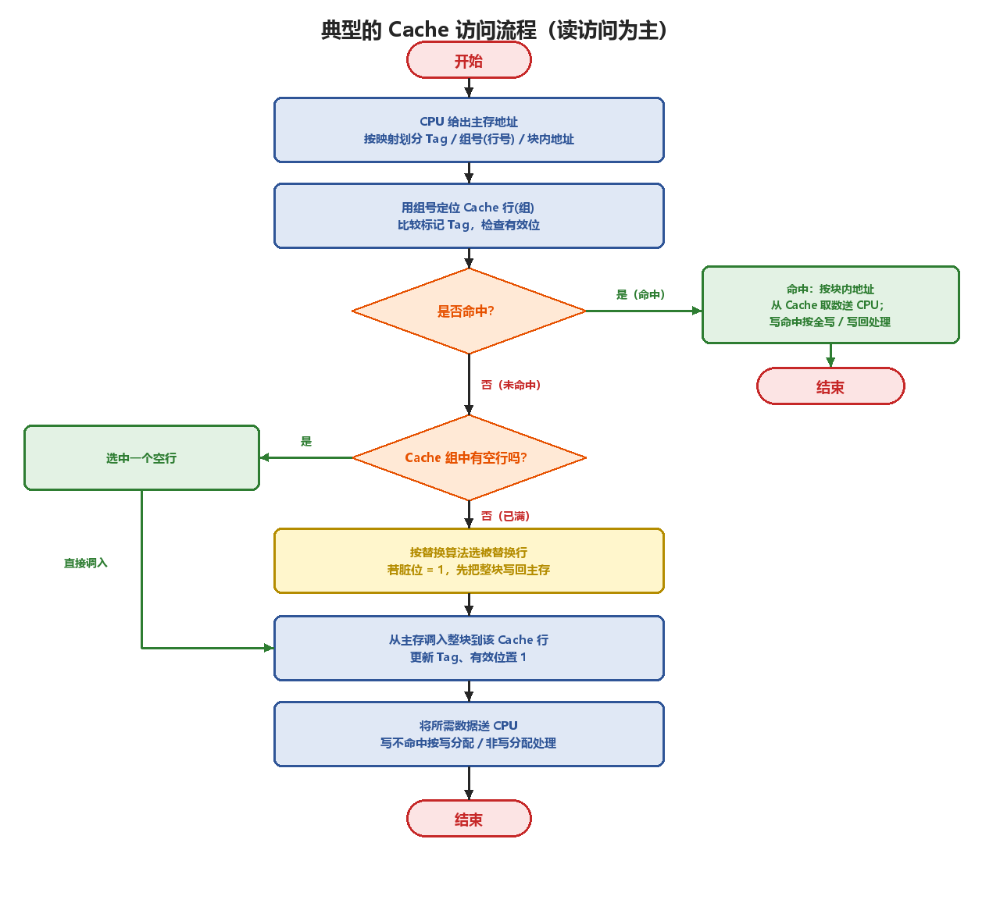

<i>图 3-8 典型的 Cache 访问流程</i>

### 14.Cache和主存的映射方式

Cache和主存有三种映射方式

Cache的地址结构

有效位+脏位+$(LRU$位$)({log}_{2}组内块数)$+标记位+$($Cache行号/Cache组号$)$+块内地址

①直接映射（类似于除留余数法）→块冲突概率最高、**【无需替换算法，直接替换】**

主存地址结构：标记+Cache行号+块内地址

**【通过比较主存的标记位与Cache中的标记位判断Cache是否命中】**

②全相联映射→主存中每一块可存放在Cache中的任意位置

主存地址结构：标记+块内地址

**【每次Cache命中的判断都要遍历Cache的所有行】**

查找过程是按内容访问的存取方式、因此属于相联存储器

③组相联映射

每组包括$r$行，称为$r$路组相联映射→$r$越大，块冲突概率越小

**【组间直接映射、组内全相联映射】**

主存地址结构：标记+组号+块内地址

> **⭐ 【大题考点】**  
> 三种映射的地址结构划分，以及 Tag、行号、组号、块内地址的位数计算是必考内容  

> **⚠️ 【易错辨析】**  
> 直接映射中主存块只能放入固定行、冲突率最高、无需替换算法；全相联可放任意位置、冲突最低但需比较全部行、成本高  
> 组相联为组间直接映射、组内全相联；直接映射地址为 Tag+行号+块内地址，全相联为 Tag+块内地址，组相联为 Tag+组号+块内地址  

### 15.Cache中的主存块替换算法

①随机算法$RAND$：随机替换

②先进先出算法$FIFO$

③最近最少使用$LRU$：基于局部性原理，优先替换最近最久未被访问的Cache行

每组Cache维护一组计数器【$LRU$替换位】，记录各Cache行的**【相对访问顺序】**

$LRU$计数器的值：记录最近访问的排名→最近访问的为第0名、替换$LRU$计数器值最大的Cache行，**【存在抖动现象】**

④最不经常使用$LFU$：替换一段时间内累计访问次数最少的Cache，替换时选择计数值最小的行，每次访问则计数器+1

> **⚠️ 【易错辨析】**  
> RAND 随机替换；FIFO 先进先出、不利用局部性且可能出现 Belady 异常  
> LRU 替换最近最久未访问的行、基于局部性、效果较好但需计数器或栈；LFU 替换累计访问次数最少的行  

> **📝 【补充】**  
> 直接映射位置唯一，不需要替换算法  

### 16.Cache的一致性问题

Cache写命中

①全写法（直写）：同时写入主存和Cache**【主存与Cache数据始终一致，无需写回】**

在主存和CPU之间通常设置一个**【写缓冲，可能饱和溢出】**

②写回法：只写入Cache，**【仅在该块被替换时写回主存，通过脏位判断被替换主存块是否需要写回】**

Cache写不命中

①写分配法：将数据写入主存，**【再将主存块调入Cache】**

②非写分配法：直接写入主存，不将数据调入Cache

> **⭐ 【大题考点】**  
> 写策略的组合及一致性判断常考：写回法常配合写分配，全写法常配合非写分配  

> **⚠️ 【易错辨析】**  
> 全写法（写直达）同时写 Cache 与主存、一致性好但速度慢、需写缓冲；写回法只写 Cache、置脏位、替换时才写回主存  
> 写分配在未命中时先把主存块调入 Cache 再写；非写分配直接写主存、不调入 Cache  

### 17.Cache容量的计算

Cache容量=（每行标记信息位数+每行数据位数）$\times $ Cache总行数

标记信息位=有效位+脏位+$(LRU$位$)$+标记位

> **⭐ 【大题考点】**  
> Cache 总容量（含标记与控制位）的计算常考  

> **⚠️ 【易错辨析】**  
> 数据容量 = 行数 × 每行数据位数；总容量 = 行数 ×（数据位 + 有效位 + 脏位 + Tag 位 + 替换位）  
> 注意题目问的是数据容量，还是包含标记信息的总容量  

### 18.Cache的应用

①分离Cache：将指令Cache和数据Cache分开→避免流水线执行时发生冲突

②同一Cache：在流水线执行时，取指部件和执行部件容易发生冲突

③多级Cache：写回+写分配法，距离CPU最近的Cache采用分离Cache

> **⚠️ 【易错辨析】**  
> 指令 Cache 与数据 Cache 分离可避免流水线冲突；多级 Cache 中 L1 常分离、L2 多统一  

### 19.虚拟存储器

页式虚拟存储器：页表，一个CPU维护一个页表基址寄存器

段式虚拟存储器：段表，一个CPU维护一个段表基址寄存器

段页式虚拟存储器：一个程序→一个段表，每一段→一个页表，一个CPU维护一个段表基址寄存器、**【没有页表基址寄存器】**

虚拟地址=段号+段内页号+页内地址

段表项：存储了段长、页表地址

TLB缺失、Cache缺失、Page缺失（主存缺失）

> **⚠️ 【易错辨析】**  
> 页式大小固定、有内部碎片无外部碎片；段式按逻辑划分、有外部碎片、便于共享与保护；段页式需多次查表  
> TLB 是页表的高速缓存（相联查找），TLB 命中可加速地址转换；一次访问可能出现 TLB 缺失、Cache 缺失、Page 缺失  

> **📝 【补充】**  
> 完整访问流程为：虚拟地址 → TLB（属于 MMU 的一部分）→ 页表 → 物理地址 → Cache → 主存；TLB 机构实现地址转换、得到物理地址，Cache 机构根据物理地址实现数据存取  

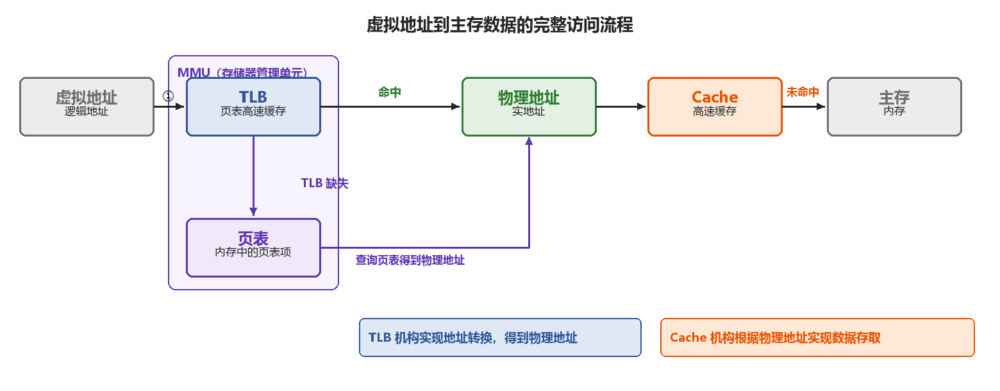

<i>图 3-9 虚拟地址到主存数据的完整访问流程</i>

### 20.虚拟存储器与Cache比较

Cache→解决CPU与主存之间速度不匹配的问题、由**【硬件独立实现】**

虚拟存储器→解决主存容量问题、由硬件+操作系统(主存缺页时)实现

> **⚠️ 【易错辨析】**  
> Cache 全由硬件实现、块小、解决速度问题；虚存由硬件与操作系统共同实现、页大、解决容量问题  
> Cache 缺失由硬件处理，缺页由操作系统（软件）处理  

### 21.Cache的性能影响因素

主要由命中率决定

①映射方式

②Cache容量：越大命中率越高

③块大小（Cache行大小）：块小难以利用局部性原理、**【块大会降低有效容量并增加缺失损失】**→块大小要适中

Cacche级数、指令/数据Cache分离、主存-总线-Cache-CPU的架构也会影响性能

> **⭐ 【大题考点】**  
> 平均访问时间 AMAT = 命中时间 + 缺失率 × 缺失代价，可出计算题  

> **⚠️ 【易错辨析】**  
> 块过小难以利用局部性，块过大降低有效容量、增加缺失代价，块大小要适中；容量增大命中率提高但成本与命中时间上升  

> **📝 【补充】**  
> 映射方式、Cache 容量、块大小、Cache 级数、指令数据分离等都会影响性能
