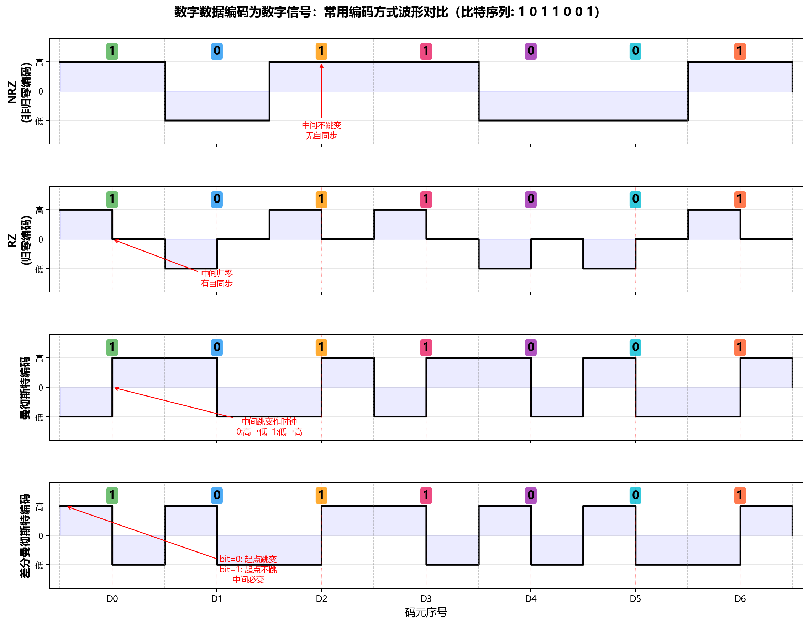
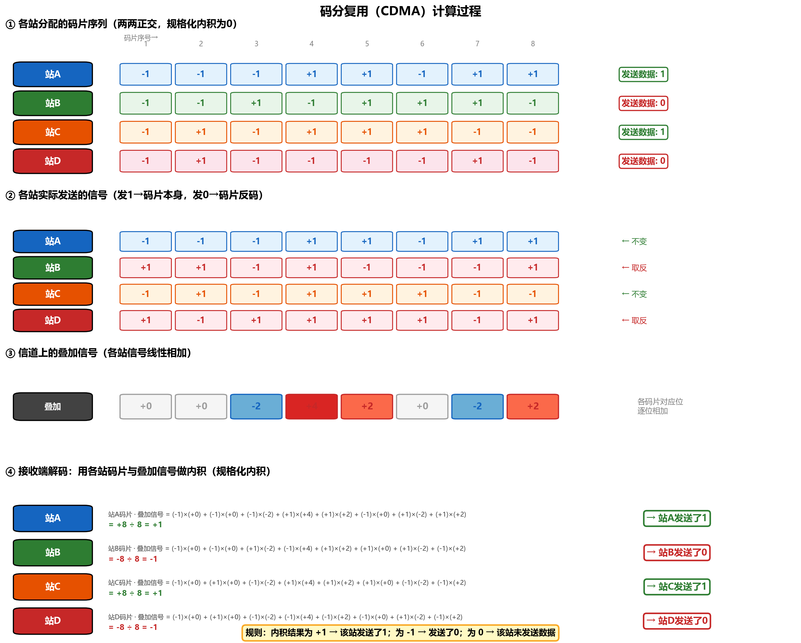
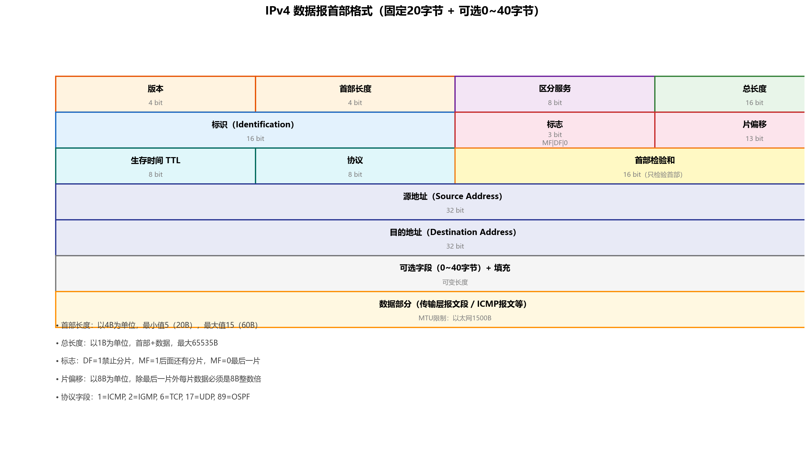
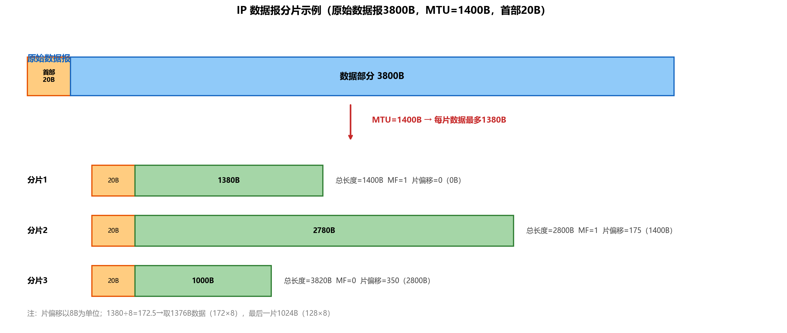
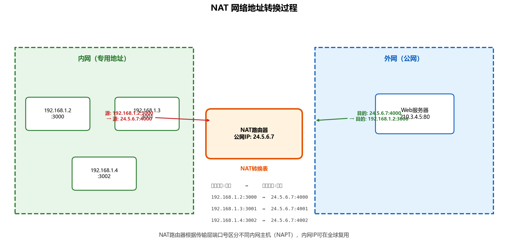
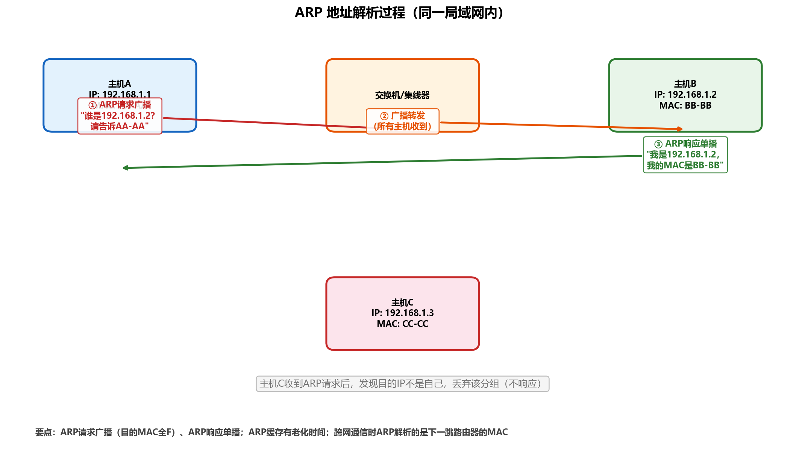
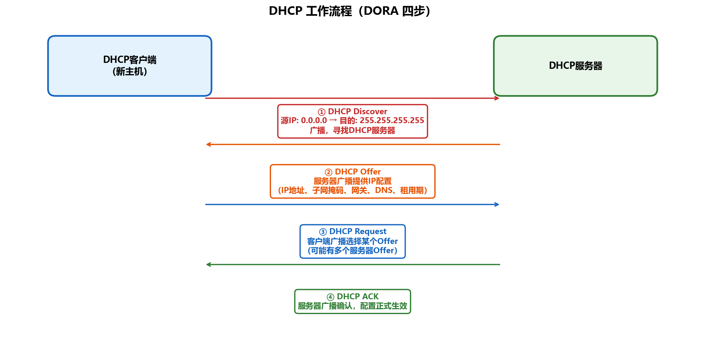
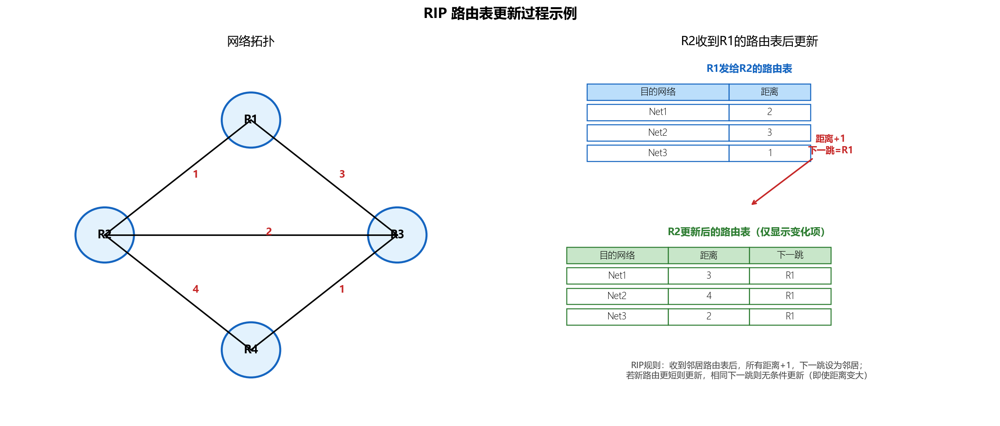
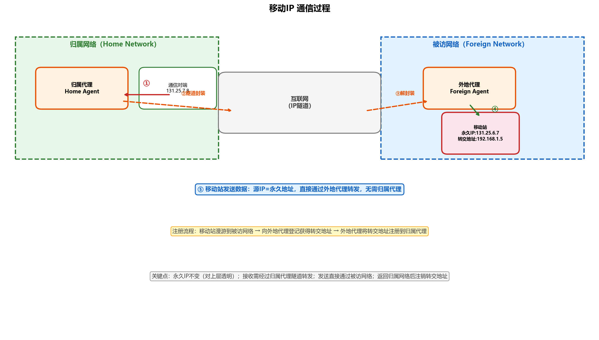
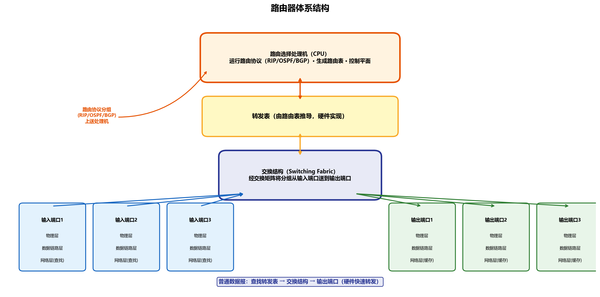

# 408 计算机网络笔记

> 第一章 ~ 第四章（体系结构 · 物理层 · 数据链路层 · 网络层）

> **📌 标注说明**  
> 🔴【高频】历年选择题/大题反复考查，必须熟练掌握  
> 🟡【中频】有一定考查频率，理解并记忆核心结论  
> 🟢【低频】偶尔考查或仅考概念，留印象即可  
> ⭐【大题考点】曾在综合应用题中出现，需掌握计算与分析过程  
> ⚠️【易错辨析】易混淆概念或常见陷阱  
> 📝【补充】原文遗漏或有误处，已补充/修正的内容  

---

## 📑 知识点目录

**[第一章 计算机网络体系结构](#第一章-计算机网络体系结构)**
- [网络、互连网、互联网](#1-网络互连网互联网互联网因特网-中频)
- [电路交换、报文交换、分组交换](#2-电路交换报文交换分组交换-高频-大题考点)
- [计算机网络的分类](#3-计算机网络的分类-低频)
- [性能指标](#4-计算机网络的性能指标-高频-大题考点)
- [分层结构](#5-计算机网络分层结构-中频)
- [OSI七层模型](#6-osi-开放系统互连参考模型7层-高频)
- [TCP/IP四层模型](#7-tcpip-模型4层-高频)
- [点到点与端到端](#8-点到点通信与端到端通信-中频)

**[第二章 物理层](#第二章-物理层)**
- [码元、波特率与速率](#1-码元波特率与速率-高频)
- [基带信号与宽带信号](#2-基带信号与宽带信号-低频)
- [奈奎斯特与香农定理](#3-信道极限容量奈奎斯特定理与香农定理-高频-大题考点)
- [编码与调制](#4-编码与调制-中频)
- [传输介质](#5-传输介质-低频)
- [物理层设备](#6-物理层设备-中频)
- [物理层四大特性](#7-物理层接口的四大特性-低频)

**[第三章 数据链路层](#第三章-数据链路层)**
- [数据链路层基本概念](#1-数据链路层的基本概念-低频)
- [组帧](#2-组帧-低频)
- [差错控制](#3-差错控制-中频)
- [检错编码与纠错编码](#4-检错编码与纠错编码-高频-大题考点)
- [流量控制与可靠传输](#5-流量控制与可靠传输机制-高频-大题考点)
- [信道划分介质访问控制](#6-介质访问控制mac信道划分介质访问控制-中频)
- [随机访问介质访问控制](#7-随机访问介质访问控制-高频-大题考点)
- [令牌传递协议](#8-令牌传递协议令牌环网-低频)
- [局域网基本概念](#9-局域网基本概念-低频)
- [以太网地址与帧格式](#10-以太网的地址与帧格式-中频)
- [无线局域网](#11-无线局域网-中频)
- [虚拟局域网VLAN](#12-虚拟局域网vlan-低频)
- [广域网与PPP协议](#13-广域网与ppp协议-中频)
- [以太网交换机](#14-以太网交换机二层交换机-高频-大题考点)

**[第四章 网络层](#第四章-网络层)**
- [网络层功能](#1-网络层的功能-中频)
- [路由器](#2-路由器网关-中频)
- [虚电路与数据报服务](#3-网络层提供的两种服务-中频)
- [SDN软件定义网络](#4-软件定义网络sdn-低频)
- [拥塞控制](#5-拥塞控制-低频)
- [IPv4](#6-ip协议与ipv4-高频-大题考点)
- [IPv6](#7-ipv6-低频)
- [CIDR与子网划分](#8-cidr无分类编址与子网划分-高频-大题考点)
- [NAT网络地址转换](#9-网络地址转换nat-中频-大题考点)
- [ARP地址解析](#10-地址解析协议arp-高频-大题考点)
- [DHCP动态主机配置](#11-动态主机配置协议dhcp-中频-大题考点)
- [ICMP网际控制报文](#12-网际控制报文协议icmp-中频)
- [路由算法与路由协议](#13-路由算法与路由协议-高频-大题考点)
- [IP多播](#14-ip多播-低频)
- [移动IP](#15-移动ip-低频)
- [路由器组成](#16-路由器的组成-中频)

---

# 第一章 计算机网络体系结构

## 1. 网络、互连网（互联网）、互联网（因特网） `🟡中频`

网络：将多台计算机连接在一起。
互连网：通用名词，多个计算机网络通过路由器连接而成的网络。
互联网（因特网）：专用名词，全球最大的、开放的特定计算机网络，必须采用TCP/IP协议族作为通信规则。

> **【易错辨析】"互连网"与"互联网" 互连网（internet，i小写）是泛指的"网络的网络"，由多个网络互连而成，任意协议均可； 互联网/因特网（Internet，I大写）是专用名词，特指全球最大的那个互连网，必须使用TCP/IP协议族。 题目中若出现"互联网"且指全球范围的那个网络，对应Internet；"互连网"对应internet。**  

## 2. 电路交换、报文交换、分组交换 `🔴高频 ⭐大题考点`

电路交换网络（传统电话网）：
分为建立连接、传输数据、释放连接三个阶段，通信双方有一条专用的物理通路。
报文交换网络：
报文由控制信息、数据信息封装而成，采用存储转发技术逐跳转发。
缓存开销大，需要交换节点配备大容量缓存；有错误时需要重新传输整个报文。
分组交换：
将报文分成若干等长的数据段，利用分组交换机（路由器）进行分组转发。
可实现流水线操作。

> **【补充】分组交换的时延公式 设分组长度为 L bit，链路带宽为 R b/s，分组数为 n，链路数（跳数）为 h， 每段链路传播时延为 d_prop，则分组交换的总时延近似为： T = (n + h - 1) × (L / R) + h × d_prop 其中 (n + h - 1) × (L/R) 是流水线传输的发送时延之和，h × d_prop 是总传播时延。 原文"总时延=（传播时延×2）+（n+1）×传输时延"仅适用于 h=2 段链路的特殊情形， 一般情况应使用上面的通用公式。**  

| 对比维度 | 电路交换 | 报文交换 | 分组交换 |
| --- | --- | --- | --- |
| 连接建立 | 需要 | 不需要 | 不需要 |
| 转发方式 | 独占通路 | 存储转发（整个报文） | 存储转发（分组） |
| 时延 | 建立时延大，传输时延小 | 报文长，转发时延大 | 分组短，可流水线，时延小 |
| 可靠性 | 高 | 较高（重传整个报文） | 高（重传单个分组） |
| 信道利用率 | 低（独占） | 较高 | 高 |
| 适用场景 | 实时语音/视频 | 早期电报 | 数据通信（互联网主流） |

> **【大题考点】交换方式时延计算 常考题型：给定报文长度、分组大小、链路带宽、链路数和传播时延， 比较电路交换与分组交换的总时延，或求分组交换的最少链路数/最优分组长度。 关键：电路交换总时延 = 建立时延 + 报文发送时延 + 传播时延（独占通路，报文一次发完）； 分组交换总时延 = (n+h-1)×(L/R) + h×d_prop（流水线效应）。**  

## 3. 计算机网络的分类 `🟢低频`

按覆盖范围：广域网（WAN，传统广域网采用交换技术）、城域网（MAN，采用以太网技术）、局域网（LAN，传统局域网采用广播技术）、个人区域网（WPAN，无线个人区域网）。
按传播方式：广播式网络（通过分组控制信息内的目的地址判断是否接收）、点对点网络。
按拓扑结构：总线形、星形、环形、网状（由众多路由器构成）。

## 4. 计算机网络的性能指标 `🔴高频 ⭐大题考点`

信道：某一方向的信息通道。通信线路：包含一条发送信道和一条接收信道。
速率（数据传输速率）：数据在数字信道上传送数据的速率，单位 b/s（bps）。
带宽：①允许通过的信号频率范围，单位 Hz；②数字信道所能支持的最高数据传输速率，单位 b/s。
吞吐量：单位时间内通过某个网络的实际数据量（真实可达到的数据传输能力），根据题目要求判断是否需要算多条信道。
时延的四个组成部分：
发送时延（传输时延）：节点将分组推入链路所需的时间 = 分组长度 / 链路带宽。
传播时延：在信道上传播一定距离所需的时间 = 信道长度 / 电磁波在信道上的传播速率。
处理时延：节点在存储转发时，处理数据所需要的时间。
排队时延：分组在路由器的输入/输出队列中等待处理或转发所需要的时间。

> **【补充】原文笔误修正 原文"发送时延：节点将分组推入链路所需的实践"中"实践"应为"时间"。**  

> **【易错辨析】发送时延 vs 传播时延 发送时延（传输时延）与信道长度无关，只与分组长度和链路带宽有关； 传播时延与分组长度、链路带宽无关，只与信道长度和信号传播速率有关。 提高链路带宽只能减小发送时延，不能减小传播时延。 总时延 = 发送时延 + 传播时延 + 处理时延 + 排队时延，做题时注意题目是否忽略后两项。**  

> **【大题考点】时延计算（2025年大题） 2025年408大题考查了时延计算，要求综合计算发送时延、传播时延并分析链路参数变化的影响。 常见考法：给定拓扑和各段链路参数，求端到端总时延；或分析"增大带宽""加长链路"对总时延的影响。**  

时延带宽积：传播时延 × 链路带宽，表示链路上可容纳的比特数（以比特为单位的链路长度）。
往返时延（RTT）：从发送方发送数据开始，到发送方收到接收方确认的总时间。
信道利用率：有数据通过的时间 / 总时间，信道利用率并非越高越好，过高会导致排队时延急剧增大。

## 5. 计算机网络分层结构 `🟡中频`

分层的基本原则：
- 每层实现相对独立功能；
- 每层接口清晰，相互依赖少；
- 各层功能的定义独立于具体实现方法；
- 保持下层对上层独立性，上层单向使用下层提供的服务；
- 有利于标准化工作。
协议数据单元 PDU：对等层之间传送的数据单位（比特流、帧、数据报）。
服务数据单元 SDU：相邻层之间交换的数据单位。
协议控制信息 PCI：用于控制协议操作的信息。
协议是对等实体之间通信的规则集合，不对等层之间不存在协议。
协议由语法（规定数据与控制信息的格式）、语义（规定需要发出何种控制信息、完成何种动作以及做出何种应答）、同步（时序：规定执行各种操作的条件及事件发生的先后顺序）组成。
下层协议对上层是透明的，协议是"水平"的，服务是"垂直"的。
接口（服务访问点 SAP）：同一节点内相邻两层实体交换信息的逻辑接口，不允许跨层定义接口，服务通过 SAP 提供给上层。
服务的分类：
面向连接服务与无连接服务（数据传输前是否建立连接）。
可靠服务和不可靠服务（是否具备检错、纠错、应答机制）：不可靠服务也称为尽最大努力交付。
有应答服务和无应答服务（接收到数据后是否应答）。

## 6. OSI 开放系统互连参考模型（7层） `🔴高频`

物理层：为数据端设备透明地传输原始比特流。
数据链路层（相邻节点）：将物理层提供的可能出差错的物理连接，改造为逻辑上无差错的数据链路，将网络层交来的分组封装成帧，并可靠地传送到相邻节点的网络层，实现结点间的差错控制与流量控制（广播式还需要解决共享信道的访问控制问题）。【不具有拥塞控制】
网络层（主机到主机）：将分组从源主机传送到目的主机，为不同主机提供通信服务，主要功能为路由选择。【路由选择、拥塞控制】
传输层（进程间的端到端）：负责不同主机中进程之间的端到端通信。【可靠性】
会话层（不同主机上进程间会话到会话）：为表示层提供【同步机制（SYN）】，引入检查点功能（可实现断点续传）。
表示层：解决异构系统间信息表示不一致的问题（进行【数据格式的转换】，还包括加密/解密、压缩/解压缩）。
应用层（用户与网络接口）。

> **【补充】表示层功能补充 原文只提到数据格式转换，表示层还负责数据的加密/解密、压缩/解压缩，选择题可能涉及。**  

## 7. TCP/IP 模型（4层） `🔴高频`

TCP/IP模型：网络接口层、网际层（网络层）、传输层、应用层。
网际层（网络层）：无法保证分组有序地到达。
传输层：实现无连接服务和面向连接服务。
【TCP/IP模型与OSI模型功能与实现层差异】：
OSI模型的【传输层只提供面向连接服务】，网络层实现两种服务（面向连接 + 无连接）。
TCP/IP模型的【网络层只提供无连接服务】，传输层实现两种服务（TCP面向连接 + UDP无连接）。

> **【补充】原文笔误修正 原文"无法保证分组有序才到达"中"才"应为"地"。 原文"网络层只提供提供无连接服务"多了一个"提供"。**  

| 对比项 | OSI（7层） | TCP/IP（4层） |
| --- | --- | --- |
| 网络层 | 面向连接 + 无连接 | 仅无连接（IP） |
| 传输层 | 仅面向连接 | 面向连接（TCP）+ 无连接（UDP） |
| 层数 | 7层 | 4层 |
| 实际应用 | 理论参考模型 | 互联网实际使用 |

> **【易错辨析】OSI vs TCP/IP 服务方向 记忆口诀："OSI下连上不连，TCP/IP下不连上连"。 OSI：网络层两种都有，传输层只有面向连接； TCP/IP：网络层只有无连接，传输层两种都有。 这是选择题高频陷阱，注意区分"网络层"和"传输层"。**  

世界上第一个计算机网络是 ARPAnet。

## 8. 点到点通信与端到端通信 `🟡中频`

点到点：主机与主机的数据传递，无法识别是哪个进程在通信。
端到端：主机的进程之间的数据传递，建立在点到点通信之上。

> **【易错辨析】 数据链路层提供点到点服务（相邻节点之间）； 网络层提供点到点服务（源主机到目的主机）； 传输层提供端到端服务（进程到进程）。 注意：网络层也是"点到点"而非"端到端"，只有传输层才是"端到端"。**  

# 第二章 物理层

## 1. 码元、波特率与速率 `🔴高频`

k进制码元：一个固定时长的波形表示一个k进制符号（即若有M种信号状态，则为M进制码元）。
波特率（调制速率）：单位时间内传输的码元数，单位码元/秒或Baud（波特），码元速率与进制无关。

> **【补充】码元速率与信息速率的关系 若一个码元携带 log₂M 个比特（M进制码元），则： 信息传输速率（比特率）= 波特率 × log₂M 即 Rb = RB × log₂M 单位：Rb 为 b/s，RB 为 Baud。这是奈奎斯特定理计算的基础公式。**  

## 2. 基带信号与宽带信号 `🟢低频`

基带信号：未调制的原始信号（来自信源的信号）。
宽带信号：基带信号调制到高频载波上形成的信号。

> **【补充】原文笔误修正 原文"基带信号（为调制信号）"应为"基带信号（未调制信号）"。**  

## 3. 信道极限容量：奈奎斯特定理与香农定理 `🔴高频 ⭐大题考点`

若题目既给出了信噪比，又给出了码元种类数（M进制信号），则极限数据传输速率要取两者中的较小值。
奈奎斯特定理（奈氏准则）【无噪声】：
码元传输速率存在上限（理想低通信道为 2W Baud，W为信道带宽Hz）；信道带宽越大传输能力越强；未限制每个码元所能承载的信息量，可采用多元调制提高比特率。

> **【补充】奈奎斯特公式 理想低通信道下的最高码元传输速率 = 2W（Baud） 极限数据传输速率 = 2W × log₂M（b/s），M为码元状态数（进制数）**  

香农定理【有噪声】：
信道带宽或信噪比越大，传输能力越强；信息传输速率上限是确定的，是理论极限；每个码元携带的可靠比特数是有限的。

> **【补充】香农公式 极限数据传输速率 = W × log₂(1 + S/N)（b/s） 其中 W 为信道带宽（Hz），S/N 为信噪比（功率之比，非dB值）。 若题目给出的是分贝值 dB，则需换算：(S/N)_dB = 10·log₁₀(S/N)，即 S/N = 10^(dB/10)。**  

> **【大题考点】奈奎斯特 + 香农联合计算 典型考法：同时给出带宽W、信噪比dB和码元进制数M， 分别用奈奎斯特公式和香农公式计算，取较小值作为实际极限速率。 注意：dB到倍数的换算是最常见的失分点。**  

> **【易错辨析】两个定理的适用条件 奈奎斯特：无噪声，限制码元速率，不限制比特率（可通过增加进制数提高）； 香农：有噪声，限制比特率（理论上限），与码元进制无关； 两者同时给条件时取min，因为实际信道既有噪声又受码元速率限制。**  

## 4. 编码与调制 `🟡中频`

数字数据编码为数字信号：

| 编码方式 | 规则 | 自同步 | 特点 |
| --- | --- | --- | --- |
| 归零编码 RZ | 低0高1，中间归零 | 有 | 每个码元中间跳变，效率低 |
| 非归零编码 NRZ | 低0高1，中间不变 | 无 | 简单，但无法自同步 |
| 反向非归零 NRZI | 跳0不跳1，看起点，中间不变 | 需冗余位 | 遇0翻转，遇1不变 |
| 曼彻斯特编码 | 跳0反跳1，看中间，中必变 | 有 | 中间跳变兼作时钟信号 |
| 差分曼彻斯特编码 | 跳0不跳1，看起点，中必变 | 有 | 抗干扰好，令牌环网使用 |

> **【易错辨析】曼彻斯特 vs 差分曼彻斯特 曼彻斯特：看"中间"跳变方向决定0/1（如高→低为1，低→高为0，具体看题目约定）； 差分曼彻斯特：看"起点"是否跳变决定0/1（跳变为0，不跳变为1），中间必有跳变； 两者每个码元中间都有跳变（自同步），区别在于0/1的判断依据是"中间"还是"起点"。 以太网（10Base-T等）使用曼彻斯特编码；令牌环网使用差分曼彻斯特编码。**

<i>图：NRZ、RZ、曼彻斯特、差分曼彻斯特编码波形对比（比特序列 1 0 1 1 0 0 1）</i>
  

自同步能力：信源和信宿可以根据信号完成节奏同步，无需额外时钟信号。除了非归零编码（NRZ）外均有自同步能力；特别地，反向非归零编码（NRZI）需要增加冗余位才能同步。
模拟数据编码为数字信号：采用 PCM（脉冲编码调制），包括采样、量化、编码三个阶段。

> **【补充】PCM采样定理 采样频率必须 ≥ 2 × 信号最高频率（奈奎斯特采样定理）， 否则会发生混叠失真，无法无失真地恢复原始模拟信号。**  

数字数据调制为模拟信号：
调幅 AM（幅移键控 ASK）、调频 FM（频移键控 FSK）、调相 PM（相移键控 PSK，绝对调相）、差分相移键控 DPSK（相对调相，利用码元间的相位差）、正交幅度调制 QAM（使用两路频率相同的载波，两路载波相位差为90°，分别对应正弦波和余弦波）。

## 5. 传输介质 `🟢低频`

双绞线（Twisted Pair）：屏蔽双绞线（STP）、非屏蔽双绞线（UTP）。模拟传输需使用放大器放大衰减信号，数字传输需要中继器对失真信号整形。
同轴电缆：内导体越粗电阻越低，50Ω用于基带数字信号传输，75Ω用于宽带信号传输。带宽高得益于高屏蔽性。
光纤：纤芯高折射率，包层低折射率。
多模光纤：允许许多条不同角度入射光线，损耗大，适合短距离传输。
单模光纤（纤芯直径只有一个波长大小）：纤芯极细，损耗小，适合远距离传输。
无线传输介质（波长越长，绕射性越好）：
- 无线电波（波长较长）：指向性弱，具有较强穿透力。
- 微波、红外线和激光（波长较短）。
- 微波通信：工作在较高频段，带宽大，通信容量高。
- 卫星通信：卫星作为中继器。
- 红外线和激光：将电信号转化为相应光信号，常用于短距离点对点链路。

> **【补充】高速以太网与传输介质 原文"超过的以太网为高速以太网"应为"速率超过100Mb/s的以太网为高速以太网"。 同轴电缆只支持半双工；双绞线、光纤可支持全双工。**  

## 6. 物理层设备 `🟡中频`

中继器：信号再生，仅支持【半双工通信】，将失真信号整形再生并转发到另一个端口，连接【同一局域网内的不同网段，不是不同子网】。
采用5-4-3原则：5段电缆由4个中继器串联，仅3段可挂接主机。
集线器（Hub）：本质是多端口中继器，仅支持【半双工通信】，是标准的共享式设备，仅工作于【物理层】，不能分割冲突域。
路由器、交换机不属于物理层设备。

> **【易错辨析】中继器/集线器连接范围 中继器连接的是"同一个局域网的不同网段"，不能连接不同子网（不同网络号）； 中继器不能隔离冲突域，也不能隔离广播域； 集线器所有端口共享带宽，属于同一个冲突域和同一个广播域。**  

## 7. 物理层接口的四大特性 `🟢低频`

| 特性 | 含义 | 举例 |
| --- | --- | --- |
| 机械特性 | 接口的物理规格 | 引脚数目、形状、尺寸、排列 |
| 电气特性 | 电压范围、传输距离/速率等 | 信号电平范围、传输速率限制 |
| 功能特性 | 电平的含义 | 某根线上某电平表示什么意义 |
| 过程（规程）特性 | 时序关系 | 各信号的先后顺序、应答关系 |

> **【补充】考纲遗漏项：数据报与虚电路 408考纲物理层部分还包含"数据报与虚电路"知识点，原文未涉及，补充如下： 数据报服务：无连接，每个分组独立携带目的地址，独立路由，可能失序/丢失，不可靠； 虚电路服务：面向连接，先建立虚电路（连接），所有分组沿同一条路径按序传输， 但虚电路不独占链路带宽（与电路交换的本质区别），可靠或不可靠取决于实现。 注意：虚电路是网络层的概念，但考纲将其列在物理层"通信基础"中。**  

# 第三章 数据链路层

## 1. 数据链路层的基本概念 `🟢低频`

数据链路层对上层（网络层）是透明的。

## 2. 组帧 `🟢低频`

字符计数法：帧首部用一个计数字段标明帧总长（计数字段+数据部分长度），无定界符。
字节填充法：SOH字符（01H）标识帧开始，EOT（04H）标识帧结束，ESC（27H）为转义字符；数据中出现控制字符前插入ESC转义。
零比特填充法：用固定比特串 0111 1110（0x7E）作为起始和结束标志；当数据中出现5个连续1时，在第5个1之后填充一个0，接收方自动删除。
违规编码法：作用在物理层，利用物理层编码的冗余特性（如曼彻斯特编码中不出现的电平组合）定界，无需任何填充技术，局域网IEEE 802采用。

## 3. 差错控制 `🟡中频`

码距（汉明距离）：两个码字对应位不同的位数，计算方法为按位异或后统计1的个数。

> **【补充】码距与检错/纠错能力的关系 检测 d 位错误：码距 ≥ d + 1 纠正 d 位错误：码距 ≥ 2d + 1 同时检t位、纠d位（t>d）：码距 ≥ t + d + 1 原文此处公式缺失，已补充。**  

## 4. 检错编码与纠错编码 `🔴高频 ⭐大题考点`

奇偶校验码：只能检测奇数位错误，奇数个1为奇校验（偶数个1为偶校验）。
循环冗余编码（CRC）：
校验码 = 信息位（k位）+ 冗余位（r位，r为生成多项式最高次数）。
生成多项式：最高位和最低位必须为1。
发送方：信息码左移r位（补r个0），与生成多项式进行模二除法（异或运算，不借位），得到的余数即为FCS冗余位。
接收方校验：直接对收到的校验码（信息位+FCS）进行模二除法，余数为0则无差错。

> **【易错辨析】CRC要点 模二除法本质是异或运算，不借位、不进位； CRC只能检测比特差错，不能纠正差错（检错码）； 生成多项式的最高次决定了补0个数和FCS位数； CRC在数据链路层（如PPP、以太网）使用，但CRC并不保证可靠传输（发现错误直接丢弃）。**  

纠错编码（海明码）：
在信息位分组进行偶校验，检验位位于2的幂次位置（1,2,4,8,...），信息位有k位，检验位有r位，信息位和检验位共有 2^r - 1 ≥ k + r 种状态（还需要一种状态标识无错）。

> **【补充】海明码计算方法 检验位编号：P_i 位于第 2^(i-1) 位（P1在第1位，P2在第2位，P3在第4位……） 检验位 P_i 对所有"位置编号的二进制第i位为1"的位进行偶校验（异或）。 单比特错误纠错：将所有检验位的校验结果按P_r...P_2P_1排列，得到的二进制数即为错误位置。 未添加全校验位时：检错2位，纠错1位；若发生2位错误，仍会按1位错误"纠错"，导致结果出错。 添加全校验位（最高位）后： - 若全校验失败且海明校验位≠0：单比特错误，可纠错； - 若全校验失败且海明校验位=0：全校验位本身出错； - 若全校验成功但海明校验位≠0：2比特错误，只能检错不能纠错，需重传。**  

> **【大题考点】海明码计算 常考题型：给定信息位和生成多项式位置，求检验位值、确定错误位置。 关键：①确定检验位插入位置（2的幂次）；②每个检验位覆盖哪些位； ③接收方校验结果组成的二进制数即错误位置号。**  

## 5. 流量控制与可靠传输机制 `🔴高频 ⭐大题考点`

帧编号位数为 n 时，各协议的发送窗口 W_S 和接收窗口 W_R 大小：

| 协议 | 发送窗口 W_S | 接收窗口 W_R | 特点 |
| --- | --- | --- | --- |
| 停止-等待 | 1 | 1 | 每发一帧都要等确认，信道利用率低 |
| 后退N帧（GBN） | 1 ~ 2^n - 1 | 1 | 累计确认，超时重传所有未确认帧 |
| 选择重传（SR） | 1 ~ 2^(n-1) | 2^(n-1) | 逐个确认，只重传出错帧，需缓存 |

停止-等待协议（不可靠传输）：W_S=1，每一个帧都需要返回确认（ACK）。
后退N帧协议（GBN，可靠传输）：W_S ≤ 2^n - 1，进行累计确认，返回最后一个按序到达的帧的确认（可重复发送ACK防止丢失），超时重传（仅为最早未确认的帧设置一个超时计时器）。
选择重传协议（SR，可靠传输）：W_S ≤ 2^(n-1)，不支持累计确认，为每个帧维护独立的计时器，接收方有与接收窗口大小相同的帧缓冲区，数据出错可以请求重传指定的帧。

> **【补充】窗口尺寸公式与信道利用率 停止-等待：W_S = W_R = 1 GBN：W_S ∈ [1, 2^n - 1]，W_R = 1 SR：W_S ∈ [1, 2^(n-1)]，W_R = 2^(n-1)（发送窗口+接收窗口 ≤ 2^n） 信道利用率（停止-等待）：U = T_D / (T_D + RTT + T_A) T_D = 数据帧发送时延 = L/R，T_A = 确认帧发送时延（通常可忽略） 流水线协议（GBN/SR）信道利用率：U = W_S × T_D / (T_D + RTT) 其中 W_S × T_D 为一个周期内可连续发送的总时间。**  

> **【易错辨析】GBN vs SR GBN：接收窗口=1，只按序接收；累计确认（确认最后一个按序到达的帧）； 某个帧出错，其后所有已发送帧都要重传（回退N帧）； SR：接收窗口>1，可缓存失序帧；逐个确认（每个帧独立ACK）； 只重传出错/超时的那个帧；需要接收方缓冲区。 GBN发送窗口最大 2^n-1，SR发送窗口最大 2^(n-1)，这是常考计算点。**  

> **【大题考点】滑动窗口协议（2017、2025年大题） 2017年大题考GBN协议，2025年大题再次考GBN协议，是数据链路层最高频的大题考点。 常考：给定帧编号位数n和窗口大小，分析发送/接收过程、确认号、重传时机、信道利用率。**  

连续ARQ协议：即采用流水线传输的GBN/SR协议的统称。

## 6. 介质访问控制（MAC）——信道划分介质访问控制 `🟡中频`

时分复用（TDM）：将时间划分为等长的时隙，每个节点在一个帧中固定占用1个时隙，每个节点最多分配总带宽的 1/N（N为节点数）。
统计时分复用（异步TDM，STDM）：动态按需分配资源，一个节点可在一段时间内获得所有信道带宽。
频分复用（FDM）：【只用于模拟信号传输】，将总频带划分为多个子频带，子频带之间设置"隔离频带"。
波分复用（WDM）：分离成不同波长的光信号，实际上是光的频分复用技术，可支持多路波分复用（DWDM）。
码分复用（CDM/CDMA）：既共享信道频率，又共享时间。将每个比特时间进一步划分为m个（通常为64或128）更短的时间槽（码片）。

> **【补充】CDMA码片序列计算 每个站点被分配一个唯一的m位码片序列，且各站码片序列两两正交（内积为0）。 发送1：发送自身码片序列；发送0：发送码片序列的反码。 接收：将接收到的叠加信号与目标站码片序列做内积： 结果为 +1 → 该站发送了1 结果为 -1 → 该站发送了0 结果为  0 → 该站未发送数据 注意：码片序列通常用 +1/-1 表示（对应1/0），内积运算时需先转换。**

<i>图：码分复用（CDMA）计算过程示例（4站8位码片，A发1、B发0、C发1、D发0）</i>
  

## 7. 随机访问介质访问控制 `🔴高频 ⭐大题考点`

纯ALOHA协议：准备好数据立即发送，发生冲突则等待【随机时间后重传】。
时隙ALOHA协议：将时间划分为等长时隙，所有站点同步时钟，【只能在时隙起点时刻发送帧】，发生冲突则等待【随机时隙后重传】。

| 协议 | 发送时机 | 冲突后 | 吞吐量 |
| --- | --- | --- | --- |
| 纯ALOHA | 随时发送 | 随机时间后重传 | 约 18.4%（1/(2e)） |
| 时隙ALOHA | 时隙开始时发送 | 随机时隙后重传 | 约 36.8%（1/e） |

CSMA协议（载波监听多路访问）：信道空闲时才可以发送。
1-坚持CSMA：信道空闲时以概率1立即发送，坚持表示持续监听信道。
非坚持CSMA：信道不空闲时放弃监听，【隔一段随机时间重新监听】，空闲时立即发送。
p-坚持CSMA：若信道忙则【下一时隙重新监听】，信道空闲时以概率p发送，以【1-p的概率推迟到下一时隙发送】。
CSMA/CD协议（载波监听多路访问/冲突检测）：
适用早期有线总线型以太网；建立在1-坚持CSMA基础上，"先听后发，边听边发，冲突停发，随机重发"；使用CRC校验码。

> **【补充】CSMA/CD关键参数 帧间最小间隔：9.6μs（相当于96比特时间），使接收方来得及处理。 争用期（碰撞窗口）：2τ = 最远两个节点的往返传播时延，以太网规定为51.2μs（10Mb/s下对应512比特时间）。 最短帧长 = 2τ × 数据传输速率 = 64字节（10Mb/s以太网）； 若发送数据小于最短帧长，则需要填充（Pad）至64字节。 最长帧长：1518字节（防止某个节点长期占用信道）。 重发机制：截断二进制指数退避算法， 第k次冲突后，从 {0, 1, ..., 2^min(k,10) - 1} 中随机取r，等待 r × 2τ 后重传； k=10是分水岭（退避窗口不再增大）；第16次冲突仍失败则放弃并报告网络层。**  

> **【易错辨析】最短帧长的意义 最短帧长必须保证：在帧发送完毕之前能够检测到冲突（即发送时延 ≥ 2τ）。 若帧太短，发送方在冲突信号返回前就已发完并停止监听，将检测不到冲突。 最短帧长 = 2τ × R，与带宽和跨距有关；提高带宽或增大跨距都会影响最短帧长。**  

> **【大题考点】CSMA/CD最短帧长计算（2010、2022年大题） 2010年大题考CSMA/CD协议与最短帧长、数据传输速率计算； 2022年大题再次考查最短帧长计算。 常考：给定电缆长度、传播速率、传输速率，求最短帧长；或反推最大跨距。**  

CSMA/CA协议（载波监听多路访问/冲突避免）：
适用于无线局域网（802.11）。由于无线信号强度远小于发送信号强度，无法边发边听（不能冲突检测），且存在隐蔽站问题，因此采用冲突避免而非冲突检测。
帧间间隔（IFS）类型及功能：

| IFS类型 | 全称 | 用途 |
| --- | --- | --- |
| SIFS | 短帧间间隔 | 最高优先级，用于ACK、CTS、分片等 |
| PIFS | 点协调功能IFS | 中等优先级，用于AP轮询（PCF） |
| DIFS | 分布协调功能IFS | 最低优先级，用于发送数据帧（DCF） |

CSMA/CA工作过程（未考虑隐蔽站）：
① 首次发送数据，检测到信道空闲后，等待DIFS持续空闲则立即发送；否则执行②。
② 选取随机数设置退避计时器，信道忙时冻结计时器，信道空闲时自减；信道空闲且等待DIFS后持续空闲，计时器归零时发送数据帧并等待确认。
③ 发送站收到ACK后，若还有数据则继续执行②；若超时未收到ACK，按二进制指数退避规则【增大竞争窗口】后重新执行②。
随机退避算法：发送方持续监听，信道空闲时才扣除倒计时，倒计时归零后立刻发送。每个空闲时隙将倒计时-1。【当且仅当检测到信道空闲且该数据帧是第一个数据帧时，才不使用随机退避算法】。
考虑隐蔽站问题时的信道预约机制（RTS/CTS）：
① 可以发送数据时，先发送RTS（请求发送）控制帧（含源地址、目的地址、通信持续时间）。
② 目的站【广播】CTS（允许发送）控制帧，通知所有站点将要占用信道。
③ 其余站点收到CTS后暂停发送（虚拟载波监听机制）。
④ 接收方正确收到数据后返回ACK。
虚拟载波监听机制：源站在数据帧首部的【持续期】字段通知其他站点将占用信道的总时长（包括收到ACK的时间），站点据此设置【自身的网络分配向量（NAV）】，在NAV计时期间暂停发送。

> **【易错辨析】CSMA/CD vs CSMA/CA CSMA/CD：有线以太网，"先听后发，边听边发"（可冲突检测），冲突后随机重传； CSMA/CA：无线局域网，"先听后发，冲突避免"（不能边发边听），使用RTS/CTS预约+ACK确认+退避； CD是检测冲突（Collision Detection），CA是避免冲突（Collision Avoidance）； 无线不能用CD的原因：①信号衰减导致无法检测；②隐蔽站问题。**  

## 8. 令牌传递协议（令牌环网） `🟢低频`

适用于负载高的网络。每个节点【获得令牌后只能传送一个帧】，传完释放令牌，生成新令牌。
网络空闲时：只有令牌帧在环路上传送。
当主机有数据发送时：令牌帧转化为数据帧（包括令牌编号、接收标志位）。
数据帧传输时，各主机检测目的地址判断是否接收；若被接收，更改接收标志位。
【数据无论是否被接收，都会经过整个环路】，回到源主机时，若接收标志位被更改则重传；若未出错则停止转发，【重新生成一个令牌】。
【若节点没有数据传送，立刻传送令牌，不能持续持有令牌】

## 9. 局域网基本概念 `🟢低频`

局域网特点：各站点地位平等、不存在主从关系、具有较低时延和误码率、【以帧为单位】进行传输。
三种局域网：
- 以太网：逻辑上总线形、物理上星形。
- 令牌环网（Token Ring）：逻辑上环形、物理上星形。
- 光纤分布数据接口（FDDI）：逻辑上环形、物理上星形。
LLC子层（逻辑链路控制子层）：与访问介质无关的部分。
MAC子层（介质访问控制子层）：与访问介质有关的部分。
以太网：无连接的工作方式（尽最大努力交付），使用曼彻斯特编码。常见介质：双绞线、光纤、粗缆、细缆。
计算机内部【网络适配器与局域网】之间通过【电缆/双绞线以串行】方式通信；计算机内部【网络适配器与计算机】之间通过【总线以并行】方式通信。网络适配器需要完成串并行数据之间的转换（利用缓冲区）。

## 10. 以太网的地址与帧格式 `🟡中频`

MAC地址（全球唯一）：48位（6字节），高24位为厂商代码（OUI），低24位为厂商自行分配的序列号。
以太网传输帧时，【各帧之间必须保持至少9.6μs的帧间间隙】。
以太网V2（DIX Ethernet V2）帧格式（MAC层）：
目的地址（6B）+ 源地址（6B）+ 类型/长度（2B）+ 数据（46~1500B）+ FCS校验码（4B）
FCS校验范围不包括前导码。数据字段长度46~1500字节，不足46字节需填充。
物理层：在MAC帧基础上于首部插入前同步码（7B，1010...交替）和帧开始定界符（1B，10101011），帧结束采用违规编码方式定界（无帧结束定界符字段）。

> **【补充】以太网帧各字段长度 前同步码：7字节；帧开始定界符（SFD）：1字节； 目的MAC：6字节；源MAC：6字节；类型：2字节； 数据+填充：46~1500字节；FCS：4字节。 最小帧长64字节 = 6+6+2+46+4（不含前导码和SFD）； 最大帧长1518字节 = 6+6+2+1500+4。**  

802.11无线局域网帧：数据帧、控制帧、【管理帧】。首部+帧主体最大长度不超过2312字节，帧检验序列FCS为4字节。
802.11数据帧有4个地址字段：地址1为接收地址（RA）、地址2为发送地址（TA）、地址3为目的地址（DA）、地址4为源地址（SA，仅在自组网中使用）。通常AP具有"帧格式转换"功能。

> **【补充】原文"第表去来"修正 原文"【第表去来】"表述不清，802.11数据帧四个地址的含义为： 地址1（RA）：接收方地址（下一跳）；地址2（TA）：发送方地址（上一跳）； 地址3（DA）：最终目的地址；地址4（SA）：最初源地址（仅WDS场景使用）。 2022年大题考查了802.11数据帧地址字段，需理解四个地址在不同场景下的含义。**  

> **【大题考点】802.11帧地址（2022年大题） 2022年大题考查了802.11数据帧中四个地址字段在基础设施模式下的取值， 需区分"接收地址/发送地址"（链路层下一跳）与"目的地址/源地址"（网络层端点）。**  

## 11. 无线局域网 `🟡中频`

分为有固定基础设施的无线局域网和无固定基础设施的移动自组织网络。
有固定基础设施的无线局域网：
基本服务集（BSS）：一个基站（AP）+多个移动站；站内通信或与外部站点通信都必须通过该AP；覆盖的地理范围为基本服务区（BSA）。
基站（AP）：配置时分配一个服务集标识符（SSID，不超过32字节）以及一个工作信道。
扩展服务集（ESS）：多个BSS连接到同一个分配系统（DS，通常是以太网），组成更大的服务集。
漫游：移动站在不同BSS之间切换时可以保持通信不中断。
无固定基础设施的无线局域网（Ad Hoc/自组网）：
不包含AP，各个移动站临时组成对等网络，每个移动站都主动参与路由的发现与维护，【兼具终端与路由器的功能】，需要专门设计路由机制。
802.11协议在MAC子层定义了两种访问模式：
分布式协调功能（DCF）：【必须实现】，不采用中心控制，通过信道争用获得发送权（基于CSMA/CA）。
点协调功能（PCF）：使用集中控制，【使用轮询】方式分配发送权，可选实现。

## 12. 虚拟局域网（VLAN） `🟢低频`

每个VLAN构成一个独立且较小的广播域。三种划分方式：基于端口、基于MAC地址、基于IP地址。
802.1Q帧格式：在以太网帧中插入【4字节】的VLAN标签，前两个字节固定为0x8100（TPID），后两个字节中包含12位VLAN ID（VID）和3位优先级（PCP）。
交换机必须支持802.1Q，主机没有要求（标签由交换机添加/剥离）。

## 13. 广域网与PPP协议 `🟡中频`

广域网：长距离运送主机所发送数据，使用点对点高速链路，将局域网互连起来。
PPP协议（点对点协议）：不可靠传输（无确认、无重传），无流量控制，无序号，提供差错检测（CRC）但不纠错。【仅支持全双工通信】。
PPP由三部分组成：
- 链路控制协议（LCP）：建立、配置、测试数据链路连接。
- 网络控制协议（NCP）：支持多种网络层协议（如IPCP分配IP地址）。
- 一种将数据包封装到串行链路的方法：信息字段长度受最大传送单元（MTU）限制。
PPP帧格式：
首部4个字段 + 信息字段 + 尾部2个字段。
标志字段F：使用 0111 1110（0x7E）作为首尾定界符。
异步传输（无统一时钟信号）采用字节填充法，转义字符为0x7D；同步传输采用零比特填充法。
信息字段：长度可变，默认MTU=1500字节。

| 字段 | 标志F | 地址A | 控制C | 协议 | 信息 | FCS | 标志F |
| --- | --- | --- | --- | --- | --- | --- | --- |
| 长度 | 1B | 1B | 1B | 2B | ≤1500B | 2B | 1B |

PPP链路状态：
链路静止状态：起始和终止均为该状态（无物理层连接）。
链路建立状态：成功建立物理层连接后，通过LCP协商配置参数，完成后进入鉴别状态。
鉴别状态：进行身份认证（PAP或CHAP）。
网络层协议状态：鉴别通过后，通过NCP配置网络层参数（如IPCP分配IP地址）。
链路打开状态：网络层配置完成后进入，可进行数据传输。
链路终止状态：鉴别失败或一方发送终止请求并收到确认后进入；待调制解调器载波信号停止后返回链路静止状态。

> **【补充】PPP状态转换修正 原文"鉴别状态下，若无身份鉴别直接进入网络层协议状态"表述不够准确： 若不进行鉴别，LCP协商时不选择鉴别协议，则直接从链路建立状态进入网络层协议状态； 若鉴别失败则进入链路终止状态。 另外，PPP是不可靠传输协议（无确认、无重传、无序号），但提供差错检测（CRC）。**  

> **【补充】考纲遗漏项：HDLC协议 408考纲数据链路层广域网部分还包含HDLC协议，原文未涉及，补充如下： HDLC（高级数据链路控制）：面向比特的数据链路层协议，可靠传输， 使用零比特填充法定界（标志字段0x7E），只支持同步传输、全双工通信。 HDLC有三种站：主站、从站、复合站；三种数据操作方式：正常响应（NRM）、 异步平衡（ABM）、异步响应（ARM）。 HDLC帧类型：信息帧（I帧，传输数据）、监督帧（S帧，流量/差错控制）、无编号帧（U帧，链路管理）。 PPP vs HDLC：PPP不可靠、面向字节（异步）或比特（同步）；HDLC可靠、面向比特。**  

## 14. 以太网交换机（二层交换机） `🔴高频 ⭐大题考点`

本质上是多端口网桥。传统共享式以太网【物理层】使用集线器，交换式以太网【数据链路层】使用交换机。
交换机具有并行性，通常为全双工通信（连接集线器时为半双工），即插即用（具有自学习算法）。
两种交换模式：
直通交换方式：只接收帧开头的目的MAC地址（前14字节）后立即转发，【无差错检验】，不能匹配速率。
存储转发交换方式：先完整接收并【缓存】整个帧，缓存完成后进行【帧检验（FCS）】，错误帧直接丢弃。
自学习算法：
每个交换机维护一个交换表（MAC地址表），记录【MAC地址 → 端口号】的映射关系。
收到帧时：①记录源MAC地址与进入端口的映射（学习发送方）；②查找目的MAC地址：
- 表中有记录：从对应端口转发（若与进入端口相同则丢弃）；
- 表中无记录：向除进入端口外的所有端口泛洪（广播）。
每个表项都有有效期（老化时间），过期自动删除。

> **【大题考点】交换机自学习过程（2021年大题） 2021年大题考查了交换机自学习与转发过程，要求根据发送帧逐步填写交换表并确定转发行为。 关键：每收到一个帧，先学习源地址（记录源MAC和入端口），再根据目的地址决定转发/泛洪/丢弃。**  

> **【易错辨析】各层设备冲突域/广播域 中继器/集线器（物理层）：不隔离冲突域，不隔离广播域，所有端口同属一个冲突域； 网桥/交换机（数据链路层）：隔离冲突域（每个端口一个冲突域），不隔离广播域； 路由器（网络层）：隔离冲突域，也隔离广播域。**

# 第四章 网络层

## 1. 网络层的功能 `🟡中频`

实现主机到主机的通信，将传输层的报文段封装成IP数据报。
向上层提供无连接的尽最大努力交付的数据报服务。
网络层的三大功能：异构网络互联、路由与转发、拥塞控制。

> **📝【补充】原文遗漏 原文只提到"主机到主机通信"和"尽最大努力交付"，考纲要求的三大功能为： ① 异构网络互联：通过路由器连接不同的物理网络，消除各网络差异； ② 路由与转发：路由选择（确定路径）+ 分组转发（将分组从输入端口移到输出端口）； ③ 拥塞控制：防止过多数据注入网络导致通信性能下降。**

## 2. 路由器（网关） `🟡中频`

实现路由、转发两大功能：
- 路由选择（控制平面）：根据路由协议构建路由表，确定端到端路径。
- 分组转发（数据平面）：根据转发表将分组从输入端口转发到输出端口。

| 对比 | 路由选择（控制平面） | 分组转发（数据平面） |
| --- | --- | --- |
| 平面 | 控制平面 | 数据平面 |
| 处理方式 | 软件实现，CPU运行路由协议 | 硬件实现，专用芯片（ASIC）快速转发 |
| 速度 | 较慢 | 极快 |
| 更新频率 | 拓扑变化时更新 | 每个分组都执行 |

## 3. 网络层提供的两种服务 `🟡中频`

虚电路服务【链路并非专用】：在通信前在网络层建立一条逻辑连接（端到端传输路径被固定），分为虚电路建立、数据传输、虚电路释放（逐段释放）三个阶段，建立时分配一个未使用过的虚电路号VCID。仅在连接建立阶段使用完整的源、目的地址，后续分组首部只需要携带虚电路号。每个节点维护一个虚电路表（VCID+下一跳信息）。是可靠有序的分组交付，支持端到端的流量控制。

数据报服务：发送分组前无需建立连接，中间节点独立选路后转发。使用存储转发机制，分组仅占用当前链路资源。尽最大努力交付，存在排队时延与丢包风险，资源利用率高。

| 对比 | 虚电路服务 | 数据报服务 |
| --- | --- | --- |
| 连接 | 面向连接 | 无连接 |
| 地址 | 建立时用完整地址，后续用VCID | 每个分组携带完整目的地址 |
| 路径 | 固定（虚电路建立时确定） | 不固定，独立选路 |
| 可靠性 | 可靠有序 | 尽最大努力，可能失序/丢失 |
| 故障影响 | 节点故障导致经过的虚电路中断 | 故障节点可绕过，适应性强 |
| 适用场景 | 实时性要求高、长会话 | 互联网（IP协议采用） |

> **⚠️【易错辨析】虚电路 vs 电路交换 虚电路虽然在传输前建立连接，但链路并非专用（不独占带宽），多个虚电路的分组可在同一条链路上统计复用； 电路交换独占物理通路，虚电路只是逻辑连接； 虚电路是网络层服务，电路交换是物理层/数据链路层的交换方式。**

## 4. 软件定义网络（SDN） `🟢低频`

【集中控制模式，互联网本质上是分布式】
控制平面与数据平面解耦：控制平面集中化、数据平面分布式部署。
控制功能由一个逻辑集中式的远程控制器（多个服务器协同实现）统一承担：掌握全网拓扑及主机状态，能为每个分组计算最优转发路径，通过OpenFlow等协议将流表（SDN中的转发表）下发至路由器，简化了路由器功能。
提供标准化编程接口，具有可编程性。三类接口：
- 北向接口：面向上层应用提供标准化API。
- 南向接口：控制器与转发设备的双向通信通道，将上层控制逻辑动态下发至数据平面（如OpenFlow）。
- 东西向接口：控制器集群内部通信。

【集中控制、分布转发、可编程、降低成本、具有安全风险及性能瓶颈】

## 5. 拥塞控制 `🟢低频`

两种方法：
- 开环控制：静态策略，事先设计好网络，不考虑当前状态。
- 闭环控制：动态策略，基于反馈机制，根据网络当前状态调整。

> **⚠️【易错辨析】拥塞控制 vs 流量控制 拥塞控制：全局性过程，涉及所有主机、路由器及导致网络拥塞的所有因素，目的是使网络能够承载现有流量； 流量控制：点对点通信量的控制，是端到端的问题，目的是防止发送方发送过快导致接收方来不及处理； 流量控制是"接收方能不能接住"，拥塞控制是"网络能不能承受"。**

## 6. IP协议与IPv4 `🔴高频 ⭐大题考点`

IP协议是互联网的核心，提供无连接、不可靠的数据报服务。
链路层数据帧的最大数据量：最大传送单元MTU（以太网MTU=1500B）。

**6.1 IPv4首部格式**

格式：首部（固定长度20B + 可变长度0~40B）+ 数据部分。

<i>图：IPv4数据报首部格式（固定20字节 + 可选0~40字节）</i>

| 字段 | 长度 | 含义 |
| --- | --- | --- |
| 版本 | 4 bit | IPv4=4，IPv6=6 |
| 首部长度 | 4 bit | 以4B为单位，最小5（20B），最大15（60B） |
| 区分服务 | 8 bit | 一般不用 |
| 总长度 | 16 bit | 以1B为单位，首部+数据，最大65535B |
| 标识 | 16 bit | 同一数据报的分片标识相同，用于重组 |
| 标志 | 3 bit | MF=1后面还有分片，DF=1禁止分片 |
| 片偏移 | 13 bit | 以8B为单位，分片数据在原数据报中的位置 |
| TTL | 8 bit | 每经过一个路由器减1，减为0则丢弃 |
| 协议 | 8 bit | 1=ICMP, 2=IGMP, 6=TCP, 17=UDP, 89=OSPF |
| 首部检验和 | 16 bit | 只检验首部，每跳重新计算 |
| 源/目的地址 | 各32 bit | 转发过程中不变 |

**6.2 IP分片**

当IP数据报长度超过链路MTU时，需要分片。分片在目的主机重组。
除了最后一个分片，其余分片的数据部分都必须是8B的整数倍。
在转发过程中，目的IP地址及源IP地址不变，但封装后的MAC地址（源MAC和目的MAC）每跳都会改变。

<i>图：IP数据报分片示例（4000B数据报，MTU=1500B，分为3片）</i>

> **⭐【大题考点】IP分片计算（2012、2018年大题） 常考：给定原始数据报长度、MTU、首部长度，计算分片数量、各分片的总长度/MF/片偏移。 关键：每片数据最大长度 = MTU - 20（首部），且必须是8B的整数倍（向下取整到8的倍数）； 片偏移 = 该片数据起始位置 / 8；最后一片MF=0，其余MF=1。**

**6.3 IPv4地址分类**

| 类别 | 范围 | 前缀 | 网络号 | 最大网络数 | 每网最大主机数 |
| --- | --- | --- | --- | --- | --- |
| A类 | 1~126.x.x.x | 0 | 8 bit | 126 (2^7-2) | 2^24-2 |
| B类 | 128~191.x.x.x | 10 | 16 bit | 2^14 | 2^16-2 |
| C类 | 192~223.x.x.x | 110 | 24 bit | 2^21 | 2^8-2=254 |
| D类 | 224~239.x.x.x | 1110 | 多播 | — | — |
| E类 | 240~255.x.x.x | 1111 | 保留 | — | — |

特殊地址：
- 全0（0.0.0.0）：本网络上的本主机，用于DHCP。
- 本地回环测试地址：127.x.x.x，用于本地进程间通信。
- 全1（255.255.255.255）：受限广播地址，在本网络中广播。
- 主机号全0：网络地址本身。
- 主机号全1：网络广播地址。

> **📝【补充】原文遗漏公式 原文"一个主机号为n位的网络，最多支持台主机"缺失公式，应为：最多支持 2^n - 2 台主机 （减2是因为主机号全0为网络地址、全1为广播地址，不能分配给主机）。 路由器与主机点对点连接可构成最小子网，需要2位主机号（2^2-2=2个可用地址）。**

> **⚠️【易错辨析】IP地址分类陷阱 A类地址最大网络号是126而非127，因为127.x.x.x保留为回环地址； 0.x.x.x也是保留地址（本网络），所以A类网络数=126=2^7-2； 主机号全0和全1不能分配给主机，计算可用主机数必须减2； 路由器每个接口对应一个IP地址，属于不同网络。**

## 7. IPv6 `🟢低频`

地址长度128bit，采用冒号十六进制法表示。命名规则：可以去掉前导0，一个地址中只可以出现一次双冒号（::）用于压缩连续的0。

IPv6基本首部固定40B，相比IPv4取消了以下字段：
- 首部长度（首部固定40B，无需此字段）
- 服务类型（由通信量类和流标号实现）
- 总长度（改用有效载荷长度）
- 标识、标志、片偏移（分片功能移到扩展首部）
- TTL（更名为跳数限制）
- 协议（更名为下一个首部）
- 首部检验和（由传输层提供差错检验，加快转发速度）
- 选项（移到扩展首部实现）

| 字段 | 长度 | 含义 |
| --- | --- | --- |
| 版本 | 4 bit | 固定为6 |
| 通信量类 | 8 bit | 区分数据报类别及优先级 |
| 流标号 | 20 bit | 标识同一数据流，支持QoS |
| 有效载荷长度 | 16 bit | 基本首部之后的字节数，最大65535B |
| 下一个首部 | 8 bit | 类似IPv4协议字段，指向上层协议或第一个扩展首部 |
| 跳数限制 | 8 bit | 类似TTL |
| 源/目的地址 | 各128 bit | IPv6地址 |

IPv6特殊地址：
- `::/128`：未指明地址（类似0.0.0.0）
- `::1/128`：回环地址（类似127.0.0.1）
- `FF00::/8`：多播地址（占全部地址的1/256）
- `FE80::/10`：本地链路单播地址
- 全球单播地址：除以上特殊地址外的地址

IPv6特点：即插即用（自动配置地址，可不使用DHCP）、灵活首部扩展、只有源主机才能分片（仅支持端到端分片，不允许中间路由器分片）。
IPv4与IPv6不兼容，但与其他互联网协议总体兼容。过渡方案：
- 双协议栈：主机通过DNS获知目的主机使用的地址类型，同时运行IPv4/IPv6。
- 隧道技术：IPv6数据报进入IPv4网络时封装成IPv4数据报的数据部分，离开IPv4网络后解封装。

## 8. CIDR无分类编址与子网划分 `🔴高频 ⭐大题考点`

不再区分网络类别，使用"网络前缀"表示网络部分，记法：IP地址/前缀长度（如192.168.1.0/24）。
CIDR将网络前缀相同的连续IP地址组成一个CIDR地址块。
子网划分技巧类似哈夫曼树：每个叶子节点对应一个子网，高度不超过h-1（包括根节点），h为可自由分配的主机号位数。
路由聚合（构成超网）：将多个小前缀聚合成一个大前缀，可能引入额外的无效地址但不影响实际使用。
最长前缀匹配：查找路由表时选择网络前缀最长的匹配项（对应地址块最小、最具体）。通常表项按网络前缀降序排列以提高查找效率。
外部聚合、内部细分。

> **⭐【大题考点】子网划分与路由聚合（2009、2013、2014、2018、2025年大题） 这是网络层最高频的大题考点，几乎每年必考。 常考：给定网络地址和各子网主机数要求，进行变长子网划分（VLSM），写出各子网的网络地址、可用地址范围、广播地址； 或给定路由表进行路由聚合，求聚合后的CIDR前缀。 关键：主机号位数n满足2^n-2≥所需主机数；聚合时找共同前缀。**

> **⚠️【易错辨析】最长前缀匹配 路由表中可能有多个匹配项，必须选择前缀最长的（最具体的）； 例如路由表有192.168.0.0/16和192.168.1.0/24，目的地址192.168.1.100匹配/24而非/16； 默认路由0.0.0.0/0前缀最短，仅在没有其他匹配时使用。**

## 9. 网络地址转换（NAT） `🟡中频 ⭐大题考点`

将专用网络中的私有IP地址转换为公有IP地址。NAT路由器包含传输层功能，在内外网转发IP数据报时，会同时修改源/目的IP地址和端口号（NAPT）。
NAT路由表表项：外网IP地址、外网端口号、内网IP地址、内网端口号。
内网IP在局域网内唯一，在全球范围内可复用。
只能用在内网的私有IP地址：
- 10.0.0.0 ~ 10.255.255.255（10.0.0.0/8）
- 172.16.0.0 ~ 172.31.255.255（172.16.0.0/12）
- 192.168.0.0 ~ 192.168.255.255（192.168.0.0/16）

<i>图：NAT网络地址转换过程（内网地址端口映射）</i>

> **⭐【大题考点】NAT转换过程（2019、2020年大题） 常考：给定NAT路由表和进出分组，分析源/目的IP和端口的变化。 关键：出网时替换源IP:端口为公网IP:端口；入网时替换目的IP:端口为内网IP:端口。**

## 10. 地址解析协议（ARP） `🔴高频 ⭐大题考点`

IP地址是分层式地址（网络号+主机号），MAC地址是平面式地址（出厂烧录，与位置无关）。
用于查询同一网络内的<IP地址, MAC地址>映射。路由器每个端口都有一个MAC地址。主机和路由器都维护ARP高速缓存，存储IP与MAC的映射表。
ARP请求分组：广播帧，目的MAC地址全F（FF:FF:FF:FF:FF:FF）。
ARP响应分组：单播帧（但经过集线器时会广播到所有端口）。
跨网通信时：ARP解析的是下一跳路由器的MAC地址，而非最终目的主机的MAC地址。
ARP仅作用于同一局域网（广播域）内。

<i>图：ARP地址解析过程（广播请求、单播响应）</i>

> **📝【补充】纠正原文表述 原文"ARP工作在网络层，但使用了应用层的端口"表述有误： ARP直接封装在数据链路层帧中（帧类型0x0806），不经过传输层，不使用任何端口； ARP位于网络层与数据链路层之间，通常认为工作在网络层。**

> **⭐【大题考点】ARP与跨网通信（2015、2021年大题） 常考：给定拓扑，分析从主机A到主机B（跨路由器）的完整过程中， 各链路帧的源MAC、目的MAC、源IP、目的IP如何变化。 关键：IP地址全程不变（源IP和目的IP端到端不变），MAC地址每跳改变（链路局部地址）。**

> **⚠️【易错辨析】ARP缓存与广播域 ARP请求是广播，只能在同一个广播域（局域网/VLAN）内传播，路由器不转发广播帧； 跨网通信时，主机将分组发给默认网关（路由器），此时ARP请求的是网关的MAC； ARP缓存有老化时间（典型15~20分钟），过期后重新解析。**

## 11. 动态主机配置协议（DHCP） `🟡中频 ⭐大题考点`

应用层协议，基于UDP（客户端端口68，服务器端口67），给主机动态分配IP地址，配置默认网关及子网掩码，即插即用，使用C/S模型。
DHCP报文 → UDP → IP数据报 → MAC帧。
DHCP在初始配置时有四种报文（DORA）：

<i>图：DHCP工作流程（DORA四步）</i>

| 阶段 | 报文 | 方向 | 说明 |
| --- | --- | --- | --- |
| ① Discover | 发现报文 | 客户端→广播 | 源IP=0.0.0.0，目的IP=255.255.255.255，寻找DHCP服务器 |
| ② Offer | 提供报文 | 服务器→广播 | 提供IP地址、子网掩码、DNS、租用期等配置 |
| ③ Request | 请求报文 | 客户端→广播 | 选择某个Offer，通知所有服务器（可能收到多个Offer） |
| ④ ACK | 确认报文 | 服务器→广播 | 正式分配IP，客户端配置生效 |

租用期更新：
- 租用期超过50%时，客户端向服务器单播发送Request请求续约（此时源IP为已分配的IP，非0.0.0.0）；同意返回ACK，拒绝返回NAK（否认报文），客户端必须停止使用该IP并重新申请。
- 租用期超过87.5%时若50%续约未响应，则重新广播发送Request。
- 客户端可随时发送Release释放报文提前终止租用期。

> **⭐【大题考点】DHCP过程（2015、2022年大题） 常考：DHCP四步报文的源/目的IP地址、广播/单播判断、端口号。 关键：Discover和Request阶段客户端还没有IP，源IP=0.0.0.0； 续约时（50%/87.5%）源IP为已分配地址，且为单播。**

## 12. 网际控制报文协议（ICMP） `🟡中频`

网络层协议，封装在IP数据报中（IP首部协议字段=1），使主机或路由器能够向源点报告网络中的差错或异常情况。
当目的地址为特殊地址（如127.0.0.1）或多播地址时，不会返回ICMP差错报文。

ICMP差错报告报文（5种）：

| 类型 | 含义 | 触发场景 |
| --- | --- | --- |
| 终点不可达 | 目的主机/端口/网络不可达 | 路由器无法转发或主机无法交付 |
| 源点抑制 | 通知源点降低发送速率 | 路由器拥塞丢包时 |
| 时间超过 | TTL减为0或分片重组超时 | TTL=0或重组计时器超时 |
| 参数问题 | IP首部字段有误 | 首部检验和错误或字段非法 |
| 改变路由（重定向） | 通知主机使用更优路由 | 路由器发现更短路径时 |

ICMP询问报文（2种）：
- 回送请求/回答报文：用于测试目的主机可达性（ping命令的实现）。
- 时间戳请求/回答报文：用于时钟同步和测量往返时间。

> **📝【补充】原文ICMP部分不完整 原文只写了"ICMP差错报文"和"ICMP询问报文"两个标题，未列出具体类型，已补充5种差错报告和2种询问报文。 另外补充：ICMP不发送差错报文的情况包括：对ICMP差错报文不再发送ICMP差错、对分片非第一个分片不发送、对多播/特殊地址不发送。 traceroute（tracert）利用ICMP时间超过报文和UDP实现路径追踪。**

## 13. 路由算法与路由协议 `🔴高频 ⭐大题考点`

路由算法本质是图的最短路径算法，分为静态路由算法和动态路由算法。动态路由算法分为：
- 距离-向量算法（RIP基础）：每个路由器只维护到各目的网络的距离和下一跳，无需知道全网拓扑，定期与邻居交换完整路由表。
- 链路状态算法（OSPF基础）：每个路由器通过洪泛法获取全网链路状态，构建完整拓扑图，用Dijkstra算法计算最短路径。
- 路径-向量算法（BGP基础）：记录到达目的网络的完整AS路径，用于自治系统间路由。

> **📝【补充】纠正原文笔误 原文"链路-向量算法（OSPF基础）"应为"链路状态算法（Link-State）"； 原文"BFP"应为"BGP"（边界网关协议）； 原文"OSFP"应为"OSPF"（开放最短路径优先）。**

路由选择协议分为：内部网关协议IGP（在AS内部使用，如RIP、OSPF）和外部网关协议EGP（在AS之间使用，使用BGP-4）。
每个自治系统（AS）对外通信时表现为单一的、一致的路由选择策略。

| 对比 | RIP | OSPF | BGP |
| --- | --- | --- | --- |
| 层次 | IGP（AS内） | IGP（AS内） | EGP（AS间） |
| 算法 | 距离-向量 | 链路状态（Dijkstra） | 路径-向量 |
| 传输层 | UDP 520端口 | IP协议（89） | TCP 179端口 |
| 交换内容 | 完整路由表 | 链路状态（LSA） | BGP路由（前缀+属性） |
| 交换对象 | 直连邻居 | 全网所有路由器（洪泛） | BGP对等体 |
| 收敛速度 | 慢（坏消息传得慢） | 快（触发更新） | — |
| 度量 | 跳数（最大15） | 链路代价（带宽） | AS-PATH等属性 |
| 适用规模 | 小型网络 | 大型网络（可分区域） | 互联网骨干 |

**RIP（路由信息协议）：**
分布式、基于距离向量，使用跳数作为距离度量，跳数最少即为"好"。合法路径跳数≤15，跳数16表示不可达（180s未收到邻居路由表也视为不可达）。
工作原理：固定时间（通常30s）与直接相邻的路由器交换完整的路由表，可引入触发更新（拓扑变化时立即通知邻居）。
RIP报文：请求报文（请求邻居发送路由表）、响应报文（响应请求或定期发送）。
RIP路由表表项：目的网络 + 距离（跳数）+ 下一跳地址，一般最多25个表项。
更新规则：收到邻居路由表后，所有距离+1，下一跳设为该邻居；若原表中无此网络则添加；若下一跳相同则无条件更新（即使距离变大）；若下一跳不同，仅当新距离更短时才更新。
RIP收敛速度慢（"好消息传得快，坏消息传得慢"），支持多条等价路径负载均衡（轮询转发）。每个路由器的更新时间以自身启动时间为准，非统一时钟。

<i>图：RIP路由表更新过程示例（距离+1、下一跳更新规则）</i>

> **⚠️【易错辨析】RIP更新规则 同一目的网络，若新路由来自不同下一跳：只有新距离更短才更新； 若新路由来自同一下一跳：无条件更新（即使距离变大，因为可能拓扑变化了）； RIP最大跳数15，16表示不可达，这限制了网络规模； RIP定期交换完整路由表（30s），OSPF只在链路状态变化时触发更新。**

**OSPF（开放最短路径优先）：**
网络层协议（IP协议字段89），使用链路状态算法，只记录下一跳路由器，不存储所有路径，使用洪泛法更新链路状态。
链路代价 metric = 参考带宽 / 接口带宽（默认参考带宽100Mbps，带宽越高代价越小）。
只有在链路状态发生变化时才触发更新，收敛速度极快。每个链路状态有32bit序号，序号越大状态越新。
支持区域划分：在AS内部通过区域边界路由器（ABR）划分为多个区域，区域内洪泛LSA，减少路由开销。
数据转发路径：源区域 → 本地区域边界路由器 → 主干区域（Area 0） → 目的区域边界路由器 → 目的地。

OSPF的5种分组：

| 分组 | 功能 |
| --- | --- |
| Hello问候分组 | 发现邻居并维持邻接关系（10s发送，40s未收到视为不可达） |
| DD数据库描述分组 | 向邻居发送LSDB中所有LSA的摘要信息 |
| LSR链路状态请求 | 请求自身缺失或过期的LSA详细信息 |
| LSU链路状态更新【核心】 | 通过洪泛法发送链路状态通告LSA |
| LSAck链路状态确认 | 对LSU的确认，实现可靠洪泛（收到重复LSA也确认） |

工作过程：路由器启动时通过Hello发现邻居 → 交换DD摘要 → 请求缺失的LSR → 收到LSU更新LSDB → 用Dijkstra计算最短路径生成路由表。LSA最大生存时间60min，最初生成的路由器每30min定期刷新。

**BGP（边界网关协议）：**
应用层协议，基于TCP（端口179），在自治系统之间交换路由信息。找到的是"较好的路由"而非"最佳路由"，会考虑各种现实策略，采用路径-向量算法（需要告知到达目的地的完整AS路径）。
BGP路由 = <CIDR前缀, BGP属性>，核心属性包括AS-PATH和NEXT-HOP。
AS-PATH：记录该BGP路由经过的自治系统序列，每个AS由全局唯一的自治系统号（ASN）标识，但无需知道具体经过哪些路由器。
NEXT-HOP：接收该路由的路由器去往目的网络时的下一跳IP地址。每个路由器收到BGP通告后，都要执行NEXT-HOP解析和IGP查找，才能将路由正确写入本地路由表。

BGP路由选择优先级：
本地偏好（Local Preference）最高 → AS跳数最少（AS-PATH最短） → 热土豆路由（最小IGP代价离开本AS） → BGP标识符最小。

BGP四种报文：

| 报文 | 功能 |
| --- | --- |
| Open打开 | 建立BGP对等体会话，初始化通信 |
| Update更新【核心】 | 通告一条新路由或撤销多条路由 |
| Keepalive保活 | 周期性确认连通性（保持时间180s的1/3，即60s） |
| Notification通知 | 检测到差错时发送，立即关闭BGP连接 |

> **⭐【大题考点】路由协议选择与BGP（2013、2024年大题） 2013年考路由协议选择，2024年考BGP会话和路由选择过程。 常考：给定场景判断使用RIP/OSPF/BGP；BGP属性分析；路由表构建与聚合。**

## 14. IP多播 `🟢低频`

硬件多播：在局域网上进行硬件多播。互联网多播：需要使用硬件多播。
IP多播不产生ICMP差错报文，尽最大努力交付，不提供可靠交付。

IGMP协议（网际组管理协议）：网络层协议（IP协议字段=2），在主机和本地多播路由器之间运行，管理主机对多播组的加入和离开，仅作用于本地子网。
UDP数据：协议字段=17。

硬件多播地址映射：D类IP多播地址映射为以太网多播MAC地址：01-00-5E-00-00-00 ~ 01-00-5E-7F-FF-FF（48bit中前25bit固定，仅23bit可映射）。这导致D类IP地址中32个不同的IP多播地址映射到同一个多播MAC地址（多对一映射），因此主机收到多播帧后，还需要在IP层利用数据报首部中的目的IP地址进行过滤。

IGMP工作原理：
① 主机加入新多播组时，向该组多播地址发送IGMP报文声明成员关系；本地多播路由器收到后利用多播路由协议通告其他多播路由器。
② 本地多播路由器周期性查询本地局域网，若多次查询无主机响应，则停止通告该组成员关系。

> **📝【补充】多播路由 多播路由协议构建以多播源为根的多播转发树（最短路径树SPT或共享树RPT）， 避免分组在网络中重复传播。常见协议：PIM-SM、PIM-DM（408考查较少，了解概念即可）。**

## 15. 移动IP `🟢低频`

允许移动主机在切换网络接入点时，仍能保持永久IP地址不变的网络协议，对上层TCP完全透明。

三个功能实体：

| 实体 | 说明 |
| --- | --- |
| 移动节点 | 拥有永久IP地址，在网络间移动的主机 |
| 归属代理（本地代理） | 连接归属网络的路由器，负责代收数据并通过隧道（IP-in-IP封装协议）转发给移动站的新地址 |
| 外地代理 | 连接被访网络的路由器，登记MAC地址、归属地址、转交地址 |

转交地址：移动站漫游到外地时被分配的临时IP地址（移动站、归属代理、外地代理使用，应用程序不使用该地址）。一个转交地址可被多个移动站共用。

比网络层多的四个功能：移动站到外地代理的登记协议、外地代理到归属代理的登记协议、归属代理封装协议、外地代理拆封协议。

外地代理的两个功能：
- 为移动站分配一个临时的转交地址，属于被访网络，用于标识移动站的当前位置；
- 将此转交地址及时通知给其归属代理，以便建立从归属网络到当前位置的转发路径。

<i>图：移动IP通信过程（归属代理隧道转发、外地代理解封装）</i>

通信流程：
① 本地通信：传统的TCP/IP通信。
② 漫游与注册：移动站漫游到被访网络，先向该网络的外地代理登记，获得临时转交地址；外地代理将该转交地址注册到归属代理，完成位置更新。
③ 移动站接收数据：归属代理截获所有发往移动站的IP分组，构建一条通往转交地址的IP隧道，将原始分组封装在新的IP数据报中，通过隧道转发给外地代理；外地代理解封装还原出原始分组，交付给移动站。
④ 移动站发送数据：在被访网络发送IP分组时，使用永久地址作为源地址，直接通过被访网络的外地代理转发，无需经过归属代理。
⑤ 移动与返回：移动站漫游到新网络后，注册新的转交地址；返回归属网络后，向归属代理注销转交地址，恢复本地直连通信。

> **⚠️【易错辨析】移动IP收发不对称 接收数据：必须经过归属代理隧道转发（三角路由问题）； 发送数据：直接通过被访网络的外地代理发送，不经过归属代理； 转交地址是临时的，应用层使用的仍然是永久IP地址，对TCP透明； 隧道封装采用IP-in-IP：外层IP头目的地址=转交地址，内层IP头目的地址=永久地址。**

## 16. 路由器的组成 `🟡中频`

路由器是具有多个输入端口和多个输出端口的专用计算机，任务是转发分组。

路由选择处理机：相当于路由器中的CPU，运行路由选择协议进程，生成路由表，再由路由表推导出转发表。

路由选择部分（控制平面）：由多个路由器协同工作，运行路由协议，构建路由表。

分组转发部分（数据平面）：由交换结构、输入端口和输出端口组成，在单一路由器内完成分组转发，转发表由硬件实现。

<i>图：路由器体系结构（路由处理机、转发表、交换结构、输入/输出端口）</i>

端口处理：路由器的每个端口都包含物理层、数据链路层和网络层的处理模块。
- 若收到的分组为普通数据报 → 根据目的IP地址查找转发表，经交换结构送至输出端口。
- 若收到的分组为路由协议分组（RIP、OSPF分组等） → 交给路由选择处理机进行处理。

路由器在端口处设置有缓冲区，可进行差错检测。

| 对比 | 控制平面（路由选择） | 数据平面（分组转发） |
| --- | --- | --- |
| 实现 | 软件（路由处理机/CPU） | 硬件（ASIC芯片） |
| 功能 | 运行路由协议，构建路由表 | 查找转发表，转发分组 |
| 范围 | 多个路由器协同 | 单一路由器内部 |
| 速度 | 较慢 | 极快 |
| 处理对象 | 路由协议分组 | 普通数据报 |

> **📝【补充】网络设备层次 第一层设备（物理层）：中继器、集线器（Hub）—— 仅放大/再生信号，不识别地址； 第二层设备（数据链路层）：交换机、网桥 —— 根据MAC地址转发，隔离冲突域； 第三层设备（网络层）：路由器 —— 根据IP地址转发，隔离广播域； 网关：工作在传输层及以上，用于不同协议网络之间的转换。**

> **⚠️【易错辨析】路由表 vs 转发表 路由表：由路由选择算法生成，包含目的网络、下一跳、度量值等，软件维护； 转发表：由路由表推导而来，结构优化为硬件快速查找（如TCAM），包含输出端口等转发信息； 路由表是"怎么去"的逻辑表，转发表是"从哪个口出"的硬件表。**
