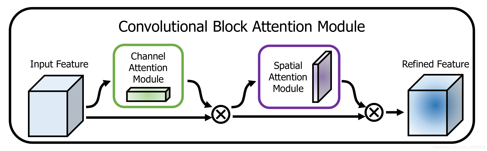

# CBAM：卷积块注意力模块

> Woo, S., Park, J., Lee, J. Y., & Kweon, I. S. (2018). CBAM: Convolutional Block Attention Module. ECCV 2018.
>
> arXiv: https://arxiv.org/abs/1807.06521

## 解决的问题

SE只关注了通道维度上的注意力，空间位置信息被忽略了，CBAM把通道和空间两个维度都考虑进来，同时告诉网络"什么特征重要"和"哪里重要"。

## 模块结构

通道注意力和空间注意力是串联的，先过通道注意力再过空间注意力，实验证明串联比并联效果好。

### 通道注意力模块

平均池化和最大池化同时使用，两路共享一个MLP：

$$M_c(F) = \sigma(MLP(AvgPool(F)) + MLP(MaxPool(F)))$$

两种池化提供的信息不一样，平均池化保留整体信息，最大池化保留响应最强烈的特征，两路加起来以后过Sigmoid得到通道权重。

### 空间注意力模块

在通道维度上做平均池化和最大池化，把两个结果拼接起来，然后用7x7卷积：

$$M_s(F) = \sigma(f^{7\times7}([AvgPool_c(F); MaxPool_c(F)]))$$

输出一张空间注意力图，每个位置的值表示这个位置有多重要。

## 特点

- 轻量级，即插即用，加在任何卷积块后面都行。
- 通道加空间双维度注意力，比SE多了空间上的关注能力。
- 参数量增加很少，计算开销也很小。
