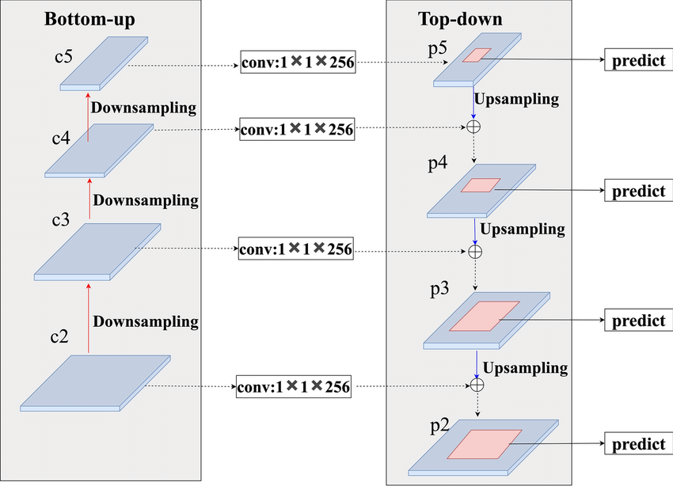

# FPN：特征金字塔网络

> Lin, T. Y., Dollar, P., Girshick, R., He, K., Hariharan, B., & Belongie, S. (2017). Feature Pyramid Networks for Object Detection. CVPR 2017.
>
> arXiv: https://arxiv.org/abs/1612.03144

## 解决的问题

CNN的特征金字塔有一个天然的矛盾：

- 浅层特征图分辨率高，细节丰富，但语义信息比较弱。
- 深层特征图语义信息强，但分辨率低，细节丢失严重。

单独用某一层的话，强语义和高分辨率没法同时拿到。

## 核心结构

### 自底向上路径

就是CNN正常的前向传播过程，每个stage输出不同尺度的特征图，分别记为C2、C3、C4、C5。

### 自顶向下路径

从语义最强的最高层开始，上采样以后和下一层通过横向连接融合到一起：

1. 先用1x1卷积把各层通道数统一。
2. 高层特征做2倍上采样。
3. 和对应的底层特征逐元素相加。
4. 再用3x3卷积消除上采样带来的混叠效应。

### 横向连接

1x1卷积把不同通道数的特征图统一到相同维度，这样逐元素相加才能进行。

## 效果

融合以后，每个尺度的特征图都同时具备了：

- 强语义信息，来自深层。
- 高分辨率细节，来自浅层。

这样大物体和小物体都能在合适的尺度上被检测到。
