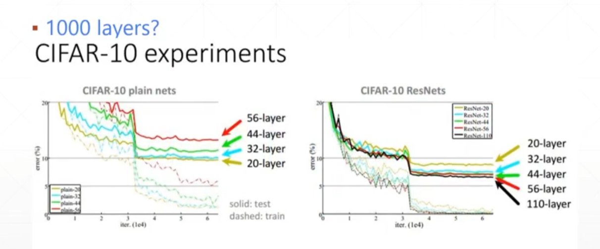
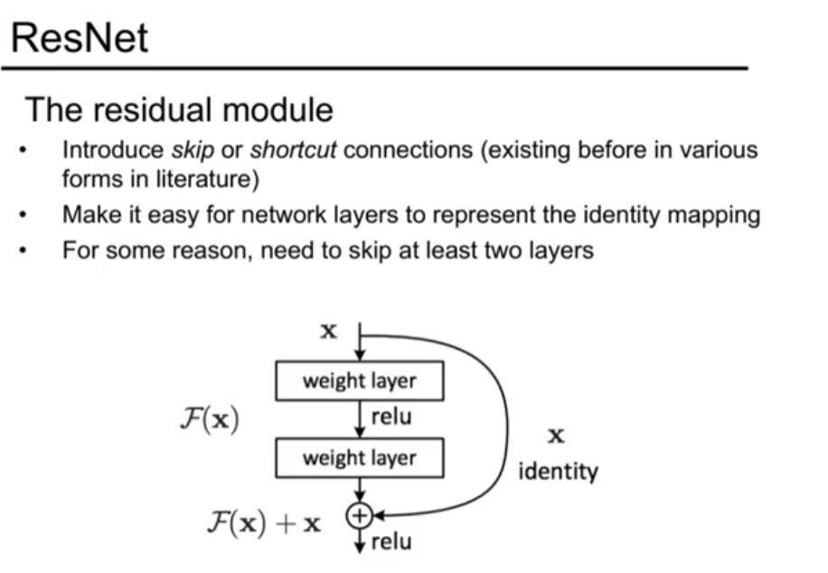

# ResNet：深度残差学习

> He, K., Zhang, X., Ren, S., & Sun, J. (2016). Deep Residual Learning for Image Recognition. CVPR 2016.
>
> arXiv: https://arxiv.org/abs/1512.03385

## 解决的问题

网络层数不断加深以后，会遇到一种被称为退化问题（degradation problem）的现象，准确率在层数增加到一定程度后先趋于饱和，随后急剧下降；这并不是过拟合造成的，因为训练误差同样出现了上升，说明深层网络反而更难优化。

从图中能够看到，普通网络的层数从20层增加到56层以后，训练误差和测试误差都变大了，这表明问题的根源不在于过拟合，而在于网络过深时优化变得困难。

## 核心思想

与其让网络直接学习目标映射 H(x)，不如改为学习残差部分：

$$F(x) = H(x) - x$$

网络的输出相应地变为：

$$H(x) = F(x) + x$$

具体做法是引入一条shortcut connection，即恒等映射，把输入直接加到输出上；如果最优映射本身就接近恒等映射，那么只需要把 F(x) 优化到接近0即可，这比重新学习一个恒等映射要容易得多。

## 为什么有效

一是梯度能够通过shortcut直接回传到浅层，反向传播时至少存在一条梯度为1.0的通路，梯度消失的问题由此得到缓解；由于每经过一层梯度都会有所衰减，有了这条直连通路以后，浅层也能接收到足够的梯度信号。

二是恒等映射更容易学习，让残差趋近于0，比从零开始拟合一个恒等映射在优化上要简单不少。

三是shortcut只做逐元素相加，不引入任何需要学习的参数，也不会增加额外的计算量。

## 网络结构

ResNet-18/34采用基本残差块，每个块包含两个3x3卷积；ResNet-50/101/152则采用瓶颈块，结构为1x1卷积加3x3卷积再加1x1卷积，先降维后升维，计算量相对较小。
