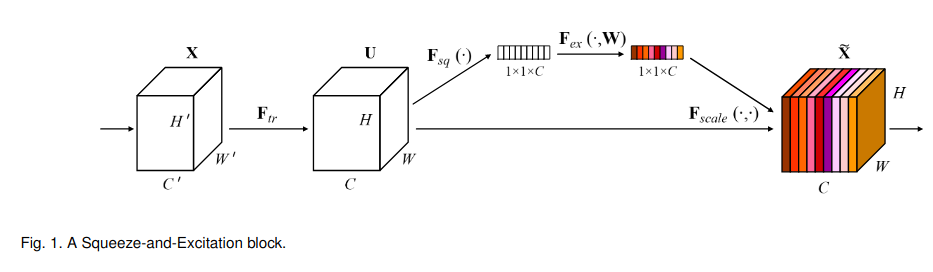

# SENet：Squeeze-and-Excitation 通道注意力

> Hu, J., Shen, L., & Sun, G. (2018). Squeeze-and-Excitation Networks. CVPR 2018.
>
> arXiv: https://arxiv.org/abs/1709.01507

## 解决的问题

以前的工作大多在空间维度上做特征增强，通道之间的关系没有被充分利用，不同通道学到的特征模式不一样，有的通道关注耳朵，有的关注毛色，网络应该自动把重要的通道增强，把不重要的通道抑制掉。

## 核心思想：Squeeze + Excitation

### Squeeze（压缩）

对每个通道做全局平均池化，把整个通道压缩成一个数：

$$z_c = \frac{1}{H \times W}\sum_{i=1}^{H}\sum_{j=1}^{W} x_c(i,j)$$

H乘W的空间信息被压缩成一个标量，这样每个通道就获得了全局的感受野。

### Excitation（激励）

用两层全连接网络来学习通道之间的依赖关系：

$$s = \sigma(W_2 \cdot \text{ReLU}(W_1 \cdot z))$$

- W1先降维，reduction ratio一般设成16，W2再升回原来的维度。
- Sigmoid把权重限制在0到1之间。
- 最后得到每个通道的重要性权重。

### Scale（重标定）

用学到的权重对原来的特征图逐通道相乘：

$$\tilde{x}_c = s_c \cdot x_c$$

重要的通道权重接近1，不重要的通道权重接近0，这样特征就被重新标定了。

## 特点

- 即插即用，可以嵌到任何CNN里面。
- 增加的参数量和计算量都很小。
- 拿到了ILSVRC 2017分类任务的冠军。
