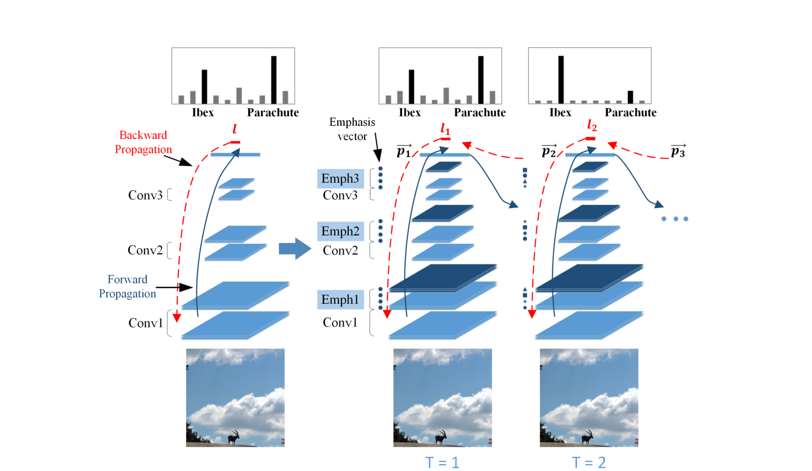

# Learning with Rethinking：反馈迭代修正

> Li, X., Jie, Z., Feng, J., Liu, C., & Yan, S. (2017). Learning with Rethinking: Recurrently Improving Convolutional Neural Networks through Feedback.
>
> arXiv: https://arxiv.org/abs/1708.04483

## 解决的问题

传统CNN只有前馈结构，信息从输入单向传到输出，没有从高层到低层的反馈机制来修正预测，人类视觉系统里，高层的语义信息会反馈到低层，引导重新审视输入的细节。

## 核心思想

### Feedback Layer（反馈层）

第一次前向传播得到后验概率 p，也就是高层的预测信息，通过全连接层传回低层，生成一个emphasis vector，即强调向量：

$$e = f(p)$$

### Emphasis Layer（强调层）

用emphasis vector对低层特征图的通道重新加权：

$$\tilde{F} = E \otimes F$$

emphasis vector经过softmax归一化，再乘以通道数让均值为1，这样加权前后特征的期望值保持不变。

### 迭代过程

- T=1的时候，emphasis全为1，等价于普通的前馈网络。
- T大于等于2的时候，用高层预测生成反馈信号，调制低层特征，然后重新前向传播。
- 多次迭代就是多次"重新思考"，预测会被逐步修正。

## 实验结果

在CIFAR-100、CIFAR-10、MNIST-background-image和ILSVRC-2012上都验证了反馈机制的有效性。
